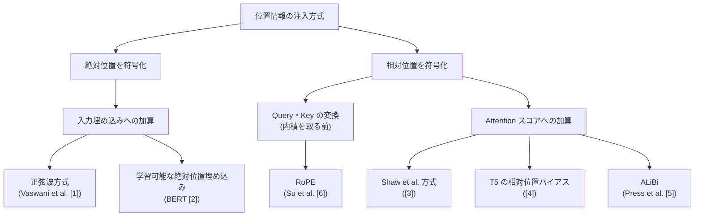

この記事は前編(理論編)です。実装・実験編は [こちら](https://zenn.dev/kojikojiprg/articles/003_positional_encoding_rope-practice)。

# 003. 位置エンコーディング(Positional Encoding)/ RoPE

**分類の枠組みから RoPE(Rotary Position Embedding)の導出まで**
*From a Unified Taxonomy of Positional Encoding to the Derivation of RoPE*

`theories/01_foundations/003_positional_encoding_rope.ipynb`

## 1. 概要 / Overview

[002](https://zenn.dev/kojikojiprg/articles/002_transformer_block-theory) では、Transformer Block(多頭注意機構と順伝播ネットワークの組み合わせ)が単体では入力の並び替えに対して置換同変(permutation equivariant)であることを述べ、系列の順序情報を与えるために正弦波(sinusoidal)方式の位置エンコーディング(Positional Encoding)を暫定的に導入した。

本ノートブックでは、位置情報をどこに・どのように注入するかで方式を統一的に分類したうえで、学習可能な絶対位置埋め込み(Learned Absolute Positional Embedding)・相対位置エンコーディング(Relative Positional Encoding、Shaw et al. 方式・T5 の相対位置バイアス)・ALiBi(Attention with Linear Biases)・RoPE(Rotary Position Embedding)を数式レベルで比較する。中心となるのは RoPE の数学的導出であり、「Query・Key の内積が相対位置のみに依存する」という要請から回転行列による解を導き、効率的な実装まで扱う。

学習を伴う実験では、可変長の copy task を用いて各方式の学習長内での表現力(実験 B-1)と、学習長を超える外挿(length extrapolation)性能(実験 B-2)を分けて評価する。

## 2. 参考論文 / References

| # | 著者 / Authors | タイトル / Title | 会議・媒体 / Venue | URL |
|---|---|---|---|---|
| [1] | Vaswani, Shazeer, Parmar, Uszkoreit, Jones, Gomez, Kaiser, Polosukhin | Attention Is All You Need | NeurIPS 2017 | https://arxiv.org/abs/1706.03762 |
| [2] | Devlin, Chang, Lee, Toutanova | BERT: Pre-training of Deep Bidirectional Transformers for Language Understanding | NAACL 2019 | https://arxiv.org/abs/1810.04805 |
| [3] | Shaw, Uszkoreit, Vaswani | Self-Attention with Relative Position Representations | NAACL 2018 | https://arxiv.org/abs/1803.02155 |
| [4] | Raffel, Shazeer, Roberts, Lee, Narang, Matena, Zhou, Li, Liu | Exploring the Limits of Transfer Learning with a Unified Text-to-Text Transformer | JMLR 2020 | https://arxiv.org/abs/1910.10683 |
| [5] | Press, Smith, Lewis | Train Short, Test Long: Attention with Linear Biases Enables Input Length Extrapolation | ICLR 2022 | https://arxiv.org/abs/2108.12409 |
| [6] | Su, Lu, Pan, Murtadha, Wen, Liu | RoFormer: Enhanced Transformer with Rotary Position Embedding | Neurocomputing 2024 | https://arxiv.org/abs/2104.09864 |
| [7] | Haviv, Ram, Press, Izsak, Levy | Transformer Language Models without Positional Encodings Still Learn Positional Information | Findings of EMNLP 2022 | https://arxiv.org/abs/2203.16634 |

- **[1] が正弦波方式の原典**(原論文の 3.5 節)であり、002 で暫定導入した方式に対応する。
- [2] は学習可能な絶対位置埋め込みの代表例(BERT)として参照する。
- [3] は Shaw et al. 方式の相対位置エンコーディングの原典。
- [4] は T5 の相対位置バイアス(原論文の 2.1 節)の原典。
- [5] は ALiBi の原典。原論文タイトルの "Train Short, Test Long" が示す通り、外挿を明示的な設計目標とする。
- **[6] が本トピックの中心である RoPE の原典**。原論文の 2 節の要請の定式化・3 節の導出・3.4.3 節の遠距離減衰の議論に基づく。
- [7] は、位置エンコーディングを一切持たない因果的な言語モデルであっても位置情報を獲得できることを報告する。実験 B の対照群(位置エンコーディングなし)の精度を解釈する際に参照する(3.1 節)。

## 3. 理論 / Theory

**表記の約束**: 本ノートブックでも 002 と同様、系列を行方向に並べた行ベクトル規約を用いる。

**記号 / Notation**(本セクション全体で共通)

| 記号 | 意味 |
|---|---|
| $L$ | 系列長 |
| $d_{\text{model}}$ | モデル次元 |
| $h$ | ヘッド数 |
| $d_k = d_{\text{model}} / h$ | ヘッドあたりの次元 |
| $m$ | Query 側の位置インデックス |
| $n$ | Key 側の位置インデックス |

### 3.1 動機・課題 / Motivation

001 で見た通り、Scaled Dot-Product Attention は $e_{mn} = q_m^{\top} k_n / \sqrt{d_k}$ という **すべての位置対に対称な** 演算であり、入力の行を並び替えると出力の行も同じように並び替わる(置換同変)。したがって Attention・順伝播ネットワークだけを積み重ねても、系列が「どの順序で並んでいるか」を区別できない(002・3.6 節で述べた通り。ただし因果マスクを課す場合については後述する)。

002 では、この問題への対処として正弦波(sinusoidal)方式を **ひとまずブロックの構造を検証するための足場** として暫定導入した。本トピックでは一歩進んで、そもそもどのような位置情報の注入方式がありうるのか、現代の大規模言語モデルがなぜ特定の方式(多くの場合 RoPE)を採用するのかを扱う。

**因果マスクとの関係について**: 上記の置換同変性の議論は、すべての位置対を対称に扱う場合(双方向の自己注意)に厳密に成り立つ。しかし、本ノートブックの実験 B が用いる **因果マスク付き decoder-only 構成** では話が異なる。因果マスクの下では、位置 $m$ の Query が参照できる Key の集合は $\{0, \dots, m\}$ に制限され、**位置ごとに参照可能なトークンの数(集合のサイズ)が異なる**。この非対称性そのものが暗黙の位置情報の一種であり、因果的な自己注意は厳密には置換同変ではない。実際、位置エンコーディングを一切持たない因果的な言語モデルであっても位置情報を獲得することが報告されている(Haviv et al. [7])。したがって、実験 B の対照群(位置エンコーディングなし)は「位置情報がゼロ」の条件ではなく、「明示的な位置エンコーディングを持たない」条件として解釈する必要がある(この点は実験 B-1 の対照群の精度の解釈に直結する、6.2 節参照)。

もう 1 つの重要な課題が **長さの外挿(length extrapolation)** である。学習時に見た最大系列長を超える入力に対して、モデルがどこまで性能を保てるかは方式によって大きく異なる。この観点は実験 B-2 で扱う。

### 3.2 位置情報の注入点による分類 / Taxonomy by Injection Point

位置情報をどこに注入するかで、各方式は次の 3 グループに分類できる。

| 注入点 | 該当方式 | 絶対 / 相対 |
|---|---|---|
| 入力埋め込みへの加算 | 正弦波、学習可能な絶対位置埋め込み | 絶対位置 |
| Query・Key の線形射影後、内積を取る前の変換 | RoPE | 相対位置(絶対位置 $m$ を作用させるが、内積は相対位置 $n-m$ のみに依存する) |
| Attention スコアへの加算 | Shaw et al. 方式、T5 の相対位置バイアス、ALiBi | 相対位置 |



この分類は 4 節「実装方針」のインターフェース設計(`QueryKeyPositionalTransform`と`AttentionScoreBias`の 2 種類)と対応する。図がなくても、以下の数式・文章だけで各方式の位置づけは理解できる。

### 3.3 正弦波方式の再訪 / Sinusoidal Positional Encoding Revisited

002・3.6 節で、正弦波方式は次元ペア $(2i, 2i+1)$ ごとに周波数 $\omega_i = 1/10000^{2i/d_{\text{model}}}$ の正弦波を割り当てており、固定オフセット $k$ だけ位置をずらす操作が

$$
\mathrm{PE}(\mathrm{pos}+k) = M_i(k) \, \mathrm{PE}(\mathrm{pos})
$$

という、$\mathrm{pos}$ に依存せず $k$ だけで決まる $2\times2$ 回転行列 $M_i(k)$ で表現できることを導出した(角度 $k \omega_i$ の回転行列)。

この「固定オフセットが位置に依存しない回転行列で表現できる」という性質は、後述する RoPE の回転行列 $R(m\theta)$ と数学的に同じ構造を持つ。**両者の決定的な違いは、この回転をどこに作用させるかである**:

- **正弦波方式**: 回転(に相当する正弦波パターン)を **トークン埋め込みに加算する**。回転行列 $M_i(k)$ は埋め込み空間上の性質として導出される副産物であり、Attention の内積計算そのものには回転として現れない。
- **RoPE**: 回転を **Query・Key そのものに作用させる**(内積を取る直前に $R(m\theta)$ を乗じる)。この結果、内積 $(R(m\theta)q)^{\top}(R(n\theta)k)$ は相対位置 $n-m$ のみに依存する形に **必然的に** なる(3.8 節で厳密に導出する)。加算ではなく回転という **乗法的** な作用にすることで、この相対位置への依存が「たまたま成り立つ性質」ではなく「設計上保証される性質」になる。

以下、この違いを起点に、各方式を数式で見ていく。

### 3.4 学習可能な絶対位置埋め込み(Learned Absolute Positional Embedding)

**定義**: 学習可能な行列 $P \in \mathbb{R}^{L_{\max} \times d_{\text{model}}}$ を用意し、位置 $m$ のトークン埋め込みに $P_m$(行列 $P$ の $m$ 行目)を加算する。$L_{\max}$ は学習時に定めた最大系列長。BERT [2] などが採用する。

$$
x_m \leftarrow x_m + P_m
$$

**パラメータ数**: $d_{\text{model}} \cdot L_{\max}$ に比例する(正弦波方式はパラメータを持たない)。

**外挿性**: $P$ は $L_{\max}$ 行しか持たないため、$m \ge L_{\max}$ に対応する行が存在しない。**原理的に外挿できない**(実験 B-2 で、この制約を実際に超えた場合の挙動を確認する)。

### 3.5 Shaw et al. 方式の相対位置エンコーディング

Attention スコアを次のように定義する [3]:

$$
e_{mn} = \frac{(x_m W^Q)(x_n W^K + a^K_{mn})^{\top}}{\sqrt{d_k}}, \qquad
a^K_{mn} = w^K_{\mathrm{clip}(n-m,\ k_{\text{clip}})}
$$

- $\mathrm{clip}(x, k) = \max(-k, \min(k, x))$ は相対距離を $[-k_{\text{clip}}, k_{\text{clip}}]$ に切り詰める関数。$k_{\text{clip}}$ より遠い相対距離はすべて境界値として扱われる(「これ以上遠い」という情報だけが残る)。
- $w^K \in \mathbb{R}^{(2k_{\text{clip}}+1) \times d_k}$ が学習可能パラメータで、相対距離のバケット数($2k_{\text{clip}}+1$ 通り)に比例する。

上式を展開すると

$$
e_{mn} = \underbrace{\frac{q_m^{\top} k_n}{\sqrt{d_k}}}_{\text{通常の Attention スコア}} + \underbrace{\frac{q_m^{\top} a^K_{mn}}{\sqrt{d_k}}}_{\text{相対位置バイアス項}}
$$

となり、第 2 項は Query の内容 $q_m$ と相対位置ベクトル $a^K_{mn}$ の内積である。この項は $q_m$ に依存するため、位置のみに依存する「スコアへのバイアス」という枠組み(T5・ALiBi と共通のインターフェース)には厳密には収まらない(詳細は 4 節)。

**原論文は Value 側にも同様の項を加算する定式化を持つ**:

$$
z_m = \sum_n a_{mn} (v_n + a^V_{mn}), \qquad a^V_{mn} = w^V_{\mathrm{clip}(n-m,\ k_{\text{clip}})}
$$

この項は Attention 重み $a_{mn}$ による Value の集約そのものに介入するため、「スコアへのバイアス」という枠組みには収まらない。後続研究では、この Value 側の項は寄与が小さいとして省略されることが多い。本ノートブックでは 5.5 節で、この項を直接実装し、Key 側のみの場合との差を小規模な数値例で確認する。

### 3.6 T5 の相対位置バイアス

T5 [4] は、Attention スコアにヘッドごとに学習可能な **スカラー** $b_{h,\, \mathrm{bucket}(n-m)}$ を加算する:

$$
e_{mn} = \frac{q_m^{\top} k_n}{\sqrt{d_k}} + b_{h,\, \mathrm{bucket}(n-m)}
$$

相対距離 $n-m$ は $\mathrm{bucket}(\cdot)$ によってバケット化される。バケット化は次の考え方に基づく:

- 近距離(絶対値が小さい相対距離)は **線形スケール** でバケットに割り当て、1 だけ違う距離も別のバケットとして区別する。
- 遠距離は **対数スケール** でバケットに割り当て、大きく異なる距離をまとめて 1 つのバケットにする。これにより、任意の遠さの相対距離もバケット数の上限内に収まる。
- 双方向(Encoder の自己注意)の場合はバケット数を前半・後半で 2 分割し、$n>m$ と $n<m$ を区別する。因果的(Decoder の自己注意)の場合は $n \le m$ のみを考えればよいため、全バケットを片側に使う。

**Shaw et al. 方式との違い**:

| | Shaw et al. 方式 | T5 |
|---|---|---|
| 加算する項 | ベクトル $a^K_{mn} \in \mathbb{R}^{d_k}$(Query との内積が必要) | スカラー $b_{h,\, \mathrm{bucket}(n-m)}$ |
| 相対距離の扱い | クリップ(境界を超えると一定値) | 対数バケット化(境界を超えても粗く区別) |
| 層間の共有 | 層ごとに独立が一般的 | 原論文では層間で共有されることが多いが、本ノートブックの実験では層ごとに独立した`T5RelativePositionBias`インスタンスを持たせている(4 節参照) |

### 3.7 ALiBi(Attention with Linear Biases)

ALiBi [5] は、Attention スコアに **学習可能パラメータを持たない** 線形バイアスを加算する:

$$
e_{mn} = \frac{q_m^{\top} k_n}{\sqrt{d_k}} - m_h \cdot (m - n)
$$

$m_h$ はヘッド $h$ ごとに固定された傾き(slope)で、幾何数列として次のように定める(ヘッド数を $H$ とする):

$$
m_h = 2^{-8h/H} \qquad (h = 1, \dots, H)
$$

例えば $H=8$ なら傾きは $2^{-1}, 2^{-2}, \dots, 2^{-8}$ という等比数列になる。傾きが小さいヘッドは遠い位置まで緩やかに減衰するバイアスを持ち(遠距離を見渡す担当)、傾きが大きいヘッドは近い位置に強く減衰するバイアスを持つ(近距離に集中する担当)。ヘッドごとに異なる距離スケールを担当させることで、単一の減衰スケールでは表現しきれない多様な距離依存性をカバーする。

学習可能パラメータを一切持たないため、$m_h$ は系列長によらず定義でき、**任意の系列長にそのまま適用できる**。原論文のタイトル "Train Short, Test Long" が示す通り、外挿性能を明示的な設計目標としている。$H$ が 2 のべき乗でない場合、原論文は直近の 2 のべき乗で計算した傾きを補間して残りのヘッド分を埋めるという別の定め方をしており、`ALiBiPositionBias._compute_slopes`(5.3 節)もこの原論文の公式実装に従っている。

### 3.8 RoPE(Rotary Position Embedding)

本トピックの中心。Su et al. [6] の導出を追う。

#### 3.8.1 要請の定式化

位置 $m$ の Query と位置 $n$ の Key を作る関数 $f_q(x_m, m)$, $f_k(x_n, n)$ について、その内積が **相対位置のみに依存する** ことを要請する:

$$
\langle f_q(x_m, m),\ f_k(x_n, n) \rangle = g(x_m, x_n,\ m-n)
$$

すなわち、$m, n$ 自体ではなく差 $m-n$ だけが内積に影響するような $f_q, f_k$ を探すという問題設定である($g$ は任意関数なので、以降の導出では符号を反転した $n-m$ の形で表しても要請自体は変わらない)。

#### 3.8.2 2 次元の場合の解

$d_k=2$ の場合、回転行列

$$
R(\theta) = \begin{pmatrix} \cos\theta & -\sin\theta \\ \sin\theta & \cos\theta \end{pmatrix}
$$

を用いて $f_q(x_m, m) = R(m\theta)\,(W^Q x_m)$、$f_k(x_n, n) = R(n\theta)\,(W^K x_n)$ と定めると、回転行列の直交性 $R(\theta)^{\top} = R(-\theta)$ と加法定理 $R(\alpha)R(\beta) = R(\alpha+\beta)$ から

$$
R(m\theta)^{\top} R(n\theta) = R(-m\theta) R(n\theta) = R((n-m)\theta)
$$

が成り立つ。したがって

$$
\langle R(m\theta) q,\ R(n\theta) k \rangle = q^{\top} R(m\theta)^{\top} R(n\theta)\, k = q^{\top} R((n-m)\theta)\, k
$$

となり、内積は相対位置 $n-m$ のみの関数になる。これが 3.8.1 節の要請を満たす具体解である。

#### 3.8.3 複素数表現

2 次元の回転は複素数の乗算として書ける。$q = W^Q x_m$ を複素数 $q_{\mathbb{C}} \in \mathbb{C}$ とみなすと

$$
f_q(x_m, m) = (W^Q x_m)\, e^{i m \theta}
$$

であり、角度 $m\theta$ だけ回転させる操作そのものである(オイラーの公式 $e^{i\alpha} = \cos\alpha + i\sin\alpha$ が 3.8.2 節の回転行列に対応する)。

#### 3.8.4 $d_k$ 次元への一般化

$d_k$ 次元の Query・Key を $d_k/2$ 個の 2 次元部分空間に分割し、部分空間 $i$ ($i=0, \dots, d_k/2-1$)に角周波数

$$
\theta_i = \mathrm{base}^{-2i/d_k}
$$

の回転を適用する。$\mathrm{base}$ の既定値は $10000$(正弦波方式と同じ値)。$\mathrm{base}$ は部分空間ごとの回転速度の分布を決めるパラメータであり、$i$ が小さい(低次元インデックス)部分空間ほど速く回転し(高周波)、$i$ が大きい部分空間ほどゆっくり回転する(低周波)。この分布は $\mathrm{base}$ を変えることで調整でき、これが長文脈拡張(トピック 014)のスケーリング手法群(NTK-aware スケーリング・YaRN など)の出発点になる。

全部分空間の回転をまとめたブロック対角行列を $R_{\Theta,m}$ とする:

$$
R_{\Theta,m} = \begin{pmatrix}
R(m\theta_0) & & \\
& \ddots & \\
& & R(m\theta_{d_k/2-1})
\end{pmatrix} \in \mathbb{R}^{d_k \times d_k}
$$

#### 3.8.5 内積が相対位置のみに依存することの証明

$R_{\Theta,m}$ はブロック対角行列であり、各ブロックが直交行列 $R(m\theta_i)$ なので、転置との積もブロックごとに独立に計算できる:

$$
R_{\Theta,m}^{\top} R_{\Theta,n} =
\begin{pmatrix}
R(m\theta_0)^{\top} R(n\theta_0) & & \\
& \ddots & \\
& & R(m\theta_{d_k/2-1})^{\top} R(n\theta_{d_k/2-1})
\end{pmatrix}
= R_{\Theta,\, n-m}
$$

(各ブロックに 3.8.2 節の関係を適用した)。したがって

$$
(R_{\Theta,m}\, q)^{\top} (R_{\Theta,n}\, k) = q^{\top} R_{\Theta,m}^{\top} R_{\Theta,n}\, k = q^{\top} R_{\Theta,\, n-m}\, k
$$

となり、回転後の Query・Key の内積は相対位置 $n-m$ のみに依存する(3.8.1 節の要請を $d_k$ 次元で満たす)。

#### 3.8.6 遠距離減衰(long-term decay)

RoPE には、相対距離 $|n-m|$ が大きくなるにつれて内積の絶対値の上界が減衰するという性質がある。厳密な証明には Abel 変換による上界の評価が必要であり、本ノートブックでは立ち入らない(原論文 [6] の 3.4.3 節を参照)。この傾向は実験 A-4 でランダムな Query・Key に対する内積を相対距離の関数として数値的に確認する。

#### 3.8.7 効率的な実装

ブロック対角行列 $R_{\Theta,m}$ との明示的な行列積は $O(d_k^2)$ かかり非効率である。実務上は、次元を前半・後半に 2 分割して要素を入れ替える演算 $\mathrm{rotate\_half}$ と、$\cos$・$\sin$ の要素ごとの積(ブロードキャスト)で等価な計算を行う($[q_1, q_2]$ をそれぞれ $d_k/2$ 次元の前半・後半とする):

$$
\mathrm{rotate\_half}([q_1, q_2]) = [-q_2, q_1]
$$

$$
R_{\Theta,m}\, q \;\;\hat{=}\;\; q \odot \cos(m\boldsymbol{\theta}) + \mathrm{rotate\_half}(q) \odot \sin(m\boldsymbol{\theta})
$$

ここで $\boldsymbol{\theta} = [\theta_0, \dots, \theta_{d_k/2-1}, \theta_0, \dots, \theta_{d_k/2-1}]$($\theta_i$ を前半・後半に複製したベクトル)、$\odot$ は要素ごとの積である。この実装は次元ペアの取り方(部分空間 $i$ を何番目と何番目の次元に対応させるか)が 3.8.4 節のブロック対角行列と異なる($i$ 番目と $i+d_k/2$ 番目を組にする、GPT-NeoX / LLaMA 系の実装で広く使われる変形)が、Query と Key に **同一の置換** を適用するため、3.8.5 節の相対位置のみへの依存という性質は保たれる。この等価性は実験 A-3a で数値的に検証する。

隣接ペアの取り方(3.8.4 節)と前半・後半ペアの取り方(本節)は、座標の固定置換 $P$ によって $R^{\text{half}}_{\Theta,m} = P^{\top} R^{\text{interleaved}}_{\Theta,m} P$ と厳密に結ばれている(実験 A-3c で数値的に確認する)。この置換は線形射影 $W^Q, W^K$ の再パラメータ化(列の並べ替え)に吸収されるため、**モデルの表現力としては両者は等価** である。ただし置換を揃えずに同一の $q, k$ を両方の取り方で回転させると、内積の値そのものは一致しない(実験 A-3b で確認する)。

#### 3.8.8 適用対象

RoPE は **Query と Key のみに適用し、Value には適用しない**。RoPE の狙いは「内積という演算そのものに相対位置を持ち込む」ことであり、Value は Attention 重みによる加重平均の対象であって内積の計算には関与しないため、回転を適用する対象にならない。

### 3.9 アルゴリズム / Algorithm

#### RoPE: 角周波数の事前計算と適用

```text
入力: d_k(偶数)、base(既定 10000)、事前計算する最大位置 P
出力: cos, sin ∈ R^{P × d_k}

1: theta_i ← base^(-2i/d_k)                     (i = 0, ..., d_k/2 - 1)
2: freqs[m, i] ← m * theta_i                     (m = 0, ..., P-1)
3: emb ← concat(freqs, freqs, axis=-1)           (d_k/2 を複製して d_k に)
4: cos ← cos(emb), sin ← sin(emb)

# Query・Key への適用(位置 m の q、位置 n の k、それぞれ独立に)
5: rotate_half(x) ← concat(-x[d_k/2:], x[:d_k/2])
6: q' ← q * cos[m] + rotate_half(q) * sin[m]
7: k' ← k * cos[n] + rotate_half(k) * sin[n]
```

#### 相対位置バイアス行列の構築(Shaw et al. / T5 / ALiBi 共通の枠組み)

```text
入力: S_q, S_k(Query 側・Key 側の系列長)
出力: bias ∈ R^{h × S_q × S_k}(または (1, S_q, S_k))

1: m ← arange(S_q), n ← arange(S_k)
2: relative_position[m, n] ← n - m

# Shaw et al. 方式(a^K_mn のみを返し、Query との内積は呼び出し側で計算する)
3a: index ← clip(relative_position, -k_clip, k_clip) + k_clip
4a: a_K[m, n] ← w_K[index[m, n]]                 (呼び出し側で q_m と内積を取る)

# T5
3b: bucket[m, n] ← relative_position_bucket(relative_position[m, n])
4b: bias[h, m, n] ← b[h, bucket[m, n]]

# ALiBi
3c: slopes[h] ← 2^(-8h/H)                        (h = 1, ..., H)
4c: bias[h, m, n] ← slopes[h] * relative_position[m, n]
```


## 元ノートブック(実装の全文はこちら)

https://github.com/kojikojiprg/ai-theories/blob/main/theories/01_foundations/003_positional_encoding_rope.ipynb


<!-- zenn-nav:start -->
---
- 前: [Transformer Block(実装・実験編)](https://zenn.dev/kojikojiprg/articles/002_transformer_block-practice)
- 次: [位置エンコーディング(Positional Encoding)/ RoPE(実装・実験編)](https://zenn.dev/kojikojiprg/articles/003_positional_encoding_rope-practice)
<!-- zenn-nav:end -->
