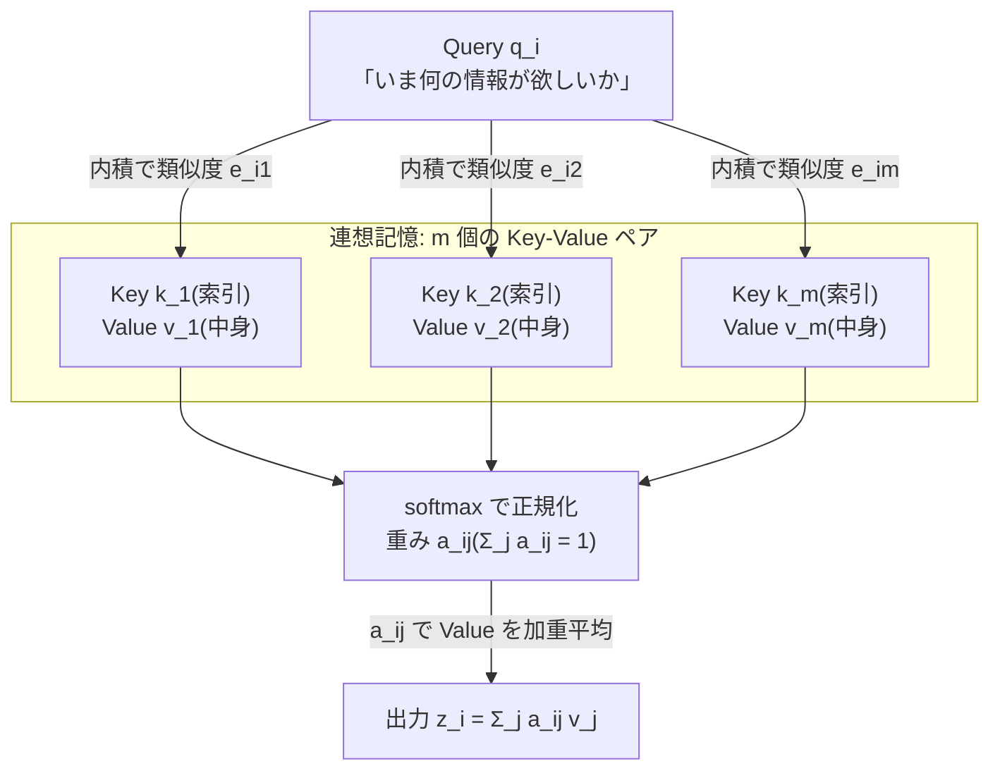
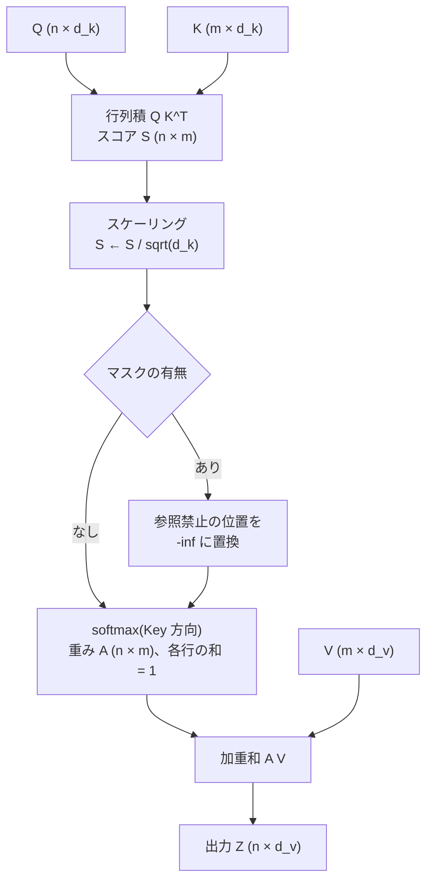
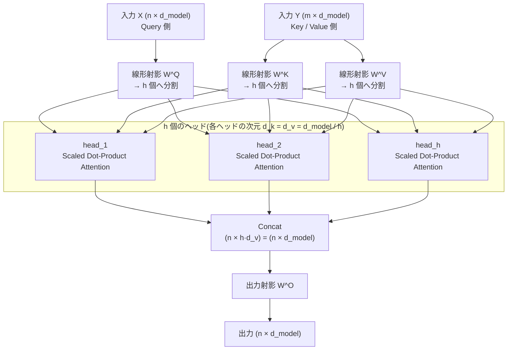

この記事は前編(理論編)です。続きは [こちら](https://zenn.dev/kojikojiprg/books/ai-theories-roadmap/viewer/001_attention_mechanism-practice)。

# 001. 注意機構(Attention Mechanism)

**Scaled Dot-Product Attention から Multi-Head Attention まで**
*From Scaled Dot-Product Attention to Multi-Head Attention*

`theories/01_foundations/001_attention_mechanism.ipynb`

## 1. 概要 / Overview

Transformer の中核である **注意機構(Attention Mechanism)** は、系列中の各位置が「他のどの位置の情報をどれだけ参照するか」を、内容そのものから動的に決める仕組みである。本ノートブックでは Vaswani et al. (2017) の **Scaled Dot-Product Attention** (スケール付き内積注意)を起点に、その素直な拡張である **Multi-Head Attention** (多頭注意)までを扱う。

具体的には、(1) Query / Key / Value(クエリ・キー・バリュー)という定式化とスケーリング係数 $\sqrt{d_k}$ の必要性を数式で導出し、(2) PyTorch でスクラッチ実装し(`nn.MultiheadAttention`などの既存実装は使わない)、(3) Attention 重みの可視化と簡単な系列復元タスク(copy task)の学習を通して、その挙動を実験的に確認する。

RNN・CNN との比較や、Seq2Seq 時代の Attention(Bahdanau / Luong)の歴史的経緯には深入りせず、**Transformer 論文の定式化を出発点** とする。

## 2. 参考論文 / References

| # | 著者 / Authors | タイトル / Title | 会議・媒体 / Venue | URL |
|---|---|---|---|---|
| [1] | Vaswani, Shazeer, Parmar, Uszkoreit, Jones, Gomez, Kaiser, Polosukhin | Attention Is All You Need | NeurIPS 2017 | https://arxiv.org/abs/1706.03762 |
| [2] | Clark, Khandelwal, Levy, Manning | What Does BERT Look At? An Analysis of BERT's Attention | BlackboxNLP @ ACL 2019 | https://arxiv.org/abs/1906.04341 |
| [3] | Elhage, Nanda, Olsson, et al. | A Mathematical Framework for Transformer Circuits | Transformer Circuits Thread, 2021 | https://transformer-circuits.pub/2021/framework/index.html |

- **[1] が本トピックの原典**。Scaled Dot-Product Attention(3.2.1 節)と Multi-Head Attention(3.2.2 節)、およびスケーリング係数 $1/\sqrt{d_k}$ の根拠(3.2.1 節の脚注)はすべてこの論文に基づく。
- [2] は学習済みモデルの Attention 重みを可視化・分析した研究で、本ノートブックの実験 2(ヒートマップの読み方)の背景として参照する。
- [3] は Attention を「QK 回路(どこを見るか)」と「OV 回路(何を書き込むか)」に分解して読む視点を与える。実験 3 の考察で参照する。

## 3. 理論 / Theory

### 3.1 動機・課題 / Motivation

自然言語のような系列データでは、離れた位置どうしが強く依存し合う(**長距離依存関係 / long-range dependency**)。例えば "**The dog** that chased the cat across the yard **was** tired." では、動詞 *was* の数一致は 6 語以上離れた *dog* に依存する。

系列モデルがこの依存を学習できるかは、**2 つの位置の間で情報が伝わる経路の長さ(path length)** に大きく左右される。経路が長いほど、逆伝播で勾配が減衰・発散しやすく、依存関係の学習が難しくなる。

| モデル | 任意の 2 位置間の最大経路長 | 系列方向の並列化 | 1 層の計算量 |
|---|---|---|---|
| RNN(LSTM / GRU) | $O(n)$ | 不可(逐次計算) | $O(n \cdot d^2)$ |
| CNN(カーネル幅 $k$) | $O(n / k)$(積層で $O(\log_k n)$) | 可 | $O(k \cdot n \cdot d^2)$ |
| **Self-Attention** | $O(1)$ | 可 | $O(n^2 \cdot d)$ |

($n$: 系列長、$d$: 表現次元。この比較は [1] Table 1 に対応する。)

RNN は時刻 $t$ の隠れ状態を $h_t = f(h_{t-1}, x_t)$ と逐次的に計算するため、(a) 任意の 2 位置間の経路長が距離に比例して伸び、(b) 系列方向に並列化できない、という 2 つの問題を同時に抱える。

**Attention はこの経路長を距離によらず $O(1)$ にする。** 各位置は他のすべての位置を 1 回の行列積で直接参照でき、しかもその計算は位置方向に完全並列である。代償として計算量・メモリが系列長の 2 乗 $O(n^2)$ になる(この計算量の緩和は後のトピック、例えば Flash Attention や線形注意で扱う)。

さらに重要なのは、**どこを参照するかが固定の重みではなく、入力内容から動的に決まる** 点である。畳み込みの重みは「相対位置」に紐づく静的なパラメータだが、Attention の重みは Query と Key の内容の類似度から毎回計算される **データ依存の重み(content-based addressing)** である。

### 3.2 Query, Key, Value

Attention は **連想記憶(associative memory)/ 微分可能な辞書引き** として理解できる。

- **Query(クエリ)$q$**: 「いま自分は何の情報が欲しいか」を表すベクトル。
- **Key(キー)$k$**: 「自分はどんな情報を持っているか」という索引(見出し)ベクトル。
- **Value(バリュー)$v$**: 実際に取り出される中身のベクトル。

通常の辞書は「キーが完全一致した 1 つの値」を返すが、Attention は **すべての Key との類似度で重み付けした Value の加重平均** を返す。この「ハードな検索」を「ソフトな加重平均」に緩和したことが、微分可能で学習可能である理由である。

#### 記号の定義 / Notation

| 記号 | 意味 |
|---|---|
| $n$ (= $S_q$) | Query 側の系列長 |
| $m$ (= $S_k$) | Key / Value 側の系列長(自己注意では $m = n$) |
| $d_{\text{model}}$ | モデルの隠れ次元(埋め込み次元) |
| $h$ | ヘッド数(number of heads) |
| $d_k$ | 1 ヘッドあたりの Query / Key の次元 |
| $d_v$ | 1 ヘッドあたりの Value の次元(原論文・本実装ともに $d_v = d_k = d_{\text{model}} / h$) |
| $X \in \mathbb{R}^{n \times d_{\text{model}}}$ | Query 側の入力(各行が 1 トークンの表現) |
| $Y \in \mathbb{R}^{m \times d_{\text{model}}}$ | Key / Value 側の入力(自己注意では $Y = X$) |
| $Q \in \mathbb{R}^{n \times d_k}$, $K \in \mathbb{R}^{m \times d_k}$, $V \in \mathbb{R}^{m \times d_v}$ | Query / Key / Value 行列 |
| $A \in \mathbb{R}^{n \times m}$ | Attention 重み行列(各行の和が 1) |

$Q, K, V$ は入力を学習可能な行列で線形射影して作る:

$$
Q = X W^Q, \qquad K = Y W^K, \qquad V = Y W^V
$$

$$
W^Q \in \mathbb{R}^{d_{\text{model}} \times d_k},\quad
W^K \in \mathbb{R}^{d_{\text{model}} \times d_k},\quad
W^V \in \mathbb{R}^{d_{\text{model}} \times d_v}
$$

- $Y = X$ のとき **自己注意(Self-Attention)**、$Y \neq X$(例: デコーダがエンコーダ出力を参照)のとき **交差注意(Cross-Attention)** と呼ぶ。
- $W^Q$ と $W^K$ は「**どこを見るか**」を、$W^V$ と後述の $W^O$ は「**何を持ってくるか**」を担う。この 2 つの役割の分離が [3] の QK 回路 / OV 回路という見方に対応する。

#### 図 1: 連想記憶としての Query / Key / Value



通常の辞書引きは「一致した 1 つの Key に対応する Value」だけを返すが(上図で 1 本の矢印だけが重み 1、残りが 0 の状態)、Attention はすべての Key への重み $a_{ij}$ を softmax で決め、Value を加重平均する。この緩和により全体が微分可能になる。

### 3.3 Scaled Dot-Product Attention

#### 定義

$$
\operatorname{Attention}(Q, K, V) = \underbrace{\operatorname{softmax}\!\left( \frac{Q K^{\top}}{\sqrt{d_k}} \right)}_{A \;\in\; \mathbb{R}^{n \times m}} V \;\in\; \mathbb{R}^{n \times d_v}
$$

要素ごとに書き下すと、$i$ 番目の Query に対する出力 $z_i$ は

$$
e_{ij} = \frac{q_i^{\top} k_j}{\sqrt{d_k}}, \qquad
a_{ij} = \frac{\exp(e_{ij})}{\sum_{j'=1}^{m} \exp(e_{ij'})}, \qquad
z_i = \sum_{j=1}^{m} a_{ij} \, v_j
$$

- $e_{ij}$ は位置 $i$ の Query と位置 $j$ の Key の **類似度スコア(logit)**。内積が大きいほど「関連が強い」。
- softmax は **Key 方向($j$ 方向)** にとる。したがって $\sum_j a_{ij} = 1, \; a_{ij} \ge 0$ であり、各行は Key 上の確率分布になる。
- 出力 $z_i$ は Value ベクトルの **凸結合(重み付き平均)** であり、$V$ の張る空間の中に収まる。

#### 図 2: Scaled Dot-Product Attention の計算の流れ



各ステップは 3.5 節の擬似コードの 1〜6 行目、および`src/layers/attention.py`の`scaled_dot_product_attention()`の各行と 1 対 1 に対応する。

**マスク(masking)** を使う場合は、参照を禁止したい位置のスコアを softmax の前に $-\infty$ に置き換える:

$$
e_{ij} \leftarrow \begin{cases} e_{ij} & (\text{位置 } j \text{ を参照してよい}) \\ -\infty & (\text{参照禁止}) \end{cases}
\quad \Longrightarrow \quad a_{ij} = 0
$$

代表例は、位置 $i$ が $j \le i$ しか見られないようにする **因果マスク(causal mask)** (自己回帰生成で未来を見ないため)と、パディング位置を無視する **パディングマスク** である。

#### なぜ $\sqrt{d_k}$ で割るのか / Why scale by $\sqrt{d_k}$?

$q, k \in \mathbb{R}^{d_k}$ の各成分が独立に平均 $0$・分散 $1$ に従うと仮定する。内積 $q^{\top} k = \sum_{t=1}^{d_k} q_t k_t$ について、独立性から

$$
\mathbb{E}[q^{\top} k] = \sum_{t=1}^{d_k} \mathbb{E}[q_t]\mathbb{E}[k_t] = 0,
\qquad
\operatorname{Var}[q^{\top} k] = \sum_{t=1}^{d_k} \operatorname{Var}[q_t k_t] = \sum_{t=1}^{d_k} 1 = d_k
$$

つまりスコアの標準偏差は $\sqrt{d_k}$ に比例して **次元とともに増大する**。$d_k = 64$ なら標準偏差は 8、$d_k = 512$ なら約 22.6 であり、logit のスケールとしては非常に大きい。

logit の分散が大きいと softmax は **飽和(saturate)** し、ほぼ one-hot な分布になる。ここで softmax $p = \operatorname{softmax}(e)$ のヤコビアンは

$$
\frac{\partial p_i}{\partial e_j} = p_i (\delta_{ij} - p_j)
$$

であり、$p$ が one-hot に近い($p_i \approx 1$ または $p_i \approx 0$)ほど $p_i(1 - p_i) \to 0$ となって **勾配がほぼ消える**。学習初期にこの状態に入ると、Attention 重みがほとんど更新されなくなる。

そこでスコアを $\sqrt{d_k}$ で割ると

$$
\operatorname{Var}\!\left[\frac{q^{\top} k}{\sqrt{d_k}}\right] = \frac{d_k}{d_k} = 1
$$

となり、**$d_k$ によらず logit の分散が $1$ に正規化される**。これが「Scaled」Dot-Product Attention の意味であり、[1] 3.2.1 節の脚注で述べられている根拠そのものである(この効果は後の実験 1-2 で数値的に確認する)。

### 3.4 Multi-Head Attention

#### 動機

単一の Attention では、各 Query に対して softmax は **ただ 1 つの確率分布** しか作れない。しかし言語では、同じ単語が同時に複数の関係(構文的な係り受け、共参照、直前の局所文脈 …)を持つ。単一ヘッドでこれらを同時に表現しようとすると、重みは平均化されてぼやけてしまう。

そこで、表現を **複数の部分空間(subspace)に分割** し、それぞれで独立に Attention を計算して結合する。これが Multi-Head Attention である。実際、学習済みモデルでは「直前のトークンを見るヘッド」「同一単語を見るヘッド」「構文的な係り先を見るヘッド」など、役割の分化が観察される [2]。

#### 定義

$$
\operatorname{MultiHead}(X, Y) = \operatorname{Concat}(\text{head}_1, \ldots, \text{head}_h)\, W^O
$$

$$
\text{head}_i = \operatorname{Attention}\!\left(X W_i^{Q},\; Y W_i^{K},\; Y W_i^{V}\right)
= \operatorname{softmax}\!\left( \frac{(X W_i^{Q})(Y W_i^{K})^{\top}}{\sqrt{d_k}} \right) Y W_i^{V}
$$

パラメータ行列の形状は以下の通り($i = 1, \ldots, h$):

$$
W_i^{Q} \in \mathbb{R}^{d_{\text{model}} \times d_k},\quad
W_i^{K} \in \mathbb{R}^{d_{\text{model}} \times d_k},\quad
W_i^{V} \in \mathbb{R}^{d_{\text{model}} \times d_v},\quad
W^{O} \in \mathbb{R}^{h d_v \times d_{\text{model}}}
$$

原論文では $h = 8$、$d_{\text{model}} = 512$、$d_k = d_v = d_{\text{model}} / h = 64$ としている。

#### 図 3: Multi-Head Attention の構造



「分割 → 各ヘッドで独立に Attention → 連結 → 出力射影」という流れが、3.5 節の擬似コードの 1〜7 行目に対応する。分割によって 1 ヘッドあたりの次元が $d_{\text{model}} / h$ に下がるため、ヘッドを増やしても全体の計算量は変わらない。

#### 計算量が単一ヘッドと変わらないこと

$d_k = d_v = d_{\text{model}} / h$ と取ることで、全ヘッドの射影行列を横に連結したものはちょうど $d_{\text{model}} \times d_{\text{model}}$ になる:

$$
W^Q = \left[\, W_1^Q \; \middle|\; W_2^Q \;\middle|\; \cdots \;\middle|\; W_h^Q \,\right] \in \mathbb{R}^{d_{\text{model}} \times d_{\text{model}}}
$$

したがって、パラメータ数($4 d_{\text{model}}^2$)も行列積の計算量も、$h = 1$ で $d_k = d_{\text{model}}$ とした場合と **ほぼ同じ** である。「ヘッドを増やすとコストが増える」のではなく、**同じ予算を $h$ 個の低次元部分空間に分割して使う**、というのが Multi-Head の要点である。

実装上もこの性質を利用し、ヘッドごとにループを回すのではなく、$d_{\text{model}}$ 次元へ一括射影してから $(B, n, d_{\text{model}}) \to (B, h, n, d_k)$ に reshape することで、全ヘッドをまとめて 1 回のバッチ行列積で計算する(数学的には上式と等価)。

### 3.5 アルゴリズム / Algorithm

#### Scaled Dot-Product Attention

```text
入力: Q (n × d_k), K (m × d_k), V (m × d_v), mask (n × m, 省略可)
出力: Z (n × d_v), A (n × m)

1: S ← Q Kᵀ                      # スコア行列 (n × m)
2: S ← S / sqrt(d_k)             # スケーリング(logit の分散を 1 に正規化)
3: if mask is not None:
4:     S[i, j] ← -inf   for all (i, j) where mask[i, j] = False
5: A ← softmax(S, axis = -1)     # 各行(Query)ごとに Key 方向で正規化
6: Z ← A V                       # Value の加重平均 (n × d_v)
7: return Z, A
```

#### Multi-Head Attention

```text
入力: X (n × d_model), Y (m × d_model), mask (省略可)
パラメータ: W^Q, W^K, W^V, W^O (すべて d_model × d_model), ヘッド数 h
出力: Z (n × d_model), A (h × n × m)

1: Q ← X W^Q ;  K ← Y W^K ;  V ← Y W^V            # 一括線形射影
2: Q ← reshape(Q, n × h × d_k) → transpose → (h × n × d_k)   # ヘッドへ分割
3: K, V も同様に (h × m × d_k), (h × m × d_v) へ分割
4: for i = 1 … h:  (実装上は h 方向にバッチ化して同時計算)
5:     head_i, A_i ← ScaledDotProductAttention(Q_i, K_i, V_i, mask)
6: H ← Concat(head_1, …, head_h)                  # (n × h·d_v) = (n × d_model)
7: Z ← H W^O                                      # 出力射影
8: return Z, A
```


## 元ノートブック(実装の全文はこちら)

https://github.com/kojikojiprg/ai-theories/blob/main/theories/01_foundations/001_attention_mechanism.ipynb
