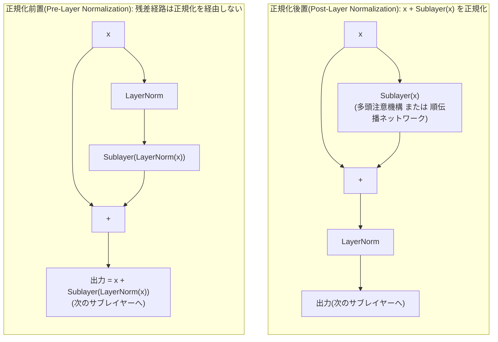
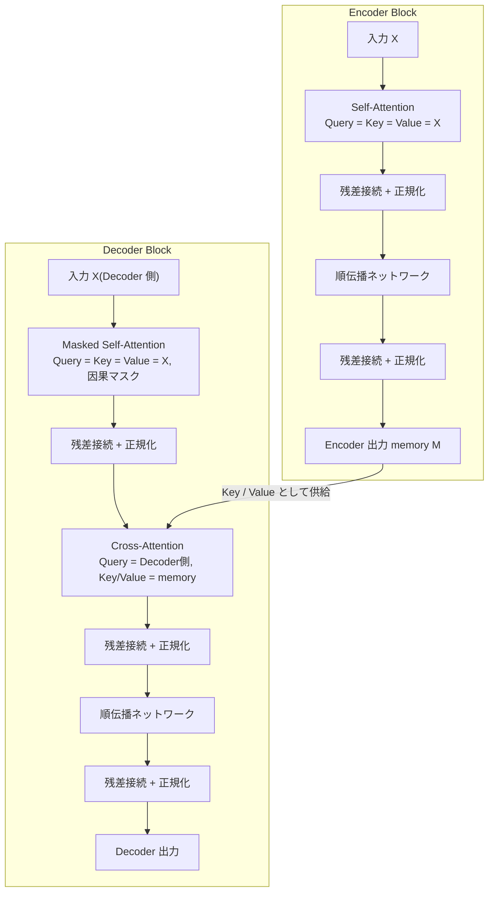

この記事は前編(理論編)です。続きは [こちら](https://zenn.dev/kojikojiprg/books/ai-theories-roadmap/viewer/002_transformer_block-practice-1)。

# 002. Transformer Block

**残差接続・層正規化・順伝播ネットワークによるブロック構築 — Encoder Block と Decoder Block**
*From Residual Connections and Normalization to Encoder / Decoder Blocks*

`theories/01_foundations/002_transformer_block.ipynb`

## 1. 概要 / Overview

[001](https://zenn.dev/kojikojiprg/books/ai-theories-roadmap/viewer/001_attention_mechanism-theory) で実装した **多頭注意機構(Multi-Head Attention)** は、系列中の任意の 2 位置を $O(1)$ の経路で結びつけられる一方、(1) 各位置内での非線形な特徴変換を持たず、(2) 層を深く積むと勾配が不安定になりやすいという 2 つの限界を持つ。本ノートブックでは、**残差接続(Residual Connection)** ・ **層正規化(Layer Normalization)** ・ **順伝播ネットワーク(Feed-Forward Network)** を多頭注意機構と組み合わせることで、これらを補う **Transformer Block** を構成する。

具体的には、(1) 残差接続・層正規化・順伝播ネットワークをそれぞれスクラッチ実装し、(2) 正規化を残差経路の前に置く **正規化前置(Pre-Layer Normalization)** と後に置く **正規化後置(Post-Layer Normalization)** という 2 つの構造を比較し、(3) 自己注意のみからなる **Encoder Block** と、交差注意(cross-attention)を含む **Decoder Block** を実装する。あわせて、系列の順序情報を与えるために **正弦波(sinusoidal)方式の位置エンコーディング(Positional Encoding)を暫定的に** 導入する(この方式を選ぶ理論的根拠には踏み込まず、あくまで実験を成立させるための足場として扱う。詳細は 3.6 節の注記を参照)。

正規化・活性化関数のさらなる発展(RMSNorm、SwiGLU など)は [004](./004_normalization_and_activation.ipynb) で、位置エンコーディングの各方式の比較・回転位置エンコーディング(RoPE)は [003](https://github.com/kojikojiprg/ai-theories/blob/main/theories/01_foundations/003_positional_encoding_rope.ipynb) で、学習を安定化させる warmup などの最適化技術は 007 で扱う。

## 2. 参考論文 / References

| # | 著者 / Authors | タイトル / Title | 会議・媒体 / Venue | URL |
|---|---|---|---|---|
| [1] | Vaswani, Shazeer, Parmar, Uszkoreit, Jones, Gomez, Kaiser, Polosukhin | Attention Is All You Need | NeurIPS 2017 | https://arxiv.org/abs/1706.03762 |
| [2] | Ba, Kiros, Hinton | Layer Normalization | arXiv 2016 | https://arxiv.org/abs/1607.06450 |
| [3] | Xiong, Yang, He, Zheng, Zheng, Xing, Zhang, Lan, Wang, Liu | On Layer Normalization in the Transformer Architecture | ICML 2020 | https://arxiv.org/abs/2002.04745 |
| [4] | He, Zhang, Ren, Sun | Deep Residual Learning for Image Recognition | CVPR 2016 | https://arxiv.org/abs/1512.03385 |
| [5] | Elhage, Nanda, Olsson, et al. | A Mathematical Framework for Transformer Circuits | Transformer Circuits Thread, 2021 | https://transformer-circuits.pub/2021/framework/index.html |
| [6] | Olsson, Elhage, Nanda, et al. | In-context Learning and Induction Heads | Transformer Circuits Thread, 2022 | https://arxiv.org/abs/2209.11895 |
| [7] | Veit, Wilber, Belongie | Residual Networks Behave Like Ensembles of Relatively Shallow Networks | NeurIPS 2016 | https://arxiv.org/abs/1605.06431 |

- **[1] が本トピックの原典。** Encoder / Decoder のブロック構造(3.7 節)、順伝播ネットワーク(3.4 節)、正弦波位置エンコーディング(3.6 節)はすべてこの論文に基づく。原論文の構成は正規化後置(Post-Layer Normalization)である。
- **[2] は層正規化の原典。** 平均・分散の計算軸の定義に用いる。
- **[3] は正規化前置・正規化後置の勾配挙動を理論的に解析した研究** で、実験 2(勾配伝播の比較)の設計と考察の根拠として参照する。
- **[4] は残差接続の原典**(画像領域だが、恒等写像の項を勾配に持つという議論は Transformer にもそのまま当てはまる)。3.2 節の勾配の導出で参照する。
- [5], [6] は 001 の実験 3 でも参照した Attention の解釈可能性研究で、実験 1(ブロック積層による精度改善)で使う induction task(2 ホップの参照を要するタスク)の設計根拠として参照する。
- [7] は、残差接続を持つネットワークが、深さの異なる多数の経路の集合(アンサンブル)のように振る舞うことを示した研究で、3.2 節の「入力側の勾配が恒等写像だけを通る経路を含む $2^L$ 通りの経路の和になる」という解釈の根拠として参照する。

## 3. 理論 / Theory

**表記の約束**: 本ノートブックでは、系列を行方向に並べた行ベクトル規約($x$ を行ベクトルとして右から重みを掛ける)を用いる。これは原論文 [1] および 001 の表記、PyTorch の `nn.Linear` の実装と一致する。

### 3.1 動機・課題 / Motivation

001 で見た通り、多頭注意機構は「$O(1)$ の経路で任意の位置を選択的に参照できる」という強力な性質を持つ。しかし、多頭注意機構 **だけ** を積み重ねても、実用的な Transformer にはならない。理由は大きく 2 つある。

**(a) 位置ごとの非線形変換の欠如。** Attention の出力 $z_i = \sum_j a_{ij} v_j$ は、Value $v_j = x_j W^V$ の **凸結合(重み $a_{ij} \ge 0$、$\sum_j a_{ij}=1$)** である。$W^V$ は線形変換であり、softmax の重み自体は非線形だが、Value 側の変換そのものには非線形性がない。複数ヘッドを結合したあとの $W^O$ も線形である。つまり、多頭注意機構だけを積み重ねても、各位置の表現に対して行われる変換は「他位置の情報を線形結合する」ことに留まり、**各位置内で表現を非線形に変換する** 機構が存在しない。

**(b) 深層化に伴う勾配の不安定性。** $L$ 層を単純に $x_L = f_L(f_{L-1}(\cdots f_1(x_0) \cdots))$ と合成すると、逆伝播の勾配は $L$ 個のヤコビアンの積になる。001 の実験 1 で見たように、Attention のヤコビアンは softmax が飽和するほど 0 に近づきうる(ヘッドごとに見れば $\|\partial p/\partial e\|$ が縮小する)。同様の縮小・増大が層ごとに起これば、積は指数的に消失・爆発しうる。He et al. [4] は画像領域の深層 CNN でこの問題を指摘し、残差接続によって解決した。

この 2 つを補うのが、それぞれ **順伝播ネットワーク(Feed-Forward Network)** と **残差接続(Residual Connection)+ 層正規化(Layer Normalization)** である。

### 3.2 残差接続(Residual Connection)

**定義**: サブレイヤー(多頭注意機構や順伝播ネットワークなど)の関数を $F$ とすると、残差接続は

$$
y = x + F(x)
$$

という形で $F$ の出力に入力 $x$ をそのまま足し合わせる(He et al. [4])。$F$ は「$x$ をどう変換するか」ではなく「$x$ に対する **差分・残差**」を学習すればよくなる。

**勾配が恒等写像の項を持つことの導出。** ここでは連鎖律の見通しを良くするため、$x$ を一時的に列ベクトルとして扱い、ヤコビアンに対する標準的な行列微分の記法を用いる(本章冒頭で述べた行ベクトル規約とは独立な、この導出のためだけの表記である)。$y = x + F(x)$ を $x$ で偏微分すると

$$
\frac{\partial y}{\partial x} = I + \frac{\partial F(x)}{\partial x}
$$

損失 $L$ の $x$ に関する勾配は連鎖律により

$$
\frac{\partial L}{\partial x} = \left( \frac{\partial y}{\partial x} \right)^{\!\top} \frac{\partial L}{\partial y} = \frac{\partial L}{\partial y} + \left( \frac{\partial F}{\partial x} \right)^{\!\top} \frac{\partial L}{\partial y}
$$

**恒等写像の項 $\partial L / \partial y$ がそのまま加算される** ため、$\partial F/\partial x$ がどれほど小さく(あるいは不安定で)あっても、勾配には必ず出力側の勾配がそのままの大きさで伝わる経路が残る。$L$ 層を残差接続で積み重ねた場合、入力側の勾配は「恒等写像だけを通る経路」を含む $2^L$ 通りの経路の和になり(Veit et al. [7])、その中には必ず縮小も増幅もされない経路が存在する。これに対し残差接続のない単純な合成 $x_L = f_L(\cdots f_1(x_0))$ では、勾配は $L$ 個のヤコビアンの **積のみ** であり、恒等写像の経路を持たない。実験 2 でこの違いを勾配ノルムとして数値的に確認する。

### 3.3 層正規化(Layer Normalization)

**記号**:
- $x \in \mathbb{R}^{d_{\text{model}}}$: 正規化対象のベクトル(系列中の 1 位置の表現)
- $\mu, \sigma^2$: $x$ の $d_{\text{model}}$ 方向(特徴次元方向)の平均・分散
- $\gamma, \beta \in \mathbb{R}^{d_{\text{model}}}$: 学習可能なスケール・シフトパラメータ
- $\varepsilon$: 数値安定化のための微小定数

**定義**(Ba et al. [2]):

$$
\mu = \frac{1}{d_{\text{model}}} \sum_{k=1}^{d_{\text{model}}} x_k, \qquad
\sigma^2 = \frac{1}{d_{\text{model}}} \sum_{k=1}^{d_{\text{model}}} (x_k - \mu)^2
$$

$$
\operatorname{LayerNorm}(x) = \gamma \odot \frac{x - \mu}{\sqrt{\sigma^2 + \varepsilon}} + \beta
$$

（$\odot$ は要素積。$\gamma, \beta$ は特徴次元ごとに 1 つずつ、系列長・バッチサイズに依存しない。）

**Batch Normalization との違い。** 両者とも「平均を引いて標準偏差で割る」という形は同じだが、**どの軸に沿って統計量を計算するか** が異なる。

| | 統計量の計算軸 | 推論時の追加状態 |
|---|---|---|
| Batch Normalization | バッチ方向(・画像なら空間方向も) | バッチ全体の running mean / running variance が必要 |
| Layer Normalization | 特徴次元($d_{\text{model}}$ 方向)、サンプル・位置ごとに独立 | 不要(バッチサイズや系列長に依存しない) |

系列モデルでは系列長がサンプルごとに異なり、自己回帰生成ではバッチサイズが 1 になることもある。Batch Normalization はバッチ方向の統計量に依存するためこうした状況と相性が悪く、**各位置が独立に正規化できる層正規化** が Transformer の標準になっている。

### 3.4 順伝播ネットワーク(Feed-Forward Network)

**記号**:
- $d_{\text{model}}$: ブロックの入出力次元
- $d_{\text{ff}}$: 中間層(隠れ層)の次元
- $W_1 \in \mathbb{R}^{d_{\text{model}} \times d_{\text{ff}}}, b_1 \in \mathbb{R}^{d_{\text{ff}}}$: 1 層目の線形変換
- $W_2 \in \mathbb{R}^{d_{\text{ff}} \times d_{\text{model}}}, b_2 \in \mathbb{R}^{d_{\text{model}}}$: 2 層目の線形変換
- $\operatorname{act}(\cdot)$: 活性化関数(原論文 [1] は ReLU)

**定義**:

$$
\operatorname{FeedForwardNetwork}(x) = \operatorname{act}(x W_1 + b_1) W_2 + b_2
$$

系列の各位置に対して **同じ重み $W_1, W_2$ を独立に** 適用する(position-wise)。位置間の情報混合は多頭注意機構が担い、順伝播ネットワークは各位置内の非線形変換のみを担当するという役割分担になっている。

**$d_{\text{ff}}$ と $d_{\text{model}}$ の関係。** 原論文 [1] では $d_{\text{ff}} = 4 \, d_{\text{model}}$ とされる(例: $d_{\text{model}}=512$ に対して $d_{\text{ff}}=2048$)。中間層を一度大きく広げてから元の次元に戻す構造であり、比率 $d_{\text{ff}}/d_{\text{model}}$ が表現力と計算量・パラメータ数のトレードオフを決める(実験 3 で数値的に確認する)。

**パラメータ数の見積もり。** バイアス項を含めると

$$
\#\text{params}(\operatorname{FeedForwardNetwork}) = \underbrace{d_{\text{model}} d_{\text{ff}} + d_{\text{ff}}}_{W_1, b_1} + \underbrace{d_{\text{ff}} d_{\text{model}} + d_{\text{model}}}_{W_2, b_2} = 2 \, d_{\text{model}} d_{\text{ff}} + d_{\text{ff}} + d_{\text{model}}
$$

$d_{\text{ff}} = 4 d_{\text{model}}$ を代入すると $\#\text{params}(\operatorname{FeedForwardNetwork}) \approx 8 \, d_{\text{model}}^2$ となる。001 で確認した多頭注意機構のパラメータ数(バイアスなしの場合 $4 \, d_{\text{model}}^2$)と比べると、**標準的な設定では順伝播ネットワークの方が多頭注意機構よりも約 2 倍多くのパラメータを持つ。** Transformer 全体のパラメータの過半数が順伝播ネットワークに集中するのはこのためである。

### 3.5 正規化後置(Post-Layer Normalization)と正規化前置(Pre-Layer Normalization)

サブレイヤー($\operatorname{Sublayer}$、多頭注意機構または順伝播ネットワーク)・残差接続・層正規化を組み合わせる順序には 2 通りある。

**正規化後置(Post-Layer Normalization)**(原論文 [1] の構成):

$$
x \leftarrow \operatorname{LayerNorm}\bigl(x + \operatorname{Sublayer}(x)\bigr)
$$

残差接続を取ったあとに層正規化を適用する。

**正規化前置(Pre-Layer Normalization)**:

$$
x \leftarrow x + \operatorname{Sublayer}\bigl(\operatorname{LayerNorm}(x)\bigr)
$$

サブレイヤーへの入力側だけを層正規化し、**残差接続そのものは正規化を経由しない。**

#### 図 1: 正規化後置と正規化前置のデータフロー対比



図の通り、正規化前置では入力 $x$ から出力への矢印(`QX --> QADD`)が`LayerNorm`を経由しない。この 1 点が、両者の勾配挙動の違いを生む。

**Xiong et al. [3] の議論。** 3.2 節で見た通り、残差接続は恒等写像の勾配経路を保証する。しかし正規化後置では、この経路の上に **層正規化が乗る。** 層正規化は分散で割る操作を含むため、勾配に対して $O(1/\sigma)$ 程度のスケーリングをかけてしまう。層を積み重ねるとこのスケーリングが繰り返しかかり、Xiong et al. は初期化直後の正規化後置において、**出力に近い層ほど期待勾配ノルムが大きく、入力に近い層ほど小さくなる** ことを理論的に示した。この不均衡が大きいと、大きな学習率では出力付近の層が発散し、それを避けて学習率を下げると入力付近の層がほとんど学習されない。原論文 [1] が学習率の **warmup**(小さな学習率から徐々に増やす)を必須としていたのはこのためである(warmup 自体の詳細は 007 で扱う)。

正規化前置では、残差経路が正規化を一切経由しないため、**層数によらず勾配のスケールが保たれやすい。** この結果、正規化前置は warmup なしでも比較的安定に学習でき、深いモデルほどこの差が顕著になる。実験 2 でこれを勾配ノルムの実測値として確認する。

### 3.6 位置エンコーディング(Positional Encoding)

> **位置エンコーディングについての注記**
>
> Transformer Block(多頭注意機構と順伝播ネットワークの組み合わせ)は、単体では入力の並び替えに対して **置換同変(permutation equivariant)** であり、系列の順序を区別できない。多頭注意機構はすべての位置対の類似度から重みを決めるだけで、順伝播ネットワークは位置ごとに独立な変換を行うだけなので、入力の行を並び替えると出力の行もそのまま同じように並び替わり、位置が「何番目か」という情報はどこにも現れない。本ノートブックでは、この後の実験(copy task や induction task)を成立させる目的で位置エンコーディングを導入する。
>
> ただし、ここで使うのは Vaswani ら [1] の原論文に準拠した **正弦波(sinusoidal)方式のみ** であり、これは **暫定的な導入** である。定義式は以下に示すが、「なぜこの形が選ばれたのか」という導出には踏み込まない。ただし、この方式が持つ性質のうち、後述する実験の解釈に必要なもの(固定オフセットの線形表現)には触れる。位置エンコーディングには他にも、学習可能な絶対位置埋め込み(Learned Absolute Positional Embedding)、相対位置エンコーディング(Relative Positional Encoding)、回転位置エンコーディング(RoPE: Rotary Position Embedding)などの方式が存在する。これらの比較と、現代の大規模言語モデルが採用する方式の理論的背景は、トピック 003「位置エンコーディング / RoPE」で扱う。
>
> したがって、本ノートブックにおける位置エンコーディングは **「ブロックの構造を検証するための足場」** であり、この方式が最良だという主張ではない点に注意する。

**記号**:
- $\text{pos}$: 系列中の位置(0-indexed)
- $i$: 次元インデックス($0 \le i < d_{\text{model}}/2$)
- $d_{\text{model}}$: モデルの隠れ次元

**定義**(原論文 [1] の 3.5 節):

$$
\operatorname{PositionalEncoding}(\text{pos}, 2i) = \sin\!\left( \frac{\text{pos}}{10000^{2i / d_{\text{model}}}} \right), \qquad
\operatorname{PositionalEncoding}(\text{pos}, 2i+1) = \cos\!\left( \frac{\text{pos}}{10000^{2i / d_{\text{model}}}} \right)
$$

各位置 $\text{pos}$ に対して長さ $d_{\text{model}}$ のベクトル $\operatorname{PositionalEncoding}(\text{pos}, :)$ を 1 つ定め、トークン埋め込みに **加算** して使う。次元ペア $(2i, 2i+1)$ ごとに異なる周波数 $1/10000^{2i/d_{\text{model}}}$ の $\sin$ / $\cos$ を割り当てることで、低次元(小さい $i$)は高周波(位置ごとに素早く変化)、高次元(大きい $i$)は低周波(ゆっくり変化)になる。実装確認(5.4 節)でこの周波数の違いをヒートマップとして可視化する。

#### 固定オフセットの線形表現

正弦波位置エンコーディングは、位置を一定量だけシフトする操作が、シフト量だけで決まる**線形変換**として表現できるという性質を持つ。この性質は、実験 1(6.1 節)の結果を解釈するために必要になるため、ここで導出する(この方式が選ばれた理由そのものには立ち入らない。本節冒頭の注記を参照)。

**記号の追加**:
- $k$: 固定のオフセット(整数。正なら未来方向、負なら過去方向への位置ずれを表す)
- $\omega_i = 1 / 10000^{2i / d_{\text{model}}}$: 次元ペア $i$ の角周波数(定義式の $\sin$、$\cos$ の引数の係数)

この記号を使うと、定義式は $\operatorname{PositionalEncoding}(\text{pos}, 2i) = \sin(\omega_i \, \text{pos})$、$\operatorname{PositionalEncoding}(\text{pos}, 2i+1) = \cos(\omega_i \, \text{pos})$ と書き直せる。三角関数の加法定理より、

$$
\sin(\omega_i(\text{pos}+k)) = \sin(\omega_i \text{pos})\cos(\omega_i k) + \cos(\omega_i \text{pos})\sin(\omega_i k)
$$

$$
\cos(\omega_i(\text{pos}+k)) = \cos(\omega_i \text{pos})\cos(\omega_i k) - \sin(\omega_i \text{pos})\sin(\omega_i k)
$$

が成り立つ。これを行列形にまとめると、

$$
\begin{pmatrix} \operatorname{PositionalEncoding}(\text{pos}+k, 2i) \\ \operatorname{PositionalEncoding}(\text{pos}+k, 2i+1) \end{pmatrix}
=
\underbrace{\begin{pmatrix} \cos(\omega_i k) & \sin(\omega_i k) \\ -\sin(\omega_i k) & \cos(\omega_i k) \end{pmatrix}}_{M_i(k)}
\begin{pmatrix} \operatorname{PositionalEncoding}(\text{pos}, 2i) \\ \operatorname{PositionalEncoding}(\text{pos}, 2i+1) \end{pmatrix}
$$

$M_i(k)$ は $2 \times 2$ の回転行列(直交行列、行列式 $1$)であり、**$\text{pos}$ には依存せず $k$ だけで決まる**。すなわち、次元ペア $(2i, 2i+1)$ を単位として見ると、「位置を $k$ だけ進める」という操作は、系列中のどの位置からでも同じ回転行列 $M_i(k)$ で表現できる。

この性質により、「現在の位置から一定距離 $k$ だけ離れた位置を参照する」という参照パターンは、位置エンコーディングに対する**固定の線形変換**として実現でき、多頭注意機構の Query・Key の線形射影($W^Q$、$W^K$)がこの変換を吸収できる限り、内容に依存しない固定オフセットの参照は 1 層の Attention でも学習しうる。この点は、実験 1(6.1 節)で観測される結果の解釈に直接関わる。回転行列による表現という共通点は、トピック 003 で扱う回転位置エンコーディング(RoPE: Rotary Position Embedding)にも見られるが、両者の比較には踏み込まない。

### 3.7 アルゴリズム / Algorithm

#### Encoder Block

```text
入力: X (n × d_model), mask(省略可)
パラメータ: 多頭注意機構(W^Q, W^K, W^V, W^O)、順伝播ネットワーク(W_1, b_1, W_2, b_2)、
            LayerNorm_1(γ_1, β_1)、LayerNorm_2(γ_2, β_2)
出力: Z (n × d_model)、A(自己注意重み)

# 正規化前置(Pre-Layer Normalization)の場合
1: X' ← X + MultiHeadAttention(LayerNorm_1(X), LayerNorm_1(X), LayerNorm_1(X), mask)
2: Z  ← X' + FeedForwardNetwork(LayerNorm_2(X'))
3: return Z, A

# 正規化後置(Post-Layer Normalization)の場合
1: X' ← LayerNorm_1(X + MultiHeadAttention(X, X, X, mask))
2: Z  ← LayerNorm_2(X' + FeedForwardNetwork(X'))
3: return Z, A
```

#### Decoder Block

```text
入力: X (n × d_model)  [Decoder 側], M (m × d_model)  [Encoder 出力 memory]
パラメータ: SelfAttention, CrossAttention(共に多頭注意機構)、順伝播ネットワーク、
            LayerNorm_1, LayerNorm_2, LayerNorm_3
出力: Z (n × d_model)、A_self、A_cross

# 正規化前置(Pre-Layer Normalization)の場合
1: X'  ← X  + SelfAttention(LayerNorm_1(X), LayerNorm_1(X), LayerNorm_1(X), tgt_mask)
2: X'' ← X' + CrossAttention(LayerNorm_2(X'), M, M, memory_mask)   # Query=Decoder側, Key/Value=M
3: Z   ← X'' + FeedForwardNetwork(LayerNorm_3(X''))
4: return Z, A_self, A_cross
```

Decoder Block は Encoder Block に **交差注意(cross-attention)** を追加した構造で、Query は Decoder 側の表現から、Key / Value は Encoder の出力(memory)から作られる。自己注意には自己回帰生成で未来を見ないための因果マスク(`tgt_mask`)を渡す。

#### 図 2: Encoder Block と Decoder Block の構造対比



図の通り、**Encoder 側の出力がそのまま Decoder の交差注意の Key / Value になる** 一方、Query は常に Decoder 側の表現から作られる。この非対称性が「Decoder が Encoder の情報を参照しながら、自分自身の系列を(自己回帰的に)生成する」という Encoder-Decoder 構成の中心的な仕組みである。実験 4 でこの構造を実際に学習させて確認する。


## 元ノートブック(実装の全文はこちら)

https://github.com/kojikojiprg/ai-theories/blob/main/theories/01_foundations/002_transformer_block.ipynb
