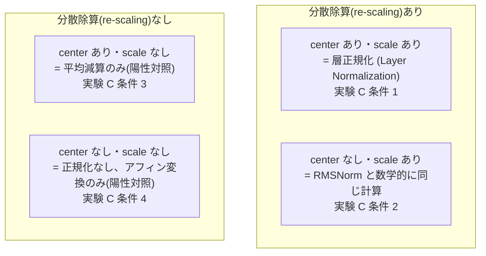
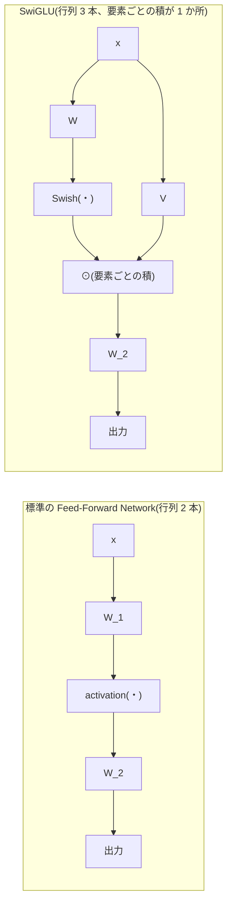
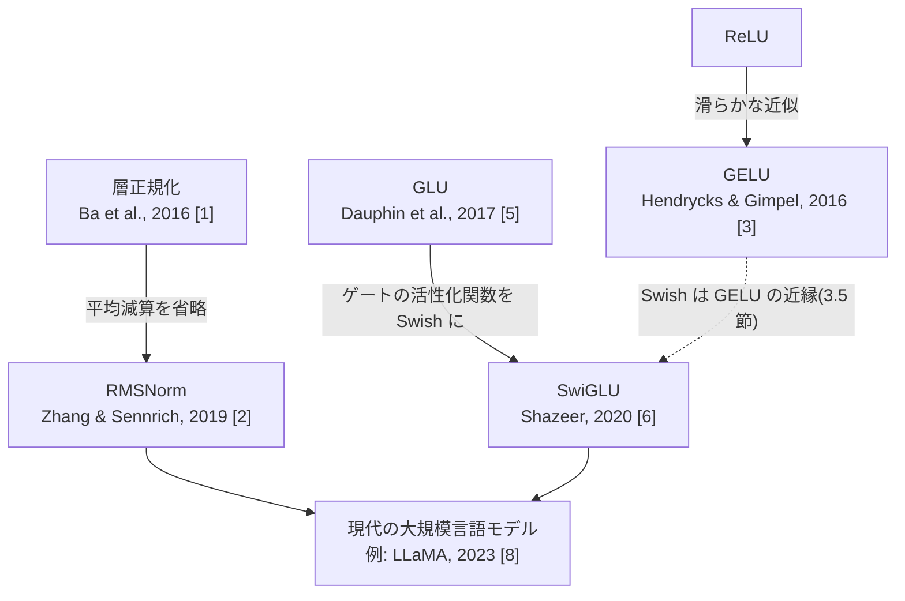

この記事は前編(理論編)です。続きは [こちら](https://zenn.dev/kojikojiprg/books/ai-theories-roadmap/viewer/004_normalization_and_activation-practice-1)。

# 004. 正規化と活性化の系譜

**層正規化・RMSNorm と ReLU・GELU・SwiGLU — 除去実験と合成タスクによる機構の切り分け**
*From Layer Normalization to RMSNorm, and from ReLU through GELU to SwiGLU*

`theories/01_foundations/004_normalization_and_activation.ipynb`

## 1. 概要 / Overview

[002](https://zenn.dev/kojikojiprg/books/ai-theories-roadmap/viewer/002_transformer_block-theory) でスクラッチ実装した層正規化(Layer Normalization)は、平均減算(re-centering)と分散除算(re-scaling)の 2 つの操作から成る。RMSNorm(Root Mean Square Normalization、二乗平均平方根正規化)[2] は、このうち平均減算を省略し分散除算のみを行う簡略版であり、現代の大規模言語モデルの多くが層正規化の代わりに採用している。同様に、順伝播ネットワーク(Feed-Forward Network)の活性化関数も ReLU から GELU(Gaussian Error Linear Unit)[3] を経て、GLU(Gated Linear Unit)[5] 系のゲート機構を組み込んだ SwiGLU [6] へと発展してきた。

本ノートブックは、これらの変遷を「性能が上がったから」で済ませず、**何が本質的な変化で、何がそうでないか** を除去実験(ablation)・不変性の数値検証・小規模合成タスクによって切り分けることを目的とする。特に、文字レベル言語モデリングという 1 つの最終指標だけに頼らず、複数の実験を機構ごとに独立させることで、「効果があった」ことと「その機構が寄与した」ことを混同しないように設計する。

## 2. 参考論文 / References

| # | 著者 / Authors | タイトル / Title | 会議・媒体 / Venue | URL |
|---|---|---|---|---|
| [1] | Ba, J., Kiros, J. R., Hinton, G. E. | Layer Normalization | arXiv:1607.06450, 2016 | https://arxiv.org/abs/1607.06450 |
| [2] | Zhang, B., Sennrich, R. | Root Mean Square Layer Normalization | NeurIPS 2019 | https://arxiv.org/abs/1910.07467 |
| [3] | Hendrycks, D., Gimpel, K. | Gaussian Error Linear Units (GELUs) | arXiv:1606.08415, 2016 | https://arxiv.org/abs/1606.08415 |
| [4] | Ramachandran, P., Zoph, B., Le, Q. V. | Searching for Activation Functions | arXiv:1710.05941, 2017 | https://arxiv.org/abs/1710.05941 |
| [5] | Dauphin, Y. N., Fan, A., Auli, M., Grangier, D. | Language Modeling with Gated Convolutional Networks | ICML 2017 | https://arxiv.org/abs/1612.08083 |
| [6] | Shazeer, N. | GLU Variants Improve Transformer | arXiv:2002.05202, 2020 | https://arxiv.org/abs/2002.05202 |
| [7] | Narang, S. et al. | Do Transformer Modifications Transfer Across Implementations and Applications? | EMNLP 2021 | https://arxiv.org/abs/2102.11972 |
| [8] | Touvron, H. et al. | LLaMA: Open and Efficient Foundation Language Models | arXiv:2302.13971, 2023 | https://arxiv.org/abs/2302.13971 |

[2] が正規化パート、[6] が活性化パートの原典である。[7] は、小規模な比較実験ではアーキテクチャ変更の優劣が観測できないことがある、という本ノートブックの結論の枠づけの根拠として使う。[8] は、現代の大規模言語モデルが RMSNorm と SwiGLU を実際に採用している例として、7 節末尾で参照する。

## 3. 理論 / Theory

**表記の約束**: 本ノートブックでは 002 と同様に、系列中の 1 トークンの隠れ状態を行ベクトル $a \in \mathbb{R}^{d_{\text{model}}}$ として扱う($d_{\text{model}}$: モデルの隠れ次元)。正規化・活性化はいずれもトークンごと・チャネル方向(特徴次元方向)に独立に作用するため、以下の数式はバッチ・系列長の次元を省略し 1 ベクトル $a$ に対する定義として記述する。

### 3.1 層正規化(Layer Normalization)の復習と一般形

[002](https://zenn.dev/kojikojiprg/books/ai-theories-roadmap/viewer/002_transformer_block-theory) で導入した層正規化(Ba et al. [1])は、

$$
\mu = \frac{1}{d_{\text{model}}} \sum_{i=1}^{d_{\text{model}}} a_i, \qquad
\sigma^2 = \frac{1}{d_{\text{model}}} \sum_{i=1}^{d_{\text{model}}} (a_i - \mu)^2
$$

$$
\mathrm{LayerNorm}(a) = \gamma \odot \frac{a - \mu}{\sqrt{\sigma^2 + \varepsilon}} + \beta
$$

と定義される。ここで $\gamma, \beta \in \mathbb{R}^{d_{\text{model}}}$ は学習可能なパラメータ、$\varepsilon$ は分散がゼロに近いときの数値安定化のための微小定数、$\odot$ は要素ごとの積である。

この定義は 2 つの独立した操作の合成として読み直せる。

1. **平均減算(re-centering)**: $a \mapsto a - \mu$。各成分から平均を引き、平均を 0 にそろえる。
2. **分散除算(re-scaling)**: $a \mapsto a / \sqrt{\sigma^2 + \varepsilon}$。標準偏差で割り、分散を 1 にそろえる。

`src/layers/normalization.py`(004 で拡張)の`LayerNormalization`は、この 2 つの操作をそれぞれ`center`・`scale`という bool 引数で独立に無効化できるようにしてある。4 通りの組み合わせ(いずれも $\gamma, \beta$ 自体は保持する)を実験 C で比較する。

### 3.2 RMSNorm(Root Mean Square Normalization、二乗平均平方根正規化)

RMSNorm(Zhang, Sennrich [2])は、層正規化から平均減算を落とし、分散除算のみを残した簡略版である。まず 2 乗平均平方根(RMS)を

$$
\mathrm{RMS}(a) = \sqrt{\frac{1}{d_{\text{model}}} \sum_{i=1}^{d_{\text{model}}} a_i^2}
$$

と定義すると、

$$
\mathrm{RMSNorm}(a) = \gamma \odot \frac{a}{\sqrt{\mathrm{RMS}(a)^2 + \varepsilon}}
$$

学習パラメータは $\gamma \in \mathbb{R}^{d_{\text{model}}}$ のみで、層正規化の $\beta$ に相当するシフトパラメータを持たない。

$\mathrm{RMS}(a)^2 = \frac{1}{d_{\text{model}}} \sum_i a_i^2$ は「平均 0 まわりの分散」ではなく「原点まわりの 2 乗平均」であることに注意する。もし $a$ がすでに平均 0 であれば($\mu = 0$)、$\mathrm{RMS}(a)^2 = \sigma^2$ となり、RMSNorm は層正規化から $\beta$ を除いたものと完全に一致する。この関係は、`LayerNormalization(center=False, scale=True)`と`RMSNorm`が初期化直後($\beta = 0$)に同じ出力を返すことに対応し、2 つの実装の相互検証として実験 B で確認する。

### 3.3 不変性の比較(平行移動不変性の喪失)

層正規化と RMSNorm の違いを、入力の変換に対する **不変性(invariance)** という観点から導出する。入力 $a$ に対して、スカラー $\alpha > 0$ とスカラー $b$ を用いた変換

$$
a \mapsto \alpha a + b \mathbf{1}, \qquad \mathbf{1} = (1, 1, \dots, 1) \in \mathbb{R}^{d_{\text{model}}}
$$

を考える(全成分を同じ倍率 $\alpha$ でスケールし、同じ量 $b$ だけシフトする)。以下、$\varepsilon \to 0$ の理想化した極限で考える($\varepsilon$ 自体は数値安定化のための項であり、不変性の議論の本質には影響しない)。

**層正規化は $\alpha$・$b$ の両方に不変である。** 変換後の平均・分散は $\mu' = \alpha \mu + b$、$\sigma'^2 = \alpha^2 \sigma^2$ となるため、

$$
\frac{(\alpha a_i + b) - \mu'}{\sqrt{\sigma'^2}} = \frac{\alpha (a_i - \mu)}{\alpha \sqrt{\sigma^2}} = \frac{a_i - \mu}{\sqrt{\sigma^2}}
$$

($\alpha > 0$ より $\sqrt{\alpha^2} = \alpha$)。$b$ は平均減算で厳密に打ち消され、$\alpha$ は分子・分母の両方に現れて厳密に打ち消される。

**RMSNorm は $\alpha$ にのみ不変で、$b$ には不変ではない。** 変換後の RMS は

$$
\mathrm{RMS}(\alpha a + b\mathbf{1})^2 = \frac{1}{d_{\text{model}}}\sum_i (\alpha a_i + b)^2 = \alpha^2 \mathrm{RMS}(a)^2 + 2\alpha b\,\bar{a} + b^2
$$

($\bar{a} = \mu$ は $a$ の平均)であり、$b \neq 0$ のとき $\mathrm{RMS}(\alpha a + b\mathbf{1})$ は $\mathrm{RMS}(a)$ の単純な定数倍にならない。したがって

$$
\mathrm{RMSNorm}(\alpha a + b\mathbf{1}) \neq \mathrm{RMSNorm}(\alpha a) = \mathrm{RMSNorm}(a) \quad (b \neq 0 \text{ のとき})
$$

($\alpha$ のみのスケーリング、$b=0$ の場合は $\mathrm{RMS}(\alpha a) = \alpha \,\mathrm{RMS}(a)$ となり厳密に不変)。

すなわち **RMSNorm は平行移動不変性(shift invariance)を失う**。この「失った性質」が実際の学習で問題になるかどうかは、理論だけでは決まらない実証的な問題である。実験 B で数値的に不変性の有無そのものを検証し、実験 D で実際の隠れ状態においてこの喪失が実害になっているかどうかを検証する。

### 3.4 演算回数とパラメータ数

$d_{\text{model}}$ 次元のベクトル 1 本を正規化するのに必要な演算回数(概算、定数個の演算は除く)とパラメータ数を比較する。

| | 加算・減算 | 乗算 | 除算 | 平方根 | パラメータ数 |
|---|---:|---:|---:|---:|---:|
| 層正規化(Layer Normalization) | $\approx 4 d_{\text{model}}$ | $\approx 2 d_{\text{model}}$ | $\approx 2 d_{\text{model}} + 1$ | $1$ | $2 d_{\text{model}}$($\gamma, \beta$) |
| RMSNorm | $\approx d_{\text{model}}$ | $\approx 2 d_{\text{model}}$ | $\approx d_{\text{model}} + 1$ | $1$ | $d_{\text{model}}$($\gamma$ のみ) |

RMSNorm は平均を計算する 1 パス($d_{\text{model}}$ 回の加算 + 中心化の $d_{\text{model}}$ 回の減算)と $\beta$ の加算($d_{\text{model}}$ 回)を省略できるため、層正規化よりおおむね加算・減算の回数が少なく、パラメータ数もちょうど半分になる。

> **注意: 本ノートブックでは実行時間の実測は行わない。** 理由は 2 つある。(1) [002](https://zenn.dev/kojikojiprg/books/ai-theories-roadmap/viewer/002_transformer_block-theory) の実験でも述べた通り、Colab の共有 GPU 上での単一試行の計測はノイズが大きく、条件間の実行時間の差を主張する根拠にならない。(2) 正規化層はテンソル全体に対する演算量が小さく、演算密度(演算数 ÷ メモリアクセス量)が低いためメモリ帯域律速になりやすい。この場合、上表のような演算回数の削減がそのまま実測速度の改善に直結するとは限らない(この論点は 013 の Flash Attention でタイリングと合わせて再訪する)。したがって本ノートブックは演算回数・パラメータ数という理論値の比較に留め、実測時間による優劣は主張しない。

### 3.5 活性化関数: ReLU・GELU・Swish

**ReLU**: $\mathrm{ReLU}(x) = \max(0, x)$。原点で微分不可能、負領域で導関数が恒等的に 0 になる。

**GELU(Gaussian Error Linear Unit、Hendrycks, Gimpel [3])**: 標準正規分布(平均 0、分散 1)の累積分布関数(CDF)を $\Phi(x)$ として、

$$
\mathrm{GELU}(x) = x \, \Phi(x), \qquad \Phi(x) = \frac{1}{2}\left(1 + \mathrm{erf}\!\left(\frac{x}{\sqrt{2}}\right)\right)
$$

これが厳密形である($\mathrm{erf}$: 誤差関数)。計算コストの高い $\mathrm{erf}$ を避けるため、原論文は tanh を使った近似形も提示している。

$$
\mathrm{GELU}(x) \approx \frac{1}{2} x \left(1 + \tanh\!\left(\sqrt{\tfrac{2}{\pi}}\,(x + 0.044715\,x^3)\right)\right)
$$

**Swish / SiLU(Sigmoid Linear Unit、Ramachandran et al. [4])**: シグモイド関数 $\sigma(z) = 1/(1+e^{-z})$ を用いて、形状パラメータ $\beta$ を持つ

$$
\mathrm{Swish}_\beta(x) = x \, \sigma(\beta x)
$$

$\beta = 1$ のとき SiLU と呼ばれる形になる。$\beta \to \infty$ の極限で $\sigma(\beta x)$ はステップ関数(Heaviside 関数、$x<0$ で $0$、$x>0$ で $1$)に収束するため、

$$
\lim_{\beta \to \infty} \mathrm{Swish}_\beta(x) = x \cdot \mathbb{1}[x > 0] = \mathrm{ReLU}(x)
$$

すなわち **Swish は $\beta$ を介して ReLU を連続的に含む族になっている**。この収束の様子は実験 A で複数の $\beta$ について数値的に確認する。

### 3.6 GLU から SwiGLU へ

**GLU(Gated Linear Unit、Dauphin et al. [5])** は、線形変換の出力を別の線形変換にシグモイドを通した値で要素ごとに変調(ゲーティング)する機構である。

$$
\mathrm{GLU}(x, W, V, b, c) = (xW + b) \odot \sigma(xV + c)
$$

Shazeer [6] は、ゲート側の活性化関数 $\sigma$ を他の活性化関数に置き換えた一群の変種(ReGLU、GEGLU、SwiGLU など)を提案し、**SwiGLU** ではゲート側に Swish を使う。

$$
\mathrm{FFN}_{\text{SwiGLU}}(x) = \left(\mathrm{Swish}(x W) \odot x V\right) W_2
$$

ここで $W, V \in \mathbb{R}^{d_{\text{model}} \times d_{\text{ff}}'}$、$W_2 \in \mathbb{R}^{d_{\text{ff}}' \times d_{\text{model}}}$ であり($d_{\text{ff}}'$: SwiGLU の中間次元。標準の順伝播ネットワークの $d_{\text{ff}}$ と区別するためダッシュを付ける)、$\odot$ は要素ごとの積である。標準の順伝播ネットワーク(3.7 節で復習)が行列 2 つ($W_1, W_2$)なのに対し、SwiGLU は行列 3 つ($W, V, W_2$)を持つ。$\mathrm{Swish}(xW)$ が「$xV$ の各成分をどれだけ通すか」を決めるゲートとして働く。

### 3.7 パラメータ数を揃えるための中間次元の導出

[002](https://zenn.dev/kojikojiprg/books/ai-theories-roadmap/viewer/002_transformer_block-theory) で実装した標準の順伝播ネットワーク(バイアスを省略して考える)は

$$
\mathrm{FFN}(x) = \mathrm{activation}(x W_1) W_2, \qquad W_1 \in \mathbb{R}^{d_{\text{model}} \times d_{\text{ff}}},\ W_2 \in \mathbb{R}^{d_{\text{ff}} \times d_{\text{model}}}
$$

でパラメータ数は $2\, d_{\text{model}}\, d_{\text{ff}}$。一方 SwiGLU は行列を 3 つ持つため、中間次元を同じ $d_{\text{ff}}$ のまま置き換える(**素朴な置換**)と、パラメータ数は $3\, d_{\text{model}}\, d_{\text{ff}}$ となり **ちょうど 1.5 倍** に増える。

「ゲート機構そのものの寄与」と「単純にパラメータが増えたことによる寄与」を混同しないためには、パラメータ数を揃えた比較が必要になる。SwiGLU の中間次元を $d_{\text{ff}}'$ として、

$$
3\, d_{\text{model}}\, d_{\text{ff}}' = 2\, d_{\text{model}}\, d_{\text{ff}} \quad \Longrightarrow \quad d_{\text{ff}}' = \frac{2}{3}\, d_{\text{ff}}
$$

原論文([Vaswani et al., 2017])の設定 $d_{\text{ff}} = 4\, d_{\text{model}}$ を使うと、$d_{\text{ff}}' = \frac{8}{3}\, d_{\text{model}} \approx 2.667\, d_{\text{model}}$ となる(Shazeer [6] も同じ $\frac{2}{3}$ 倍の調整を採用している)。

$d_{\text{ff}}'$ は整数でなければならないため、実装では丸め込みが必要になる。本ノートブックの実験(共通ハイパーパラメータ: $d_{\text{model}} = 256$、$d_{\text{ff}} = 1024$)での実際の値を計算すると、

| | 中間次元 | 順伝播ネットワーク部分のパラメータ数 |
|---|---:|---:|
| 標準(GELU) | $d_{\text{ff}} = 1024$ | $2 \times 256 \times 1024 = 524{,}288$ |
| SwiGLU(パラメータ数を揃えた条件) | $d_{\text{ff}}' = \mathrm{round}(2/3 \times 1024) = 683$ | $3 \times 256 \times 683 = 524{,}544$ |
| SwiGLU(素朴な置換、中間次元そのまま) | $d_{\text{ff}} = 1024$ | $3 \times 256 \times 1024 = 786{,}432$($1.5$ 倍) |

丸め込みの結果、「パラメータ数を揃えた条件」も $524{,}544$ 対 $524{,}288$ で **256 個(約 0.05%)だけ厳密には一致していない**。この程度の差は無視できるが、「揃えた」という表現が近似であることは明記しておく。実験 E ではこの 2 つの SwiGLU 条件(揃えた条件・素朴な置換)の両方を比較し、素朴な置換だけでは「ゲートの寄与」と「パラメータ数の寄与」が交絡することを実験 G で機構レベルから、実験 E ではモデル全体のパラメータ数の観点から補強する。

### 3.8 図: 正規化の 4 条件・順伝播ネットワークのデータフロー・手法の系譜

以下は本ノートブックの構造を視覚的に整理するための Mermaid 図である。**Google Colab やローカル Jupyter 上ではコードブロックのまま表示され図として描画されない**(GitHub 上のノートブックプレビューでは描画される)。そのため、以下の図がなくても 3.1〜3.7 節の数式・文章だけで理論が理解できるように書いてある。

**図 1: 正規化の 4 条件(平均減算 × 分散除算)**



**図 2: 標準の順伝播ネットワークと SwiGLU のデータフロー比較**



**図 3: 手法の系譜**



### 3.9 アルゴリズム / Algorithm

```text
RMSNorm(a, gamma, eps):
    ms  <- mean(a_i^2 for i in 1..d_model)      # RMS(a)^2
    a_hat <- a / sqrt(ms + eps)
    return gamma * a_hat                          # 要素ごとの積、beta は存在しない

FFN_SwiGLU(x, W, V, W2, beta):
    gate   <- Swish(x @ W, beta)                   # (..., d_ff')
    gated  <- gate * (x @ V)                        # 要素ごとの積、(..., d_ff')
    return gated @ W2                               # (..., d_model)
```


## 元ノートブック(実装の全文はこちら)

https://github.com/kojikojiprg/ai-theories/blob/main/theories/01_foundations/004_normalization_and_activation.ipynb
