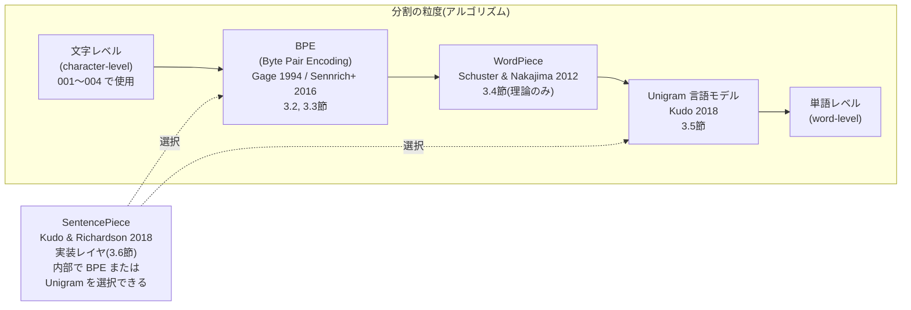
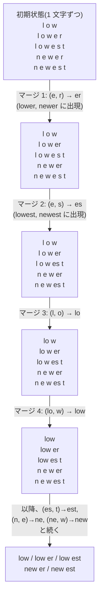
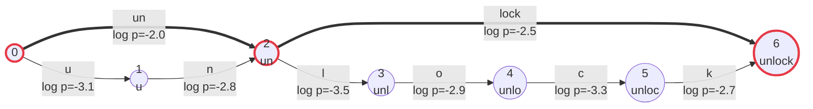

この記事は前編(理論編)です。続きは [こちら](https://zenn.dev/kojikojiprg/books/ai-theories-roadmap/viewer/005_tokenizer-practice-1)。

# 005. トークナイザと部分語分割

**Byte Pair Encoding・WordPiece・Unigram 言語モデル・SentencePiece — 語彙サイズと系列長のトレードオフ**
*Tokenizer and Subword Tokenization*

`theories/02_pretraining/005_tokenizer.ipynb`

## 1. 概要 / Overview

[001](https://zenn.dev/kojikojiprg/books/ai-theories-roadmap/viewer/001_attention_mechanism-theory)〜[004](https://zenn.dev/kojikojiprg/books/ai-theories-roadmap/viewer/004_normalization_and_activation-theory) では、条件比較を目的とした最小構成として文字レベル(character-level)の系列(`CharacterLevelTokenizer`)を前提にしてきた。しかし実際の大規模言語モデルは、文字でも単語でもなく **部分語(subword)** を入力の単位とする。本トピックでは、なぜ部分語が選ばれるのか(系列長・語彙サイズ・未知語のトレードオフ)を理論的に整理したうえで、代表的な部分語分割アルゴリズムである BPE(Byte Pair Encoding)・WordPiece・Unigram 言語モデル(Unigram Language Model)をスクラッチ実装し、アルゴリズムの一種と誤解されがちな SentencePiece の位置づけを明確にする。

英語・日本語・コードという性質の異なる 3 ドメインで語彙サイズを振った比較実験を行い、語彙サイズと圧縮効率(fertility)・系列長・計算量のトレードオフを定量的に検証する。トークナイザそのものの選定(どの方式・語彙サイズを 006 の事前学習で使うか)は本トピックでは行わず、006 で改めて選定する。

## 2. 参考論文 / References

| # | 著者 / Authors | タイトル / Title | 会議・媒体 / Venue | URL |
|---|---|---|---|---|
| [1] | Gage, P. | A New Algorithm for Data Compression | The C Users Journal, Vol. 12, Issue 2, pp. 23–38, 1994 | https://dl.acm.org/doi/10.5555/177910.177914 |
| [2] | Sennrich, R., Haddow, B., Birch, A. | Neural Machine Translation of Rare Words with Subword Units | ACL 2016 (Volume 1: Long Papers), pp. 1715–1725 | https://aclanthology.org/P16-1162/ |
| [3] | Schuster, M., Nakajima, K. | Japanese and Korean Voice Search | ICASSP 2012, pp. 5149–5152 | https://research.google/pubs/japanese-and-korean-voice-search/ |
| [4] | Kudo, T. | Subword Regularization: Improving Neural Network Translation Models with Multiple Subword Candidates | ACL 2018 (Volume 1: Long Papers), pp. 66–75 | https://aclanthology.org/P18-1007/ |
| [5] | Kudo, T., Richardson, J. | SentencePiece: A simple and language independent subword tokenizer and detokenizer for Neural Text Processing | EMNLP 2018: System Demonstrations, pp. 66–71 | https://aclanthology.org/D18-2012/ |
| [6] | Radford, A., Wu, J., Child, R., Luan, D., Amodei, D., Sutskever, I. | Language Models are Unsupervised Multitask Learners | OpenAI, 2019 | https://d4mucfpksyws.cloudfront.net/better-language-models/language-models.pdf |
| [7] | Rust, P., Pfeiffer, J., Vulić, I., Ruder, S., Gurevych, I. | How Good is Your Tokenizer? On the Monolingual Performance of Multilingual Language Models | ACL-IJCNLP 2021 (Volume 1: Long Papers), pp. 3118–3135 | https://aclanthology.org/2021.acl-long.243/ |

本文中で各理論に言及する際は、対応する番号(例:「BPE [1, 2]」)を付す。

## 3. 理論 / Theory

**表記の約束**: 本節では、テキストを構成する最小単位を **文字(character)**、分割・符号化の最終的な出力単位を **トークン(token)** または **部分語(subword)/ 部分語片(piece)** と呼ぶ。文字列 $x$ に対する分割(セグメンテーション)を $\mathbf{x} = (x_1, \ldots, x_M)$($M$ 個の部分語の列、各 $x_i$ を連結すると $x$ に戻る)と書く。

### 3.1 動機・課題 / Motivation

**文字レベルの限界**: 001〜004 では、トークナイザそのものの性能を比較対象にしないという理由から、`CharacterLevelTokenizer` による文字レベルの系列を一貫して用いてきた(004 の実装方針を参照)。しかし文字レベルには本質的な限界がある。同じ量の情報を表すのに必要な系列長 $n$ が(部分語レベルと比べて)大きくなり、001 で導出した Scaled Dot-Product Attention の計算量 $O(n^2 d_{\text{model}})$、および順伝播ネットワーク(Feed-Forward Network)の計算量 $O(n \, d_{\text{model}}^2)$([002](https://zenn.dev/kojikojiprg/books/ai-theories-roadmap/viewer/002_transformer_block-theory))がともに $n$ に対して増加する形で効いてくる(Attention は $n$ の 2 乗)。文字レベルの系列は、この $n$ を不必要に大きくしてしまう。

**単語レベルの限界**: 逆の極端である単語(word)を単位にすると、$n$ は大きく減るが、別の問題が生じる。

- **語彙サイズの爆発**: 活用形・複合語・固有名詞などを考慮すると、単語の異なり数は非常に大きくなる(実質的に上限がない)。
- **未知語(Out-of-Vocabulary)**: 学習コーパスに出現しなかった単語は語彙に存在せず、推論時に表現できない。
- **単語境界の不在**: 日本語・中国語のように、単語の境界が表層(スペースなど)に現れない言語では、そもそも「単語に分割する」こと自体が形態素解析などの追加処理を要する、自明ではない問題になる。

**部分語という中間解**: 部分語(subword)は、頻出する単語やその一部を 1 つのトークンとして扱いつつ、未知の単語は既知の断片(最悪の場合は 1 文字ずつ)に分解して表現する。これにより、語彙サイズを有限に固定したまま、任意の文字列を(未知語なしに、あるいは実用上ごくわずかな未知語で)表現できる。$n$ は文字レベルより小さく、単語レベルよりは大きい、中間的な値になる。3.7 節で、この中間性を語彙サイズと系列長のトレードオフとして定量化する。

#### 図 1: 手法の系譜 / Taxonomy of tokenization methods

以下は、本ノートブックで扱う手法どうしの位置づけを整理した図である。文字レベルと単語レベルを両端に置き、BPE・WordPiece・Unigram 言語モデルは「どの粒度で分割するか」を決める **アルゴリズム** として横軸上に並ぶ。一方 SentencePiece は同じ横軸上のどこかに位置する 1 手法ではなく、BPE または Unigram 言語モデルを **内部アルゴリズムとして選択できる実装** であり、軸に対して直交する(3.6 節で詳述)。



### 3.2 BPE(Byte Pair Encoding) / 3.2 BPE

**起源**: BPE はもともと Gage [1] が提案した汎用データ圧縮アルゴリズムであり、「最も頻出するバイト対を、コーパスに未出現の 1 バイトに置き換える」ことを繰り返すものだった。Sennrich et al. [2] は、この「頻出する対を 1 つの新しいシンボルにまとめる」という操作を、圧縮(バイト数を減らす)ではなく **語彙構築**(頻出する部分文字列をひとまとまりのトークンにする)に転用した。これが自然言語処理における BPE の起源である。

**学習(learning)**: 学習コーパスを何らかの初期シンボル列(3.3 節で 2 通りの初期化を扱う)に変換したのち、以下を反復する。

1. 隣接するシンボル対 $(s_1, s_2)$ ごとに、コーパス全体での出現頻度 $c(s_1, s_2)$ を数える。
2. 頻度が最大の対 $(s_1^\ast, s_2^\ast) = \arg\max_{(s_1, s_2)} c(s_1, s_2)$ を選び、新しいシンボル $s_1^\ast \oplus s_2^\ast$(文字列としての連結)としてコーパス中のすべての出現箇所をマージする。
3. このマージ規則 $(s_1^\ast, s_2^\ast)$ を **学習順に** 記録する。
4. 目標の語彙サイズ $V$ に達するか、それ以上マージできる対が無くなるまで 1〜3 を繰り返す。

**タイブレーク規則**: 手順 2 で頻度が同点の対が複数存在する場合、どれを選ぶかを決めるルールを固定しなければ、同じ入力から実行のたびに異なるマージ順序が生成されうる。本ノートブックでは、対 $(s_1, s_2)$ をタプルとして辞書式順序(まず $s_1$ を文字列として比較し、等しければ $s_2$ を比較する)で比較し、頻度が同点の場合は辞書式に最小の対を選ぶ。この規則を固定することが再現性(reproducibility)の根拠になる(4 節・7 節で詳述)。

**符号化(encoding)**: 学習で得られたマージ規則の列 $(s_1^{(1)}, s_2^{(1)}), (s_1^{(2)}, s_2^{(2)}), \ldots$ を、**学習順に**(規則の番号が小さいものを優先して)新しい文字列に適用する。具体的には、現在のシンボル列に含まれる隣接対のうち、マージ規則の中で最も早く学習されたものを毎回選んで 1 回マージし、適用可能な規則がなくなるまで繰り返す。

**学習と符号化の非対称性**: 学習は「その時点で最も頻度が高い対」を毎回選び直す(データ依存・貪欲(greedy)な手続き)のに対し、符号化は学習で確定した規則列を優先順位表として使うだけであり、符号化対象のテキストにおける頻度は一切参照しない。この非対称性(学習は頻度ベース、符号化は規則の学習順ベース)を混同すると、実装を誤る(例えば符号化時にも頻度で対を選んでしまう、など)。

**アルゴリズム(擬似コード)**:

```text
学習(learn_bpe):
入力: コーパス D、目標語彙サイズ V
出力: マージ規則列 merges、語彙 vocab

1: 初期シンボルでコーパスの各チャンクを分解し、頻度 freq を集計する
2: vocab ← 初期シンボル全体の集合
3: merges ← 空列
4: while |vocab| < V かつ マージ可能な対が存在する:
5:     すべての隣接対についてコーパス全体での頻度 c(s1, s2) を数える
6:     (s1*, s2*) ← 頻度最大の対(同点はタプルの辞書式順序で決定的にタイブレーク)
7:     コーパス中の (s1*, s2*) をすべて s1* ⊕ s2* にマージする
8:     merges.append((s1*, s2*));  vocab.add(s1* ⊕ s2*)
9: return merges, vocab

符号化(encode):
入力: 文字列 x、マージ規則列 merges(学習順)
出力: 部分語シンボル列

1: symbols ← x を初期シンボルに分解した列
2: while True:
3:     現在の symbols に含まれる隣接対のうち、merges の中で最も早く学習された対を探す
4:     見つからなければ break
5:     見つかった対のすべての出現箇所を 1 つのシンボルにマージする
6: return symbols
```

**計算量**: 素朴には、手順 5 でコーパス全体を毎回スキャンし直すと、1 回のマージあたり $O(N)$($N$: コーパスの総文字数)、目標語彙サイズ $V$ に達するまでに $O(V)$ 回のマージが必要なため、全体で $O(VN)$ になる。本実装では、各シンボル対がどのチャンクに含まれるかを追跡し(`pair_index`)、あるマージによって実際に変化したチャンクのみ差分更新することで、この毎回の全体スキャンを避けている(5 節参照)。

#### 図 2: BPE のマージ過程 / BPE merge process

小さな例(`"low", "lower", "lowest", "newer", "newest"` という 5 語からなるコーパス)で、マージによってシンボル列がどう成長するかを示す。初期状態では各語は 1 文字ずつのシンボル列であり、頻度最大の隣接対(この例では `e` と `r` の対、`newer` と `lower` に共通して出現する)から順にマージされていく。



実験1で、実際のコーパスに対してこの過程を(30 個程度のマージ規則として)観察する。

### 3.3 バイトレベル BPE(byte-level BPE) / 3.3 Byte-level BPE

3.2 節の学習・符号化アルゴリズムは、「初期シンボルを何にするか」に依存する。ここには 2 つの選択肢がある。

- **文字レベル初期化**: 学習コーパスに出現した Unicode 文字をそのまま初期シンボルにする。学習コーパスに出現しなかった文字は語彙に存在しないため、推論時にその文字を含む入力があると表現できない(未知語、Out-of-Vocabulary)。
- **バイトレベル初期化(byte-level BPE)**: GPT-2 [6] が採用した方式で、初期シンボルを Unicode 文字ではなく **UTF-8 の 256 バイト値** にする。任意の Unicode 文字列は UTF-8 バイト列として一意に表現できるため、初期語彙が「バイト値 0〜255 のすべて」を含む限り、コーパスに一度も出現しなかった文字(絵文字、稀な漢字など)であっても、必ずいずれかのバイトの組み合わせとして表現できる。これにより、**未知語が原理的に発生しなくなる**(実験3で検証する)。

**トレードオフ**: バイトレベル初期化には代償がある。ASCII 文字(英数字など)は UTF-8 で 1 バイトだが、日本語の文字の多くは UTF-8 で **3 バイト** を占める。文字レベル初期化であれば、頻出する日本語の 1 文字は最初から 1 個のシンボル(1 トークン)として扱えるのに対し、バイトレベル初期化ではその 1 文字を表すために 3 バイトのシンボルを毎回マージして 1 個のシンボルに統合し直す必要がある。このコストが実際にどれだけの語彙(マージ回数)を消費しているかは実験4で測定する。

ただしこの代償の大きさは語彙サイズに依存する点に注意が必要である。目標語彙サイズが十分に大きければ、バイトレベル初期化であってもマージによって頻出する日本語文字を 1 トークンに統合しきれる。一方、文字レベル初期化の側にも見落とされがちな制約がある。日本語のようにユニーク文字数が多い言語では、目標語彙サイズがそのユニーク文字数を下回る間、文字レベル初期化は **マージを 1 回も行えない**(初期シンボルの数だけで既に目標語彙サイズに達してしまうため)。したがって「バイトレベル BPE は日本語で UTF-8 の 3 バイト表現のコストを負う」という主張は、低語彙サイズ域で無条件に成り立つものではなく、両者がともにマージの余地を持つ比較可能な語彙サイズ域でどちらが有利かという、**語彙サイズに依存したトレードオフ** として検証する必要がある(実験4)。「バイトレベルは常に優れている」「文字レベルは常に優れている」のいずれの単純な結論も、実験4の結果次第では成り立たない可能性がある。

### 3.4 WordPiece / 3.4 WordPiece

WordPiece [3] は、Google が音声認識(日本語・韓国語の音声検索)のために提案した部分語分割アルゴリズムで、後に BERT 系列のモデルで広く使われた。学習の反復構造は BPE(3.2 節)と同じ(隣接対を反復的にマージし、目標語彙サイズに達したら終了)だが、**どの対をマージするかを選ぶ基準** が異なる。

BPE がペア $(A, B)$ の生の出現頻度をスコアとするのに対し($\mathrm{score}_{\text{BPE}}(A, B) = \mathrm{freq}(AB)$)、WordPiece は

$$
\mathrm{score}_{\text{WordPiece}}(A, B) = \frac{\mathrm{freq}(AB)}{\mathrm{freq}(A) \cdot \mathrm{freq}(B)}
$$

を用いる。これは点別相互情報量(pointwise mutual information)に類似した量であり、$A$ と $B$ それぞれの出現頻度に対して $AB$ の共起が「どれだけ偶然の水準を上回るか」を測る。単に頻出するというだけでなく、$A$ と $B$ が互いに強く結びついているペアを優先してマージする点が BPE との違いである(直感的には、コーパス中の尤度の増加分を近似する基準になっている)。

**実装方針の注記**: 本ノートブックでは、WordPiece は理論の説明にとどめ、スクラッチ実装は行わない。学習の反復構造は BPE と共通であり($\mathrm{score}$ 関数だけを差し替えれば得られる)、本トピックが重視する「BPE(構築手続き)と Unigram 言語モデル(確率モデル)の対比」(3.5 節)という観点からは、WordPiece は BPE と同じ「構築手続き」側に位置づけられる派生形であるため、実装による追加の学びが少ないと判断した。

### 3.5 Unigram 言語モデル(Unigram Language Model) / 3.5 Unigram Language Model

**BPE との本質的な違い**: BPE(および WordPiece)は「隣接対を反復的にマージする」という **構築手続き(procedure)** であり、それ自体は確率モデルではない。これに対し Unigram 言語モデル [4] は、部分語の列に対する明示的な **生成確率モデル** として定式化される。この対比 ――「BPE は手続き、Unigram 言語モデルはモデル」―― が両者の本質的な違いである。

**定式化**: 語彙 $V$ の各部分語(piece)$v \in V$ に生起確率 $p(v)$ が割り当てられているとする($\sum_{v \in V} p(v) = 1$)。文字列 $x$ の分割 $\mathbf{x} = (x_1, \ldots, x_M)$($x_i \in V$、$x_1 \oplus \cdots \oplus x_M = x$)に対して、各部分語が独立に生成されると仮定し、

$$
P(\mathbf{x}) = \prod_{i=1}^{M} p(x_i)
$$

と定義する。$M$ は分割 $\mathbf{x}$ に含まれる部分語の個数(分割によって異なりうる)。

**分割の非一意性と最尤分割**: 同じ文字列 $x$ に対して、複数の分割 $\mathbf{x}$ が存在しうる(例:`"unlock"` は `["un", "lock"]` とも `["u", "n", "lock"]` とも分割できる)。Unigram 言語モデルは、その中で $P(\mathbf{x})$ を最大化する分割(最尤分割)を採用する。

$$
\hat{\mathbf{x}} = \arg\max_{\mathbf{x} : x_1 \oplus \cdots \oplus x_M = x} P(\mathbf{x}) = \arg\max_{\mathbf{x}} \sum_{i=1}^{M} \log p(x_i)
$$

これは、文字位置を頂点、語彙に含まれる部分語を辺(重み $\log p(x_i)$)とする有向非巡回グラフ(分割格子、lattice)の上で最長経路(対数確率の和が最大の経路)を求める問題であり、**Viterbi アルゴリズム**(動的計画法)で厳密に解ける。本ノートブックでは、この Viterbi 最尤分割(`viterbi_segment`)をスクラッチ実装する。

**語彙学習(EM ベースの反復的縮小)**: 学習コーパスから、大きな候補語彙(頻出する部分文字列の集合)を初期状態として用意し、以下を反復する。

1. 現在の語彙・確率のもとで、EM アルゴリズム(期待値最大化法)により各部分語の確率 $p(v)$ を推定する(E ステップ: 各文の最尤分割、または分割の期待値を計算し、M ステップ: 部分語の出現期待頻度から確率を再推定する)。
2. 各部分語 $v$ について、$v$ を語彙から除いた場合にコーパス全体の対数尤度がどれだけ減少するか(その部分語の「効用」)を評価する。
3. 効用の低い部分語から一定割合(shrinking factor)を語彙から削減する。
4. 目標語彙サイズに達するまで 1〜3 を繰り返す。

本ノートブックでは、この語彙学習は sentencepiece に委ね(4 節・実装方針を参照)、Viterbi 最尤分割のみをスクラッチ実装する。

**Subword regularization**: Kudo [4] は、学習時に常に最尤分割(1 通り)だけを使うのではなく、$P(\mathbf{x})$ に応じて複数の分割候補を確率的にサンプリングして学習データに使う **subword regularization** を提案した。同じ単語が学習中に複数の分割で出現することが、部分語の境界の揺らぎに対するモデルの頑健性を高める一種のデータ拡張として働く。本ノートブックは分割(推論)のみを扱い、モデルの学習は行わないため、subword regularization 自体は実装しない。

#### 図 3: Unigram 言語モデルの分割格子(lattice)と Viterbi 経路

文字列 `"unlock"` を例に、語彙に含まれる部分語ごとに 1 本の辺を持つ分割格子を示す。各辺の重みは対数確率 $\log p(v)$(値が大きい = 確率が高い)であり、Viterbi アルゴリズムは頂点 0(先頭)から頂点 6(末尾)までの重みの和が最大になる経路を動的計画法で求める。図中では、`["un", "lock"]` という分割(太字矢印)が `["u", "n", "lock"]` より高い対数確率の和を持ち、最尤分割として選ばれる例を示す。



太字(⇒)の経路が `["un", "lock"]`(対数確率の和 $-2.0 + (-2.5) = -4.5$)であり、細字の経路をすべて辿る `["u", "n", "lock"]` の和($-3.1 + (-2.8) + (-2.5) = -8.4$)より大きい。実験6で、この Viterbi 分割の実装が sentencepiece 自身の分割結果と一致することを検証する。

### 3.6 SentencePiece / 3.6 SentencePiece

**SentencePiece はアルゴリズムではなく実装である** [5]。3.2〜3.5 節で見た BPE や Unigram 言語モデルが「部分語をどう選ぶか」を定めるアルゴリズムであるのに対し、SentencePiece は、内部アルゴリズムとして BPE と Unigram 言語モデルの **どちらでも選択できる**、学習・符号化・復号を一貫して行うためのソフトウェア実装である。図1 で SentencePiece をアルゴリズムの系譜(横軸)に対して直交する位置に置いたのはこのためである。

SentencePiece のもう 1 つの特徴は、**生のテキストを直接扱い、事前分割(pre-tokenization)を必要としない設計** にある。3.2 節で実装する自作の BPE は、`chunk_split_mode`(空白の直前で事前分割するか、しないか)を明示的に指定する必要があり、この選択自体が言語依存の問題を引き起こす(3.7 節・実験5で検証する、日本語では空白による事前分割が機能しないという問題)。これに対し SentencePiece は、空白を含むテキストをあらかじめ単語に分割することを前提とせず、**空白そのものを語彙上のシンボルの 1 つ** として扱う。具体的には、入力テキスト中の空白文字を`▁`(U+2581、下線に似た専用の記号)に置き換えてから分割する。分割結果の部分語を単純に連結し、`▁`を空白に戻すだけで元のテキストを **完全に復元(lossless detokenization)** できる。

自作の BPE も、事前分割(3.2 節の`pretokenize`)の`whitespace`モードで空白をチャンクの先頭に保持する設計にしたことにより、符号化結果を単純に連結するだけで元のテキストを完全に復元できる(5.1 節の可逆性の検証を参照)。この点では SentencePiece の`▁`による可逆性と実質的に同じ性質を持つ(GPT-2 のバイトレベル BPE [6] も同じ「空白をチャンク先頭に含める」方式を採用している)。両者の違いは可逆性の **有無** ではなく、その **実現方法** にある。SentencePiece は`▁`という明示的な語彙記号を導入することで、事前分割の要否そのものをアルゴリズムから切り離している(利用者に`chunk_split_mode`のような選択を要求しない)のに対し、自作の BPE の可逆性は`chunk_split_mode="whitespace"`という特定の事前分割方式を選んだ場合に限られる(`chunk_split_mode="none"`は複数行にわたるテキストで改行が失われるため可逆ではない、5.1 節を参照)。

SentencePiece が事前分割の要否をアルゴリズムから切り離せるのは、そもそも事前分割の有無が圧縮効率(fertility)にどれだけ影響するかという点と無関係ではないはずである。事前分割の方式が fertility にどの程度影響するかは実験5で測定する。

### 3.7 語彙サイズと系列長のトレードオフ / Vocabulary size vs. sequence length

3.1 節で述べた通り、部分語は文字レベルと単語レベルの中間解であり、語彙サイズ $V$ の選び方によってこの中間性の度合いが変わる。本節では、このトレードオフをモデルのパラメータ数・計算量という観点から定式化する。

**埋め込み行列のパラメータ数**: トークン埋め込み(および出力の線形写像、多くの実装で重み共有される)のパラメータ数は

$$
\#\text{params}_{\text{embed}} = V \times d_{\text{model}}
$$

であり、$V$ に **比例して線形に増加** する($d_{\text{model}}$: モデルの隠れ次元、[001](https://zenn.dev/kojikojiprg/books/ai-theories-roadmap/viewer/001_attention_mechanism-theory) の記法)。

**系列長に依存する計算量**: [001](https://zenn.dev/kojikojiprg/books/ai-theories-roadmap/viewer/001_attention_mechanism-theory) で導出した Scaled Dot-Product Attention の計算量は系列長 $n$ に対して $O(n^2 d_{\text{model}})$、[002](https://zenn.dev/kojikojiprg/books/ai-theories-roadmap/viewer/002_transformer_block-theory) の順伝播ネットワークの計算量は $O(n \, d_{\text{model}}^2)$ である。$V$ を大きくして 1 トークンあたりの表現力を上げる(圧縮効率を高める)ほど、同じ量の文字列を表すのに必要なトークン数 $n$ は **減少** する。

**fertility(1 文字あたりのトークン数)**: この圧縮効率を定量化する指標として、fertility を

$$
\mathrm{fertility} = \frac{(\text{トークン数})}{(\text{文字数})}
$$

と定義する(Rust et al. [7] の定義に基づく)。fertility が小さいほど、同じ文字数のテキストをより少ないトークンで表現できている。

**単語ではなく文字を分母にする理由**: Rust et al. [7] を含む多くの先行研究では、fertility を「1 単語あたりのトークン数」として定義することが多い。しかし本リポジトリは日本語(単語境界が表層に現れない言語、3.1 節)を扱うため、そもそも「単語数」を言語に依存せず一貫して数える手段がない。そこで本ノートブックでは、分母を単語数ではなく **文字数** に統一する。これにより、英語・日本語・コードという性質の異なるドメイン間でも同じ定義で比較できる。

**トレードオフの構造**: 固定量の文字列(文字数 $C$)を処理する際の系列長は $n \approx C \times \mathrm{fertility}(V)$ と書ける。$V$ を増やすと $\mathrm{fertility}(V)$ は減少する(圧縮効率が上がる)ため $n$ は減り、Attention・順伝播ネットワークの計算量は下がる。しかし埋め込み行列のパラメータ数 $V \times d_{\text{model}}$ は増え続ける。したがって、

- $V$ が小さい領域では、$V$ を増やすことで系列長由来の計算量が大きく減る一方、埋め込みパラメータの増加は緩やか(直線的)である。
- $V$ が大きい領域では、fertility の減少が鈍化する(3.2 節の圧縮効率が収穫逓減する、実験2で検証する)一方、埋め込みパラメータは増え続ける。

このため、埋め込みパラメータと系列長由来の計算量の和を最小化する $V$ が(少なくとも数値的には)存在しうる。ただし、fertility(V) の関数形はドメイン(英語・日本語・コード)によって大きく異なるため、最適点の位置もドメインに依存する。実験7で、実験2で得た実測の fertility を用いてこれを数値的に確認する。


## 元ノートブック(実装の全文はこちら)

https://github.com/kojikojiprg/ai-theories/blob/main/theories/02_pretraining/005_tokenizer.ipynb
