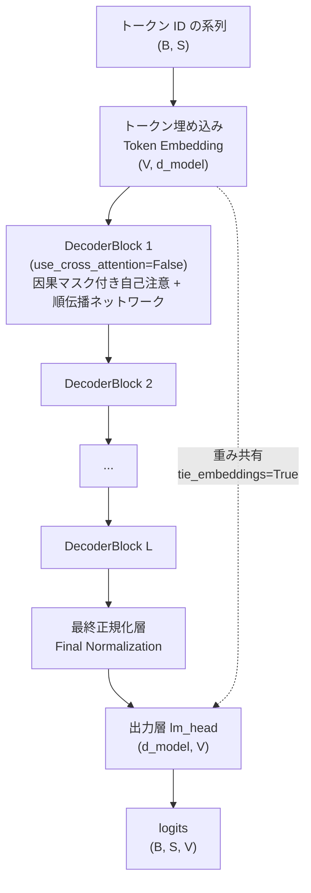
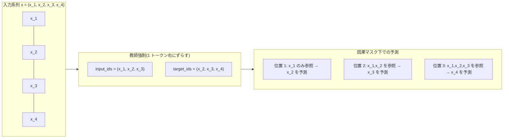
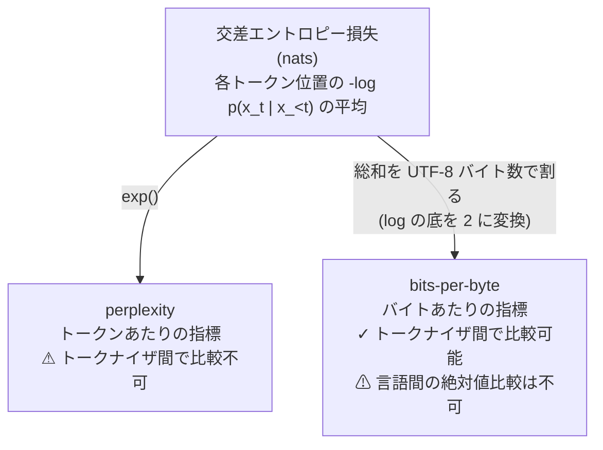

この記事は前編(理論編)です。続きは [こちら](https://zenn.dev/kojikojiprg/books/ai-theories-roadmap/viewer/006_pretraining_small_gpt-practice-1)。

# 006. 小型 GPT の事前学習(Pretraining a Small GPT)

## 1. 概要 / Overview

001〜005 で個別に検証してきた部品(多頭注意機構、Transformer Block、RoPE、RMSNorm、SwiGLU、トークナイザ)を統合し、**decoder-only な自己回帰言語モデル(Autoregressive Language Model)を実際に事前学習(pretraining)させる** 初めてのトピックである。あわせて、005 で比較したトークナイザ(方式・語彙サイズ)を下流の言語モデリング性能(bits-per-byte)で選定する。日本語版・英語版 Wikipedia のコーパスを用い、トークナイザ条件間・語彙サイズ間の比較を、測定ノイズ床(noise floor)を基準にした判定基準のもとで行う。

## 2. 参考論文 / References

| # | 著者 / Authors | タイトル / Title | 会議・媒体 / Venue | URL |
|---|---|---|---|---|
| [1] | Radford, A., Narasimhan, K., Salimans, T., Sutskever, I. | Improving Language Understanding by Generative Pre-Training | OpenAI, 2018 | https://cdn.openai.com/research-covers/language-unsupervised/language_understanding_paper.pdf |
| [2] | Radford, A., Wu, J., Child, R., Luan, D., Amodei, D., Sutskever, I. | Language Models are Unsupervised Multitask Learners | OpenAI, 2019 | https://d4mucfpksyws.cloudfront.net/better-language-models/language-models.pdf |
| [3] | Brown, T. B., et al. | Language Models are Few-Shot Learners | NeurIPS 2020 | https://arxiv.org/abs/2005.14165 |
| [4] | Press, O., Wolf, L. | Using the Output Embedding to Improve Language Models | EACL 2017 | https://arxiv.org/abs/1608.05859 |
| [5] | Inan, H., Khosravi, K., Socher, R. | Tying Word Vectors and Word Classifiers: A Loss Framework for Language Modeling | ICLR 2017 | https://arxiv.org/abs/1611.01462 |
| [6] | Kaplan, J., et al. | Scaling Laws for Neural Language Models | 2020 | https://arxiv.org/abs/2001.08361 |
| [7] | Touvron, H., et al. | LLaMA: Open and Efficient Foundation Language Models | 2023 | https://arxiv.org/abs/2302.13971 |

本文中で各理論に言及する際は、対応する番号(例:「decoder-only 構成 [1, 2]」)を付す。

## 3. 理論 / Theory

### 3.1 自己回帰言語モデリング(Autoregressive Language Modeling)

**記号 / Notation**:

- $x = (x_1, \dots, x_n)$: トークン ID の系列(系列長 $n$)
- $V$: 語彙サイズ(vocabulary size)
- $\theta$: モデルのパラメータ
- $p_\theta(x_t \mid x_{<t})$: パラメータ $\theta$ のもとで、位置 $t$ より前のトークン $x_{<t} = (x_1, \dots, x_{t-1})$ を条件とした位置 $t$ のトークンの予測分布

系列全体の同時分布 $p_\theta(x)$ は、確率の連鎖律(chain rule)によって、各位置の条件付き分布の積に分解できる。

$$
p_\theta(x) = \prod_{t=1}^{n} p_\theta(x_t \mid x_{<t})
$$

**自己回帰言語モデル(Autoregressive Language Model)** は、この各項 $p_\theta(x_t \mid x_{<t})$ をニューラルネットワークで直接モデル化する [1, 2]。学習は、この同時分布の負の対数尤度(negative log-likelihood)を最小化することで行う。

$$
\mathcal{L}(\theta) = -\frac{1}{n}\sum_{t=1}^{n} \log p_\theta(x_t \mid x_{<t})
$$

この式は、各位置 $t$ で「正解トークン $x_t$」を $V$ クラス分類問題の正解ラベルとみなした **交差エントロピー損失(cross entropy loss)** の系列全体の平均に他ならない。

**教師強制(teacher forcing)**: 学習時、モデルへの入力系列 $x_{<t}$ には(モデル自身が生成したトークンではなく)**正解の系列** をそのまま与える。実装上は、入力系列を `input_ids = x[:-1]`、目標系列を `target_ids = x[1:]` のように **1 トークンだけ右にずらす** ことで、位置 $t$ の入力(`input_ids[t]` = $x_t$)から位置 $t$ の目標(`target_ids[t]` = $x_{t+1}$)を予測する形に揃える(図 2 参照)。これにより、系列長 $n$ の 1 つの forward 計算で $n-1$ 個すべての位置の予測を並列に計算できる(位置 $t$ の予測に使ってよい情報を $x_{\le t}$ のみに制限する **因果マスク(causal mask)** と組み合わせて初めて、この並列計算が「未来の情報を見ない」という自己回帰の制約を満たす)。学習時とは異なり、**生成時(推論時)は自分自身が直前に生成したトークンを次の入力にする**(教師強制なしの自己回帰生成、後述の生成例を参照)。

### 3.2 decoder-only 構成

002 で実装した `DecoderBlock` は、自己注意(self-attention)に加えて、Encoder の出力(memory)を参照する **交差注意(cross-attention)** を持つ、Encoder-Decoder 構成のためのブロックだった。系列変換(機械翻訳など、002 の実験 4)では、Decoder が Encoder 側の入力系列(source)を参照しながら出力系列(target)を生成する必要があるため、この交差注意が本質的だった。

しかし、自己回帰言語モデリングでは「参照すべき別の系列(source)」は存在しない。モデルが予測すべきなのは、**同じ 1 つの系列の中で、これまでに出現したトークンから次のトークンを予測する** ことだけである。したがって、交差注意で参照する Encoder 出力(memory)がそもそも存在せず、Decoder Block は自己注意と順伝播ネットワークの 2 つの副層だけで構成できる。これが **decoder-only 構成** である [1, 2]。

004 までは、decoder-only 構成を作るために `EncoderBlock`(自己注意のみの 2 副層構成)に因果マスクを渡すという方式を使っていた(`EncoderBlock` という名前ではあるが、交差注意を持たない点で構造的には decoder-only に一致するため)。006 では `DecoderBlock` 自体に `use_cross_attention: bool = False` 引数を追加し、交差注意の副層(`cross_attn`・対応する正規化層)を **生成しない** モードを設けた。これにより、`DecoderBlock` という名前のクラスをそのまま decoder-only 構成に使えるようになった(`src/layers/transformer_block.py`)。

`GPTLanguageModel`(`src/models/gpt.py`)は、この `DecoderBlock(use_cross_attention=False)` を $L$ 層積み、トークン埋め込み・最終正規化層・出力層(語彙への射影)を組み合わせた構成である(図 1)。**正規化前置(Pre-Layer Normalization、`norm_first=True`)** を採用する(002 の知見の通り、深い層でも学習が安定するため)。

**図 1: decoder-only Transformer(`GPTLanguageModel`)の全体構成。** 破線はトークン埋め込み行列と出力層 `lm_head` の重み共有(3.3 節)を表す。RoPE・RMSNorm・SwiGLU の配置は 3.4 節で述べる。

**図 2: 教師強制における入力・目標の 1 トークンずらしと、因果マスク下での予測対応。** 位置 $t$ の logits(`input_ids[t]` までを見た予測)が `target_ids[t]`(= $x_{t+1}$)の予測に対応する。

### 3.3 重み共有(Weight Tying)

トークン埋め込み行列 $E \in \mathbb{R}^{V \times d_{\text{model}}}$(トークン ID → ベクトル)と、出力層(語彙への射影)の重み行列 $W_{\text{out}} \in \mathbb{R}^{V \times d_{\text{model}}}$(ベクトル → 各トークンのスコア)は、形状が一致する。**重み共有(weight tying)** は、この 2 つの行列に **同一のパラメータ** $E = W_{\text{out}}$ を使う手法である [4, 5]。

**動機**: 入力側の埋め込みは「トークン ID を意味空間のベクトルに変換する」写像、出力側の射影は「意味空間のベクトルを各トークンへの選好スコアに変換する」写像であり、直感的には互いに逆向きの、しかし同じ意味空間を共有する変換である。実際、意味的に近いトークン(類義語など)は、入力側の埋め込みでも出力側の射影でも近いベクトルを持つことが期待される。Press & Wolf [4] と Inan et al. [5] は、この 2 つの行列を独立に学習するより共有した方が、言語モデルの性能(perplexity)が同等かそれ以上になることを示した。

**パラメータ削減効果**: 埋め込み行列・出力層はいずれも $V \times d_{\text{model}}$ 個のパラメータを持つ。重み共有により、この $2 \times V \times d_{\text{model}}$ 個から $V \times d_{\text{model}}$ 個へと、**語彙サイズに比例する分だけ** パラメータ数を削減できる。語彙サイズ $V$ が大きい(例えばバイトレベル BPE で $V=8192$)条件ほど、この削減効果は大きい。`GPTLanguageModel` は `tie_embeddings: bool = True` 引数でこれを切り替えられる(既定で共有する)。

**非埋め込みパラメータ数(non-embedding parameters)との関係**: 3.5 節・実験で条件間のパラメータ数を揃える際、埋め込み行列・出力層(重み共有時は同一のパラメータ)を除いた **非埋め込みパラメータ数** を基準にする(`count_non_embedding_parameters`、`src/utils/statistics.py`)。語彙サイズが条件ごとに異なる(文字レベル・$V{=}1024$・$V{=}2048$・$V{=}4096$・$V{=}8192$)ため、総パラメータ数をそのまま比較すると語彙サイズの効果と「実質的な計算能力」の効果が交絡してしまう。重み共有によって埋め込み関連パラメータが 1 セットに統一されていることは、この切り分けをより明確にする(Kaplan et al. [6] が総パラメータ数ではなく非埋め込みパラメータ数でスケーリング則を定式化した理由と同じ発想であり、009 で改めて扱う)。

### 3.4 003・004 の成果の統合

`GPTLanguageModel` は、003・004 で個別に検証した部品を **注入点(injection point)を通じて** 組み込む。新しいクラスを作るのではなく、既存の `DecoderBlock` の注入点(`normalization_factory`・`feed_forward_factory`)と、`MultiHeadAttention` の注入点(`positional_transform`)にそのまま差し込む設計であり、001〜005 を通じて一貫している「ラッパークラスを増やすのではなく optional 引数・注入点で拡張する」方針を踏襲する。

- **RoPE(Rotary Position Embedding、003)**: `positional_transform` として各層の `self_attn` に注入する。学習パラメータを持たないため、全層で同一インスタンスを共有できる(`GPTLanguageModel._build_block` が 003 と同じ手法、すなわち構築済みの `DecoderBlock` の `self_attn` 属性を位置変換を注入した `MultiHeadAttention` に差し替える手法で組み込む)。002 の正弦波(sinusoidal)方式・学習可能な絶対位置埋め込みのようにトークン埋め込みへ加算する方式は使わない(3.2 節・図 1 の通り、`GPTLanguageModel` はモジュール内部に位置エンコーディングを持たず、注入方式のみに一本化している)。
- **RMSNorm(004)**: `normalization_factory=RMSNorm` として `DecoderBlock`・最終正規化層に渡す。
- **SwiGLU(004)**: `feed_forward_factory` として `DecoderBlock` に渡す。中間次元は 004 の理論セクションで導出した通り、標準の順伝播ネットワークとパラメータ数を揃えるため $d_{ff}' = \text{round}(\frac{2}{3} d_{ff})$ に丸める。

これら 3 つを採用する理由は、LLaMA [7] が実際にこの組み合わせ(RoPE・RMSNorm・SwiGLU)を採用しており、現代の decoder-only 言語モデルの標準的な構成の一例になっているためである。ただし本トピックの主眼は「トークナイザの選定」(実験 D〜F)であり、アーキテクチャ選択そのものの比較実験(RoPE 対 学習可能絶対位置埋め込み、RMSNorm 対 層正規化など)は 003・004 で既に行っているため、006 では固定の構成として採用し、繰り返さない。

### 3.5 評価指標: perplexity と bits-per-byte

**perplexity(困惑度)**: トークンあたりの平均負の対数尤度 $\bar{\mathcal{L}}$(3.1 節の $\mathcal{L}(\theta)$)を使って

$$
\text{PPL} = \exp(\bar{\mathcal{L}})
$$

と定義される(`compute_perplexity`、`src/utils/statistics.py`)。直感的には「モデルが各ステップで平均的に何個のトークンから 1 つを選ぶのに相当する不確実性を持っているか」を表す。

**perplexity の限界**: perplexity は **1 トークンあたり** の指標であり、**トークナイザが異なる条件間では比較できない**。同じテキストでも、語彙サイズを上げればトークン数(系列長)が減る(005 の fertility の議論)。1 トークンに、より多くの情報(文字数)が詰め込まれるようになるため、モデルの予測能力そのものが変わらなくても、1 トークンあたりの負の対数尤度は変化しうる。したがって、「トークナイザ A(perplexity 20)はトークナイザ B(perplexity 15)より劣る」という比較は、語彙サイズが異なる限り成立しない。

**bits-per-byte**: この問題を避けるため、条件間比較(実験 D〜G)には **bits-per-byte** を使う。

$$
\text{bits\_per\_byte} = \frac{\sum_{t} -\log_2 p_\theta(x_t \mid x_{<t})}{\text{total\_bytes}}
$$

分母を「評価対象のトークン数」ではなく「評価対象の **UTF-8 バイト数**」にすることで、トークナイザの語彙サイズ・分割方式によらず、常に同じ「元のテキストの物理的な量」を基準にできる(`compute_bits_per_byte`、`src/utils/statistics.py`)。**分母を文字数ではなくバイト数にする理由** は 005 の fertility の議論と同じで、日本語(1 文字が UTF-8 で 3 バイト)と英語(1 文字が 1 バイト)を文字数で揃えると、そもそも情報量が揃わないためである。バイトレベル BPE では 1 トークンが UTF-8 の複数バイト文字の途中で切れうる(005 の byte-level BPE の議論)ため、バイト数を分母にすることで、この「トークンの境界がバイト境界と必ずしも一致しない」という事情に関係なく、全条件で厳密に同じ量(バイト)を分母にできる。**実装上は、この分母をトークン化後の窓から逆算するのではなく、トークン化前の検証テキストから直接** `len(text.encode("utf-8"))` **として求める**(`make_evaluation_windows`、`src/data/text.py`)。これにより、末尾の不完全な窓をパディングして損失計算から除外する実装(5.7 節)と組み合わせても、分母が全トークナイザ条件で厳密に同一の定数になることを保証できる(本番実行前の修正 2)。

**bits-per-byte を言語間で直接比較しない**: bits-per-byte はトークナイザ条件をまたいだ比較を可能にするが、**言語をまたいだ絶対値の比較には使えない**。日本語は 1 文字が平均して英語よりずっと多くの情報(エントロピー)を持ち、同じ文字数のテキストを表すのに必要なバイト数も約 3 倍になる(005 で述べた通り)。そのため、「日本語の bits-per-byte が英語より高い」という結果が出ても、それは日本語の方がモデルにとって「難しい」ことを意味するとは限らず、言語そのものの情報量の違いを反映しているだけの可能性がある。本トピックで日英を比較する際は、**各言語内での相対改善率**(例えば「$V{=}1024$ から $V{=}8192$ への改善率」)のみを比較し、絶対値そのものを日英間で比較しない(実験 F)。

**図 3: 損失から perplexity / bits-per-byte への変換と、トークナイザ依存性がどこで入るか。** perplexity はトークン単位で計算するため、分母(トークン数)自体がトークナイザに依存する。bits-per-byte は分母を UTF-8 バイト数に固定することで、この依存性を除去する。ただし言語が変われば同じバイト数が表す情報量も変わるため、言語間の絶対値比較はできない(いずれも `compute_bits_per_byte`・`compute_perplexity`、`src/utils/statistics.py`)。

### 3.6 事前分割チャンクの最大長(本番実行前の修正 21)

**005 で確認した問題の計算量側での帰結**: 005 では、空白による事前分割(`chunk_split_mode="whitespace"`)が、分かち書きをしない言語(日本語)では単語境界を検出できず機能しないことを確認した。この場合、事前分割の単位(チャンク)は実質的に「空白を含まない最長の文字列」、すなわち 1 行や 1 段落まるごとになる。自作の`learn_bpe`(`src/data/tokenizer.py`)は、マージのたびに全チャンクに対してシンボル対の頻度を再カウントする素朴な実装であり、1 回のマージあたりの計算量はチャンク長にほぼ比例する。チャンク自体が長くなると、この再カウント処理のコストが積み重なり、コーパスサイズに対して超線形に近い計算量になる。日本語で`learn_bpe`・`BPETokenizer.encode()`の実行時間が英語よりはるかに速いペースで増加した(5.1 節・5.5 節の計測)ことは、005 で確認した「日本語では空白による事前分割が機能しない」という性質の、計算量側での直接の帰結である。

**対策としてのチャンク長の上限**: `pretokenize()`(`src/data/tokenizer.py`)に`max_chunk_bytes`引数を追加し、空白(または分割なし)による事前分割の後、なお`max_chunk_bytes`バイトを超えるチャンクを、UTF-8 の文字境界(Unicode コードポイントの境界)を壊さない位置でさらに分割する。既定値`None`(制限なし)では 005 の挙動を一切変えない。`learn_bpe()`・`BPETokenizer.encode()`の両方にこの引数を伝播させ、**語彙学習と符号化で必ず同一の値を使う**(異なる値を使うと符号化時のチャンク分割が学習時と食い違い、学習した部分語マージ規則を正しく適用できなくなる)。

**この手法は正当な技術であり、単なる便宜的な回避策ではない**: 正規表現による事前分割によってチャンク長を実質的に制限する手法は、実際の byte-level BPE の実装(GPT-2 [8] 以降)でも採用されている。GPT-2 の tokenizer は、マージを行う前に正規表現でテキストを単語相当の単位に分割しており、この事前分割の単位を超えてマージが行われることはない。本トピックの`max_chunk_bytes`は、この「事前分割によってマージの対象範囲を制限する」という設計思想を、空白による分割が機能しない言語に対して補完する形で適用したものであり、計算量対策として場当たり的に導入した特殊なハックではない。

**制限の代償: 得られる語彙は厳密には異なる**: チャンク境界をまたぐシンボル対はマージ候補になり得ないため、`max_chunk_bytes`を設定すると、設定しない場合(制限なし)と比べて学習される語彙(マージ規則の集合)は厳密には異なる。特に、`max_chunk_bytes`より長い、本来なら 1 つのチャンクとしてマージされ得た文字列は、チャンク境界で強制的に分断され、そこをまたぐマージが選択肢から除外される。

**条件間比較の妥当性は保たれる**: しかし、006 の実験(D〜F)が検証しているのは「特定の 1 つのトークナイザ条件が絶対的にどれだけ良いか」ではなく、**同一の学習手続きのもとで条件間(語彙サイズ・分割方式)を比較したときの相対的な差** である。`max_chunk_bytes`を全 BPE 条件(4 語彙サイズ)・両言語に共通の値で適用する限り、この制限は全条件に同一に課された制約であり、特定の条件だけを有利・不利にするものではない。したがって、この制限のもとで測定された bits-per-byte の条件間の差(実験 D〜F の判定対象)の妥当性は損なわれない。ただし、`max_chunk_bytes`を設定しない場合との **絶対値** の比較はできないことに注意する(採用する値と理由は 5.1 節で述べる)。

## 元ノートブック(実装の全文はこちら)

https://github.com/kojikojiprg/ai-theories/blob/main/theories/02_pretraining/006_pretraining_small_gpt.ipynb
