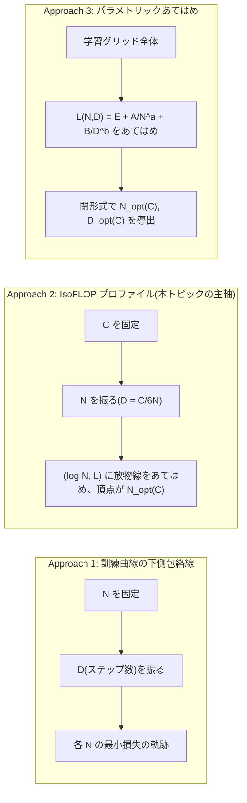
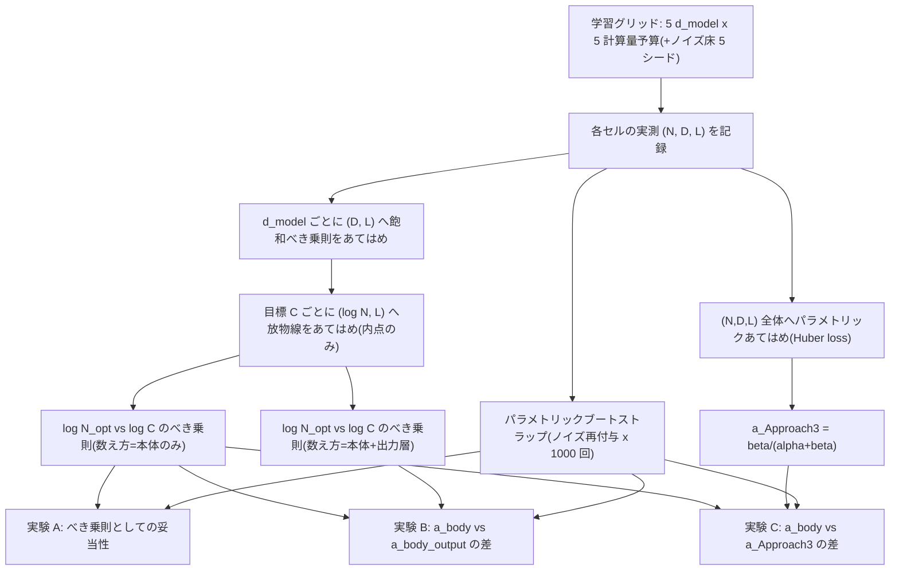

この記事は前編(理論編)です。続きは [こちら](https://zenn.dev/kojikojiprg/books/ai-theories-roadmap/viewer/009_scaling_laws-practice-1)。

# 009. スケーリング則(Scaling Laws)

## 1. 概要 / Overview

計算量予算(compute budget)$C$ が与えられたとき、それをモデルサイズ $N$ と訓練トークン数 $D$ にどう配分すれば損失を最小化できるかという問題を扱う。Kaplan et al. (2020) と Hoffmann et al. (2022, Chinchilla)はこの **計算量最適(compute-optimal)** な配分則を導いたが、両者は大きく異なる指数($a \approx 0.73$ と $a \approx 0.5$、$N_{opt}(C) \propto C^{a}$)を報告した。Porian et al. (2024) はこの食い違いを、計算量の数え方・warmup の長さ・スケール依存の最適化ハイパーパラメータ調整という 3 つの交絡要因により説明した。

**本トピックの規模上の制約**: Google Colab 無料枠の T4 GPU で振れる計算量の範囲はせいぜい 1.5 桁(コンピュートバジェットを 5 水準・公比 2 で振っても $2^4 = 16$ 倍、$\log_{10} 16 \approx 1.2$)であり、べき指数 $a$ の絶対値を原論文の値(0.73 や 0.5)と一致させることは原理的に不可能である。したがって本トピックが検証するのは **指数の値そのものではなく、小スケールでも成立する構造的な主張** に限る。具体的には、計算量最適なモデルサイズ $N_{opt}(C)$ のべき指数 $a$ を、3 つの異なる角度から攻める。

- **実験 A**: そもそも $N_{opt}(C)$ がべき乗則(対数空間で直線)として記述できるか(IsoFLOP プロファイル、Hoffmann et al., 2022 の Approach 2)。
- **実験 B**: 計算量の数え方(出力層を含めるかどうか)が指数 $a$ の推定値に与える影響。Porian et al. (2024) が特定した 3 要因のうち要因 1(最終層の計算量)のみを、既存の学習結果の再解析だけで検証する。
- **実験 C**: IsoFLOP プロファイル(Approach 2)による指数推定と、パラメトリックあてはめ(Approach 3)から導出した指数推定が内的に整合するか。

$a$ の推定値が Chinchilla の 0.5 や Kaplan らの 0.73 に近いかどうかは判定基準にせず、参考値として事後的に報告するに留める。


## 2. 参考論文 / References

1. Kaplan, J., McCandlish, S., Henighan, T., Brown, T. B., Chess, B., Child, R., Gray, S., Radford, A., Wu, J., Amodei, D. "Scaling Laws for Neural Language Models." arXiv:2001.08361, 2020. https://arxiv.org/abs/2001.08361
2. Hoffmann, J., Borgeaud, S., Mensch, A., et al. "Training Compute-Optimal Large Language Models." NeurIPS 2022. arXiv:2203.15556. https://arxiv.org/abs/2203.15556
3. Porian, T., Wortsman, M., Jitsev, J., Schmidt, L., Carmon, Y. "Resolving Discrepancies in Compute-Optimal Scaling of Language Models." NeurIPS 2024. arXiv:2406.19146. https://arxiv.org/abs/2406.19146

本トピックのモデル学習は、006・007・008 の以下の論文にも依拠する(理論の再掲はしない)。

- Radford, A. et al., "Language Models are Unsupervised Multitask Learners", 2019(GPT-2、バイトレベル BPE)
- Su, J. et al., "RoFormer: Enhanced Transformer with Rotary Position Embedding", Neurocomputing 2024(RoPE)
- Loshchilov, I., Hutter, F., "Decoupled Weight Decay Regularization", ICLR 2019(AdamW)
- Besiroglu, T., Erdil, E., Barnett, M., You, J. "Chinchilla Scaling: A replication attempt." arXiv:2404.10102, 2024(Chinchilla のパラメトリックあてはめが初期値に敏感であることの指摘。本文中で言及する)


## 3. 理論 / Theory

### 3.1 動機・課題

計算量予算 $C$(浮動小数点演算回数)が与えられたとき、それをモデルサイズ $N$(非埋め込みパラメータ数、non-embedding parameter count)と訓練トークン数 $D$ にどう配分すべきか。この問いに Kaplan et al. (2020) と Hoffmann et al. (2022) は大きく異なる答えを出した。Kaplan らは $N_{opt}(C) \propto C^{a}$ の指数を $a \approx 0.73$(モデルサイズを積極的に増やすべき)と報告し、Hoffmann らは $a \approx 0.50$(モデルサイズとデータ量を同程度に増やすべき)と報告した。この 2 つの結果は、GPT-3(Kaplan らの指針に基づく)が同時代の他モデルに比べて過大なモデルサイズ・過小な訓練データ量になっていた、という業界的に大きな影響を持つ違いだった。Porian et al. (2024) はこの食い違いの原因を、計算量の数え方・warmup の長さ・スケール依存の最適化ハイパーパラメータ調整という 3 つの交絡要因に帰着させ、これらを補正すると Kaplan らの手法でも Chinchilla に近い指数が得られることを示した。

### 3.2 記号の定義と計算量の見積もり

以下の記号を用いる。

- $N$: 非埋め込みパラメータ数(non-embedding parameter count)。埋め込み層・出力層を除く Transformer 本体のパラメータ数(`count_non_embedding_parameters`、006 で導入)。
- $D$: 訓練トークン数。
- $C$: 計算量予算(浮動小数点演算回数、FLOPs)。
- $L$: 検証損失。009 では bits-per-byte(006 で確立した、トークナイザに依存しない指標)を用いる。009 は全条件で同一トークナイザ(3.1 節参照)を使うため perplexity でも比較可能だが、シリーズ内の一貫性のため bits-per-byte を使う。
- $V$: 語彙サイズ、$d_{model}$: モデルの隠れ次元、$n_{layer}$: 層数、$n_{ctx}$: 系列長(sequence length)。
- $E, A, B, \alpha, \beta$: Chinchilla のパラメトリックあてはめ(3.3 節 Approach 3)の係数・指数。
- $a, b$: 計算量最適配分の指数($N_{opt}(C) \propto C^{a}$、$D_{opt}(C) \propto C^{b}$)。

**トークンあたりの計算量**: 順伝播 1 パラメータあたり 2 回の演算(乗算+加算)、逆伝播を含めて 3 倍という標準的な近似(Kaplan et al., 2020)から出発する。1 トークンあたりの計算量を、以下の 3 つの項の和として見積もる(`estimate_flops_per_token`、`src/scaling/laws.py`)。

$$
C_{\text{token}} = \underbrace{6N}_{\text{本体}} + \underbrace{6 V d_{model}}_{\text{出力層}} + \underbrace{12 \, n_{layer} \, n_{ctx} \, d_{model}}_{\text{Attention の系列長依存項}}
$$

- **本体**(embedding 層と出力層を除く Transformer 本体): $6N$。
- **出力層**(重み共有(weight tying)により埋め込み行列と同一の行列、006 参照): $6 V d_{model}$。出力層は $V \times d_{model}$ の行列演算であり、1 トークンあたり $2 V d_{model}$ の順伝播演算(逆伝播を含め 3 倍で $6 V d_{model}$)。
- **Attention の系列長依存項**: 各層の Attention スコア計算($QK^\top$ と重み付き和)が系列長 $n_{ctx}$ に比例した追加コストを持つ(Kaplan et al., 2020 の $C_{\text{attn}}$)。

**本トピックの中心的な観察**: $N$ は概ね $d_{model}^2$ に比例する(Attention・Feed-Forward Network の重み行列がいずれも $d_{model}$ の 2 次関数であるため)一方、出力層の項 $6 V d_{model}$ は $d_{model}$ に対して 1 次でしか増加しない。したがって **モデルが小さいほど、出力層が全計算量に占める割合が相対的に大きくなる**。009 の規模($V = 8192$、$d_{model} \le 400$ 程度)ではこの割合が数十パーセントに達することを、次のコードセルで具体的な数値表として示す。


```python
# 環境セットアップ(Google Colab)
import sys

IN_COLAB = "google.colab" in sys.modules

if IN_COLAB:
    !git clone https://github.com/kojikojiprg/ai-theories.git
    %cd ai-theories
    !pip install uv -q
    !uv pip install --system -r requirements.txt
# ローカル(Jupyter)実行時は、リポジトリルートで起動していればそのまま動く。
import functools
import json
import time
import warnings
from pathlib import Path

import matplotlib.pyplot as plt
import numpy as np
import torch

from src.data.text import (
    encode_corpus,
    encode_text_to_memmap,
    load_english_wikipedia_corpus_with_fallback,
    make_evaluation_windows,
    split_train_val_text,
)
from src.data.tokenizer import BPEIDTokenizer, load_bpe_id_tokenizer_from_hub
from src.layers.feedforward import SwiGLUFeedForwardNetwork
from src.layers.normalization import RMSNorm
from src.layers.positional_encoding import RotaryPositionEmbedding
from src.models.gpt import GPTLanguageModel
from src.scaling.laws import (
    BootstrapResult,
    ChinchillaParametricFit,
    FrontierResult,
    GridPoint,
    IsoFLOPParabolaFit,
    PowerLawFit,
    SaturatingPowerLawFit,
    bootstrap_scaling_analysis,
    compute_optimal_allocation_exponents,
    estimate_flops_per_token,
    fit_chinchilla_parametric,
    fit_isoflop_parabola,
    fit_power_law,
    fit_saturating_power_law,
    reconstruct_optimal_frontier,
)
from src.training.optimizer import AdamW
from src.training.schedule import compute_warmup_cosine_learning_rate
from src.training.trainer import train_language_model
from src.utils.statistics import compute_bits_per_byte, count_non_embedding_parameters
from src.utils.visualization import plot_isoflop_profile, plot_learning_curves, plot_optimal_frontier

SEED = 42
torch.manual_seed(SEED)
np.random.seed(SEED)

device = torch.device(
    "mps" if torch.backends.mps.is_available() else "cuda" if torch.cuda.is_available() else "cpu"
)
print(f"torch: {torch.__version__} / device: {device}")

ROOT = Path(".")

```

    Cloning into 'ai-theories'...
    remote: Enumerating objects: 646, done.
    remote: Counting objects: 100% (144/144), done.
    remote: Compressing objects: 100% (96/96), done.
    remote: Total 646 (delta 74), reused 97 (delta 47), pack-reused 502 (from 1)
    Receiving objects: 100% (646/646), 7.79 MiB | 10.67 MiB/s, done.
    Resolving deltas: 100% (330/330), done.
    /content/ai-theories
       ━━━━━━━━━━━━━━━━━━━━━━━━━━━━━━━━━━━━━━━━ 20.0/20.0 MB 27.9 MB/s eta 0:00:00
    [?25hUsing Python 3.13.15 environment at: /usr
    Resolved 52 packages in 374ms
    Prepared 31 packages in 46.77s
    Uninstalled 17 packages in 802ms
    Installed 31 packages in 304ms
     - click==8.5.0
     + click==8.4.2
     - cuda-bindings==12.9.7
     + cuda-bindings==13.3.1
     - cuda-pathfinder==1.8.0
     + cuda-pathfinder==1.6.0
     - cuda-toolkit==12.8.1
     + cuda-toolkit==13.0.3.0
     - filelock==3.32.5
     + filelock==3.32.2
     - fonttools==4.64.0
     + fonttools==4.63.0
     - fsspec==2025.12.0
     + fsspec==2026.7.0
     - huggingface-hub==1.29.0
     + huggingface-hub==1.28.0
     - kiwisolver==1.5.1
     + kiwisolver==1.5.0
     - matplotlib==3.10.0
     + matplotlib==3.11.1
     - numpy==2.1.3
     + numpy==2.5.2
     + nvidia-cublas==13.1.1.3
     + nvidia-cuda-cupti==13.0.85
     + nvidia-cuda-nvrtc==13.0.88
     + nvidia-cuda-runtime==13.0.96
     + nvidia-cudnn-cu13==9.20.0.48
     + nvidia-cufft==12.0.0.61
     + nvidia-cufile==1.15.1.6
     + nvidia-curand==10.4.0.35
     + nvidia-cusolver==12.0.4.66
     + nvidia-cusparse==12.6.3.3
     + nvidia-cusparselt-cu13==0.8.1
     - nvidia-nccl-cu13==2.31.2
     + nvidia-nccl-cu13==2.29.7
     + nvidia-nvjitlink==13.3.33
     + nvidia-nvshmem-cu13==3.4.5
     + nvidia-nvtx==13.0.85
     - pillow==11.3.0
     + pillow==12.3.0
     - setuptools==80.10.2
     + setuptools==84.0.0
     - torch==2.11.0+cu128
     + torch==2.13.0
     - tqdm==4.67.3
     + tqdm==4.70.0
     - triton==3.6.0
     + triton==3.7.1
    torch: 2.13.0+cu130 / device: cuda


### 3.2.1 出力層が計算量に占める割合(数値表)

009 の学習グリッド(6.1 節)で使う`d_model`の水準(32・64・96・128、語彙サイズ $V=8192$、$n_{layer}=4$、$n_{ctx}=256$)について、本体の計算量 $6N$ に対して出力層の計算量 $6 V d_{model}$ がどの程度の割合を占めるかを示す。ここでの $N$ は 006・008 と同じ構成(RoPE・RMSNorm・SwiGLU、6.1 節で確定)のモデルを実際に構築して`count_non_embedding_parameters`で実測した値である。


```python
VOCAB_SIZE = 8192
N_LAYER = 4
HEAD_DIM = 32  # 1 ヘッドあたりの次元を固定し、num_heads = d_model // HEAD_DIM とする
SEQUENCE_LENGTH = 256  # 006・008 と揃える
D_MODEL_LEVELS = [32, 64, 96, 128]  # 上限側の 192 は不採用(5.3.2 節参照)
MID_D_MODEL_IDX = len(D_MODEL_LEVELS) // 2  # 中央の水準を指すインデックス(以降、D_MODEL_LEVELS[2] の直書きは使わない)


def build_gpt_model(d_model: int, num_layers: int = N_LAYER, max_seq_len: int = SEQUENCE_LENGTH):
    '''RoPE・RMSNorm・SwiGLU の構成(006・008 と同一)で GPTLanguageModel を構築する。'''
    num_heads = d_model // HEAD_DIM
    swiglu_d_ff = round((2 / 3) * (d_model * 4))  # 004: 標準 FFN とパラメータ数を揃えるための丸め
    rope = RotaryPositionEmbedding(d_model // num_heads, max_position=max_seq_len)
    return GPTLanguageModel(
        vocabulary_size=VOCAB_SIZE,
        d_model=d_model,
        num_layers=num_layers,
        num_heads=num_heads,
        d_ff=swiglu_d_ff,
        max_sequence_length=max_seq_len,
        positional_transform=rope,
        normalization_factory=RMSNorm,
        feed_forward_factory=lambda: SwiGLUFeedForwardNetwork(d_model, swiglu_d_ff),
        tie_embeddings=True,
        norm_first=True,
    )


_measured_N = {}
print(f"{'d_model':>8} {'num_heads':>10} {'N (実測)':>12} {'body 6N':>14} {'output 6Vd':>14} {'output比率':>10}")
for d_model in D_MODEL_LEVELS:
    m = build_gpt_model(d_model)
    n = count_non_embedding_parameters(m)
    _measured_N[d_model] = n
    body_flops = 6 * n
    output_flops = 6 * VOCAB_SIZE * d_model
    ratio = output_flops / (body_flops + output_flops)
    num_heads = d_model // HEAD_DIM
    print(f"{d_model:>8} {num_heads:>10} {n:>12,} {body_flops:>14,.0f} {output_flops:>14,.0f} {ratio:>9.1%}")

_n_ratios = [
    _measured_N[D_MODEL_LEVELS[i + 1]] / _measured_N[D_MODEL_LEVELS[i]] for i in range(len(D_MODEL_LEVELS) - 1)
]
print(f"\n隣接 d_model 間の N の比: {[round(r, 3) for r in _n_ratios]}(目標 2.0)")

```

     d_model  num_heads       N (実測)        body 6N     output 6Vd   output比率
          32          1       49,312        295,872      1,572,864     84.2%
          64          2      197,440      1,184,640      3,145,728     72.6%
          96          3      443,232      2,659,392      4,718,592     64.0%
         128          4      787,072      4,722,432      6,291,456     57.1%
    
    隣接 d_model 間の N の比: [4.004, 2.245, 1.776](目標 2.0)


出力層の割合は最小の`d_model=32`で最も大きく、`d_model`が増えるにつれ低下する(本体の計算量が $d_{model}^2$ で増える一方、出力層は $d_{model}$ の 1 次でしか増えないため)。この非対称性が、計算量の数え方(出力層を含めるか)がスケーリング指数の推定値に影響を与えるという実験 B の理論的根拠である。


### 3.3 Chinchilla の 3 つのアプローチ

Hoffmann et al. (2022) は、計算量最適な配分則を 3 つの独立なアプローチで推定し、結果が一致することを示した。

- **Approach 1**: モデルサイズ $N$ を固定して訓練ステップ数(= $D$)を振り、各 $N$ について損失 $L$ が最小になる訓練曲線の下側包絡線(minimum envelope)を取る。
- **Approach 2(IsoFLOP プロファイル、本トピックの主軸)**: 計算量予算 $C$ を固定して $N$(したがって $D = C/(6N)$)を振る。$(\log N, L)$ の点は下に凸な放物線状になり、その頂点が $N_{opt}(C)$ を与える。
- **Approach 3(パラメトリックあてはめ)**: $L(N, D) = E + A/N^{\alpha} + B/D^{\beta}$ という関数形を学習グリッド全体にあてはめ、閉形式で $N_{opt}(C)$・$D_{opt}(C)$ を導く。

以下、Approach 3 の閉形式解を導出する。制約 $C = 6ND$(本体のみの数え方、5.2 節)の下で $D = C/(6N)$ を $L$ に代入すると

$$
L(N) = E + A N^{-\alpha} + B (6N/C)^{\beta} = E + A N^{-\alpha} + B \, 6^{\beta} C^{\beta} N^{-\beta}
$$

$N$ について微分し 0 と置く。

$$
\frac{\partial L}{\partial N} = -\alpha A N^{-\alpha - 1} + \beta B \, 6^{\beta} C^{\beta} \, (-1) N^{-\beta - 1} \cdot (-1)
$$

やや煩雑になるので、$D = C/(6N)$ を保ったまま $N, D$ の両方を変数として、ラグランジュの未定乗数法で $C = 6ND$ の制約下の最小化を行う方が見通しがよい。$\mathcal{L} = E + A N^{-\alpha} + B D^{-\beta} - \lambda (6ND - C)$ とおき、$N, D, \lambda$ について偏微分を 0 と置く。

$$
\frac{\partial \mathcal{L}}{\partial N} = -\alpha A N^{-\alpha - 1} - 6 \lambda D = 0, \qquad
\frac{\partial \mathcal{L}}{\partial D} = -\beta B D^{-\beta - 1} - 6 \lambda N = 0
$$

2 式から $\lambda$ を消去する。第 1 式より $\lambda = -\alpha A N^{-\alpha - 1} / (6D)$、第 2 式より $\lambda = -\beta B D^{-\beta - 1} / (6N)$。両者を等置すると

$$
\frac{\alpha A N^{-\alpha - 1}}{D} = \frac{\beta B D^{-\beta - 1}}{N}
\quad \Longrightarrow \quad
\alpha A N^{-\alpha} = \beta B D^{-\beta}
$$

（両辺に $ND$ を掛けて整理した。）この関係と制約 $D = C/(6N)$ を組み合わせると、$N^{-\alpha} \propto N^{\beta}$($D^{-\beta} \propto N^{\beta}$ に $D \propto 1/N$ を代入)より $N^{\alpha + \beta} \propto C^{\beta}$、すなわち

$$
\boxed{N_{opt}(C) \propto C^{a}, \quad a = \frac{\beta}{\alpha + \beta}}
\qquad\qquad
\boxed{D_{opt}(C) \propto C^{b}, \quad b = \frac{\alpha}{\alpha + \beta}}
$$

（$a + b = 1$ は $C = 6ND$、$N_{opt} D_{opt} \propto C$ から自明に整合する。）この導出は **$C$ が $ND$ に比例することを前提としている** 点に注意する。出力層を含む数え方(実験 B)では $C$ は $ND$ に単純比例しないため、この閉形式は使えない。実験 C(6.7 節)で`compute_optimal_allocation_exponents`を使う際は、必ず本体のみの数え方で得られた $(\alpha, \beta)$ を用いる。




### 3.4 Kaplan と Chinchilla の食い違いと 3 要因

Porian et al. (2024) は、Kaplan らの指数($a \approx 0.73$)と Hoffmann らの指数($a \approx 0.5$)の食い違いを、以下の 3 要因に帰着させた。

1. **最終層の計算量**: Kaplan らは計算量の見積もりから出力層(3.2 節の $6 V d_{model}$ 項)を除外しており、小さいモデルの計算量を過小評価していた。出力層を除外すると、小さいモデルは「実際より少ない計算量で今の損失を達成した」ことになり、同じ計算量予算に対して相対的に有利に評価される。この結果、低い計算量予算での $N_{opt}$ が実際より小さく見積もられ、フロンティアの傾き($a$)が急になる(過大評価される)。
2. **warmup の長さ**: 固定ステップ数の warmup は、訓練ステップ数が少ないラン(小さい計算量予算)ほど、訓練全体に占める warmup の割合が大きくなり不利に働く。
3. **スケール依存の最適化ハイパーパラメータ調整**: モデルサイズごとに学習率などを調整しないと、最適配分の推定が歪む。

これらを補正すると、Kaplan らの手法(Approach 1 に近い手法)でも Chinchilla のスケーリング則とよく一致することを Porian らは示した。また、Hoffmann らが示唆した仮説(学習率の減衰(decay)を訓練終了時点に正確に合わせることがスケーリング則の妥当性に重要)に反して、**学習率の減衰の丁寧な扱いはスケーリング則の妥当性に必須ではない** と Porian らは結論している。

**009 で検証するのは要因 1(最終層の計算量)のみである。** 理由は、要因 1 は既存の学習結果の計算量の数え方を変えるだけの再解析で検証でき、要因 2(warmup)・要因 3(最適化ハイパーパラメータ)は追加の学習グリッド(warmup 長・学習率を独立変数として振った別グリッド)を要するという、**観測結果とは独立な** 実装コスト上の理由による(結果を見てから要因 1 だけを選んだのではない)。要因 2・要因 3 は 6.2 節の固定条件として扱う(要因 2 は比例 warmup で回避する側に、要因 3 は全条件で学習率を固定する交絡として明示的に残す)。

### 3.5 解析パイプラインのデータフロー

学習グリッド(モデルサイズ x 計算量予算)から実験 A〜C の指数推定に至るデータフローを示す(6.4 節で詳述)。Mermaid は Google Colab 上では描画されないため、本文の数式・文章だけでも理解が成立するように 6.4 節に文章での説明を併記する。




## 元ノートブック(実装の全文はこちら)

https://github.com/kojikojiprg/ai-theories/blob/main/theories/02_pretraining/009_scaling_laws.ipynb
