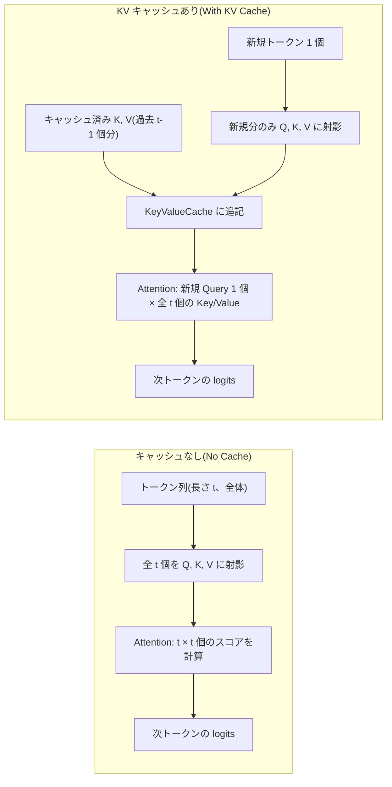
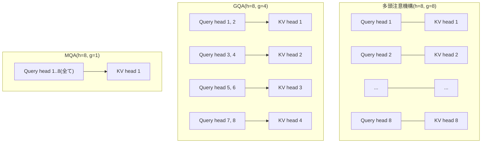

この記事は前編(理論編)です。続きは [こちら](https://zenn.dev/kojikojiprg/books/ai-theories-roadmap/viewer/010_kv_cache_and_inference_compute-practice-1)。

# 010. KV キャッシュと推論の計算量(KV Cache and Inference Compute)

## 1. 概要 / Overview

自己回帰生成(autoregressive generation)では、各生成ステップで同じ Key / Value を
繰り返し計算する冗長性がある。この冗長性を取り除く **KV キャッシュ(KV Cache)** の
仕組みと、それが生成の時間計算量・メモリ量に与える影響を扱う。特に、文脈全体を
一度に処理する **prefill** と 1 トークンずつ処理する **decode** という 2 つの
フェーズの非対称性(計算律速とメモリ帯域律速)に注目し、Key / Value ヘッド数を
削減してキャッシュを縮小する MQA(Multi-Query Attention)・GQA(Grouped-Query
Attention)の効果を実験で検証する。

## 2. 参考論文 / References

1. Shazeer, N. "Fast Transformer Decoding: One Write-Head is All You Need."
   arXiv:1911.02150, 2019. https://arxiv.org/abs/1911.02150
2. Ainslie, J., Lee-Thorp, J., de Jong, M., Zemlyanskiy, Y., Lebrón, F., Sanghai, S.
   "GQA: Training Generalized Multi-Query Transformer Models from Multi-Head
   Checkpoints." EMNLP 2023. https://arxiv.org/abs/2305.13245
3. Pope, R., Douglas, S., Chowdhery, A., Devlin, J., Bradbury, J., Levskaya, A.,
   Heek, J., Xiao, K., Agrawal, S., Dean, J. "Efficiently Scaling Transformer
   Inference." MLSys 2023. https://arxiv.org/abs/2211.05102
4. Kwon, W., Li, Z., Zhuang, S., Sheng, Y., Zheng, L., Yu, C. H., Gonzalez, J. E.,
   Zhang, H., Stoica, I. "Efficient Memory Management for Large Language Model
   Serving with PagedAttention." SOSP 2023. https://arxiv.org/abs/2309.06180
   (メモリ断片化への対処。本ノートブックでは理論の位置づけとして言及するのみで、
   実装・実験の対象にはしない)

## 3. 理論 / Theory

### 3.1 自己回帰生成における再計算の冗長性

記号(このセクション共通):

- $T$: 生成するトークン数
- $L$: 層数(num_layers)
- $h$: 多頭注意機構(Multi-Head Attention)のヘッド数
- $d_{\mathrm{model}}$: モデルの隠れ次元
- $d_k$: ヘッドあたりの次元($= d_{\mathrm{model}} / h$)

003([位置エンコーディング(RoPE)](https://zenn.dev/kojikojiprg/books/ai-theories-roadmap/viewer/003_positional_encoding_rope-theory))
までの`GPTLanguageModel.generate()`(006〜008)は、生成ステップ $t$ ごとに、
その時点までの系列全体(長さ $t$)を`forward()`に丸ごと渡し直す。すなわち、
ステップ $t$ の計算には以下が含まれる。

- **Query / Key / Value の線形射影**: 系列長 $t$ の入力を $d_{\mathrm{model}}
  \times d_{\mathrm{model}}$ の行列で変換するため、1 層あたり $O(t \, d_{\mathrm{model}}^2)$。
- **Attention 本体(スコア計算 + 加重和)**: $t \times t$ のスコア行列を計算するため、
  1 層あたり $O(t^2 d_{\mathrm{model}})$(ヘッド数 $h$ に分割しても
  $h \times (t^2 d_k) = t^2 (h d_k) = t^2 d_{\mathrm{model}}$ で変わらない)。

$T$ トークンを生成するには、この計算を $t = 1, \dots, T$ について毎回すべて
やり直す。$\sum_{t=1}^{T} t = O(T^2)$、$\sum_{t=1}^{T} t^2 = O(T^3)$ であるから、
1 層あたりの総計算量は

$$
\underbrace{O(T^2 d_{\mathrm{model}}^2)}_{\text{linear projections}}
+ \underbrace{O(T^3 d_{\mathrm{model}})}_{\text{attention}}
$$

(第 1 項が線形射影の総和、第 2 項が Attention 本体の総和である)

$L$ 層分では、これに $L$ を掛けた $O(L T^2 d_{\mathrm{model}}^2 + L T^3
d_{\mathrm{model}})$ になる(層数 $L$ はアーキテクチャを固定すれば定数とみなせる
ため、以降では単に $O(T^3 d_{\mathrm{model}} + T^2 d_{\mathrm{model}}^2)$ と書く)。

**KV キャッシュ** は、ステップ $t$ で計算した Key / Value を保持しておき、
ステップ $t+1$ では新規トークン 1 個分の Key / Value だけを計算して追記する
仕組みである。これにより、ステップ $t$ の計算は次で済む。

- **新規トークン分の線形射影**: 系列長 1 の入力を変換するだけなので
  $O(d_{\mathrm{model}}^2)$(定数)。
- **Attention 本体**: 新規の Query 1 個と、キャッシュ済みの長さ $t$ の
  Key / Value との内積なので $O(t \, d_{\mathrm{model}})$。

$T$ ステップの総和は $\sum_{t=1}^{T} 1 = O(T)$、$\sum_{t=1}^{T} t = O(T^2)$ から、

$$
O(T \, d_{\mathrm{model}}^2) + O(T^2 d_{\mathrm{model}})
$$

キャッシュなしの $O(T^3 d_{\mathrm{model}} + T^2 d_{\mathrm{model}}^2)$ から、
キャッシュありの $O(T^2 d_{\mathrm{model}} + T d_{\mathrm{model}}^2)$ へ、
$T$ に対する次数がそれぞれ 1 つずつ下がる。これが実験 A で検証する内容である。

下図は、1 生成ステップにおけるデータフローの違いを示す(キャッシュなしは
系列全体を毎回計算し直すのに対し、キャッシュありは新規トークン分のみを計算し
過去の結果に追記する)。



### 3.2 キャッシュのメモリ量の閉形式

記号(前節に加えて):

- $B$: バッチサイズ
- $g$: Key / Value ヘッド数(num_key_value_heads。多頭注意機構では $g = h$)
- $\text{bytes\_per\_element}$: 要素あたりバイト数(fp32 なら 4、fp16 / bf16 なら 2)

層 $l$ の KV キャッシュは、Key・Value それぞれ形状 $(B, g, T, d_k)$ のテンソルであり、
要素数は $B \, g \, T \, d_k$。Key と Value の 2 つを保持するので、1 層あたりの
バイト数は $2 \, B \, g \, T \, d_k \times \text{bytes\_per\_element}$。これを
$L$ 層分合計すると、

$$
\text{memory}
= 2 \cdot B \cdot L \cdot T \cdot (g \cdot d_k) \cdot \text{bytes\_per\_element}
$$

多頭注意機構では $g = h$ であり $g \cdot d_k = d_{\mathrm{model}}$ なので、この式は
$2 \, B \, L \, T \, d_{\mathrm{model}} \cdot \text{bytes\_per\_element}$ になる
(`compute_key_value_cache_memory_bytes`、`src/utils/statistics.py`)。系列長
$T$ に **線形** で増えることが、prefill と異なる decode 特有の性質である
(prefill 自体はキャッシュを増やすだけで、モデル本体の計算量が $T$ に対して
線形に留まるわけではない。3.1 節参照)。


```python
# 環境セットアップ(Google Colab)
import sys

IN_COLAB = "google.colab" in sys.modules

if IN_COLAB:
    get_ipython().system("git clone https://github.com/kojikojiprg/ai-theories.git")
    get_ipython().run_line_magic("cd", "ai-theories")
    get_ipython().system("pip install uv -q")
    get_ipython().system("uv pip install --system -r requirements.txt")
# ローカル(Jupyter)実行時は、リポジトリルートで起動していればそのまま動く。

import functools
import hashlib
import json
import platform
import shutil
import subprocess
import tempfile
import time
from pathlib import Path

import matplotlib.pyplot as plt
import numpy as np
import torch
from torch import nn

from src.data.text import (
    encode_corpus,
    load_wikipedia_corpus_with_fallback,
    make_evaluation_windows,
    split_train_val_text,
)
from src.data.tokenizer import load_bpe_id_tokenizer_from_hub
from src.generation.cache import KeyValueCache
from src.layers.attention import MultiHeadAttention, create_causal_mask
from src.layers.feedforward import SwiGLUFeedForwardNetwork
from src.layers.normalization import RMSNorm
from src.layers.positional_encoding import RotaryPositionEmbedding
from src.models.gpt import GPTLanguageModel, convert_attention_to_grouped_query
from src.training.trainer import evaluate_bits_per_byte, train_language_model
from src.utils.statistics import (
    compute_arithmetic_intensity,
    compute_key_value_cache_memory_bytes,
    count_non_embedding_parameters,
    fit_power_law_exponent,
)
from src.utils.visualization import plot_log_log_fit

ROOT = Path(".")

SMOKE_TEST = False  # Claude Code はこの True 側のみ実行する(Colab T4 では False に切り替える)

DEVICE = torch.device(
    "mps" if torch.backends.mps.is_available() else "cuda" if torch.cuda.is_available() else "cpu"
)
# 時間計測(実験 A・B・C・D)専用のデバイス。実験 B・C は decode がメモリ帯域律速で
# あること(GPU 固有の性質)そのものを検証するため、CUDA が使える環境では必ず CUDA を
# 使う(DEVICE をそのまま使う)。この Mac の MPS バックエンドは、本ノートブックのような
# 小さいテンソルに対するカーネル起動オーバーヘッドが大きく、変動係数(CV)が前提条件
# P0(0.1 以下)を安定して満たさない(ローカルで実測済み)ため、MPS のときのみ CPU に
# 落とす(CPU は決定的で高速なため P0 を安定して満たせる。Claude Code によるローカル
# 実行(第 1 段階)はこの経路を通る)。Google Colab T4 GPU での本番実行(第 2 段階)は
# CUDA が使えるため、DEVICE(= cuda)がそのまま使われる。
TIMING_DEVICE = DEVICE if DEVICE.type == "cuda" else torch.device("cpu")

# 実験 A・B・C 共通のウォームアップ反復回数(前提条件 P0)。CUDA カーネルの
# コンパイル・初回起動コストを計測区間から除くため、計測前に複数回実行して
# 捨てる。反復回数を増やしても変動係数(CV、個々の測定値のばらつき)自体は
# 縮まらない(CV が縮むのは平均の標準誤差であって個々の測定値の散らばりでは
# ないため)。P0 が主張しているのは「ウォームアップ後に計測すること」であり、
# ウォームアップが不十分だと初回起動コストの残滓が測定値に混入して CV を
# 押し上げる。したがってウォームアップ回数を増やすことは、P0 への対処として
# 反復回数を増やすこととは異なる(7.1 節参照)。
WARMUP_REPEATS = 3

# --- 実験 A・B・C・D の水準・反復回数(スモーク値と本番値を SMOKE_TEST で切り替える) ---
# ここに集約し、各実験のセル内には水準の数値を直接書かない。SMOKE_TEST を切り替える
# だけで全実験が本番水準に切り替わることを保証するのが目的である(以前は
# PRODUCTION_* 定数が外挿の見積もりにしか使われず、SMOKE_TEST=False でも実際の
# 実験がスモーク水準のまま完了してしまう不具合があった)。

# 実験 A(7.2 節): KV キャッシュによる生成時間の次数の低下。生成長 T の水準・反復回数。
SMOKE_A_T_LEVELS = [16, 32, 64, 128, 256]  # 等比刻み
PRODUCTION_A_T_LEVELS = [128, 256, 512, 1024, 2048]  # 等比刻み
# SMOKE_A_REPEATS は 6(P0-a が先頭 3 反復・末尾 3 反復の非重複比較として定義できる
# 最小値、7.1 節参照)以上にする必要があるため 5 から引き上げた(仮説・水準とは無関係な、
# P0-a の定義上の制約による)。PRODUCTION_A_REPEATS は今回の観測値からの見積もりで
# P0-b(標準誤差が平均の 5% 以下)を満たす見込みのため、15 から変更しない(7.1.1 節参照)。
SMOKE_A_REPEATS = 6
PRODUCTION_A_REPEATS = 10
A_T_LEVELS = PRODUCTION_A_T_LEVELS if not SMOKE_TEST else SMOKE_A_T_LEVELS
A_REPEATS = PRODUCTION_A_REPEATS if not SMOKE_TEST else SMOKE_A_REPEATS

# 実験 B(7.3 節): decode のバッチサイズ依存性の差。バッチサイズの水準・反復回数。
SMOKE_B_LEVELS = [1, 2, 4, 8, 16]  # 等比刻み
PRODUCTION_B_LEVELS = [1, 4, 16, 64, 256]  # 等比刻み
SMOKE_B_REPEATS = 7
# PRODUCTION_B_REPEATS は 15 から 30 に引き上げた。今回の観測値(decode_B4 の変動係数
# 0.1922)からの見積もりでは、反復 15 回では標準誤差が平均の 5.0% となり P0-b の閾値
# ぎりぎりだったため(7.1.1 節参照、前提条件に関する量に基づく判断であり検証したい
# 仮説の方向には依存しない)。
PRODUCTION_B_REPEATS = 30
B_LEVELS = PRODUCTION_B_LEVELS if not SMOKE_TEST else SMOKE_B_LEVELS
B_REPEATS = PRODUCTION_B_REPEATS if not SMOKE_TEST else SMOKE_B_REPEATS
# prefill 長は SMOKE_TEST に関わらず本番値のまま固定する(バッチサイズを縮小しても
# この実験の計算量は十分小さいため、prefill 長は縮小せず本番と一致させる。
# 条件間で厳密に一致させる設計の値は縮小後も一致させる、という縮小規則に沿う。
# プロンプト A のレビューで、prefill 長を縮小したまま本番バッチサイズへ外挿すると、
# prefill の 1 回あたりコスト(B * S * d_model * (d_model + S) に比例)のうち S の
# 効果が外挿から抜け落ちることが判明したため、この節で修正した)。
PRODUCTION_B_PREFILL_LEN = 512
B_PREFILL_LEN = PRODUCTION_B_PREFILL_LEN

# 実験 C(7.4 節): Key / Value ヘッド数の削減による高速化の系列長依存性。
# 生成長 T の両端(等比刻み)・反復回数。
SMOKE_C_T_SMALL, SMOKE_C_T_LARGE = 16, 256  # 等比刻みの両端
PRODUCTION_C_T_SMALL, PRODUCTION_C_T_LARGE = 64, 4096  # 等比刻みの両端
SMOKE_C_REPEATS = 7
PRODUCTION_C_REPEATS = 15
C_T_SMALL, C_T_LARGE = (
    (PRODUCTION_C_T_SMALL, PRODUCTION_C_T_LARGE)
    if not SMOKE_TEST
    else (SMOKE_C_T_SMALL, SMOKE_C_T_LARGE)
)
C_REPEATS = PRODUCTION_C_REPEATS if not SMOKE_TEST else SMOKE_C_REPEATS

# 実験 D(7.5 節): GQA への変換における平均プール初期化の効果。追加学習ステップ数。
SMOKE_D_NUM_STEPS = 15
PRODUCTION_D_NUM_STEPS = 300
D_NUM_STEPS = PRODUCTION_D_NUM_STEPS if not SMOKE_TEST else SMOKE_D_NUM_STEPS
# 実験 D の学習データ量(文字数)は d_train_text(5.3 節でコーパス取得後に確定)に
# 依存するため、ここでは smoke 側の定数のみを定義する。本番側は「d_train_text 全体」
# であり定数化できない(D_TRAIN_TEXT_CHARS = SMOKE_D_TRAIN_TEXT_CHARS if SMOKE_TEST
# else len(d_train_text) として、d_train_text が確定した時点(5.3 節)で導出する)。
SMOKE_D_TRAIN_TEXT_CHARS = 400_000

# P0-a(7.1 節)は先頭 3 反復・末尾 3 反復を重複なく比較するため、反復回数が
# 3 の 2 倍(6)未満の条件では定義できない。実験 A・B・C の反復回数(SMOKE・
# PRODUCTION のいずれも)がこの最小値を満たすことを、実験の計測に進む前に確認する。
for _name, _repeats in (
    ("SMOKE_A_REPEATS", SMOKE_A_REPEATS),
    ("PRODUCTION_A_REPEATS", PRODUCTION_A_REPEATS),
    ("SMOKE_B_REPEATS", SMOKE_B_REPEATS),
    ("PRODUCTION_B_REPEATS", PRODUCTION_B_REPEATS),
    ("SMOKE_C_REPEATS", SMOKE_C_REPEATS),
    ("PRODUCTION_C_REPEATS", PRODUCTION_C_REPEATS),
):
    assert _repeats >= 6, (
        f"{_name}={_repeats} は P0-a(先頭 3 反復・末尾 3 反復の非重複比較)が定義可能な"
        "最小値 6 未満である。反復回数を 6 以上にすること。"
    )


def sync(device: torch.device) -> None:
    '''時間計測の前後で呼ぶデバイス同期(前提条件 P0)。'''
    if device.type == "cuda":
        torch.cuda.synchronize()
    elif device.type == "mps":
        torch.mps.synchronize()


def is_oom_error(exc: BaseException) -> bool:
    '''out-of-memory 例外の判定(``torch.OutOfMemoryError``は PyTorch 2.5 以降の
    属性であり、Colab のバージョンによっては存在しない場合があるため、例外の
    クラス名・メッセージ文字列でも判定できるようにする)。
    '''
    name = type(exc).__name__
    return "OutOfMemory" in name or "out of memory" in str(exc).lower()


def warn_if_unreliable_fit(fit, name: str) -> None:
    '''べき乗則あてはめの標準誤差が推定値と同程度以上の場合に警告を出力する。
    外挿が信用できない状態を、合計値へ静かに混ぜないための安全弁。
    '''
    if fit.exponent_stderr >= abs(fit.exponent):
        print(
            f"[警告] {name} のべき指数の標準誤差({fit.exponent_stderr:.3f})が推定値"
            f"({fit.exponent:.3f})と同程度以上であり、この外挿は信用できない。"
            "水準・反復回数を増やして再計測すること。"
        )


P0A_MAX_DRIFT_SIGMA = 2.0  # P0-a: 先頭・末尾平均の差の許容量(全反復の標準偏差の倍数)
P0B_MAX_RELATIVE_STDERR = 0.05  # P0-b: 平均の標準誤差の許容量(平均に対する比率)


def compute_p0a(values) -> dict:
    '''P0-a(ウォームアップの担保)を計算する。先頭 3 反復の平均と末尾 3 反復の平均の
    差が、全反復の標準偏差(ddof=1)の P0A_MAX_DRIFT_SIGMA 倍以内かを見る。ウォームアップ
    不足による系統的なドリフト(反復を重ねるにつれ値が単調に変化する)を直接検出する
    指標であり、絶対時間の大小には依存しない(7.1 節参照)。``values``の長さは 6 以上
    であること(呼び出し前にセットアップセルでアサーション済み)。
    '''
    arr = np.array(values)
    assert len(arr) >= 6, f"P0-a には反復回数 6 以上が必要: {len(arr)}"
    head_mean = float(arr[:3].mean())
    tail_mean = float(arr[-3:].mean())
    diff = abs(tail_mean - head_mean)
    std_all = float(arr.std(ddof=1))
    threshold = P0A_MAX_DRIFT_SIGMA * std_all
    return {
        "head_mean": head_mean,
        "tail_mean": tail_mean,
        "diff": diff,
        "std_all": std_all,
        "threshold": threshold,
        "holds": bool(diff <= threshold),
    }


def compute_p0b(values) -> dict:
    '''P0-b(判定精度の担保)を計算する。平均の標準誤差(標準偏差(ddof=1) / sqrt(反復回数))
    が平均の P0B_MAX_RELATIVE_STDERR(5%)以下かを見る。対比量の推定に使う各測定の
    平均が十分な精度で求まっていることを担保する指標である(7.1 節参照)。
    '''
    arr = np.array(values)
    n = len(arr)
    mean_val = float(arr.mean())
    std_val = float(arr.std(ddof=1))
    stderr = std_val / (n**0.5)
    ratio = stderr / mean_val
    return {
        "mean": mean_val,
        "std": std_val,
        "stderr": stderr,
        "ratio": ratio,
        "holds": bool(ratio <= P0B_MAX_RELATIVE_STDERR),
    }


print(f"torch: {torch.__version__} / DEVICE: {DEVICE} / TIMING_DEVICE: {TIMING_DEVICE}")
print(f"SMOKE_TEST: {SMOKE_TEST} / WARMUP_REPEATS: {WARMUP_REPEATS}")
if TIMING_DEVICE.type != "cuda":
    print(
        "[注記] TIMING_DEVICE が CUDA ではない。実験 B・C の "
        "「decode はメモリ帯域律速」という仮説自体が GPU 固有の性質であるため、"
        "CUDA 環境(Google Colab T4 GPU)で再実行するまでは結果を確定させないこと。"
    )

# --- 実効水準の一覧(このセルの出力だけで、本番水準で走っているか判断できるようにする) ---
print(f"\n[実効水準] SMOKE_TEST={SMOKE_TEST}(True ならスモーク値、False なら本番値)")
print(f"  実験 A: A_T_LEVELS={A_T_LEVELS}, A_REPEATS={A_REPEATS}")
print(f"  実験 B: B_LEVELS={B_LEVELS}, B_REPEATS={B_REPEATS}, "
      f"B_PREFILL_LEN={B_PREFILL_LEN}(常に本番値に固定)")
print(f"  実験 C: C_T_SMALL={C_T_SMALL}, C_T_LARGE={C_T_LARGE}, C_REPEATS={C_REPEATS}")
print(f"  実験 D: D_NUM_STEPS={D_NUM_STEPS}, "
      f"D_TRAIN_TEXT_CHARS={'(コーパス取得後に確定)' if not SMOKE_TEST else SMOKE_D_TRAIN_TEXT_CHARS}")
```

    Cloning into 'ai-theories'...
    remote: Enumerating objects: 851, done.
    remote: Counting objects: 100% (349/349), done.
    remote: Compressing objects: 100% (224/224), done.
    remote: Total 851 (delta 200), reused 236 (delta 124), pack-reused 502 (from 1)
    Receiving objects: 100% (851/851), 10.81 MiB | 9.10 MiB/s, done.
    Resolving deltas: 100% (456/456), done.
    /content/ai-theories
       ━━━━━━━━━━━━━━━━━━━━━━━━━━━━━━━━━━━━━━━━ 20.4/20.4 MB 51.6 MB/s eta 0:00:00
    [?25hUsing Python 3.13.15 environment at: /usr
    Resolved 52 packages in 527ms
    Prepared 31 packages in 45.82s
    Uninstalled 17 packages in 790ms
    Installed 31 packages in 296ms
     - click==8.5.0
     + click==8.4.2
     - cuda-bindings==12.9.7
     + cuda-bindings==13.3.1
     - cuda-pathfinder==1.8.0
     + cuda-pathfinder==1.6.0
     - cuda-toolkit==12.8.1
     + cuda-toolkit==13.0.3.0
     - filelock==3.32.5
     + filelock==3.32.2
     - fonttools==4.64.0
     + fonttools==4.63.0
     - fsspec==2025.12.0
     + fsspec==2026.7.0
     - huggingface-hub==1.29.0
     + huggingface-hub==1.28.0
     - kiwisolver==1.5.1
     + kiwisolver==1.5.0
     - matplotlib==3.10.0
     + matplotlib==3.11.1
     - numpy==2.1.3
     + numpy==2.5.2
     + nvidia-cublas==13.1.1.3
     + nvidia-cuda-cupti==13.0.85
     + nvidia-cuda-nvrtc==13.0.88
     + nvidia-cuda-runtime==13.0.96
     + nvidia-cudnn-cu13==9.20.0.48
     + nvidia-cufft==12.0.0.61
     + nvidia-cufile==1.15.1.6
     + nvidia-curand==10.4.0.35
     + nvidia-cusolver==12.0.4.66
     + nvidia-cusparse==12.6.3.3
     + nvidia-cusparselt-cu13==0.8.1
     - nvidia-nccl-cu13==2.31.2
     + nvidia-nccl-cu13==2.29.7
     + nvidia-nvjitlink==13.3.33
     + nvidia-nvshmem-cu13==3.4.5
     + nvidia-nvtx==13.0.85
     - pillow==11.3.0
     + pillow==12.3.0
     - setuptools==80.10.2
     + setuptools==84.0.0
     - torch==2.11.0+cu128
     + torch==2.13.0
     - tqdm==4.67.3
     + tqdm==4.70.0
     - triton==3.6.0
     + triton==3.7.1
    torch: 2.13.0+cu130 / DEVICE: cuda / TIMING_DEVICE: cuda
    SMOKE_TEST: False / WARMUP_REPEATS: 3
    
    [実効水準] SMOKE_TEST=False(True ならスモーク値、False なら本番値)
      実験 A: A_T_LEVELS=[128, 256, 512, 1024, 2048], A_REPEATS=10
      実験 B: B_LEVELS=[1, 4, 16, 64, 256], B_REPEATS=30, B_PREFILL_LEN=512(常に本番値に固定)
      実験 C: C_T_SMALL=64, C_T_LARGE=4096, C_REPEATS=15
      実験 D: D_NUM_STEPS=300, D_TRAIN_TEXT_CHARS=(コーパス取得後に確定)


### 3.3 prefill と decode の非対称性

本トピックの中心的な洞察は、生成の 2 つのフェーズ **prefill**(起点となる文脈
全体を 1 回の順伝播でまとめて処理する)と **decode**(KV キャッシュを使い、
新規トークン 1 個ずつを逐次処理する)が、計算資源の使われ方の点で対称ではない
ことである。

**演算強度(arithmetic intensity)** は、ある演算が読み書きするメモリの
バイト数に対する浮動小数点演算回数(FLOPs)の比

$$
\text{AI} = \frac{\text{FLOPs}}{\text{bytes moved}}
$$

で定義される(`compute_arithmetic_intensity`)。roofline モデル(Williams et al.,
"Roofline: An Insightful Visual Performance Model for Multicore Architectures",
CACM 2009)では、ハードウェアごとに定まる **ridge point**

$$
\text{AI}_{\text{ridge}} = P_{\text{peak}} / BW
$$

を境に演算の律速要因が切り替わる($P_{\text{peak}}$ はハードウェアのピーク演算性能
(FLOPS)、$BW$ はメモリ帯域幅(bytes/s))。ridge point より演算強度が低い演算は、
演算器がメモリからのデータ供給を待つ **メモリ帯域律速(memory-bound)** になり、
高い演算はメモリ帯域が余っていても演算器が追いつかない **計算律速(compute-bound)**
になる。

線形層(重み $(d_{\text{in}}, d_{\text{out}})$、入力 $N$ 行、要素あたり
$\text{bytes\_per\_element}$ バイト)を例にとる。

- FLOPs: $2 N d_{\text{in}} d_{\text{out}}$(積和 1 回を 2 演算と数える標準的な近似)
- bytes moved: 重みの読み出し $d_{\text{in}} d_{\text{out}} \cdot
  \text{bytes\_per\_element}$ + 入出力活性化の読み書き
  $N (d_{\text{in}} + d_{\text{out}}) \cdot \text{bytes\_per\_element}$

**prefill**($N = B \cdot S$、$S$ は文脈全体の系列長)では、$N$ が大きいほど
FLOPs は $N$ に比例して増える一方、重みの読み出しバイト数は $N$ によらず一定
(1 回の呼び出しにつき 1 回だけ読む)ため、$N$ が大きいほど演算強度は大きくなる
(重みの読み出しコストが多くの演算で「償却」される)。

**decode**($N = B$、系列長 1 の新規トークンのみ)では、$B$ が小さい典型的な
生成では $N$ が小さく、重みバイト数が総バイト数の大部分を占め続ける。1 ステップ
ごとに同じ重みを読み直すコストを、そのステップの少ない演算量では償却できない
ため、演算強度は低いまま(概ね $O(B)$、$B=1$ では $O(1)$)に留まる。

このため decode はメモリ帯域律速になりやすく、KV キャッシュのメモリ量(3.2 節)を
減らすこと(MQA・GQA)が、decode の速度に直接効いてくる。実験 B は、この非対称性を
バッチサイズ依存性の差として検証する。


```python
# 数値例: 線形層 1 個(d_in = d_out = D_MODEL)の演算強度を、decode(N=1)と
# prefill(N=系列長)で比較する。d_model・要素あたりバイト数は本ノートブック共通の
# 本番モデル構成(6 節)を先取りして使う。
_EXAMPLE_D_MODEL = 256
_EXAMPLE_BYTES_PER_ELEMENT = 4  # fp32
_weight_bytes = _EXAMPLE_D_MODEL * _EXAMPLE_D_MODEL * _EXAMPLE_BYTES_PER_ELEMENT


def _linear_layer_ai(n: int) -> float:
    flops = 2 * n * _EXAMPLE_D_MODEL * _EXAMPLE_D_MODEL
    activation_bytes = n * 2 * _EXAMPLE_D_MODEL * _EXAMPLE_BYTES_PER_ELEMENT
    bytes_moved = _weight_bytes + activation_bytes
    return compute_arithmetic_intensity(flops, bytes_moved)


ai_decode = _linear_layer_ai(1)  # decode: B=1, 系列長 1
ai_prefill_256 = _linear_layer_ai(256)  # prefill: 系列長 256
print(f"演算強度(decode, N=1):    {ai_decode:.3f} FLOPs/byte")
print(f"演算強度(prefill, N=256): {ai_prefill_256:.3f} FLOPs/byte")
print(f"比(prefill / decode): {ai_prefill_256 / ai_decode:.1f} 倍")

# 診断量: T4 GPU の公称値(FP32 ピーク ~8.1 TFLOPS、メモリ帯域 ~320 GB/s)との対比。
# この絶対値の一致は判定基準にしない(実測の達成帯域は公称値の 7 割前後であり、
# 真偽を判定できる形にはならない。CLAUDE.md の実験 B 宣言セル参照)。
_T4_PEAK_FLOPS = 8.1e12
_T4_BANDWIDTH_BYTES_PER_SEC = 320e9
_t4_ridge_point = _T4_PEAK_FLOPS / _T4_BANDWIDTH_BYTES_PER_SEC
print(f"\n[診断量] T4 GPU の ridge point(公称値): {_t4_ridge_point:.2f} FLOPs/byte")
print(f"[診断量] decode の演算強度は ridge point の {ai_decode / _t4_ridge_point:.1%}")
print(f"[診断量] prefill(N=256) の演算強度は ridge point の {ai_prefill_256 / _t4_ridge_point:.1%}")
```

    演算強度(decode, N=1):    0.496 FLOPs/byte
    演算強度(prefill, N=256): 42.667 FLOPs/byte
    比(prefill / decode): 86.0 倍
    
    [診断量] T4 GPU の ridge point(公称値): 25.31 FLOPs/byte
    [診断量] decode の演算強度は ridge point の 2.0%
    [診断量] prefill(N=256) の演算強度は ridge point の 168.6%


### 3.4 MQA(Multi-Query Attention)と GQA(Grouped-Query Attention)

3.2 節の閉形式が示す通り、KV キャッシュのメモリ量は Key / Value ヘッド数 $g$ に
比例する。Shazeer (2019) の **MQA** は $g = 1$(全ての Query ヘッドが単一の
Key / Value ヘッドを共有する)、Ainslie et al. (2023) の **GQA** はその中間
($1 < g < h$、Query ヘッドを $h/g$ 個ずつのグループに分け、グループ内で
Key / Value ヘッドを共有する)を提案した。いずれも、キャッシュのメモリ量を
$g/h$ 倍に縮小する(Query 側の射影 $W^Q$・出力射影 $W^O$ は変更しない)。



**uptraining**(Ainslie et al., 2023): 既存の多頭注意機構チェックポイントから
GQA / MQA へ変換する際、Key / Value の射影行列をランダムに初期化すると、
学習済みの Query・出力射影との整合が崩れ、追加学習の初期の損失が大きく跳ね上がる。
Ainslie らは、グループ内の元の Key / Value ヘッドの重みを **平均プール
(mean pooling)** して初期化する方法を提案し、ランダム初期化より少ない追加学習
ステップ数で高い性能に到達することを示した(`convert_attention_to_grouped_query`
の`init="mean_pool"`、実験 D で検証する)。

### 3.5 RoPE とキャッシュの相互作用

003([位置エンコーディング(RoPE)](https://zenn.dev/kojikojiprg/books/ai-theories-roadmap/viewer/003_positional_encoding_rope-theory))
で導入した RoPE(Rotary Position Embedding、Su et al., Neurocomputing 2024)は、
Query・Key の各トークンをその **絶対位置** $m$ だけ回転させる
(`RotaryPositionEmbedding.apply`)。この回転は他のトークンの値に一切依存しない
(トークン $m$ の回転は $m$ だけで決まる)ため、系列全体をまとめて回転させても、
1 トークンずつ回転させて後から連結しても、結果は完全に同じになる。

これが、KV キャッシュと RoPE の相互作用の核心である。decode の各ステップで
新規トークンに RoPE を適用する際、**その系列内での相対位置(常に 0)ではなく、
キャッシュ長だけずれた絶対位置** を使う必要がある。003 の時点で
`MultiHeadAttention.forward`・`RotaryPositionEmbedding.apply`・`DecoderBlock.forward`
はいずれも`positions`引数(Query の絶対位置インデックス)を既に持っており、
docstring にも「KV キャッシュを用いた逐次推論(トピック 010)では、生成の各
ステップで Query の絶対位置がキャッシュ長だけずれるため、これを外部から指定
できるようにしている」と明記されていた。010 の実装(`GPTLanguageModel.generate`
の`use_cache=True`パス)は、この 003 の設計をそのまま使う。具体的には、prefill
ステップでは`positions = arange(S_0)`、decode の各ステップでは
`positions = [kv_cache.length]`(その時点のキャッシュ長)を渡す。


## 元ノートブック(実装の全文はこちら)

https://github.com/kojikojiprg/ai-theories/blob/main/theories/03_efficient_training/010_kv_cache_and_inference_compute.ipynb
