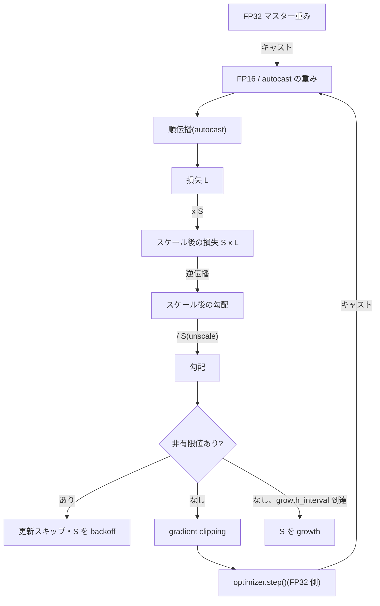

この記事は前編(理論編)です。続きは [こちら](https://zenn.dev/kojikojiprg/books/ai-theories-roadmap/viewer/011_mixed_precision_training-practice-1)。

# 011. 混合精度学習(Mixed Precision Training)

## 1. 概要 / Overview

FP32(単精度浮動小数点)で行っていた学習を FP16(半精度浮動小数点)・BF16
(Brain Floating Point)に置き換えると、メモリ量と演算時間を削減できる一方、
表現範囲(dynamic range)の狭さから勾配がアンダーフロー(underflow)し、
学習が進まなくなることがある。本トピックでは、損失スケーリング(loss scaling)
によってこのアンダーフローを回避する仕組みと、FP32 マスター重み(master weights)
によって小さい更新量が丸め落ちる問題を回避する仕組みをスクラッチ実装し、006・007
で構築した小型 GPT の事前学習に組み込んで効果を検証する。演算ごとの精度の割り当て
(行列積は低精度、正規化層の統計量・損失の reduction は FP32)は`torch.autocast`
に委ね、その割り当てが実際にどう行われるかを実測して確認する。

## 2. 参考論文 / References

1. Micikevicius, P. et al., "Mixed Precision Training", ICLR 2018.
   https://arxiv.org/abs/1710.03740
   (損失スケーリング・FP32 マスター重み・演算ごとの精度割り当ての原典)
2. Kalamkar, D. et al., "A Study of BFLOAT16 for Deep Learning Training", 2019.
   https://arxiv.org/abs/1905.12322
   (BF16 の数値的性質と、損失スケーリングが不要になる理由)
3. Rajbhandari, S. et al., "ZeRO: Memory Optimizations Toward Training Trillion
   Parameter Models", SC 2020. https://arxiv.org/abs/1910.02054
   (混合精度学習のメモリ内訳の出典)
4. Micikevicius, P. et al., "FP8 Formats for Deep Learning", 2022.
   https://arxiv.org/abs/2209.05433(位置づけのみ、本トピックでは実験しない)
5. IEEE Std 754-2019, "IEEE Standard for Floating-Point Arithmetic".
   (FP32 / FP16 / BF16 のビット構造の規格)

## 3. 理論 / Theory

**記法についての注記**: 本ノートブックでは損失スケーリングのスケール値を $S$ と
表記する(3.4 節)。リポジトリ内の他ノートブック(006 など)では系列長を $S$ と
表記しているが、本ノートブックでは系列長を $T$ と表記し、$S$ とは重複させない。

### 3.1 動機・課題: なぜ混合精度が必要か

パラメータ数・データ量を増やすほど学習に必要な演算量・メモリ量が増える(009・010)。
GPU の多くは FP16 / BF16 の行列積を FP32 の数倍高速に実行でき、かつ値のサイズが
半分になるためメモリ帯域(010 の演算強度の議論)・メモリ量の両方を削減できる。
しかし単純に全ての演算を FP16 に置き換えると、以下の 2 つの問題が生じる
(Micikevicius et al. [1])。

1. **勾配のアンダーフロー**: 逆伝播中の勾配は多くの場合、損失そのものより
   桁数が小さい(連鎖律により、深い層に伝わるほど微小になりやすい)。FP16 の
   表現範囲(3.2 節で導出)を下回ると 0 に丸められ、その要素は学習に一切
   寄与しなくなる。
2. **更新量の丸め落ち**: パラメータ $w$ に対する更新量 $u$(学習率 x 勾配)が
   $w$ 自体よりも十分小さいと、$w + u$ を FP16 で計算した結果が $w$ のまま
   丸められ、更新が失われる(3.5 節で境界を導出する)。

本トピックでは、この 2 つの問題をそれぞれ損失スケーリング(3.4 節)・FP32
マスター重み(3.5 節)で回避する仕組みを扱う。

### 3.2 浮動小数点形式の構造

IEEE 754(規格 [5])の浮動小数点形式は、符号(sign)・指数(exponent)・仮数
(mantissa、fraction)の 3 つのビット列からなる。指数のビット数を $e$、仮数の
ビット数を $m$ とすると、正規化数(normalized number)の値は

$$
x = (-1)^{s} \times 1.f \times 2^{E - \mathrm{bias}}
$$

と表される($s$ は符号ビット、$f$ は仮数部が表す 2 進小数、$E$ は指数部の
符号なし整数値、$\mathrm{bias} = 2^{e-1} - 1$)。先頭の暗黙の $1$(implicit leading
bit)により、仮数部の $m$ ビットで $2^{-m}$ の相対分解能を持つ。

| 形式 | 符号 | 指数 $e$ | 仮数 $m$ | 合計 |
|---|---:|---:|---:|---:|
| FP32 | 1 | 8 | 23 | 32 |
| FP16 | 1 | 5 | 10 | 16 |
| BF16 | 1 | 8 | 7 | 16 |

指数部が全て 0(下駄履き表現、$E=0$)の場合は非正規化数(subnormal number、
暗黙のビットが 0 になる)を表す。

$$
x_{\text{subnormal}} = (-1)^{s} \times 0.f \times 2^{1 - \mathrm{bias}}
$$

これにより、正規化数の最小値 $2^{1-\mathrm{bias}}$(**最小正規数**)よりもさらに
小さい値(**最小非正規数** $2^{1-\mathrm{bias}-m}$)まで表現できるが、仮数の有効
桁数は値が小さくなるほど減っていく(段階的アンダーフロー、gradual underflow)。

**相対精度(unit roundoff)** は $u_r = 2^{-m-1}$ であり、これは正規化数を最も近い
表現可能な値に丸めたときの相対誤差の上界を与える。仮数ビット数 $m$ が大きいほど
相対精度は高いが、指数ビット数 $e$ が大きいほど表現範囲(dynamic range、最小正規数
から最大値までの比)は広い。FP16 は仮数が多く(相対精度が高い)が指数が少なく
(表現範囲が狭い)、BF16 は逆に指数が FP32 と同じ(表現範囲は FP32 と同等)だが
仮数が少ない(相対精度は低い)。この **表現範囲と相対精度のトレードオフ** が、
3.4 節(損失スケーリング)・3.9 節(BF16)の議論の起点になる。実測は実験 A で行う。

### 3.3 アンダーフローとオーバーフロー

逆伝播中のある層の出力に対する勾配 $\partial L / \partial a$ を FP16 にキャストする
とき、その絶対値が最小非正規数を下回れば 0 に丸められる(**アンダーフロー**)。
反対に、最大値(FP16 は 65504)を上回れば無限大(Inf)になる(**オーバーフロー**)。
アンダーフローした要素は勾配が完全に失われ、その要素に依存するパラメータは
その位置からの寄与を受けて更新されない。オーバーフローは Inf・NaN(Not a Number、
Inf - Inf や 0 x Inf などから生じる)を生成し、後続の計算全体を破壊する。

損失に対する勾配はモデルの後段(損失に近い層)ほど大きく、前段(入力に近い層)
ほど、連鎖律による重みの積によって縮小・拡大されうる(実験 B で実測する)。
アンダーフローは主に絶対値の小さい勾配に対して起こるため、勾配全体を一律に
大きくずらすことで緩和できる。これが損失スケーリングの動機である。

### 3.4 損失スケーリング(Loss Scaling)

損失 $L$ を正のスケール値 $S$ 倍してから逆伝播すると、連鎖律により、逆伝播で
計算される **全ての勾配が同じ倍率 $S$ 倍になる**。パラメータ $\theta$ に対して

$$
\frac{\partial (S L)}{\partial \theta} = S \frac{\partial L}{\partial \theta}
$$

が成り立つ(連鎖律において $S$ は損失に対する定数倍であり、逆伝播のどの経路でも
分配則により外に出せる)。したがって、逆伝播が終わった直後の勾配を $S$ で割り
戻す(**unscale**)ことで、数学的には元の勾配 $\partial L/\partial\theta$ に
正確に戻る。この性質により、逆伝播の間だけ勾配を $S$ 倍にずらしてアンダーフローを
避け、更新の直前に戻すという操作が可能になる。

**静的損失スケーリング(static loss scaling)**: $S$ を学習全体で固定する。
$S$ が大きすぎるとオーバーフローが起こり、小さすぎるとアンダーフローを防げない
ため、$S$ の決め方が問題になる(実験 C・較正セルで扱う)。

**動的損失スケーリング(dynamic loss scaling)**: $S$ を学習の進行に応じて
自動調整する。unscale 後の勾配に非有限値(Inf・NaN)が見つかったステップでは、
そのステップの更新を **スキップ** し、$S$ を`backoff_factor`倍(1 未満)に
縮小する。非有限値が`growth_interval`ステップ連続で見つからなければ、$S$ を
`growth_factor`倍(1 より大きい)に拡大する。この手続きにより、$S$ は
「オーバーフローしない最大の値」の近傍を自動的に追跡する(`DynamicLossScaler`、
実験 D)。

### 3.5 FP32 マスター重み(Master Weights)

パラメータ $w$ を FP16 で保持したまま、更新量 $u$(学習率 x 勾配)を直接加算
すると、$u$ が $w$ に比べて十分小さい場合、$w + u$ を最も近い FP16 の表現可能な
値に丸めた結果が $w$ 自身に戻ってしまい、更新が消える。

FP16(仮数 $m=10$)の正規化数は、指数が同じ区間(binade、$[2^k, 2^{k+1})$)の中で
均等な間隔 $2^{k-10}$(最小単位、unit in the last place、ulp)の格子上に存在する。
$w_0 = 1$(区間 $[1, 2)$、ulp $= 2^{-10}$)を例に、加算方向 $w_0 + u$ と減算方向
$w_0 - u$ で境界がどう変わるかを導出する。

**加算方向**: $w_0 + u$ は $u$ が小さい間は同じ区間 $[1, 2)$ に留まるため、
最も近い格子点への丸めは ulp $=2^{-10}$ の格子上で行われる。round-to-nearest-even
(既定の丸めモード)のもとで、$u$ が ulp の半分 $2^{-11}$ 以下のとき、$w_0 + u$
は $w_0$ 自身(格子点)に丸められる($u = 2^{-11}$ の丁度半分の場合は「最も近い
偶数」に丸めるルールにより、$w_0$ の仮数が偶数(全ビット 0)であるため $w_0$ 側に
丸められる)。したがって **加算方向で更新が失われる境界は $u / w_0 = 2^{-11}$**
である。

**減算方向**: $w_0 - u$($u > 0$)は、$u$ がどれだけ小さくても結果が $w_0$ 未満に
なるため、指数が 1 小さい区間 $[0.5, 1)$ に入る(この区間の ulp は $2^{-11}$、
$[1,2)$ の半分)。この区間の格子は $w_0=1$ そのものより細かいため、$u \le
2^{-12}$(この区間の ulp の半分)のとき $w_0 - u$ は $w_0$ に丸め戻される。
したがって **減算方向で更新が失われる境界は $u / w_0 = 2^{-12}$** であり、
加算方向の境界の半分になる。実験 E で数値的に検証するのは加算方向の境界
($u / w_0 = 2^{-11}$)のみであり、減算方向の境界は理論としての導出にとどめる。

この問題は $S$ の大小に関わらず生じる(loss scaling は勾配のスケールを直接
補正するが、パラメータ $w$ 自体のスケールとは無関係)。回避する方法は、
パラメータの正本(master weights)を FP32 で別に保持し、勾配の蓄積と optimizer
の更新を FP32 側で行い、更新後に FP16 のモデル重みへコピーし直すことである
(`MasterWeightOptimizer`)。この場合、加算方向の境界は FP32(仮数 $m=23$)の
$u/w_0 = 2^{-24}$ まで縮小する。

### 3.6 演算ごとの精度の割り当て

行列積(Linear・Attention の内積)は低精度(FP16 / BF16)で計算しても、多数の
積の和を取る操作自体は内部でより高精度に累積されることが多く、実用上十分な精度が
得られる。一方、以下の演算は数値的に不安定になりやすいため FP32 で行うことが
推奨される([1] 3.3 節)。

- softmax・cross entropy(指数関数・対数の値域が広く、桁落ちしやすい)
- 正規化層の統計量(RMSNorm・層正規化の分散・二乗平均、多数の要素の和を取る
  reduction であり、要素数が多いほど桁落ちの影響が大きい)
- 損失の reduction(バッチ全体の平均、同様の理由)

本ノートブックでは、これらの割り当てを手動で書き分けず`torch.autocast`に委ねる
(`src/training/trainer.py`の`autocast_dtype`引数)。この割り当てが実際にどう
行われるかは PyTorch のバージョン・バックエンド(CUDA / MPS / CPU)に依存するため、
本ノートブックでは一般論を書かず、5.8 節で実測して確認できた範囲のみを記す。

MPS 上で実測した結果(5.8 節)、本リポジトリの RMSNorm(`src/layers/normalization.py`)
の実装`x.pow(2).mean(dim=-1, keepdim=True)`のうち、**`pow`(2 乗)が
`torch.autocast`によって常に FP32 で計算される** ことを確認した(`mean`自体は
MPS 上では FP16 のままだが、`pow`の時点で既に FP32 になっているため、後続の
`mean`・除算・乗算は型昇格により FP32 のまま伝播する)。CPU 上での BF16
autocast では`pow`・`mean`の両方が FP32 に昇格することも確認した(5.8 節)。
これに加えて、**残差接続の加算(FP32 の残差ストリーム + FP16 のサブレイヤー出力)
自体が、PyTorch の通常の型昇格規則(異なる dtype 同士の演算はより高精度側に
揃える)によって FP32 になる** ことも確認した。トークン埋め込みの出力は
autocast の対象外(埋め込み参照は行列積ではない)であるため FP32 のまま始まり、
最初のサブレイヤーの残差接続の時点でこの型昇格が働く。したがって、RMSNorm の
`pow`の昇格と残差接続の型昇格の 2 つの機構が独立に働き、いずれも **サブレイヤー
(自己注意機構・順伝播ネットワーク)の内部出力は FP16 で計算されるが、正規化を
経由した残差接続の出力(Decoder Block 全体の出力)は FP32 のまま流れる** という
結果を支える。したがって、FP16 化された活性化を観測したい場合(実験 B)は、
Decoder Block 全体の出力ではなく、各サブレイヤー自身の出力を見る必要がある
(5.8 節・実験 B でこの違いを実測する)。本番実行環境の T4(CUDA)上でも、5.8 節のセルで同じ結果(`pow`の FP32 への
昇格、残差接続の加算による FP32 への型昇格、サブレイヤー出力が FP16・Decoder Block
全体の出力が FP32 であること)が得られた(7.2 節)。

### 3.7 gradient clipping との順序

損失スケーリングと gradient clipping(007)を併用する場合、処理の順序が重要になる。
unscale 前(スケール後)の勾配を $\tilde{g} = S g$($g$ は unscale 後の、本来の
スケールの勾配)と表記する。勾配のグローバルノルム $\lVert g \rVert$(unscale 後)
に対して閾値 $c$ で clipping するとき、**unscale の前に** clipping してしまうと、
比較対象がスケール後のノルム $\lVert \tilde{g} \rVert = S \lVert g \rVert$
になる。$S$ は 3.4 節で見た通り数百から数万倍の大きさであるため、
$\lVert \tilde{g} \rVert$ はほぼ常に $c$ を超え、clipping がほぼ毎ステップ
発動する。この場合、スケール後の勾配は

$$
\tilde{g} \leftarrow \tilde{g} \times \frac{c}{\lVert \tilde{g} \rVert}
$$

でスケーリングされ、その後 unscale(さらに $S$ で除す)すると、最終的な勾配は

$$
g_{\text{final}} = \frac{1}{S} \tilde{g} \times \frac{c}{\lVert \tilde{g} \rVert}
= \frac{1}{S} \cdot S g \times \frac{c}{S \lVert g \rVert}
= \frac{c}{S \lVert g \rVert} g
$$

となる。これは正しい手続き(unscale → clip)で得られる勾配 $g \times \min(1,
c/\lVert g\rVert)$ とは異なり、**閾値が実質 $c/S$ に縮小した clipping** になる
($S \gg 1$ のため $c/S$ は極めて小さい閾値であり、ほぼ全ての勾配が過剰に
縮小される)。この誤りを実験 F で実際に再現する。

### 3.8 メモリの内訳

Adam(または AdamW)を用いた学習でのパラメータあたりのメモリ量を考える。
FP32 のみで学習する場合、パラメータあたり重み 4 バイト・勾配 4 バイト・Adam の
1 次・2 次モーメント推定 $4 \times 2 = 8$ バイトで、合計 16 バイト / パラメータで
ある。

Micikevicius et al. [1] の元の混合精度学習(FP16 の重み・勾配を実際に保持し、
FP32 マスター重みを別に持つ設計)では、FP16 の重み 2 バイト・FP16 の勾配 2
バイト・FP32 マスター重み 4 バイト・FP32 の 1 次・2 次モーメント推定 8 バイトの
合計 16 バイトとなり、**FP32 学習と同じメモリ量になる**(Rajbhandari et al. [3]
のメモリ内訳の整理に基づく)。削減の主因はパラメータあたりのメモリではなく、
系列長・バッチサイズに比例して増える **活性化(activation)のメモリ**(順伝播で
保持し逆伝播に使う中間テンソル)が FP16 化により半分になることである
(実験 G で検証する)。

一方、本ノートブックが採用する`torch.autocast`を用いる経路では、パラメータ
自体は常に FP32 のまま保持され(3.6 節で見た通り、autocast は演算の入力を
その場でキャストするだけで、パラメータの保存形式は変えない)、FP16 の重みを
別途保持する設計にはならない。したがって本経路でのメモリ内訳は、重み 4 バイト・
勾配 4 バイト・Adam のモーメント推定 8 バイトの合計 16 バイトで **FP32 学習と
変わらない**(パラメータ側だけを見れば削減はない)。削減が生じるのは、順伝播で
FP16 のまま保持される活性化のメモリのみである(実験 G の対象)。

### 3.9 BF16 の位置づけ

BF16 は指数部が FP32 と同じ 8 ビットであるため、**表現範囲が FP32 と同等** である
(3.2 節の表)。損失スケーリングは、FP16 の狭い表現範囲(指数 5 ビット)を
補うための技法であり、BF16 では勾配がアンダーフローする前に表現範囲を使い切る
ことがほとんど無いため、**損失スケーリングが原理的に不要になる**([2])。
仮数が 7 ビットしかなく相対精度は FP16 より低い(3.2 節)が、勾配の桁落ちより
アンダーフローの方が学習を破壊しやすいため、実務上 BF16 が使える環境では
好まれる。

ただし、T4(NVIDIA Turing アーキテクチャ、compute capability 7.5)は BF16 の
Tensor Core 対応を持たない(Ampere 世代以降で追加された)。本ノートブックの
本番実行環境は Google Colab 無料枠の T4 であるため、**BF16 は学習経路には
使わず、数値的性質の解析(実験 A・実験 B の一部)のみに用いる**。

### 3.10 範囲外の技術の位置づけ

FP8([4])は、FP16 / BF16 と同じ「浮動小数点のビット幅を削減する」論理の延長
であり、指数・仮数の配分を変えた 2 つの変種(E4M3・E5M2)を用途によって使い分ける
(E4M3 は仮数重視、E5M2 は BF16 と同様に指数重視)。本ノートブックでは実験は
行わず位置づけのみ述べる。整数への量子化(quantization、INT8・NF4 など)は
013 で、メモリ帯域とタイリング(Flash Attention)は 014 で扱う。

### 図 1: 混合精度学習の 1 ステップのデータフロー

## 元ノートブック(実装の全文はこちら)

https://github.com/kojikojiprg/ai-theories/blob/main/theories/03_efficient_training/011_mixed_precision_training.ipynb
