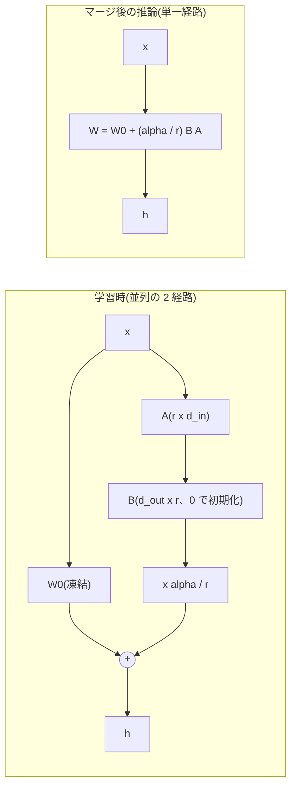

この記事は前編(理論編)です。続きは [こちら](https://zenn.dev/kojikojiprg/books/ai-theories-roadmap/viewer/012_low_rank_adaptation-practice-1)。

# 012. LoRA(Low-Rank Adaptation)

## 1. 概要 / Overview

LoRA(Low-Rank Adaptation、低ランク適応)は、事前学習済みの重みを凍結し、微調整(fine-tuning)で
加える重みの更新量を 2 つの低ランク行列の積に制限することで、学習可能パラメータ数を大幅に減らす
手法である。本トピックでは、008 で事前学習した小型 GPT を Tiny Shakespeare に適応させ、
注意機構の Query・Value 射影に掛けた LoRA が全パラメータ微調整(full fine-tuning)に匹敵する
適応性能を得られるかを検証する。あわせて、その理由が更新量の低ランク構造にあるかを、
同じパラメータ数のランダムな疎な更新との比較と、rank を振ったときの飽和によって検証する。

## 2. 参考論文 / References

1. Hu, E. J., Shen, Y., Wallis, P., Allen-Zhu, Z., Li, Y., Wang, S., Wang, L., Chen, W.,
   "LoRA: Low-Rank Adaptation of Large Language Models", ICLR 2022.
   https://arxiv.org/abs/2106.09685(https://openreview.net/forum?id=nZeVKeeFYf9)
   (本トピックの原典。定式化・$\alpha/r$ スケーリング(第 4.1 節)・適用対象の選択(第 7.1 節))
2. Microsoft, `loralib`(LoRA の公式実装)。https://github.com/microsoft/LoRA
   (`loralib/layers.py`の`Linear.reset_parameters`。$A$・$B$ の初期化の出典)
3. Li, C., Farkhoor, H., Liu, R., Yosinski, J., "Measuring the Intrinsic Dimension of
   Objective Landscapes", ICLR 2018. https://arxiv.org/abs/1804.08838
   (内在次元(intrinsic dimension)の定義)
4. Aghajanyan, A., Gupta, S., Zettlemoyer, L., "Intrinsic Dimensionality Explains the
   Effectiveness of Language Model Fine-Tuning", ACL 2021. https://arxiv.org/abs/2012.13255
   (https://aclanthology.org/2021.acl-long.568/)(事前学習済み言語モデルの微調整の内在次元)
5. Kalajdzievski, D., "A Rank Stabilization Scaling Factor for Fine-Tuning with LoRA", 2023.
   https://arxiv.org/abs/2312.03732(rsLoRA。実験 C の交絡の説明に使う)
6. Biderman, D. et al., "LoRA Learns Less and Forgets Less", TMLR 2024.
   https://arxiv.org/abs/2405.09673(LoRA が全パラメータ微調整に届かない条件)
7. Guo, D., Rush, A. M., Kim, Y., "Parameter-Efficient Transfer Learning with Diff Pruning",
   ACL 2021. https://arxiv.org/abs/2012.07463(https://aclanthology.org/2021.acl-long.378/)
   (疎な差分による微調整。実験 B の対照の位置づけ)
8. Houlsby, N. et al., "Parameter-Efficient Transfer Learning for NLP", ICML 2019.
   https://arxiv.org/abs/1902.00751(Adapter。位置づけの説明のみ)

## 3. 理論 / Theory

### 3.1 動機: 全パラメータ微調整のメモリ内訳

事前学習済みモデルの全パラメータを更新する全パラメータ微調整では、学習中に次の量をすべて
保持する。モデルの全パラメータ数を $P$ とし、すべて単精度浮動小数点(fp32、1 要素 4 バイト)で
持つとする。

| 保持するもの | バイト数 |
|---|---|
| 重み | $4P$ |
| 勾配 | $4P$ |
| AdamW(Loshchilov & Hutter, ICLR 2019)の一次モーメント $m$・二次モーメント $v$ | $8P$ |
| 合計(活性化を除く) | $16P$ |

これに加えて、逆伝播のために保存される活性化のメモリが必要になる。さらに、下流タスクごとに
微調整したモデルを保存すると、タスクの数だけ $P$ 個のパラメータの複製が必要になる。

学習可能なパラメータを $P_{\mathrm{train}} \ll P$ 個に絞れれば、勾配と AdamW の状態は
$P_{\mathrm{train}}$ 個分で済み、活性化を除くメモリは次のように減る。

$$
M_{\mathrm{full}} = 16P, \qquad M_{\mathrm{train}} = 4P + 12 P_{\mathrm{train}}
$$

ここで $M_{\mathrm{full}}$ は全パラメータ微調整、$M_{\mathrm{train}}$ は $P_{\mathrm{train}}$
個のパラメータのみを学習する場合の、活性化を除くメモリ(バイト)である。凍結した重み
($4P$)は順伝播に必要なので減らない。

**活性化のメモリは、一部は減る。** 線形層 $y = W x$ の逆伝播では、入力側への勾配
$\partial \mathcal{L} / \partial x = W^\top (\partial \mathcal{L} / \partial y)$ の計算には $W$ しか
要らない。入力 $x$ が必要になるのは、重みの勾配
$\partial \mathcal{L} / \partial W = (\partial \mathcal{L} / \partial y)\, x^\top$ を計算するときだけである
($\mathcal{L}$ は損失)。したがって、重みを凍結した線形層では、逆伝播のために入力 $x$ を保存して
おく必要がない。一方、SwiGLU・softmax・RMSNorm のような非線形の演算が逆伝播のために保存する
テンソルは減らない。これらは、それより入力側にある学習可能な層へ勾配を届けるために必要であり、
凍結した層であっても逆伝播で通過すること自体は変わらないからである。同じ理由で、凍結した線形層では
重みの勾配を求める行列積 $(\partial \mathcal{L} / \partial y)\, x^\top$ を省けるため、1 ステップの
計算時間も減る。

小型のモデルでは活性化のメモリが支配的になりやすい。[011](https://zenn.dev/kojikojiprg/books/ai-theories-roadmap/viewer/011_mixed_precision_training-theory)
の実験 G では、系列長 256・バッチサイズ 32 の 1 ステップのピークメモリ(約 2.2 GB)に対し、
重み・勾配・AdamW の状態の合計は約 48 MB だった。本トピックでの実測との対応は 7.6 節で述べる。

### 3.2 内在次元: 微調整に必要な更新は低次元に収まるという仮説

Li et al.(ICLR 2018)[3] は、目的関数の地形の **内在次元(intrinsic dimension)** を次のように
測った。$D$ 次元のパラメータ $\theta \in \mathbb{R}^D$ を、固定したランダム行列
$Q \in \mathbb{R}^{D \times d}$ で張られる $d$ 次元の部分空間の中だけで動かす。

$$
\theta = \theta_0 + Q \phi, \qquad \phi \in \mathbb{R}^d
$$

$\theta_0$ は初期値、$\phi$ が学習する $d$ 次元のベクトルである($Q$ と $\theta_0$ は固定)。
$d$ を増やしていき、制約なしの学習の性能の 90% に初めて達する $d$ を内在次元 $d_{90}$ と呼ぶ。
(原論文は射影行列を $P$ と書くが、本ノートブックでは $P$ をパラメータ数に使うため $Q$ と書く。)

Aghajanyan et al.(ACL 2021)[4] はこの測定を事前学習済み言語モデルの微調整に適用し、
パラメータ数が数億でも、数百〜数千次元の部分空間の中の更新で全パラメータ微調整の 90% の性能に
届くタスクが多いこと、また事前学習が進むほど内在次元が小さくなることを報告した。

Hu et al.(ICLR 2022)[1] はこれを受けて、**微調整による重みの更新量 $\Delta W$ も低い
「内在的な rank(intrinsic rank)」を持つ** という仮説を立て、更新量を最初から低ランク行列の
積に制限する LoRA を提案した。本トピックの実験 A は LoRA が全パラメータ微調整に匹敵するか、
実験 B・C はその理由が低ランク構造にあるかを問う。

### 3.3 定式化

対象とする線形層の事前学習済みの重みを $W_0 \in \mathbb{R}^{d_{\mathrm{out}} \times d_{\mathrm{in}}}$
とする。$d_{\mathrm{in}}$ は入力次元、$d_{\mathrm{out}}$ は出力次元である。LoRA は $W_0$ を凍結し、
順伝播を次のように置き換える。

$$
h = W_0 x + \frac{\alpha}{r} B A x
$$

- $x \in \mathbb{R}^{d_{\mathrm{in}}}$: 層への入力
- $h \in \mathbb{R}^{d_{\mathrm{out}}}$: 層の出力
- $A \in \mathbb{R}^{r \times d_{\mathrm{in}}}$、$B \in \mathbb{R}^{d_{\mathrm{out}} \times r}$: 学習する行列
- $r$: rank。$r \ll \min(d_{\mathrm{in}}, d_{\mathrm{out}})$ とする
- $\alpha$: スケーリング定数(3.5 節)

更新量は $\Delta W = \frac{\alpha}{r} B A$ であり、その rank は高々 $r$ である。

**初期化**: $B = 0$ で初期化する。このため学習開始時は $\Delta W = 0$ となり、出力は
ベースモデルと完全に一致する。$A$ の初期化は公式実装`loralib`[2] に従い、`nn.Linear`の
既定と同じ`kaiming_uniform_(a=sqrt(5))`、すなわち一様分布
$A_{ij} \sim \mathcal{U}(-1/\sqrt{d_{\mathrm{in}}},\ 1/\sqrt{d_{\mathrm{in}}})$ とする。
**原論文本文(第 4.1 節)は「$A$ はランダムなガウス分布で初期化する」と書いており、分布の形が
公式実装と異なる。** 本ノートブックは公式実装に従う。どちらでも $B = 0$ なので、学習開始時に
ベースモデルと一致する性質は変わらない。

**勾配の流れ**: $B = 0$ のとき、損失 $\mathcal{L}$ の $A$ についての勾配は
$\partial \mathcal{L} / \partial A = \frac{\alpha}{r} B^\top (\partial \mathcal{L} / \partial h) x^\top = 0$
であり、最初のステップで更新されるのは $B$ のみである。$B$ が 0 から離れた後に $A$ も動き始める。

**学習可能パラメータ数**: 1 行列あたり

$$
P_{\mathrm{LoRA}} = r (d_{\mathrm{in}} + d_{\mathrm{out}})
$$

であり、全パラメータを更新する場合の $d_{\mathrm{in}} d_{\mathrm{out}}$ に比べて、
$d_{\mathrm{in}} = d_{\mathrm{out}} = d$ なら $2r/d$ 倍になる。

**マージ**: 学習後に

$$
W = W_0 + \frac{\alpha}{r} B A
$$

を計算して重みに書き込めば、推論時は元と同じ 1 回の行列積 $h = W x$ になり、追加の遅延が
生じない。逆に $\frac{\alpha}{r} B A$ を引けば $W_0$ に戻せる(unmerge)ので、1 つの
ベースモデルに複数のタスクの LoRA を差し替えて使える。



### 3.4 アルゴリズム

```text
procedure APPLY_LORA(model, target_names, r, alpha):
    for each parameter p in model: p.requires_grad <- False        # 全パラメータを凍結
    for each linear layer W0 in model whose name is in target_names:
        A <- Uniform(-1/sqrt(d_in), 1/sqrt(d_in)), shape (r, d_in)  # 学習可能
        B <- 0, shape (d_out, r)                                    # 学習可能
        replace W0 by LoRALinear(W0, A, B, scale = alpha / r)

procedure TRAIN(model, data, optimizer over {A, B} only):
    for step = 1 .. T:
        h = W0 x + scale * B (A x)        # W0 は凍結、A・B のみ勾配を持つ
        loss.backward(); clip gradients; optimizer.step()

procedure MERGE(layer):
    W0 <- W0 + scale * B A                # 以降 h = W0 x の 1 回の行列積
```

### 3.5 スケーリング $\alpha / r$ の意図と rsLoRA の指摘

Hu et al. [1](第 4.1 節)は、更新量に $\alpha / r$ を乗じ、$\alpha$ を「最初に試した $r$」に
固定して調整しない。Adam 系の optimizer では $\alpha$ の調整は学習率の調整とほぼ同じ働きを
するため、$r$ を変えても学習率を再調整せずに済むことを意図した設計である。

これに対して Kalajdzievski [5](rsLoRA)は、$\alpha / r$ のもとでは $r$ を大きくするほど
学習中の更新量 $\frac{\alpha}{r} B A$ が $r$ に対して縮み、学習が遅くなるため、大きな $r$ の
利点が打ち消されると指摘した。更新量の大きさが $r$ によらず安定するのは、スケーリング係数を
$\alpha / \sqrt{r}$ にした場合であると導出している。

本トピックでは原論文どおり $\alpha / r$ を使う。rsLoRA の指摘は、rank の飽和を調べる実験 C の
**交絡** として扱う(飽和が観測されても、低ランクで十分だからなのか、大きな $r$ で更新量が
縮むからなのかを実験 C だけでは区別できない)。

### 3.6 適用対象: Query・Value 射影

Hu et al. [1] の第 7.1 節は、学習可能パラメータ数の予算を固定したうえで、注意機構の
Query・Key・Value・出力の射影($W_q$・$W_k$・$W_v$・$W_o$)のどれに LoRA を掛けるかを比べ、
$W_q$ と $W_v$ の両方に掛けるのが最もよいと結論している(1 種類の射影に大きな rank を
割り当てるより、rank を小さくしてでも複数の射影に掛けるほうがよい)。本トピックでもこれに従い、
全層の Query 射影 $W^Q$ と Value 射影 $W^V$ にのみ LoRA を掛ける。

層数を $L$、隠れ次元を $d_{\mathrm{model}}$ とすると($W^Q$・$W^V$ はいずれも
$d_{\mathrm{model}} \times d_{\mathrm{model}}$)、学習可能パラメータ数の合計は

$$
P_{\mathrm{LoRA,total}} = 2L \cdot r (d_{\mathrm{model}} + d_{\mathrm{model}}) = 4 L r d_{\mathrm{model}}
$$

である。

### 3.7 他のパラメータ効率のよい微調整との位置づけ

- **Adapter**(Houlsby et al., ICML 2019 [8]): 各層にボトルネック構造の小さな
  順伝播ネットワーク(Feed-Forward Network)を直列に挿入し、それのみを学習する。直列に
  挿入するため、推論時にも追加の計算が残る。LoRA は並列の経路でありマージできる点が異なる。
- **Diff Pruning**(Guo et al., ACL 2021 [7]): 事前学習済みの重みへの差分を疎なベクトルとして
  学習し、どの要素を更新するか(マスク)自体も $L_0$ ノルムの緩和によって学習する。
  実験 B の対照(ランダムマスク疎微調整)は、差分が疎である点は同じだが、マスクを学習せず
  **ランダムに固定する** 点が異なる。したがって実験 B の対照は Diff Pruning の再現ではなく、
  「パラメータ数を揃え、低ランク構造だけを取り除いた更新」として置く。

### 3.8 LoRA が全パラメータ微調整に届かない可能性

Biderman et al.(TMLR 2024)[6] は、プログラミングと数学のドメインで大規模なデータを使った
継続事前学習・指示チューニングにおいて、LoRA が全パラメータ微調整に大きく劣ることを報告した。
同論文は、全パラメータ微調整が学習する更新量の rank が、典型的な LoRA の設定の rank より
10〜100 倍高いことも示している。事前学習とのドメイン差が大きく、適応に多くの情報を書き込む
必要がある設定では、低ランクの制約が効いてしまう。

本トピックの設定(英語版 Wikipedia で事前学習した小型モデルを、戯曲の台詞という文体・語彙の
大きく異なる Tiny Shakespeare に適応させる)は、モデルが小さく、ドメイン差が大きい。
したがって、LoRA が全パラメータ微調整に届かない結果も十分にありうる。実験 A はその可能性を
排除しない判定基準(3 値判定)で宣言する。


## 元ノートブック(実装の全文はこちら)

https://github.com/kojikojiprg/ai-theories/blob/main/theories/03_efficient_training/012_low_rank_adaptation.ipynb
