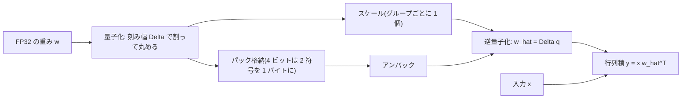
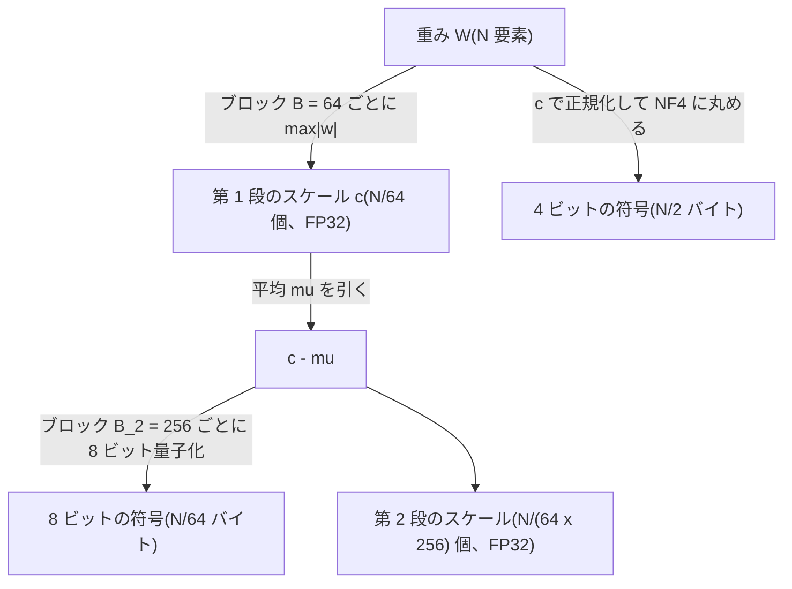
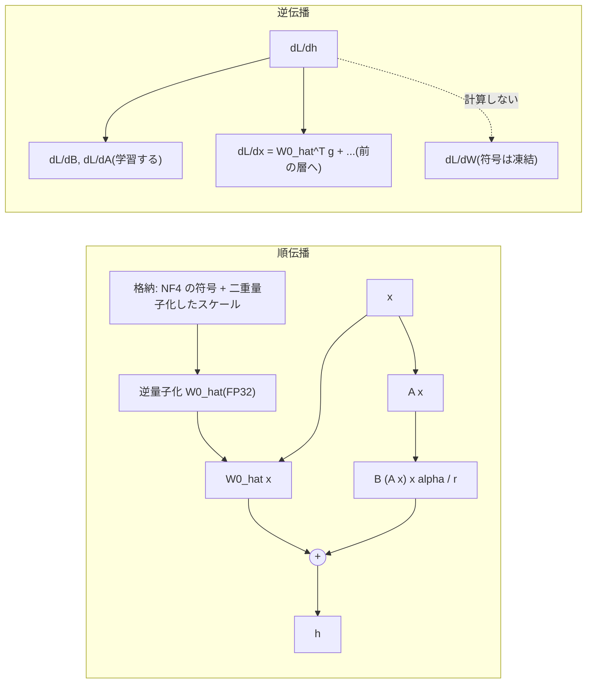

この記事は前編(理論編)です。続きは [こちら](https://zenn.dev/kojikojiprg/books/ai-theories-roadmap/viewer/013_quantization_basics-practice-1)。

# 013. 量子化の基礎(Quantization Basics)

## 1. 概要 / Overview

量子化(Quantization)は、モデルの重みを少ないビット数の離散的な値で表すことで、格納に要する
メモリと、推論時にメモリから読み出すバイト数を減らす技術である。本トピックでは、一様量子化
(Uniform Quantization)の absmax 方式・ゼロ点(Zero-Point)付き方式と、正規分布に対する
分位点量子化(Quantile Quantization)である NF4(4-bit NormalFloat)・二重量子化(Double
Quantization)をスクラッチ実装し、量子化誤差の理論値との一致、量子化の粒度と重みの外れ値の関係、
NF4 と INT4 の誤差の比較を 008 の事前学習済み小型 GPT の重みで検証する。さらに、凍結した NF4 の
基盤モデルに 012 の LoRA を載せる QLoRA によって、量子化による劣化が微調整で縮小するかを検証する。

## 2. 参考論文 / References

1. Bennett, W. R., "Spectra of Quantized Signals", Bell System Technical Journal, vol. 27, no. 3,
   pp. 446–472, 1948. https://doi.org/10.1002/j.1538-7305.1948.tb01340.x
   (量子化誤差を刻み幅の中で一様に分布するとみなしたときの平均二乗誤差 $\Delta^2 / 12$、3.3 節)
2. Jacob, B., Kligys, S., Chen, B., Zhu, M., Tang, M., Howard, A., Adam, H., Kalenichenko, D.,
   "Quantization and Training of Neural Networks for Efficient Integer-Arithmetic-Only Inference",
   CVPR 2018. https://arxiv.org/abs/1712.05877
   (ゼロ点付きの非対称な一様量子化 $r = S(q - Z)$、量子化を考慮した学習、3.2 節・3.10 節)
3. Dettmers, T., Lewis, M., Shleifer, S., Zettlemoyer, L., "8-bit Optimizers via Block-wise
   Quantization", ICLR 2022. https://arxiv.org/abs/2110.02861
   (ブロック単位の量子化、分位点量子化、3.4 節・3.6 節)
4. Dettmers, T., Lewis, M., Belkada, Y., Zettlemoyer, L., "LLM.int8(): 8-bit Matrix Multiplication
   for Transformers at Scale", NeurIPS 2022. https://arxiv.org/abs/2208.07339
   (ベクトル単位の量子化、外れ値の特徴次元と混合精度分解、3.5 節・観察)
5. Dettmers, T., Pagnoni, A., Holtzman, A., Zettlemoyer, L., "QLoRA: Efficient Finetuning of
   Quantized LLMs", NeurIPS 2023. https://arxiv.org/abs/2305.14314
   (NF4・二重量子化・QLoRA・Paged Optimizer、3.6〜3.8 節。NF4 の符号語の値は Appendix E)
6. Frantar, E., Ashkboos, S., Hoefler, T., Alistarh, D., "GPTQ: Accurate Post-Training Quantization
   for Generative Pre-trained Transformers", ICLR 2023. https://arxiv.org/abs/2210.17323
   (位置づけのみ、3.10 節)
7. Lin, J., Tang, J., Tang, H., Yang, S., Chen, W.-M., Wang, W.-C., Xiao, G., Dang, X., Gan, C.,
   Han, S., "AWQ: Activation-aware Weight Quantization for LLM Compression and Acceleration",
   MLSys 2024. https://arxiv.org/abs/2306.00978 (位置づけのみ、3.10 節)
8. Hu, E. J., Shen, Y., Wallis, P., Allen-Zhu, Z., Li, Y., Wang, S., Wang, L., Chen, W.,
   "LoRA: Low-Rank Adaptation of Large Language Models", ICLR 2022. https://arxiv.org/abs/2106.09685
   ([012](https://zenn.dev/kojikojiprg/books/ai-theories-roadmap/viewer/012_low_rank_adaptation-theory) と同じ、3.8 節・実験 D)
9. Bengio, Y., Léonard, N., Courville, A., "Estimating or Propagating Gradients Through Stochastic
   Neurons for Conditional Computation", arXiv 2013. https://arxiv.org/abs/1308.3432
   (straight-through estimator、3.10 節)
10. bitsandbytes(QLoRA の公式実装)。https://github.com/bitsandbytes-foundation/bitsandbytes
    (`bitsandbytes/functional.py`の`create_normal_map`・`get_4bit_type`。NF4 の符号語の構成手順と
    値の出典、3.6 節)

## 3. 理論 / Theory

### 3.1 動機: 重みのメモリと読み出し量

パラメータ数 $P$ のモデルの重みを単精度浮動小数点(FP32、1 要素 4 バイト)で持つと $4P$ バイトになる。
70 億パラメータのモデルでは約 28 GB であり、Google Colab 無料枠の T4(16 GB)には載らない。
重みを 1 要素あたり $b$ ビットで表せれば、重みのメモリは $bP/8$ バイトになる($b = 4$ なら FP32 の
1/8)。本トピックの小型 GPT は $P = 5{,}246{,}208$(約 21 MB)なのでメモリには困らないが、
量子化の誤差の性質は同じ定式化で測れる。

量子化の効果はメモリ量だけではない。3.9 節で述べるように、自己回帰生成の decode は
メモリ帯域律速であり([010](https://zenn.dev/kojikojiprg/books/ai-theories-roadmap/viewer/010_kv_cache_and_inference_compute-theory) の実験 B)、
読み出す重みのバイト数を減らすことが速度に直結する。

### 3.2 一様量子化(Uniform Quantization)の定式化

実数値の重み $w$ を、$2^b$ 個以下の等間隔な格子点のいずれかに丸める。格子点の間隔を
**刻み幅(step size)** $\Delta$ と呼ぶ。

**absmax 方式(対称、Symmetric)**: 対象の値の集合(3.4 節の「グループ」)の最大絶対値
$m = \max_i |w_i|$ を格子の端に合わせる。

$$
\Delta = \frac{m}{2^{b-1} - 1}, \qquad
q_i = \mathrm{round}\!\left(\frac{w_i}{\Delta}\right) \in \{-(2^{b-1} - 1), \dots, 2^{b-1} - 1\}, \qquad
\hat{w}_i = \Delta\, q_i
$$

$q_i$ は整数の符号、$\hat{w}_i$ は逆量子化(Dequantization)した値である。INT8($b = 8$)では
$q_i \in [-127, 127]$ となり、QLoRA [5] の式 (1) と同じである。符号は $2^b - 1$ 通りしか使わない
(1 通りは未使用)が、0 を厳密に表現でき、正負が対称になる。

**ゼロ点(Zero-Point)付きの非対称方式(Asymmetric)**: Jacob et al. [2] は、実数 $r$ と
整数の符号 $q$ を

$$
r = S (q - Z)
$$

で対応づける。$S$ はスケール(刻み幅)、$Z$ はゼロ点(実数 0 に対応する整数)である。本ノートブックでは、
値域を $[\alpha, \beta]$、$\alpha = \min(\min_i w_i, 0)$、$\beta = \max(\max_i w_i, 0)$ とし(0 を厳密に
表現できるよう値域に 0 を含める)、

$$
S = \frac{\beta - \alpha}{2^b - 1}, \qquad Z = \mathrm{round}\!\left(\frac{-\alpha}{S}\right), \qquad
q_i = \mathrm{clamp}\!\left(\mathrm{round}\!\left(\frac{w_i}{S}\right) + Z,\ 0,\ 2^b - 1\right)
$$

とする。値の分布が 0 について非対称な場合(ReLU の出力など)に格子を無駄なく使える。

### 3.3 量子化誤差の理論値

量子化誤差を $e_i = w_i - \hat{w}_i$ とする。丸めの誤差は $|e_i| \le \Delta / 2$ を満たす。Bennett [1] は、
刻み幅が値の分布の変化に比べて十分細かい(1 つの刻みの中で密度がほぼ一定とみなせる)とき、
誤差が区間 $[-\Delta/2, \Delta/2]$ で一様に分布するとみなせることを示した。このとき誤差の平均二乗は

$$
\mathbb{E}[e^2] = \int_{-\Delta/2}^{\Delta/2} e^2 \cdot \frac{1}{\Delta}\, de = \frac{\Delta^2}{12}
$$

である。本ノートブックでは、グループ $j$ の刻み幅を $\Delta_j$、グループ数を $G$ として、
行列 1 つの再構成誤差の予測値を

$$
\mathrm{predicted} = \frac{\overline{\Delta^2}}{12}, \qquad \overline{\Delta^2} = \frac{1}{G} \sum_{j=1}^{G} \Delta_j^2
$$

とする(グループの大きさがすべて等しいので、行列全体の平均二乗誤差はグループごとの平均二乗誤差の
平均に等しい)。

**absmax 方式の系統的なずれ**: absmax 方式では、グループ内で最大絶対値をとる要素は
$w / \Delta = \pm(2^{b-1} - 1)$ が整数なので **誤差 0 で表現される**。大きさ $B$ のグループでは、
残りの $B - 1$ 要素だけが一様誤差を持つとみなせるので、予測値は

$$
\frac{B - 1}{B} \cdot \frac{\overline{\Delta^2}}{12}
$$

に補正される。$B = 64$ では係数 $63/64$、対数で $\log(63/64) \approx -0.0157$ のずれである。

**ビット幅と誤差の比**: absmax 方式でビット幅を $b$ から $b + 1$ に増やすと、同じグループの刻み幅は
$\Delta_b / \Delta_{b+1} = (2^b - 1) / (2^{b-1} - 1)$ 倍小さくなる。一様誤差の近似のもとで
平均二乗誤差の比は

$$
\frac{\mathrm{err}_b}{\mathrm{err}_{b+1}} = \left(\frac{2^b - 1}{2^{b-1} - 1}\right)^2 \xrightarrow{b \to \infty} 4
$$

である(1 ビット増えるごとに誤差がおよそ 1/4、約 6 dB 減る)。

| $b$ | 2 | 3 | 4 | 5 | 6 | 7 | 8 |
|---|---|---|---|---|---|---|---|
| $\left(\frac{2^b - 1}{2^{b-1} - 1}\right)^2$ | 9.00 | 5.44 | 4.59 | 4.27 | 4.13 | 4.06 | 4.03 |

**低ビットでは 4 から外れるだけでなく、一様誤差の近似そのものが成り立たなくなる。** 例えば
$b = 2$ では格子点は $\{-\Delta, 0, \Delta\}$ の 3 つしかなく、$\Delta = m$ は値の分布の広がり
(標準偏差の数倍)と同程度になる。1 つの刻みの中で密度が一定という前提が崩れ、正規分布のように
0 付近に値が集中する分布では、誤差は $\Delta^2/12$ より小さくなる。実験 A はこの近似が成り立つ範囲
($b \ge 4$)を判定し、$b \in \{2, 3\}$ を診断量として観察する。

### 3.4 量子化の粒度とスケールの格納オーバーヘッド

スケール($\Delta$ など)を共有する値の集合を **グループ** と呼ぶ。形状 $(d_{\mathrm{out}}, d_{\mathrm{in}})$
の重み行列($N = d_{\mathrm{out}} d_{\mathrm{in}}$ 要素、$d_{\mathrm{out}}$ は出力次元、$d_{\mathrm{in}}$ は
入力次元)に対して、次の粒度がある。

| 粒度 | グループ | グループ数 $G$ |
|---|---|---|
| テンソル単位(per-tensor) | 行列全体 | $1$ |
| チャネル単位(per-channel) | 出力チャネル(行)ごと | $d_{\mathrm{out}}$ |
| ブロック単位(block-wise)[3] | 行優先に平坦化した連続 $B$ 要素ごと | $\lceil N / B \rceil$ |

グループが細かいほど、1 つの外れ値が他の値の刻み幅を広げる影響がそのグループに閉じ込められる。
代わりに、スケールを $G$ 個格納するオーバーヘッドが増える。スケールを $s$ ビットで格納すると、
1 パラメータあたりの **実効ビット数** は

$$
\bar{b} = b + \frac{s\, G}{N}
= \begin{cases}
b + s / N & \text{(per-tensor)} \\
b + s / d_{\mathrm{in}} & \text{(per-channel)} \\
b + s / B & \text{(block-wise, } B \mid N \text{)}
\end{cases}
$$

である。$b = 4$、$s = 32$(FP32)、$B = 64$ では $\bar{b} = 4 + 32/64 = 4.5$ ビットになる。

### 3.5 外れ値(outlier)の問題と LLM.int8() の混合精度分解

absmax 方式の刻み幅はグループの最大絶対値で決まるので、裾の重い分布(外れ値を含む分布)ほど
大部分の値に対して格子が粗くなる。分布の裾の重さの指標として **尖度(excess kurtosis)**

$$
\kappa = \frac{m_4}{m_2^2} - 3
$$

を使う($m_k$ は平均まわりの $k$ 次の標本モーメント)。正規分布では $\kappa = 0$、ラプラス分布では
$\kappa = 3$ であり、裾が重いほど大きい。

ただし、外れ値がなくても、要素数が多いほど最大絶対値の期待値は大きくなる。標準偏差 $\sigma$ の
正規分布から $N$ 個を独立に取ると、最大絶対値はおよそ $\sigma \sqrt{2 \ln N}$ で増える。したがって
テンソル単位からブロック単位へ細かくしたときの誤差の低減幅は、尖度だけでなく行列の大きさにも依存する
(実験 B ではこれを交絡として行列の形状で層別する)。

Dettmers et al. [4](LLM.int8())は、行列積 $X W$(隠れ状態 $X \in \mathbb{R}^{s \times h}$、
重み $W \in \mathbb{R}^{h \times o}$、$s$ は系列長、$h$ は特徴次元、$o$ は出力次元)を INT8 で行う際、
$X$ の行ごと・$W$ の列ごとにスケールを持つベクトル単位の量子化(vector-wise quantization)に加え、
大きさの大きい特徴次元の集合 $O$ を 16 ビットのまま残す **混合精度分解(mixed-precision
decomposition)**

$$
X W \approx \sum_{h \in O} X_{:,h} W_{h,:} + \mathrm{dequant}\!\left(\sum_{h \notin O} Q(X_{:,h})\, Q(W_{h,:})\right)
$$

を提案した($Q$ は INT8 への量子化)。同論文は、隠れ状態の中に大きさ 6 以上の値を持ち、
全層の 25% 以上・系列位置の 6% 以上に同じ次元で現れる **外れ値の特徴次元(outlier features)** が、
**約 67 億パラメータ(6.7B)以上のモデルで全層に系統的に現れる**(相転移のように急に現れる)と
報告している。本トピックのモデル($P \approx 5 \times 10^6$)はこれより 3 桁小さいため、外れ値の特徴次元
の有無は判定の対象にせず、観察(判定基準を設けない診断)に留める。

### 3.6 NF4(4-bit NormalFloat): 正規分布に対する分位点量子化

**分位点量子化(Quantile Quantization)** [3] は、各量子化区間に同じ数(同じ確率)の値が入るように
符号語を置く方式である。値の分布の分位点関数 $Q_X$ を使って $2^k$ 個の区間の境界を等確率に取り、
各区間の代表値を符号語とする。一様量子化と違い、密度の高い 0 付近に符号語が密に置かれる。

QLoRA [5] は、学習済みの重みがおおむね平均 0 の正規分布に従うことに着目し、分位点を入力の経験分布から
推定する代わりに、標準正規分布の分位点から符号語を一度だけ計算して固定した。$k$ ビットの符号語は

$$
q_i = \frac{1}{2}\left(Q_X\!\left(\frac{i}{2^k + 1}\right) + Q_X\!\left(\frac{i + 1}{2^k + 1}\right)\right)
$$

($Q_X$ は標準正規分布 $\mathcal{N}(0, 1)$ の分位点関数、QLoRA の式 (4))を $[-1, 1]$ に正規化したもので
ある。重みはブロックごとに最大絶対値で割って $[-1, 1]$ に正規化し(absmax 方式の正規化と同じ)、
最も近い符号語に丸める。

**0 を厳密に表現する非対称な構成**: 上式を $2^k$ 個の符号語に対称に適用すると 0 が符号語に含まれない。
0(パディングなど)を誤差なく表現するため、QLoRA は負側に $2^{k-1}$ 個・正側に $2^{k-1} + 1$ 個の
符号語を別々に作り、両方に現れる 0 の片方を除いて統合する。公式実装 [10] の手順($k = 4$)は次のとおり
である。$\delta$ は最も外側の分位点の確率である。

1. 正側: 確率 $[\delta, 1/2]$ を 9 点に等分し、端点 $1/2$ を除く 8 点 $p_0 > \dots > p_7$ の $Q_X(p_j)$ を取る。
2. 負側: 確率 $[\delta, 1/2]$ を 8 点に等分し、端点 $1/2$ を除く 7 点 $p'_0 > \dots > p'_6$ の $-Q_X(p'_j)$ を取る。
3. 0 を 1 個加えて昇順に並べ、最大値 $Q_X(\delta)$ で割る。

結果は **正側 8 個・負側 7 個・0 が 1 個** の 16 個の符号語になる(最大値 $+1$ と最小値 $-1$ を含む)。
公式実装の既定値 $\delta = 0.9677083$ は、負側・正側それぞれで式 (4) の最も外側の確率点の位置
$1 - 1 / (2 \cdot 15)$ と $1 - 1 / (2 \cdot 16)$ の平均 $0.96770833\dots$ を小数第 7 位で丸めた値である
(本ノートブックの 5.6 節で、導出した 16 値が QLoRA の Appendix E と公式実装の定数に bit 単位で一致する
ことを確認する)。

**「情報理論的に最適」の意味**: QLoRA は NF4 を「正規分布に対して情報理論的に最適」と呼ぶが、これは
各区間に入る値の期待個数が等しい(符号の使用頻度が一様で、符号のエントロピーが最大になる)という
意味である。**平均二乗誤差を最小にする量子化器(Lloyd–Max 量子化器)とは一致しない。** また、
ブロック内の値を最大絶対値で割った分布は標準正規分布を $Q_X(\delta)$ で割ったものとは一致しない
(ブロックの大きさ $B$ の標本の最大値で正規化するため)。したがって、NF4 が同じビット数の一様量子化
(INT4)より再構成誤差が小さいかは自明ではなく、実験 C で検証する。

### 3.7 二重量子化(Double Quantization)

ブロック単位の量子化では、ブロックごとのスケール $c_j = \max_{i \in j} |w_i|$(FP32)の格納が
3.4 節のオーバーヘッドになる。QLoRA [5] の二重量子化は、このスケール自体を量子化する。

1. 第 1 段のスケール $c_1, \dots, c_G$(すべて正)から平均 $\mu$ を引いて 0 を中心にする。
2. $c_j - \mu$ を $B_2$ 個ずつのブロックに分け、8 ビットで量子化する(第 2 段のスケールは FP32)。
3. 逆量子化は $\hat{c}_j = \mathrm{dequant}(\cdot) + \mu$、重みは $\hat{w}_i = \mathrm{codebook}[q_i] \cdot \hat{c}_{j(i)}$。

原論文は第 2 段に 8 ビット浮動小数点(FP8)を使うが、本実装は 8 ビットの absmax 方式(INT8)で
量子化する(ビット数・ブロックサイズ・平均を引く手順は原論文と同じで、格納バイト数も同じ)。

実効ビット数は($N$ が $B B_2$ で割り切れ、テンソルごとの $\mu$ の 32 ビットを無視すると)

$$
\bar{b}_{\mathrm{DQ}} = b + \frac{b_2}{B} + \frac{s}{B B_2}
= 4 + \frac{8}{64} + \frac{32}{64 \cdot 256} = 4.126953125
$$

となり、二重量子化なしの $\bar{b} = 4 + 32/64 = 4.5$ から 1 パラメータあたり約 0.373 ビット減る
($b_2 = 8$ は第 2 段のビット数、$B_2 = 256$ は第 2 段のブロックサイズ)。

### 3.8 QLoRA: 量子化した基盤モデルの上での LoRA

QLoRA [5] は、基盤モデルの重みを NF4(ブロック 64 + 二重量子化)で **凍結して格納** し、LoRA [8] の
低ランク行列だけを学習する。[012](https://zenn.dev/kojikojiprg/books/ai-theories-roadmap/viewer/012_low_rank_adaptation-theory) の記法で、対象の線形層は

$$
h = \hat{W}_0 x + \frac{\alpha}{r} B A x, \qquad \hat{W}_0 = \mathrm{dequant}(c_1, c_2, W_{\mathrm{NF4}})
$$

を計算する。$\hat{W}_0$ は順伝播のたびに格納形式(NF4)から計算用の形式へ逆量子化した重み、
$A \in \mathbb{R}^{r \times d_{\mathrm{in}}}$・$B \in \mathbb{R}^{d_{\mathrm{out}} \times r}$ は学習する行列、
$r$ は rank、$\alpha$ はスケーリング定数である(QLoRA の式 (5)・(6))。原論文の計算用の形式は BF16 だが、
本ノートブックは FP32 で計算する(T4 は BF16 の行列積を持たないため)。

**勾配の流れ**: 損失を $\mathcal{L}$、$g = \partial \mathcal{L} / \partial h$ とすると、

$$
\frac{\partial \mathcal{L}}{\partial B} = \frac{\alpha}{r}\, g\, (A x)^\top, \qquad
\frac{\partial \mathcal{L}}{\partial A} = \frac{\alpha}{r}\, B^\top g\, x^\top, \qquad
\frac{\partial \mathcal{L}}{\partial x} = \hat{W}_0^\top g + \frac{\alpha}{r} A^\top B^\top g
$$

である。量子化した重みの符号 $W_{\mathrm{NF4}}$ は離散値で凍結されており、勾配は計算しない。一方、
入力側への勾配 $\partial \mathcal{L} / \partial x$ は **逆量子化した $\hat{W}_0$ を経由して** 前の層へ流れ、
前の層の LoRA の $A$・$B$ の勾配になる。つまり、LoRA の学習は $W_0$ ではなく $\hat{W}_0$ の上で行われ、
量子化による誤差 $W_0 - \hat{W}_0$ を含んだモデルに対して適応する。実験 D は、この適応によって量子化による
劣化が縮小するかを問う。

**Paged Optimizer(位置づけのみ)**: QLoRA は、GPU のメモリが一時的に不足したときに optimizer の状態を
CPU のメモリへ自動的に退避する(NVIDIA の unified memory のページングを使う)Paged Optimizer も
提案している。これは勾配チェックポイント(gradient checkpointing)使用時のメモリの急増に対処する
工夫であり、本トピックの小型モデルでは GPU のメモリが不足しないため実装しない。

### 3.9 重みのみ量子化(Weight-Only Quantization)が decode を速くする理由

[010](https://zenn.dev/kojikojiprg/books/ai-theories-roadmap/viewer/010_kv_cache_and_inference_compute-theory) の 3.3 節のとおり、線形層($d_{\mathrm{in}} \times d_{\mathrm{out}}$ の
重み、入力 $n$ 行)の演算強度(arithmetic intensity)は

$$
\mathrm{AI} = \frac{2 n\, d_{\mathrm{in}} d_{\mathrm{out}}}
{\beta_w\, d_{\mathrm{in}} d_{\mathrm{out}} + \beta_a\, n (d_{\mathrm{in}} + d_{\mathrm{out}})}
$$

である($\beta_w$ は重み 1 要素あたりのバイト数、$\beta_a$ は活性化 1 要素あたりのバイト数)。decode
($n = 1$)では分母の重みの項が支配的で、演算強度は roofline モデルの ridge point を大きく下回る
(メモリ帯域律速)。このとき 1 ステップの時間はおよそ読み出すバイト数に比例するので、重みだけを
$b$ ビットに量子化して $\beta_w = b/8$ にすると、重みの読み出し時間は FP32 の $b/32$ 倍になる。
$d_{\mathrm{in}} = d_{\mathrm{out}} = 256$、$n = 1$、$\beta_a = 4$ の数値例では、FP32 の重みで
$\mathrm{AI} = 131072 / (262144 + 2048) \approx 0.50$、4 ビットの重み(スケールを含めて 4.5 ビット)で
$\mathrm{AI} = 131072 / (36864 + 2048) \approx 3.37$ FLOPs/byte となる。活性化は量子化しないので、
これを「重みのみ量子化」と呼ぶ。

ただし、この高速化は **逆量子化と行列積を 1 つのカーネルで行い(融合カーネル)、逆量子化した重みを
メモリに書き戻さない** 場合にのみ得られる。本ノートブックの実装(`QuantizedLinear`)は、順伝播のたびに
FP32 の重み全体をメモリ上に作ってから行列積を行う擬似量子化であり、読み出すバイト数はむしろ増える。
**本トピックでは速度を実測しない。** 量子化の精度への影響と、格納するバイト数の実測に範囲を限る。

### 3.10 学習後量子化と量子化を考慮した学習

- **学習後量子化(Post-Training Quantization)**: 学習済みの重みを、追加の学習なしに量子化する。
  本トピックの実験 A〜C の量子化はすべてこれにあたる。
- **量子化を考慮した学習(Quantization-Aware Training)**: 学習中の順伝播で重みを量子化 → 逆量子化
  した値($\hat{w}$、疑似量子化)を使い、量子化誤差に強い重みを学習する(Jacob et al. [2])。丸め
  $\mathrm{round}(\cdot)$ はほぼ至るところで微分が 0 なので、逆伝播では $\partial \hat{w} / \partial w \approx 1$
  とみなす **straight-through estimator**(Bengio et al. [9])を使う。
- QLoRA(3.8 節)はどちらとも異なる。基盤モデルの重みは学習後量子化して凍結し、量子化誤差を含んだ
  モデルの上で LoRA の行列だけを学習する。

**GPTQ・AWQ(位置づけのみ)**: いずれも大規模言語モデル向けの学習後量子化で、少量の較正データの
活性化 $X$ を使う。GPTQ [6] は、層ごとに出力の誤差 $\lVert W X - \hat{W} X \rVert^2$ を最小にするよう、
二次の情報(ヘッセ行列 $H = 2 X X^\top$)を使って列を 1 つずつ量子化し、残りの列を更新して誤差を補償する。
AWQ [7] は、活性化の大きさから重要な重みのチャネルを特定し、量子化の前にチャネルごとのスケーリングで
それらの相対的な量子化誤差を小さくする。どちらも本トピックでは実装しない(本トピックの量子化は、
重みだけを見て丸める最も単純な学習後量子化である)。

## 元ノートブック(実装の全文はこちら)

https://github.com/kojikojiprg/ai-theories/blob/main/theories/03_efficient_training/013_quantization_basics.ipynb
