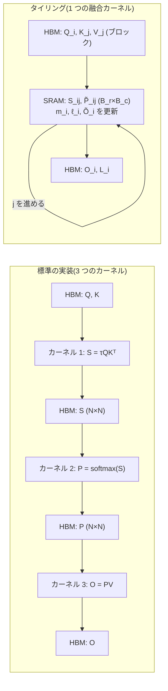
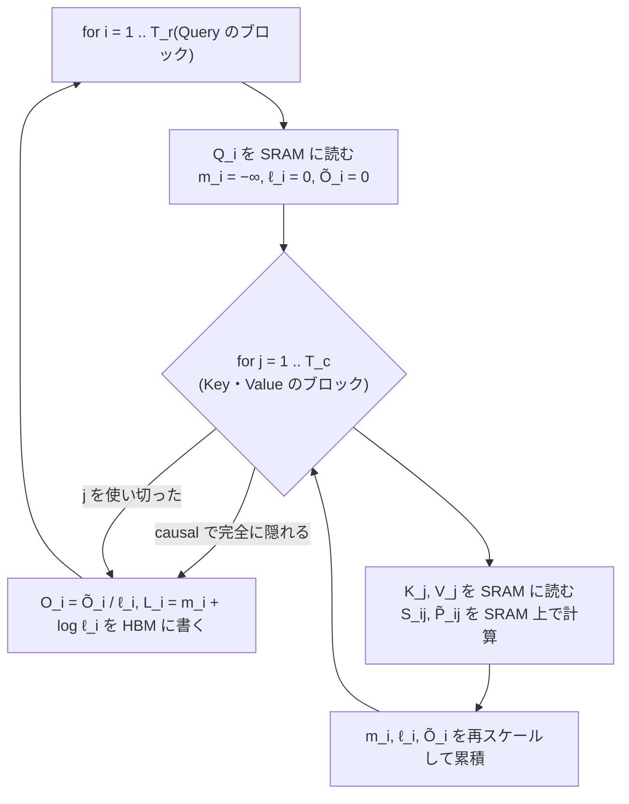

この記事は前編(理論編)です。続きは [こちら](https://zenn.dev/kojikojiprg/books/ai-theories-roadmap/viewer/014_flash_attention-practice-1)。

# 014. Flash Attention

## 1. 概要 / Overview

標準の Attention は、系列長 $N$ に対して $N \times N$ のスコア行列と softmax の出力を GPU の主記憶に書き出すため、
メモリ量が系列長の 2 乗で増え、softmax の周りの計算はメモリ帯域律速になる。Flash Attention(Dao et al., 2022)は、
Query・Key・Value を小さなブロックに分けてオンチップの高速なメモリの上で処理し(タイリング、Tiling)、
softmax の正規化を online softmax の統計量で逐次補正することで、近似なしに同じ出力を
$N \times N$ の中間行列を実体化せずに計算する。本トピックでは順伝播と、softmax の出力を保存せず再計算する逆伝播を
スクラッチ実装し、数値的な一致(実験 A・B)、メモリ量の系列長に対する次数(実験 C・D)、
PyTorch の memory-efficient バックエンドによる速度の系列長依存性(実験 E)を検証する。

## 2. 参考論文 / References

1. Dao, T., Fu, D. Y., Ermon, S., Rudra, A., Ré, C., "FlashAttention: Fast and Memory-Efficient Exact Attention
   with IO-Awareness", NeurIPS 2022. https://arxiv.org/abs/2205.14135
   (本トピックの原典。タイリングによる順伝播(Algorithm 1)、再計算による逆伝播(Algorithm 4、Appendix B)、
   読み書き量の計算量(定理 2)。3.2〜3.7 節)
2. Dao, T., "FlashAttention-2: Faster Attention with Better Parallelism and Work Partitioning", ICLR 2024.
   https://arxiv.org/abs/2307.08691
   (ループの順序の入れ替え、正規化の後回し、logsumexp のみの保存、系列方向の並列化。本ノートブックの実装の
   ループの順序はこれに従う。3.5 節・3.8 節)
3. Shah, J., Bikshandi, G., Zhang, Y., Thakkar, V., Ramani, P., Dao, T., "FlashAttention-3: Fast and Accurate
   Attention with Asynchrony and Low-precision", NeurIPS 2024. https://arxiv.org/abs/2407.08608
   (位置づけのみ、3.8 節)
4. Milakov, M., Gimelshein, N., "Online normalizer calculation for softmax", arXiv 2018.
   https://arxiv.org/abs/1805.02867
   (online softmax、3.4 節)
5. Rabe, M. N., Staats, C., "Self-attention Does Not Need $O(n^2)$ Memory", arXiv 2021.
   https://arxiv.org/abs/2112.05682
   (チャンクに分けた Attention の計算。PyTorch の memory-efficient バックエンドの系譜、3.8 節)
6. Vaswani, A., Shazeer, N., Parmar, N., Uszkoreit, J., Jones, L., Gomez, A. N., Kaiser, Ł., Polosukhin, I.,
   "Attention Is All You Need", NeurIPS 2017. https://arxiv.org/abs/1706.03762
   ([001](https://zenn.dev/kojikojiprg/books/ai-theories-roadmap/viewer/001_attention_mechanism-theory) と同じ。Scaled Dot-Product Attention の定義、3.1 節)
7. Lefaudeux, B., Massa, F., Liskovich, D., Xiong, W., Caggiano, V., Naren, S., Xu, M., Hu, J., Tintore, M.,
   Zhang, S., Labatut, P., Haziza, D., Wehrstedt, L., Reizenstein, J., Sizov, G., "xFormers: A modular and
   hackable Transformer modelling library", 2022. https://github.com/facebookresearch/xformers
   (memory-efficient Attention の実装。PyTorch の memory-efficient バックエンドの由来、3.8 節)
8. Williams, S., Waterman, A., Patterson, D., "Roofline: An Insightful Visual Performance Model for Multicore
   Architectures", Communications of the ACM, 52(4), 2009. https://doi.org/10.1145/1498765.1498785
   ([010](https://zenn.dev/kojikojiprg/books/ai-theories-roadmap/viewer/010_kv_cache_and_inference_compute-theory) と同じ。roofline モデル、3.3 節)

## 3. 理論 / Theory

### 3.0 記号

本ノートブックでは原論文 [1] の記号に従う。

- $N$: 系列長(Query と Key の系列長が等しい自己注意を考える)。[010](https://zenn.dev/kojikojiprg/books/ai-theories-roadmap/viewer/010_kv_cache_and_inference_compute-theory)
  などの既存トピックでは系列長を $T$ と書いてきたが、本ノートブックの $N$ は同じ量である
  ([009](https://zenn.dev/kojikojiprg/books/ai-theories-roadmap/viewer/009_scaling_laws-theory) のパラメータ数 $N$ とは別の量である)。
- $d$: 1 ヘッドあたりの次元。[001](https://zenn.dev/kojikojiprg/books/ai-theories-roadmap/viewer/001_attention_mechanism-theory) の $d_k$($= d_v$)にあたる。
- $Q, K, V \in \mathbb{R}^{N \times d}$: 1 つのヘッドの Query・Key・Value。バッチとヘッドの次元は互いに独立に
  同じ計算を繰り返すだけなので、理論では 1 ヘッド分を考える。
- $S = \tau Q K^\top \in \mathbb{R}^{N \times N}$: スコア行列。$\tau = 1 / \sqrt{d}$ はスケーリング係数(001 と同じ)。
- $P = \mathrm{softmax}(S) \in \mathbb{R}^{N \times N}$: 行ごとの softmax。$O = P V \in \mathbb{R}^{N \times d}$: 出力。
- $M$: オンチップの高速なメモリ(3.2 節の SRAM)に置ける要素数。
- $B_r$・$B_c$: Query のブロックの行数と、Key・Value のブロックの行数。$T_r = \lceil N / B_r \rceil$・
  $T_c = \lceil N / B_c \rceil$ はそれぞれのブロックの数。
- $m$・$\ell$: online softmax の統計量(行ごとの最大値と正規化定数、3.4 節)。
- $L$: 行ごとの logsumexp。$D$: 逆伝播で使う行ごとの内積(3.6 節)。

### 3.1 標準の Attention とその問題

Scaled Dot-Product Attention [6] は

$$
S = \tau Q K^\top, \qquad P = \mathrm{softmax}(S), \qquad O = P V
$$

である。softmax は行ごとに取り、行 $i$ について $P_{ij} = e^{S_{ij}} / \sum_{k} e^{S_{ik}}$ である。

標準の実装(原論文 [1] の Algorithm 0、001 の`scaled_dot_product_attention()`も同じ手順)は、次の 3 段階で
計算し、段階ごとに中間結果を GPU の主記憶に書き出す。

1. $Q, K$ を読み、$S = \tau Q K^\top$ を計算して $S$ を書き出す。
2. $S$ を読み、$P = \mathrm{softmax}(S)$ を計算して $P$ を書き出す。
3. $P, V$ を読み、$O = P V$ を計算して $O$ を書き出す。

中間の $S$ と $P$ はいずれも $N \times N$ である。したがって

- **メモリ量**: 中間行列のために $\Theta(N^2)$ の領域が要る(入力・出力の $\Theta(Nd)$ に加えて)。
  逆伝播のために $P$ を保存する場合も $\Theta(N^2)$ である。
- **主記憶の読み書き量**: 段階 1 で $2Nd$ を読んで $N^2$ を書き、段階 2 で $N^2$ を読んで $N^2$ を書き、段階 3 で
  $N^2 + Nd$ を読んで $Nd$ を書く。合計は $4Nd + 4N^2$ 要素、すなわち $\Theta(Nd + N^2)$ である。

$d$ は 64〜128 程度で固定され、$N$ は数千以上に伸ばしたい量なので、$N \gg d$ では $N^2$ の項が支配的になる。

### 3.2 GPU のメモリの階層

GPU のメモリは、大きさと速さの異なる階層からなる [1]。

- **HBM(High Bandwidth Memory、広帯域メモリ)**: GPU チップの外にある主記憶。容量は大きい(数十 GB)が、
  演算器から見た帯域は相対的に低い。原論文は A100 の値として容量 40〜80 GB・帯域 1.5〜2.0 TB/s を挙げる。
- **SRAM(Static Random Access Memory)**: 各ストリーミングマルチプロセッサ(Streaming Multiprocessor、演算器の
  まとまり)の中にあるオンチップのメモリ(共有メモリ・L1 キャッシュ)。容量は 1 つのストリーミング
  マルチプロセッサあたり数百 KB 以下と小さいが、帯域は HBM より 1 桁ほど高い(原論文は A100 で合計 19 TB/s 程度とする)。

以降、原論文に従い、GPU の主記憶(オフチップの DRAM)を HBM、オンチップのメモリを SRAM と呼ぶ。
Google Colab の T4 の主記憶は実際には GDDR6(容量 16 GB・公称帯域 320 GB/s)であり HBM ではないが、
階層の上での位置(大容量・低帯域のオフチップのメモリ)は同じなので、本ノートブックでは同じ名前で呼ぶ。

GPU のカーネル(1 回の演算の呼び出し)は、入力を HBM から読んで SRAM やレジスタに載せて計算し、結果を HBM に
書き戻す。3.1 節の標準の実装は 3 つ(以上)の別々のカーネルからなるので、$S$ と $P$ はカーネルの境界で必ず HBM を
経由する。Flash Attention の要点は、**3 つの段階を 1 つのカーネルに融合し、$S$ と $P$ を SRAM の中だけで
ブロックごとに作っては捨てる** ことである。そのためには、softmax の正規化(行全体の和)を、行の一部しか見えていない
状態で計算する方法が要る(3.4 節)。



### 3.3 メモリ帯域律速であること(演算強度と roofline モデル)

[010](https://zenn.dev/kojikojiprg/books/ai-theories-roadmap/viewer/010_kv_cache_and_inference_compute-theory) で導入した演算強度(arithmetic intensity、読み書きする 1 バイト
あたりの浮動小数点演算回数)と roofline モデル [8] で、標準の実装の各段階を評価する。要素あたりのバイト数を $s$
とする(FP16 で $s = 2$)。

**段階 2(softmax)**: 1 要素あたり最大値の比較・減算・指数関数・和・除算の 5 回程度の演算に対し、$S$ の読み出しと
$P$ の書き出しで $2s$ バイトを移動するので、

$$
\mathrm{AI}_{\mathrm{softmax}} \approx \frac{5 N^2}{2 s N^2} = \frac{5}{2s}
$$

であり、FP16 では約 1.25 FLOP/byte である。T4 の公称値(FP16 の Tensor Core で 65 TFLOPS、帯域 320 GB/s)から
ridge point は $\mathrm{AI}_{\mathrm{ridge}} = 65 \times 10^{12} / (320 \times 10^9) \approx 203$ FLOP/byte なので、
softmax はこれを 2 桁下回り、明確にメモリ帯域律速である。

**段階 1($S = \tau Q K^\top$)**: 演算は $2N^2 d$、移動量は $s(2Nd + N^2)$ バイトなので、$N \gg d$ では

$$
\mathrm{AI}_{QK^\top} \approx \frac{2 N^2 d}{s N^2} = \frac{2d}{s}
$$

となる。$d = 64$ の FP16 では約 64 FLOP/byte で、行列積でありながら T4 の ridge point を下回る。演算量は $d$ に
比例するのに、$S$ の書き出しは $d$ によらず $N^2$ であるためである。

どちらも、律速しているのは $N \times N$ の中間行列の HBM への書き出しと読み戻しである。演算量(FLOPs)を減らす
近似(疎な Attention や低ランク近似)ではなく、**演算量は変えずに HBM の読み書き量を減らす** のが Flash Attention の
方針であり、原論文はこれを IO を意識した(IO-aware)アルゴリズムと呼ぶ [1]。

### 3.4 online softmax

長さ $N$ のベクトル $x$ の softmax を数値的に安全に計算するには、最大値 $m = \max_k x_k$ を引いて

$$
\mathrm{softmax}(x)_i = \frac{e^{x_i - m}}{\ell}, \qquad \ell = \sum_{k=1}^{N} e^{x_k - m}
$$

とする。$x_k - m \le 0$ なので指数関数の値は $(0, 1]$ に収まり、オーバーフローしない。最大値を引かない素朴な計算
$e^{x_i} / \sum_k e^{x_k}$ は、FP32 では $x_i > 88.7$ 程度で $e^{x_i}$ が無限大になる(FP16 では $x_i > 11.1$ 程度)。
最大値を引く計算は、最大値を求めるパス・$\ell$ を求めるパス・正規化するパスの 3 回、$x$ を読む。

Milakov & Gimelshein [4] は、最大値と正規化定数を 1 パスで同時に求める **online softmax** を示した。
$x$ の先頭 $j$ 要素までの最大値を $m_j$、正規化定数を $\ell_j$ として

$$
m_j = \max(m_{j-1}, x_j), \qquad \ell_j = \ell_{j-1}\, e^{m_{j-1} - m_j} + e^{x_j - m_j}, \qquad m_0 = -\infty,\ \ell_0 = 0
$$

と更新する。

**正しさ(帰納法)**: 不変条件 $\ell_j = \sum_{k \le j} e^{x_k - m_j}$ を示す。$j = 1$ では $\ell_1 = e^{x_1 - m_1}$ で
成り立つ($e^{m_0 - m_1} = e^{-\infty} = 0$)。$j - 1$ で成り立つとすると

$$
\ell_{j-1}\, e^{m_{j-1} - m_j} = \sum_{k \le j-1} e^{x_k - m_{j-1}} e^{m_{j-1} - m_j} = \sum_{k \le j-1} e^{x_k - m_j}
$$

なので、$e^{x_j - m_j}$ を足して $\ell_j = \sum_{k \le j} e^{x_k - m_j}$ となる。$j = N$ で $m_N = m$、$\ell_N = \ell$ である。

**数値的な安定性**: 更新式に現れる指数は $m_{j-1} - m_j \le 0$ と $x_j - m_j \le 0$ だけなので、指数関数の値は常に
$(0, 1]$ に収まる。$\ell_j$ は項 $e^{x_{k^*} - m_j} = 1$($k^*$ はそれまでの最大値を取る位置)を含むので $\ell_j \ge 1$
であり、最後の除算で 0 による除算も起きない。最大値を引く標準の計算と同じ安定性が 1 パスで得られる。

**ブロック単位への一般化**: 要素を 1 つずつではなくブロックごとに処理してもよい。$x$ を 2 つの部分 $x^{(1)}, x^{(2)}$
に分け、それぞれの統計量を $(m^{(1)}, \ell^{(1)})$・$(m^{(2)}, \ell^{(2)})$ とすると、全体の統計量は

$$
m = \max(m^{(1)}, m^{(2)}), \qquad \ell = e^{m^{(1)} - m} \ell^{(1)} + e^{m^{(2)} - m} \ell^{(2)}
$$

で合成できる(上の帰納法と同じ計算)。

**出力への拡張**: Attention では softmax の値そのものではなく、それを重みとした $V$ の行の重み付き和が要る。
正規化前の出力 $\tilde{o}_j = \sum_{k \le j} e^{x_k - m_j} v_k$ も同じ係数で補正できる:
$\tilde{o}_j = e^{m_{j-1} - m_j} \tilde{o}_{j-1} + e^{x_j - m_j} v_j$。最後に $o = \tilde{o}_N / \ell_N$ とすれば、
$o = \sum_k \mathrm{softmax}(x)_k v_k$ が近似なしに得られる。これが Flash Attention の順伝播の核である。

### 3.5 タイリングによる順伝播

$Q$ を $B_r$ 行ずつの $T_r$ 個のブロック $Q_1, \dots, Q_{T_r}$ に、$K, V$ を $B_c$ 行ずつの $T_c$ 個のブロック
$K_1, \dots, K_{T_c}$・$V_1, \dots, V_{T_c}$ に分ける($N$ がブロックの行数で割り切れない場合、最後のブロックは短くなる)。
Query のブロック $i$ ごとに、行ごとの最大値 $m_i \in \mathbb{R}^{B_r}$・正規化定数 $\ell_i \in \mathbb{R}^{B_r}$・
正規化前の出力 $\tilde{O}_i \in \mathbb{R}^{B_r \times d}$ を SRAM に持ち、Key・Value のブロックを 1 つずつ読むたびに
3.4 節の更新をブロックで行う。

$$
S_{ij} = \tau Q_i K_j^\top, \qquad
m_i^{\mathrm{new}} = \max\!\left(m_i,\ \mathrm{rowmax}(S_{ij})\right), \qquad
\tilde{P}_{ij} = \exp\!\left(S_{ij} - m_i^{\mathrm{new}}\right)
$$

$$
\ell_i \leftarrow e^{m_i - m_i^{\mathrm{new}}} \ell_i + \mathrm{rowsum}(\tilde{P}_{ij}), \qquad
\tilde{O}_i \leftarrow \mathrm{diag}\!\left(e^{m_i - m_i^{\mathrm{new}}}\right) \tilde{O}_i + \tilde{P}_{ij} V_j, \qquad
m_i \leftarrow m_i^{\mathrm{new}}
$$

ここで $\mathrm{rowmax}$・$\mathrm{rowsum}$ は行ごとの最大値・和、$\exp$ は要素ごとの指数関数、$\mathrm{diag}(\cdot)$ は
ベクトルを対角成分に持つ対角行列、$m_i^{\mathrm{new}}$ を引く操作は行ごとの減算である。全ての $j$ を処理したら
$O_i = \mathrm{diag}(\ell_i)^{-1} \tilde{O}_i$ と、逆伝播で使う行ごとの logsumexp $L_i = m_i + \log \ell_i$ を HBM に書く。

**擬似コード** (本ノートブックの実装`flash_attention_forward()`の手順):

```
入力: Q, K, V (HBM 上, N x d), ブロックの行数 B_r, B_c, スケーリング係数 tau
出力: O (N x d), L (N)
for i = 1 .. T_r:                              # Query のブロック(外側のループ)
    Q_i を HBM から SRAM に読む
    m_i = -inf, l_i = 0, O~_i = 0              # SRAM 上
    for j = 1 .. T_c:                          # Key・Value のブロック(内側のループ)
        if causal かつ ブロック (i, j) が完全に隠れる: break
        K_j, V_j を HBM から SRAM に読む
        S_ij = tau * Q_i K_j^T                 # B_r x B_c(SRAM 上に閉じる)
        if causal: 対角をまたぐブロックでは j > i の位置を -inf にする
        m_new = max(m_i, rowmax(S_ij))
        P~_ij = exp(S_ij - m_new)
        l_i  = exp(m_i - m_new) * l_i + rowsum(P~_ij)
        O~_i = diag(exp(m_i - m_new)) O~_i + P~_ij V_j
        m_i  = m_new
    O_i = diag(l_i)^-1 O~_i,  L_i = m_i + log(l_i) を HBM に書く
```

原論文の Algorithm 1 はループの順序が逆(Key・Value のブロックが外側)で、内側のループのたびに $O_i$・$\ell_i$・$m_i$ を
HBM に読み書きし、毎回正規化した $O_i$ を書き戻す。上の擬似コードは FlashAttention-2 [2] の順序で、$Q_i$ と
$\tilde{O}_i$ を SRAM に置いたまま内側のループを回し、正規化を最後に 1 回だけ行う。どちらの順序でも出力は同じで、
読み書き量の次数も同じである(3.7 節)。

**因果マスクによるブロックの省略**: 因果マスクでは Query の位置 $p$ は Key の位置 $q \le p$ のみを参照する。
Query のブロック $i$ が位置 $[i_0, i_1)$、Key のブロック $j$ が位置 $[j_0, j_1)$ を占めるとき、

- $j_0 > i_1 - 1$(ブロック内の最小の Key の位置が最大の Query の位置より後ろ)なら、ブロック全体が隠れるので
  計算を飛ばせる。上の擬似コードでは $j_0 \ge i_1$ になった時点で内側のループを打ち切る。
- $j_1 - 1 \le i_0$ なら、ブロック全体が参照される(マスク不要)。
- それ以外(対角をまたぐブロック)だけ、要素ごとのマスクを適用する。

$B_r = B_c$ で $N$ がブロックの行数で割り切れるとき、計算するブロックの組は $T_r (T_r + 1) / 2$ 個で、全体の
$T_r^2$ 個の約半分である。各行の最初に処理するブロック($j_0 = 0$)には必ず $q = 0 \le p$ が含まれるので、
$m_i^{\mathrm{new}}$ は最初のブロックで有限になり、$e^{-\infty - m_i^{\mathrm{new}}} = 0$ で初期値が正しく消える。



### 3.6 逆伝播での再計算(recomputation)

損失を $\phi$ とし、$dX = \partial \phi / \partial X$ と書く。$O = PV$、$P = \mathrm{softmax}(S)$、$S = \tau Q K^\top$ から

$$
dV = P^\top dO, \qquad dP = dO\, V^\top
$$

である。行ごとの softmax のヤコビアンは $\partial P_{ij} / \partial S_{ik} = P_{ij}(\delta_{jk} - P_{ik})$ なので

$$
dS_{ik} = \sum_j dP_{ij} P_{ij} (\delta_{jk} - P_{ik}) = P_{ik} \left(dP_{ik} - \sum_j P_{ij}\, dP_{ij}\right)
$$

となる。ここで $\delta_{jk}$ はクロネッカーのデルタである。括弧の中の和を $D_i = \sum_j P_{ij}\, dP_{ij}$ とおくと、
$dP_{ij} = dO_i \cdot v_j$($dO_i$ は $dO$ の第 $i$ 行、$v_j$ は $V$ の第 $j$ 行)なので

$$
D_i = \sum_j P_{ij}\, (dO_i \cdot v_j) = dO_i \cdot \sum_j P_{ij} v_j = dO_i \cdot O_i
$$

すなわち $D = \mathrm{rowsum}(dO \circ O)$ である($\circ$ は要素ごとの積)。$D$ は $N \times N$ の $P$ を使わず、
出力 $O$ と $dO$ だけから $\Theta(Nd)$ で求まる。これを使って

$$
dS = P \circ \left(dP - D \mathbf{1}^\top\right), \qquad dQ = \tau\, dS\, K, \qquad dK = \tau\, dS^\top Q
$$

である($\mathbf{1}$ は全要素が 1 の長さ $N$ のベクトル)。

**再計算**: 標準の実装は順伝播で $P$($N \times N$)を保存し、逆伝播でそれを読む。Flash Attention は $P$ を保存せず、
$Q, K, V, O$ と行ごとの logsumexp $L$ のみを保存する。逆伝播では、ブロック $(i, j)$ ごとに

$$
S_{ij} = \tau Q_i K_j^\top, \qquad P_{ij} = \exp\!\left(S_{ij} - L_i\right)
$$

で $P_{ij}$ を SRAM 上に再計算する。$L_i = m_i + \log \ell_i$ なので $\exp(S_{ij} - L_i) = \exp(S_{ij} - m_i) / \ell_i$ は
正規化済みの softmax の値そのものであり、最大値を引いた後の指数なので安定である。実装`flash_attention_backward()`は、
Key・Value のブロック $j$ を外側のループとし、$dK_j$・$dV_j$ を SRAM に置いたまま Query のブロック $i$ について

$$
dV_j \mathrel{+}= P_{ij}^\top dO_i, \quad dP_{ij} = dO_i V_j^\top, \quad dS_{ij} = P_{ij} \circ (dP_{ij} - D_i \mathbf{1}^\top), \quad
dQ_i \mathrel{+}= \tau\, dS_{ij} K_j, \quad dK_j \mathrel{+}= \tau\, dS_{ij}^\top Q_i
$$

を累積する($dQ_i$ は HBM 上で足し込む)。因果マスクでは、順伝播と同じ規則で完全に隠れるブロックを飛ばす。

**計算量とメモリ量の交換**: 行列積の演算量(積和を 2 演算と数える)は、順伝播が $QK^\top$ と $PV$ で $4N^2 d$、
標準の逆伝播が $dV$・$dP$・$dQ$・$dK$ の 4 つで $8N^2 d$ である。再計算は $S = \tau Q K^\top$ の $2N^2 d$ を逆伝播に追加するので、
逆伝播の演算量は $10 N^2 d$(標準の 1.25 倍)になる。その代わり、逆伝播のために保存する量は

- 標準: $Q, K, V$($3Nd$)と $P$($N^2$)。$\Theta(Nd + N^2)$
- Flash Attention: $Q, K, V, O$($4Nd$)と $L$($N$)。$\Theta(Nd)$、すなわち系列長に対して $\Theta(N)$

になる。原論文 [1] は、再計算で演算量が増えても HBM の読み書き量が減るため、逆伝播も標準の実装より速くなると報告している。

### 3.7 読み書き量の計算量(IO complexity)

原論文 [1] の定理 2 は、$d \le M \le Nd$ のとき、標準の Attention の HBM の読み書き量が $\Theta(Nd + N^2)$、
Flash Attention の読み書き量が $\Theta(N^2 d^2 M^{-1})$ であることを示す。本ノートブックの実装のループの順序
(Query のブロックが外側)で導出する。

**標準**: 3.1 節のとおり $4Nd + 4N^2 = \Theta(Nd + N^2)$。

**Flash Attention**:

- $Q_i$ は外側のループで 1 回ずつ読むので合計 $Nd$、$O_i$・$L_i$ は 1 回ずつ書くので合計 $Nd + N$。
- 内側のループでは、Query のブロック 1 つごとに全ての $K_j, V_j$ を読むので、1 つの $i$ あたり $2Nd$、全体で $2 N d\, T_r$。
- 合計は $\Theta(Nd + Nd\, T_r) = \Theta(N^2 d / B_r)$。

**ブロックの大きさの制約**: SRAM には $Q_i$($B_r d$)・$\tilde{O}_i$($B_r d$)・$K_j, V_j$($2 B_c d$)・
$S_{ij}, \tilde{P}_{ij}$($B_r B_c$ 程度)が同時に載らなければならないので、

$$
2 B_r d + 2 B_c d + B_r B_c = O(M)
$$

である。$B_r = \Theta(M / d)$、$B_c = \Theta(\min(d, M/d))$ と取ればこれを満たし($B_r B_c = O(M)$)、このとき

$$
T_r = \frac{N}{B_r} = \Theta\!\left(\frac{N d}{M}\right), \qquad
\text{accesses} = \Theta\!\left(N d \cdot \frac{N d}{M}\right) = \Theta\!\left(\frac{N^2 d^2}{M}\right)
$$

となる。原論文の順序(Key・Value が外側)では役割が入れ替わり、$K, V$ を 1 回ずつ読んで $Q, O$ を $T_c$ 回読み書きするので、
$B_c = \Theta(M/d)$ と取って同じ $\Theta(N^2 d^2 / M)$ を得る。

**比較**: 標準の $N^2$ の項に対して、Flash Attention の読み書き量は $d^2 / M$ 倍である。例えば $d = 64$ で SRAM に
FP16 で約 100 KB(約 5 万要素)を使えれば $d^2 / M \approx 0.08$ で、1 桁以上少ない。演算量はどちらも $\Theta(N^2 d)$ で
変わらない。因果マスクによるブロックの省略は、計算するブロックの組を約半分にするので、読み書き量も約半分になる
(次数は変わらない)。原論文は逆伝播についても同じ $\Theta(N^2 d^2 / M)$ を示している(定理 5)。

**メモリ量**: 出力以外に必要なのは $L$(または $m, \ell$)の $\Theta(N)$ と、SRAM 上のブロックの $O(M)$ だけであり、
$N \times N$ の中間行列は HBM に一度も現れない。

### 3.8 位置づけ

**FlashAttention-2 [2]**: 原論文の Flash Attention は A100 のピーク演算性能の 25〜40% 程度に留まっていた。
FlashAttention-2 は、(1) 正規化を内側のループの最後に 1 回だけ行うなど、行列積以外の演算(GPU の行列積専用の演算器
である Tensor Core で実行できず、相対的に遅い)を減らし、(2) バッチ・ヘッドに加えて **系列方向(Query のブロック)でも
並列化** して、系列が長くバッチが小さい場合にもストリーミングマルチプロセッサを埋め、(3) 1 つのブロック内の作業を
warp(同時に実行される 32 スレッドの単位)に分ける方法を、Key・Value を分ける方式から Query を分ける方式に変えて、
warp 間の共有メモリを介した同期と読み書きを減らした。逆伝播のために $m$ と $\ell$ の代わりに logsumexp $L$ だけを
保存するのも FlashAttention-2 の変更である。本ノートブックの実装はこのループの順序と $L$ の保存に従う。

**FlashAttention-3 [3]**: H100(Hopper アーキテクチャ)の非同期実行(データの転送と行列積を別々の warp に担わせる
warp の特化、softmax と行列積の重ね合わせ)と、FP8 の低精度演算(ブロック単位の量子化と、外れ値の影響を減らす
非干渉化の処理)を使う。アルゴリズムの骨格(タイリングと online softmax、再計算)は同じである。

**PyTorch の SDPA**: PyTorch の`torch.nn.functional.scaled_dot_product_attention`(SDPA: Scaled Dot-Product
Attention)は、同じ計算を複数のバックエンドから選んで実行する。バックエンドは`torch.nn.attention.sdpa_kernel`で
明示的に制限できる。

- **math**: 行列積・softmax などの個別の演算の組み合わせ。3.1 節の標準の実装と同じく $N \times N$ の中間行列を実体化する。
- **flash**: FlashAttention-2 のカーネル。CUDA では compute capability 8.0(Ampere アーキテクチャ)以降を要求するため、
  **T4(Turing アーキテクチャ、compute capability 7.5)では使えない** (このことは 5.5 節で実際に確かめる)。
- **memory-efficient**: xFormers [7] の`memory_efficient_attention`に由来するカーネル。Rabe & Staats [5] が示した、
  Key・Value をチャンクに分けて部分的な和と最大値を持ち回る計算(3.4 節と同じ考え方)に基づく。T4 でも使える。
- (**cuDNN**: NVIDIA の cuDNN ライブラリの Attention のカーネル。本ノートブックでは扱わない。)

Rabe & Staats [5] は、Attention のメモリ量が $O(n^2)$ である必要はなく、チャンクごとの計算とチェックポイント(逆伝播での
再計算)で $O(\sqrt{n})$ 程度に抑えられることを示した(彼らの $n$ は本ノートブックの $N$)。Flash Attention [1] は、同じ
考え方を HBM と SRAM の読み書き量の観点から設計し直し、1 つの融合カーネルとして実装したものと位置づけられる。

本ノートブックのスクラッチ実装は Python のループで書くため、1 つのブロックの計算ごとに複数のカーネルを呼び出し、
ブロックの中間結果も HBM を経由する。**したがってメモリ量の次数(実験 C・D)は Flash Attention と同じ性質を持つが、
速度は本来の性能を反映しない。** 速度の系列長依存性は、実際に融合カーネルである SDPA の memory-efficient
バックエンドで検証する(実験 E)。


## 元ノートブック(実装の全文はこちら)

https://github.com/kojikojiprg/ai-theories/blob/main/theories/03_efficient_training/014_flash_attention.ipynb
