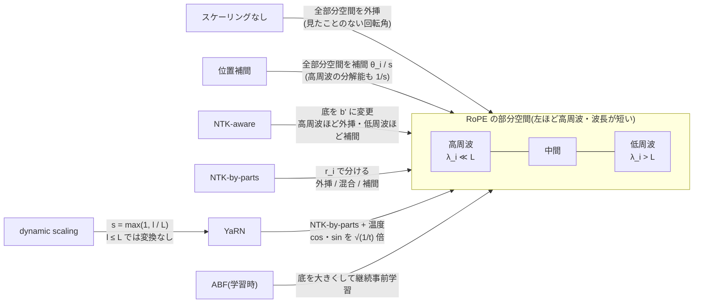

この記事は前編(理論編)です。続きは [こちら](https://zenn.dev/kojikojiprg/books/ai-theories-roadmap/viewer/015_long_context_extension-practice-1)。

# 015. 長文脈拡張 / Long Context Extension

## 1. 概要 / Overview

RoPE(Rotary Position Embedding、回転位置エンコーディング)で学習したモデルは、学習時の文脈長 $L$ を超える位置で
予測が急に悪化する。本トピックは、**RoPE で学習済みのモデルに後から手を加えて文脈長を伸ばす技術**(位置補間、
NTK-aware スケーリング、NTK-by-parts、YaRN、dynamic scaling、底の調整)を扱い、「学習長を超えると何が壊れるか、
各手法はそれをどう直すか、伸ばした文脈は実際に使われるか」を、008 で事前学習した小型 GPT で検証する。

[003](https://zenn.dev/kojikojiprg/books/ai-theories-roadmap/viewer/003_positional_encoding_rope-theory) との違い: 003 は **学習の時点から** 位置エンコーディングの
方式を変えて、学習長を超える外挿の性能を方式間で比べた。本トピックは方式を RoPE に固定し、**学習済みのモデルの RoPE の
周波数を推論時(または短い微調整)で変える** ことで文脈長を伸ばす。

## 2. 参考論文 / References

1. Su, J., Ahmed, M., Lu, Y., Pan, S., Bo, W., Liu, Y., "RoFormer: Enhanced Transformer with Rotary Position Embedding",
   Neurocomputing 568, 2024. https://arxiv.org/abs/2104.09864
   ([003](https://zenn.dev/kojikojiprg/books/ai-theories-roadmap/viewer/003_positional_encoding_rope-theory) と同じ。RoPE の定義、3.1 節)
2. Chen, S., Wong, S., Chen, L., Tian, Y., "Extending Context Window of Large Language Models via Positional
   Interpolation", arXiv 2023. https://arxiv.org/abs/2306.15595
   (位置補間。Attention のスコアの補間の上界(定理 2.1)と外挿の上界の比較、3.3 節)
3. bloc97, "NTK-Aware Scaled RoPE allows LLaMA models to have extended (8k+) context size without any fine-tuning
   and minimal perplexity degradation", Reddit(r/LocalLLaMA)への投稿, 2023.
   https://www.reddit.com/r/LocalLLaMA/comments/14lz7j5/ntkaware_scaled_rope_allows_llama_models_to_have/
   (NTK-aware スケーリングの初出。論文ではないため、式と導出は [4] の 3.1 節と Appendix A.1 の記述に従う、3.4 節)
4. Peng, B., Quesnelle, J., Fan, H., Shippole, E., "YaRN: Efficient Context Window Extension of Large Language Models",
   ICLR 2024. https://arxiv.org/abs/2309.00071(https://openreview.net/forum?id=wHBfxhZu1u)
   (NTK-aware の定式化(3.1 節)、NTK-by-parts(3.2 節)、dynamic scaling と KV キャッシュの注意(3.3 節)、
   YaRN の温度の補正(3.4 節)。本ノートブックの 3.4〜3.7 節)
5. Xiong, W., Liu, J., Molybog, I., Zhang, H., Bhargava, P., et al., "Effective Long-Context Scaling of Foundation
   Models", NAACL 2024. https://arxiv.org/abs/2309.16039(https://aclanthology.org/2024.naacl-long.260/)
   (底の調整(Adjusted Base Frequency、ABF)。底を 10,000 から 500,000 にして長い系列で継続事前学習する、3.8 節)
6. Ding, Y., Zhang, L. L., Zhang, C., Xu, Y., Shang, N., Xu, J., Yang, F., Yang, M., "LongRoPE: Extending LLM Context
   Window Beyond 2 Million Tokens", ICML 2024. https://arxiv.org/abs/2402.13753
   (https://proceedings.mlr.press/v235/ding24i.html)(次元ごとの倍率の探索。位置づけのみ、3.9 節)
7. Qwen Team, "Qwen3 Technical Report", arXiv 2025. https://arxiv.org/abs/2505.09388 、および Qwen3 のモデルカード
   (例: https://huggingface.co/Qwen/Qwen3-8B)
   (実務での使われ方: 事前学習の長文脈の段階での ABF(底を 10,000 から 1,000,000 へ)と文脈長 32,768、推論時の
   YaRN(`rope_scaling`の`factor`が 4.0)、静的な YaRN が短い入力の性能に影響しうるという注意、3.8 節)
8. Dao, T., Fu, D. Y., Ermon, S., Rudra, A., Ré, C., "FlashAttention: Fast and Memory-Efficient Exact Attention
   with IO-Awareness", NeurIPS 2022. https://arxiv.org/abs/2205.14135
   ([014](https://zenn.dev/kojikojiprg/books/ai-theories-roadmap/viewer/014_flash_attention-theory) と同じ。伸ばした文脈での Attention のメモリ、3.10 節)

## 3. 理論 / Theory

### 3.0 記号

記号は原論文 [1][4] に従う。

- $d$: 1 ヘッドあたりの次元([001](https://zenn.dev/kojikojiprg/books/ai-theories-roadmap/viewer/001_attention_mechanism-theory) の $d_k$)。YaRN の原論文 [4] の
  $|D|$ にあたる。RoPE は $d$ 次元を $d/2$ 個の 2 次元の部分空間に分けて回転させる。
- $i = 0, 1, \dots, d/2 - 1$: 部分空間の番号。
- $b$: 角周波数の底(base)。008 のモデルでは $b = 10000$。
- $\theta_i = b^{-2i/d}$: 部分空間 $i$ の角周波数(1 位置進むごとの回転角)。$\lambda_i = 2\pi / \theta_i$: 部分空間 $i$ の
  波長(1 周するのに要する位置の数)。
- $m, n$: Query と Key の位置(0 始まり)。
- $L$: 学習時の文脈長(008 のモデルでは $L = 256$)。[014](https://zenn.dev/kojikojiprg/books/ai-theories-roadmap/viewer/014_flash_attention-theory) では $L$ を logsumexp の記号に
  使ったが、本ノートブックの $L$ は文脈長である。
- $L'$: 伸ばした後の文脈長。$s = L' / L$: 拡張の倍率(scale factor)。
- $l$: 現在処理している系列の長さ(dynamic scaling で使う)。
- $\theta'_i$: 各手法で変換した後の角周波数。$b'$: 変換後の底。
- $r_i = L / \lambda_i$: 学習時の文脈長の中に部分空間 $i$ の波長が何周分入るか。$\alpha, \beta$: NTK-by-parts の境界。
  $\gamma(r)$: ランプ関数。
- $t$: Attention の温度(YaRN)。

### 3.1 RoPE の周波数と波長

RoPE [1] は、位置 $m$ の Query $q$ の部分空間 $i$ の 2 成分を角度 $m \theta_i$ だけ回転させ、Key も同様に位置 $n$ で
回転させる([003](https://zenn.dev/kojikojiprg/books/ai-theories-roadmap/viewer/003_positional_encoding_rope-theory))。部分空間 $i$ の 2 成分を複素数
$q^{(i)}, k^{(i)}$ とみなすと、内積は

$$
q_m^\top k_n = \mathrm{Re} \sum_{i=0}^{d/2-1} q^{(i)} \overline{k^{(i)}}\, e^{\mathrm{i}\,(m-n)\,\theta_i}
$$

となり($\mathrm{i}$ は虚数単位、$\overline{\cdot}$ は複素共役)、位置は相対位置 $m - n$ を通じてのみ現れる。

角周波数 $\theta_i = b^{-2i/d}$ は $i = 0$ の $1$ から $i = d/2 - 1$ の $b^{-(d-2)/d}$ まで等比で下がる。波長
$\lambda_i = 2\pi b^{2i/d}$ は $2\pi$ から約 $2\pi b$ まで伸びる。**番号の小さい部分空間は高周波(波長が短い)、
大きい部分空間は低周波(波長が長い)** である。

本トピックのモデル($d = 32$、$b = 10000$、$L = 256$)では $\lambda_i = 2\pi \cdot 10000^{i/16}$ なので、
$\lambda_i < L$ となるのは $i \le 6$ の 7 個、$\lambda_i > L$ となるのは $i \ge 7$ の 9 個である(5.6 節で表として印字する)。

### 3.2 学習長を超えると何が壊れるか

長さ $L$ の系列で学習すると、モデルが見る相対位置は $0 \le m - n \le L - 1$ に限られる。部分空間 $i$ の回転角
$(m - n)\theta_i$ は、学習中に $[0, (L-1)\theta_i]$ の範囲しか現れない。

- **高周波の部分空間**($\lambda_i \le L$): 学習中に回転角が 1 周以上回るので、$2\pi$ を法として全ての角度を見ている。
  $L$ を超える相対位置でも、個々の部分空間の回転角そのものは見たことのある値になる。
- **低周波の部分空間**($\lambda_i > L$): 回転角は $[0, 2\pi)$ の一部 $[0, 2\pi L / \lambda_i)$ にしか現れない。$L$ を超える
  相対位置では、**学習中に一度も見たことのない回転角** が現れる。Query・Key の重みはこの範囲の外での振る舞いを
  制約されていないので、Attention のスコアが学習中にはなかった値をとりうる。

位置補間の原論文 [2] は、スコアを相対位置 $s$ の関数(この段落の $s$ は倍率ではなく相対位置で、原論文の記号である)

$$
a(s) = \mathrm{Re} \sum_{j=0}^{d/2-1} h_j\, e^{\mathrm{i}\, s \theta_j}
$$

($h_j$ は Query と Key から決まる複素係数)とみなし、三角関数の和は $[0, L]$ で小さい値に収まっていても、その外では
いくらでも大きな値をとりうることを示した(外挿の上界は緩い)。このため、学習長を超える位置では Attention の重みが
学習中にはない分布になり、予測が壊れる。本ノートブックでは、スケーリングなしのモデルの位置ごとの bits-per-byte が
$L$ を境に悪化することを実験 A の診断量として観察する。

さらに、学習中には存在しなかった **Attention の対象の数** も変わる。位置 $m$ の Query は $m + 1$ 個の Key に注意を
向けるので、$m$ が大きいほど softmax の分布は平らになりやすい(エントロピーが増える)。これは回転角とは別の、
長さそのものに由来する変化である(3.6 節の温度の補正の動機)。

### 3.3 位置補間(Position Interpolation)

位置補間 [2] は、位置 $m$ を $m / s$ に縮めてから RoPE を適用する。

$$
f'(x, m) = f\!\left(x, \frac{m L}{L'}\right) = f\!\left(x, \frac{m}{s}\right)
$$

($f(x, m)$ は位置 $m$ のベクトル $x$ に RoPE を適用する関数)。回転角 $(m/s)\theta_i = m(\theta_i / s)$ なので、
**全ての部分空間の角周波数を一様に $\theta'_i = \theta_i / s$ にする** ことと同じである。長さ $L' = sL$ の系列でも回転角は
学習中の範囲 $[0, (L-1)\theta_i]$ に収まり、見たことのない回転角は現れない。

原論文 [2] の定理 2.1 は、隣接する整数の位置 $s_1, s_2$ の間の非整数の位置 $s$ での補間の誤差が

$$
\left| a(s) - a_{\mathrm{linear}}(s) \right| \le d \max_j |h_j| \frac{(s - s_1)(s_2 - s)}{8 \ln b}
$$

で抑えられることを示す($a_{\mathrm{linear}}$ は 2 点の値の線形補間。原論文は底を $c$ と書く)。$b = 10000$ では右辺は
$d \max_j |h_j| / 294.73$ 程度であり、外挿の上界より少なくとも約 600 倍小さい。補間は学習済みの 2 点の間を滑らかに
つなぐだけなので安定する、というのが位置補間の論拠である。

**欠点**: 高周波の部分空間も $1/s$ 倍に遅くなる。隣り合う 2 つの位置の回転角の差が $\theta_i$ から $\theta_i / s$ に縮むので、
**近い位置どうしを区別する分解能が $1/s$ になる**([4] の 3.1 節)。高周波の部分空間は 3.2 節のとおり外挿しても
見たことのある回転角しか生まないので、そもそも補間する必要がなかった。また、系列が $L$ 以内でも常に縮めるので、
短い入力の性能も変わる(3.7 節)。原論文は、補間したモデルを長い系列で短く微調整(1000 ステップ以内)して使う。

### 3.4 NTK-aware スケーリング

NTK-aware スケーリング [3] は、全部分空間を一様に縮める代わりに底を変える。[4] の 3.1 節の定式化では

$$
\theta'_i = b'^{-2i/d}, \qquad b' = b \cdot s^{d/(d-2)}
$$

である。底をこう選ぶと、

- 最も高周波の部分空間($i = 0$): $\theta'_0 = 1 = \theta_0$ で **変わらない**(外挿)。
- 最も低周波の部分空間($i = d/2 - 1$): $b'^{-(d-2)/d} = b^{-(d-2)/d} s^{-1}$ なので $\theta'_{d/2-1} = \theta_{d/2-1} / s$ で、
  **位置補間と同じだけ補間される**。

となる([4] の Appendix A.1。$b'^{(d-2)/d} = s\, b^{(d-2)/d}$ を $b'$ について解く)。一般の $i$ では
$\theta'_i / \theta_i = s^{-2i/(d-2)}$ で、高周波から低周波へ連続的に補間の度合いが強まる。名前は、入力の高周波成分が
学習されにくいという Neural Tangent Kernel の議論から付けられた。

微調整なしで位置補間より良いことが報告されている [3][4]。一方、中間の部分空間では $\lambda'_i > L$ となっても
$s$ 倍には伸びきらず、$L'$ 近くの相対位置で学習中の範囲を少し超える回転角が残る([4] は「一部の次元がわずかに
範囲外に外挿される」と述べ、そのため微調整後は位置補間に劣るとしている)。

### 3.5 NTK-by-parts

NTK-by-parts [4](3.2 節)は、3.2 節の観察をそのまま規則にする。部分空間 $i$ について、学習時の文脈長の中に波長が
何周入るかを

$$
r_i = \frac{L}{\lambda_i}
$$

とし、ランプ関数

$$
\gamma(r) =
\begin{cases}
0, & r < \alpha \\
1, & r > \beta \\
\dfrac{r - \alpha}{\beta - \alpha}, & \text{otherwise}
\end{cases}
$$

で補間と外挿を混ぜる。

$$
\theta'_i = \left(1 - \gamma(r_i)\right) \frac{\theta_i}{s} + \gamma(r_i)\, \theta_i
$$

- $r_i < \alpha$(波長が長い、低周波): $\gamma = 0$ で $\theta_i / s$。位置補間と同じく **補間** する。
- $r_i > \beta$(波長が十分短い、高周波): $\gamma = 1$ で $\theta_i$ のまま。**外挿** する(分解能を保つ)。
- その間: 両者を線形に **混合** する。

原論文は Llama 系のモデルについて $\alpha = 1$、$\beta = 32$ を推奨している。$r_i$ は $L$ に比例するので、
**同じ $\alpha, \beta$ でも $L$ が小さいモデルでは外挿される部分空間が少なくなる。** Llama 2($L = 4096$、$d = 128$)では
$r_i > 32$ の部分空間が 21 個あるが、本トピックのモデル($L = 256$、$d = 32$)では $r_0 \approx 40.7$ の $i = 0$ だけが
$\beta$ を超え、$i = 1, \dots, 6$ が混合、$i \ge 7$ が補間になる(5.6 節の表)。**このモデルでの NTK-by-parts・YaRN は、
位置補間との違いが高周波の数個の部分空間に限られる。** これは実験の前に config から決まる性質であり、実験 A・B の
差が小さくなりうることを意味する。

### 3.6 YaRN: 温度の補正

YaRN [4](3.4 節)は、NTK-by-parts に Attention の温度 $t$ を加えたものである。

$$
\mathrm{softmax}\!\left(\frac{q_m^\top k_n}{t \sqrt{d}}\right), \qquad \sqrt{\frac{1}{t}} = 0.1 \ln s + 1
$$

温度の式は、原論文が LLaMA の各サイズで、微調整なしの NTK-by-parts のモデルの perplexity を最小にする $1/\sqrt{t}$ を
倍率 $s$ ごとに探し、あてはめたものである($s = 4$ では $\sqrt{1/t} \approx 1.139$、$1/t \approx 1.296$)。系列が長いほど
softmax の対象が増えて分布が平らになる(3.2 節の最後)のを、logits を $1/t > 1$ 倍して鋭くすることで打ち消すと
解釈できる。

**実装**: RoPE の cos・sin に $\sqrt{1/t}$ を掛けると、Query と Key の両方が $\sqrt{1/t}$ 倍になり、内積は $1/t$ 倍になる。
Attention の実装を変えずに温度を入れられる([4] はこれを "length scaling" の技法と呼ぶ)。本ノートブックの実装も
この方法をとる(4 節)。

本ノートブックでは $\alpha = 1$、$\beta = 32$、温度の式を **原論文の値に固定し、評価集合で調整しない**(理由は 6.1 節)。

### 3.7 dynamic scaling と静的なスケーリングのコスト

ここまでの手法は、伸ばしたい長さ $L'$ から決めた倍率 $s = L'/L$ を、入力の長さによらず常に使う(**静的な** スケーリング)。
すると、$L$ 以内の短い入力でも周波数が変わっており、学習時と異なる回転角・温度で計算することになる。
これが静的なスケーリングのコストである(実験 D)。

Dynamic scaling [4](3.3 節)は、順伝播のたびに現在の系列長 $l$ から

$$
s = \max\!\left(1, \frac{l}{L}\right)
$$

を決める。$l \le L$ では $s = 1$ で、スケーリングなしと完全に同じ計算になる(5.6 節でアサーションにより確かめる)。
$l$ が伸びるにつれて徐々に補間を強める。

**KV キャッシュとの相互作用**: [010](https://zenn.dev/kojikojiprg/books/ai-theories-roadmap/viewer/010_kv_cache_and_inference_compute-theory) の KV キャッシュは、RoPE で回転させた
**後の** Key を保存する。dynamic scaling では生成が進んで $l$ が伸びるたびに $s$ が変わり、全ての位置の回転角が
変わるべきだが、キャッシュ済みの Key は古い $s$ で回転したまま残る。原論文 [4] は、RoPE を適用する **前の** Key を
キャッシュし、使うたびに回転させるべきだと指摘している。本ノートブックの評価は KV キャッシュを使わず、毎回系列の
全体を順伝播するので、この問題は生じない。

### 3.8 底の調整(ABF)と現在の実務

**底の調整(Adjusted Base Frequency、ABF)** [5] は、底 $b$ を大きくしてから長い系列で継続事前学習する。Xiong ら [5] は
Llama 2 の底を 10,000 から 500,000 に上げ、長い系列で継続事前学習した。式の形は NTK-aware(3.4 節)と同じく
「底を大きくして低周波ほど強く補間する」ことであり、**NTK-aware が推論時の変換であるのに対し、ABF は学習時に使う
変換** と位置づけられる。学習で新しい回転角に適応させるので、底の値は $b s^{d/(d-2)}$ に厳密に従う必要はない。

**現在の実務**(Qwen3 [7] の例): 事前学習の長文脈の段階で ABF により底を 10,000 から 1,000,000 に上げ、系列長 32,768 で
学習する。推論ではそれを超える長さのために YaRN(と Dual Chunk Attention)を使い、4 倍の 131,072 トークンまで伸ばす。
公開されているモデルカードは、YaRN を有効にする設定として`rope_scaling`に`"rope_type": "yarn"`・`"factor": 4.0`・
`"original_max_position_embeddings": 32768`を示し、よく使われる実装が静的な YaRN であることから、倍率が入力の長さによらず
一定であり **短いテキストの性能に影響しうる** と注意している。そのため、長い入力を扱うときだけ有効にし、倍率も
典型的な長さに合わせる(例えば 65,536 トークンなら 2.0)ことを勧めている。つまり、**事前学習での大きな底(ABF)と、
推論時の YaRN の組み合わせ** が標準的な構成であり、YaRN の静的なコストは実験 D が扱う問題そのものである。

### 3.9 LongRoPE(位置づけのみ)

LongRoPE [6] は、部分空間ごとの補間の倍率を規則(ランプ関数など)で決めるのではなく、**探索** で決める。部分空間ごと・
先頭のトークンを補間しない範囲などを探索の対象とし、評価の perplexity を目的関数とする進化的な探索で倍率を選ぶ。
さらに、256k トークンで微調整した後にもう一度補間して 2048k トークンまで伸ばす段階的な拡張と、短い文脈での性能を
回復させるための再調整を組み合わせる。NTK-by-parts・YaRN が「波長と $L$ の比」という 1 つの量で部分空間を分けるのに
対し、LongRoPE はその非一様性をデータから決める一般化と位置づけられる。本ノートブックでは実装しない。

### 3.10 014 との関係: 伸ばした文脈のメモリ

周波数を変えても計算量は変わらないが、文脈長を $s$ 倍にすると、標準の Attention のスコア行列と softmax の出力は
$N \times N$($N$ は系列長)なので、[014](https://zenn.dev/kojikojiprg/books/ai-theories-roadmap/viewer/014_flash_attention-theory) の閉形式どおり順伝播のメモリは
$2 \cdot B H N^2 \cdot 4$ バイト(FP32 の $S$ と $P$、$B$ はバッチサイズ、$H$ はヘッド数)で **$s^2$ 倍** になる。本ノートブックの
最大の評価長 $8L = 2048$ では、1 系列・8 ヘッドあたり 1 層で 256 MiB である。本ノートブックの評価・微調整は
001 の標準の Attention で行うので、このメモリの見積もりからバッチサイズを決める(5.4 節)。実務で長い文脈を扱う
ときは、014 の Flash Attention のような $N \times N$ の行列を実体化しない実装と組み合わせる。

### 3.11 各手法が部分空間ごとの周波数をどう変えるか

各手法の $\theta'_i / \theta_i$(部分空間 $i$ の角周波数の倍率)をまとめる。1 は外挿(変えない)、$1/s$ は補間、
その間は混合である。

| 手法 | 高周波($r_i > \beta$) | 中間 | 低周波($r_i < \alpha$) | cos・sin の倍率 | 使う場面 |
|---|---|---|---|---|---|
| スケーリングなし | 1 | 1 | 1 | 1 | — |
| 位置補間 | $1/s$ | $1/s$ | $1/s$ | 1 | 推論時(+ 微調整) |
| NTK-aware | $\approx 1$ | $s^{-2i/(d-2)}$ | $\to 1/s$ | 1 | 推論時 |
| NTK-by-parts | 1 | $(1-\gamma)/s + \gamma$ | $1/s$ | 1 | 推論時(+ 微調整) |
| YaRN | 1 | $(1-\gamma)/s + \gamma$ | $1/s$ | $0.1 \ln s + 1$ | 推論時(+ 微調整) |
| dynamic(YaRN など) | 上の手法を $s = \max(1, l/L)$ で | | | | 推論時 |
| ABF | 底を $b'$ にする(NTK-aware と同じ形) | | | 1 | 継続事前学習 |

## 元ノートブック(実装の全文はこちら)

https://github.com/kojikojiprg/ai-theories/blob/main/theories/03_efficient_training/015_long_context_extension.ipynb
