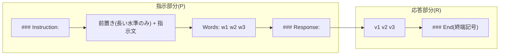
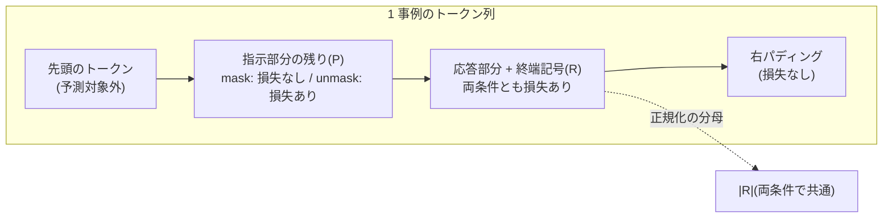

この記事は前編(理論編)です。続きは [こちら](https://zenn.dev/kojikojiprg/books/ai-theories-roadmap/viewer/016_supervised_fine_tuning-practice-1)。

# 016. SFT(指示チューニング) / Supervised Fine-Tuning (Instruction Tuning)

## 1. 概要 / Overview

SFT(Supervised Fine-Tuning、教師あり微調整)による指示チューニング(Instruction Tuning)は、
「指示 → 応答」の組からなる指示データで事前学習済みの言語モデルを微調整し、指示に従って応答を
書き分けるようにする手法である。本トピックでは、008 の小型 GPT に Query・Value 射影への LoRA
(Low-Rank Adaptation、[012](https://zenn.dev/kojikojiprg/books/ai-theories-roadmap/viewer/012_low_rank_adaptation-theory))を適用し、
入力と課題から応答が決定的に決まる **合成の指示データ** で SFT を行う。そのうえで、
(A)微調整後のモデルが指示を読んで出力を切り替えているか、(B)指示部分に損失をかけない
損失マスク(Loss Masking)の効果が指示の長さによってどう変わるか、(C)応答の形式と課題そのものの
どちらが少ないデータで習得されるかを検証する。

### 1.1 実行の手順

本番実行は Google Colab T4 の **1 つのセッションで完結** させる。5.1 節のセットアップセルで`SMOKE_TEST = False`にして、
「すべてのセルを実行」する。

実行時間の予算は 1 セッションあたり **T4 で 120 分** とする。本番の学習を始める前に(6.4 節)、スケーリングの計測
(6.3 節)から 1 セッション全体の実行時間を **削る段階**(6.1 節)ごとに見積もり、予算に収まる最小の段階を自動で選ぶ。
選択は見積もりのみに基づき、どの実験の結果も参照しない。段階 3 でも予算を超える場合は、学習の前に例外で停止する
(その場合は計画を見直す)。選ばれた段階は 6.4 節と判定の一覧(6.12 節)に印字される。

## 2. 参考論文 / References

1. Wei, J., Bosma, M., Zhao, V. Y., Guu, K., Yu, A. W., Lester, B., Du, N., Dai, A. M., Le, Q. V.,
   "Finetuned Language Models Are Zero-Shot Learners", ICLR 2022. https://arxiv.org/abs/2109.01652
   (FLAN(Finetuned Language Net)。既存の自然言語処理のデータセットを指示のテンプレートで包んで微調整し、未見の課題への汎化を示した)
2. Ouyang, L., Wu, J., Jiang, X., Almeida, D., Wainwright, C. L., Mishkin, P., Zhang, C., Agarwal, S.,
   Slama, K., Ray, A., et al., "Training language models to follow instructions with human feedback",
   NeurIPS 2022. https://arxiv.org/abs/2203.02155
   (InstructGPT。人手で書いた応答による SFT を、報酬モデルと RLHF の前段に置いた。RLHF は 017 で扱う)
3. Taori, R., Gulrajani, I., Zhang, T., Dubois, Y., Li, X., Guestrin, C., Liang, P., Hashimoto, T. B.,
   "Stanford Alpaca: An Instruction-following LLaMA model", GitHub repository, 2023.
   https://github.com/tatsu-lab/stanford_alpaca
   (Alpaca。言語モデルに生成させた 52K 件の指示データ。データのライセンスは CC BY-NC 4.0)
4. Zhou, C., Liu, P., Xu, P., Iyer, S., Sun, J., Mao, Y., Ma, X., Efrat, A., Yu, P., Yu, L., Zhang, S.,
   Ghosh, G., Lewis, M., Zettlemoyer, L., Levy, O., "LIMA: Less Is More for Alignment", NeurIPS 2023.
   https://arxiv.org/abs/2305.11206(表層的アライメント仮説。1,000 件の厳選した事例のみでの SFT)
5. Shi, Z., Yang, A. X., Wu, B., Aitchison, L., Yilmaz, E., Lipani, A.,
   "Instruction Tuning With Loss Over Instructions", NeurIPS 2024. https://arxiv.org/abs/2405.14394
   (指示部分にも損失をかける Instruction Modelling。指示が応答に比べて長い場合・事例が少ない場合に
   有利になると報告した。実験 B の仮説の出典)
6. Huerta-Enochian, M., Ko, S. Y., "Instruction Fine-Tuning: Does Prompt Loss Matter?", EMNLP 2024.
   https://arxiv.org/abs/2401.13586(https://aclanthology.org/2024.emnlp-main.1267/)
   (指示部分の損失の重み(prompt loss weight)の効果が、応答が短いデータで大きいことを報告した)
7. Hu, E. J., Shen, Y., Wallis, P., Allen-Zhu, Z., Li, Y., Wang, S., Wang, L., Chen, W.,
   "LoRA: Low-Rank Adaptation of Large Language Models", ICLR 2022. https://arxiv.org/abs/2106.09685
8. Krell, M. M., Kosec, M., Perez, S. P., Fitzgibbon, A., "Efficient Sequence Packing without
   Cross-contamination: Accelerating Large Language Models without Impacting Performance", arXiv 2021.
   https://arxiv.org/abs/2107.02027(packing と事例間の注意の漏れ。3.6 節)
9. Press, O., Wolf, L., "Using the Output Embedding to Improve Language Models", EACL 2017.
   https://arxiv.org/abs/1608.05859(重み共有(weight tying)。3.5 節)
10. Conover, M., Hayes, M., Mathur, A., Xie, J., Wan, J., Shah, S., Ghodsi, A., Wendell, P., Zaharia, M.,
    Xin, R., "Free Dolly: Introducing the World's First Truly Open Instruction-Tuned LLM",
    Databricks blog, 2023(databricks-dolly-15k。人手で書いた 15K 件の指示データ、CC BY-SA 3.0。3.1 節)

## 3. 理論 / Theory

### 3.1 事前学習と指示チューニングの目的の違い、指示データの系譜

事前学習の目的は、コーパスの次のトークンの負の対数尤度(negative log-likelihood)を系列のすべての位置で
最小化することである。モデルは「文書の続きとしてもっともらしいもの」を書くようになるが、指示に
答えるようにはならない(008 のモデルに指示を与えても、Wikipedia の記事の続きのような文を書く。5.5 節)。
指示チューニングは、同じ次トークン予測の損失を「指示 → 応答」の組に限って適用し、**指示に条件づけた
応答の分布** を学習させる。

指示データの系譜は次のとおりである。

- **FLAN**(Wei et al., ICLR 2022 [1]): 既存の自然言語処理のデータセット(翻訳・要約・分類など)を、課題ごとに
  複数用意した自然言語の指示のテンプレートで包んで微調整した。学習に使わなかった課題の群への
  ゼロショットの汎化が、テンプレートの多様さと課題の数とともに向上することを示した。
- **InstructGPT**(Ouyang et al., NeurIPS 2022 [2]): 人手で書いた応答による SFT を、報酬モデルの学習と
  RLHF(Reinforcement Learning from Human Feedback)の前段に置いた。
- **Alpaca**(Taori et al., 2023 [3]): 言語モデル自身に指示と応答を生成させた 52K 件のデータで SFT を行い、
  安価に指示追従モデルを作れることを示した。
- **LIMA**(Zhou et al., NeurIPS 2023 [4]): 厳選した 1,000 件だけで SFT を行い、大規模なデータを使った
  モデルに匹敵する応答が得られるとして、表層的アライメント仮説(3.7 節)を提唱した。

**本トピックで Dolly-15k・Alpaca の実データを使わない理由**:

- 008 のモデル(4 層・$d_{\mathrm{model}} = 256$、約 525 万パラメータ)に対して、これらのデータの応答は
  長い自然文である。モデルの規模では意味のある応答を書けず、また正解が一意に定まらないので、
  **完全一致による自動採点ができない**。本トピックの実験は、生成した応答を正解と照合する採点に基づく。
- Alpaca のデータのライセンスは CC BY-NC 4.0(非商用)であり、再配布・派生物の扱いに制約がある。

そこで、入力と課題から応答が決定的に決まる合成の指示データ(5.4 節)を使う。これにより、生成した応答を
正解と完全一致で照合でき、指示を読まずに達成できる完全一致率の上界 $c^*$(6.1 節)も厳密に計算できる。

### 3.2 チャットテンプレートと区切り記号

SFT では、指示と応答を 1 つの系列に並べ、どこが指示でどこが応答かをモデルに示す書式(チャットテンプレート)
を決める。推論時にも同じ書式で指示を与え、応答の開始位置からモデルに生成させる。応答の終わりを示す
終端記号を学習させておけば、生成をそこで止められる。本トピックのテンプレートは次のとおりである。

```text
### Instruction:
{前置き(長い水準のみ)} {指示文}
Words: w1 w2 w3
### Response: v1 v2 v3
### End
```

区切り記号(`### Instruction:`・`### Response:`・終端記号`### End`)はいずれも 008 のトークナイザの既存の
語彙で表せる文字列であり、トークナイザは変更しない(特殊トークンを追加しない理由は 3.5 節)。
`### Response:`までを **指示部分**、その直後の空白から終端記号までを **応答部分** とする。



**符号化の境界**: 指示部分と応答部分は **別々に符号化してから連結する**。こうすると、損失マスクの境界が
必ずトークンの境界と一致する。全文を一度に符号化すると、境界をまたぐ部分語のマージが起きたときに、
境界のトークンがどちらに属するか決められなくなる(本トピックのテンプレートでは、応答部分が空白で始まり
事前分割(pre-tokenization)の境界と一致するため、全文を一度に符号化した結果とも一致する。5.4 節で確認する)。

### 3.3 損失マスクの定式化と損失の正規化の単位

1 つのミニバッチについて、次の記号を使う。

- $R$: バッチ内の応答部分のトークン(終端記号を含む)の集合。
- $P$: バッチ内の指示部分のトークンのうち、予測対象になるものの集合(各系列の先頭のトークンは左の文脈を
  持たないので含めない)。
- $\ell_t = -\log p_\theta(y_t \mid y_{<t})$: トークン $t$ の負の対数尤度(nats)。$p_\theta$ はパラメータ
  $\theta$ のモデルが与える次トークンの分布、$y_t$ は位置 $t$ のトークン、$y_{<t}$ はそれより前の系列である。

**損失マスクあり**(指示部分に損失をかけない)の損失を

$$
\mathcal{L}_{\mathrm{mask}} = \frac{1}{|R|} \sum_{t \in R} \ell_t
$$

とし、**損失マスクなし**(指示部分にも損失をかける)の損失を、本トピックでは次のように定義する。

$$
\mathcal{L}_{\mathrm{unmask}} = \frac{1}{|R|} \left( \sum_{t \in R} \ell_t + \sum_{t \in P} \ell_t \right)
$$

どちらも **応答部分のトークン数 $|R|$ で割る** 点が要である。勾配をとると

$$
\nabla_\theta \mathcal{L}_{\mathrm{unmask}}
= \nabla_\theta \mathcal{L}_{\mathrm{mask}} + \frac{1}{|R|} \sum_{t \in P} \nabla_\theta \ell_t
$$

となり、応答部分のトークンが勾配に寄与する係数 $1/|R|$ は両者で同一である。2 つの条件の違いは、
指示部分の項 $\frac{1}{|R|} \sum_{t \in P} \nabla_\theta \ell_t$ を足すかどうかだけになる。

これに対して、一般的な実装(系列の全トークンの平均をとる実装)の損失は

$$
\mathcal{L}_{\mathrm{all}} = \frac{1}{|R| + |P|} \left( \sum_{t \in R} \ell_t + \sum_{t \in P} \ell_t \right),
\qquad
\nabla_\theta \mathcal{L}_{\mathrm{all}}
= \frac{|R|}{|R| + |P|} \nabla_\theta \mathcal{L}_{\mathrm{mask}}
+ \frac{1}{|R| + |P|} \sum_{t \in P} \nabla_\theta \ell_t
$$

であり、応答部分の勾配が係数 $\frac{|R|}{|R| + |P|}$ で薄まる。この係数は指示が長い($|P|$ が大きい)ほど
小さい。本トピックのデータでは 1 事例あたり $|R|$ が約 12、$|P|$ が短い水準で約 33・長い水準で約 133 なので、
係数は短い水準で約 $0.27$、長い水準で約 $0.08$ になる。$\mathcal{L}_{\mathrm{all}}$ で「損失マスクなし」の
条件を作ると、指示の長さを変えたときに **指示に損失をかけることの効果** と **応答の実効的な学習率が
下がることの効果** が混ざる。本トピックの定義はこの交絡を取り除き、実験 B の対比量が前者だけを反映する
ようにするためのものである。なお、損失マスクありの $\mathcal{L}_{\mathrm{mask}}$ は、応答部分のトークンの
平均をとる一般的な実装(予測対象から指示部分を除いて平均する実装)と一致する。

Shi et al.(NeurIPS 2024 [5])は、指示部分にも損失をかけることが、指示が応答に比べて長いデータや事例の
少ない設定で有利になると報告した。Huerta-Enochian & Ko(EMNLP 2024 [6])は、指示部分の損失の重みの効果が
応答の短いデータで大きいことを報告した。実験 B はこのうち「指示が長いほど、損失マスクの優位が縮む」
という向きを、上の正規化の単位のもとで検証する。



**パディング**: 長さの異なる事例をバッチにするとき、系列の右側だけにパディングを置く。因果マスクにより、
実トークンの位置はそれより右のパディングを参照しないので、パディングは実トークンの logits を変えない。
パディングの位置は $R$ にも $P$ にも含めない。

### 3.4 アルゴリズム

```text
procedure SFT(model, examples, T, b, include_prompt_loss):
    apply LoRA to W_q, W_v (rank r = 8); freeze all other parameters     # 012
    batches <- epoch-wise random permutations of examples, cut into T batches of size b
    for step = 1 .. T:
        tokens, P_mask, R_mask <- right-pad the examples of batches[step]
        losses <- per-token negative log-likelihood of tokens[:, 1:] given tokens[:, :-1]
        numerator <- sum(losses * R_mask)
        if include_prompt_loss: numerator <- numerator + sum(losses * P_mask)
        loss <- numerator / sum(R_mask)                                   # 3.3 節の正規化の単位
        backward; AdamW step (warmup + cosine, no gradient clipping)

procedure GENERATE(model, prompt):                                        # 採点用
    greedy decoding from the prompt with a KV cache
    stop when the decoded text contains "### End" or after 32 new tokens
```

### 3.5 特殊トークンの追加と、LoRA・重み共有との衝突(実装しない)

実務のチャットテンプレートは、`<|im_start|>`のような **特殊トークン** を語彙に追加して区切りに使うことが多い。
区切りが通常の文字列と衝突せず、1 トークンで表せるからである。しかし本トピックの設定では、次の 2 つの理由で
特殊トークンの追加が衝突を起こす。

1. **LoRA による凍結**: 新しいトークンの埋め込みベクトルは学習されていない(乱数または平均などで初期化される)。
   Query・Value 射影にだけ LoRA を掛ける設定では埋め込み行列は凍結されているので、新しいトークンの埋め込みは
   初期値のまま一度も更新されない。埋め込みも学習対象に加えると、LoRA で学習可能パラメータを絞った意味が
   薄れる(語彙 $V = 8192$、$d_{\mathrm{model}} = 256$ の埋め込みは約 210 万パラメータで、LoRA の 3.3 万を大きく
   上回る)。新しい行だけを学習する実装も可能だが、次の問題が残る。
2. **重み共有(weight tying)**: 008 のモデルは、トークン埋め込み行列と出力層の重みを共有している
   (Press & Wolf, EACL 2017 [9])。新しいトークンの行は、入力側の埋め込みであると同時に出力層で
   そのトークンの logit を計算するベクトルでもある。終端記号を新しいトークンにすると、その logit は
   学習されていないベクトルと隠れ状態の内積になり、「応答の終わりで終端記号を出す」ことを学ぶには、
   この行を入力側と出力側の両方の役割に同時に合わせて学習する必要がある。

本トピックでは、既存の語彙で表せる文字列(`### End`は 5 トークン)を区切りに使い、この問題を避ける。
代わりに、区切り記号は複数のトークンからなり、通常の文字列と区別できる保証はない(本トピックの入力の単語は
`#`を含まないので衝突しない)。

### 3.6 packing と事例間の注意の漏れ(理論のみ)

事例の長さがばらつくと、パディングで揃えたバッチには計算の無駄が生じる。**packing** は、複数の事例を
1 つの長い系列に詰めてパディングを減らす手法である。ただし、通常の因果マスクのまま詰めると、後ろの事例の
トークンが前の事例のトークンを注意で参照できてしまう(事例間の注意の漏れ、cross-contamination)。
Krell et al.(2021 [8])は、事例ごとのブロック対角な因果マスクと、事例ごとに 0 から数え直す位置の番号
(RoPE(Rotary Position Embedding)なら`positions`)を使えば、packing しても 1 事例ずつ処理した場合と同じ計算になることを示した。
本トピックの系列は短く(最長 150 トークン程度)、パディングによる無駄は小さいので、右パディング方式を使う。

### 3.7 表層的アライメント仮説と、本トピックの位置づけ

Zhou et al.(LIMA、NeurIPS 2023 [4])は、**表層的アライメント仮説(Superficial Alignment Hypothesis)** を
提唱した。モデルの知識と能力はほぼすべて事前学習で獲得されており、アライメント(SFT)が教えるのは
「利用者と対話するときにどの形式・文体を使うか」という表層の部分である、という仮説である。この仮説が正しければ、
SFT に必要なデータは少なくて済む(同論文は 1,000 件で十分な応答が得られるとした)。

**本トピックのモデルの事情(パイロットの観察、6.2 節)**: 008 のモデルは、事前学習でコピーの能力
(文脈に現れた単語の並びを後で再現する能力。Transformer では induction head と呼ばれる注意の回路が担うことが
多い)を獲得していない。無関係な単語の列を 2 回繰り返しても、2 回目の単語の負の対数尤度は 1 回目から
ほとんど下がらない(6.2 節・6.8 節)。本トピックの課題(単語の並べ替え)はコピーを必要とするので、
SFT は **形式** に加えて、**事前学習で獲得していない能力** も新たに教えることになる。

したがって、実験 C(形式と課題の習得の速さの比較)は LIMA の仮説の追試ではない。仮説は「能力は事前学習で
獲得済み」を前提とするが、本トピックではその前提が成り立たない。実験 C が比べるのは、形式の習得と、
事前学習にない能力を SFT で新たに学ぶことの習得の速さである(6.1 節)。


## 元ノートブック(実装の全文はこちら)

https://github.com/kojikojiprg/ai-theories/blob/main/theories/04_alignment/016_supervised_fine_tuning.ipynb
