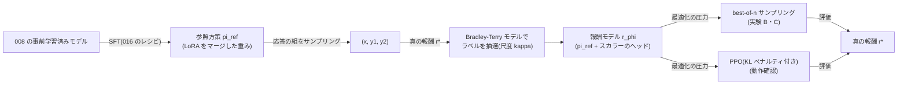

この記事は前編(理論編)です。続きは [こちら](https://zenn.dev/kojikojiprg/books/ai-theories-roadmap/viewer/017_reward_model_and_rlhf-practice-1)。

# 017. 報酬モデルと RLHF / Reward Models and RLHF

## 1. 概要 / Overview

RLHF(Reinforcement Learning from Human Feedback、人間のフィードバックによる強化学習)は、SFT(Supervised
Fine-Tuning、教師あり微調整)済みのモデルから応答の組を作り、どちらが良いかという **選好(preference)** のデータで
報酬モデル(Reward Model)を学習し、その報酬を最大化するように方策(言語モデル)を最適化する手法である。本トピックでは、
[016](https://zenn.dev/kojikojiprg/books/ai-theories-roadmap/viewer/016_supervised_fine_tuning-theory) の合成課題で SFT したモデルを参照方策 $\pi_{\mathrm{ref}}$ とし、応答の良さを
測る **既知の真の報酬** $r^*$ から Bradley-Terry モデルで選好ラベルを確率的に作る。真の報酬が分かっているので、
(A)学習した報酬モデルの報酬の差が、ラベルを生成した対数オッズの尺度に較正されているか、(B)best-of-n サンプリングで報酬モデルに対する
最適化の圧力を強めたとき、真の報酬が上がってから下がる **過最適化(overoptimization)** が起きるか、(C)選好データを
増やすと過最適化が緩和されるかを検証する。PPO(Proximal Policy Optimization)はスクラッチ実装し、判定を置かない
動作確認に留める。

### 1.1 実行の手順

本番実行は Google Colab T4 の **1 つのセッションで完結** させる。5.1 節のセットアップセルで`SMOKE_TEST = False`にして、
「すべてのセルを実行」する。

実行時間の予算は 1 セッションあたり **T4 で 120 分** とする。本番の学習を始める前に(6.4 節)、スケーリングの計測
(6.3 節)から 1 セッション全体の実行時間を **削る段階**(6.1 節)ごとに見積もり、予算に収まる最小の段階を自動で選ぶ。
選択は見積もりのみに基づき、どの実験の結果も参照しない。最後の段階でも予算を超える場合は、学習の前に例外で停止する。

SFT モデル(参照方策 $\pi_{\mathrm{ref}}$ の重み)は、018 の DPO(Direct Preference Optimization)が参照方策として使うため、
Hugging Face Hub にアップロードする(6.14 節)。アップロードは`UPLOAD_ARTIFACTS = True`にしたときだけ行う(既定は`False`)。

## 2. 参考論文 / References

1. Bradley, R. A., Terry, M. E., "Rank Analysis of Incomplete Block Designs: I. The Method of Paired Comparisons",
   Biometrika 39(3/4), 1952. https://doi.org/10.2307/2334029
   (一対比較のモデル。3.2 節の Bradley-Terry モデルの出典)
2. Christiano, P. F., Leike, J., Brown, T. B., Martic, M., Legg, S., Amodei, D.,
   "Deep Reinforcement Learning from Human Preferences", NeurIPS 2017. https://arxiv.org/abs/1706.03741
   (軌跡の一対比較から報酬モデルを学習し、それを強化学習で最大化する枠組み)
3. Ziegler, D. M., Stiennon, N., Wu, J., Brown, T. B., Radford, A., Amodei, D., Christiano, P., Irving, G.,
   "Fine-Tuning Language Models from Human Preferences", arXiv 2019. https://arxiv.org/abs/1909.08593
   (言語モデルへの適用。KL ダイバージェンスのペナルティ付きの報酬 $r - \beta \log(\pi / \pi_{\mathrm{ref}})$。3.5 節)
4. Stiennon, N., Ouyang, L., Wu, J., Ziegler, D. M., Lowe, R., Voss, C., Radford, A., Amodei, D., Christiano, P.,
   "Learning to Summarize from Human Feedback", NeurIPS 2020. https://arxiv.org/abs/2009.01325
   (要約での RLHF。報酬モデルの損失と、報酬モデルに対する過最適化の観察)
5. Ouyang, L., Wu, J., Jiang, X., Almeida, D., Wainwright, C. L., Mishkin, P., Zhang, C., Agarwal, S., Slama, K.,
   Ray, A., et al., "Training Language Models to Follow Instructions with Human Feedback", NeurIPS 2022.
   https://arxiv.org/abs/2203.02155
   (InstructGPT。SFT → 報酬モデル → PPO の 3 段階。3.1 節)
6. Schulman, J., Wolski, F., Dhariwal, P., Radford, A., Klimov, O., "Proximal Policy Optimization Algorithms",
   arXiv 2017. https://arxiv.org/abs/1707.06347(クリップ付き目的関数。3.5 節)
7. Schulman, J., Moritz, P., Levine, S., Jordan, M., Abbeel, P.,
   "High-Dimensional Continuous Control Using Generalized Advantage Estimation", ICLR 2016.
   https://arxiv.org/abs/1506.02438(GAE(Generalized Advantage Estimation)。3.5 節)
8. Gao, L., Schulman, J., Hilton, J., "Scaling Laws for Reward Model Overoptimization", ICML 2023.
   https://arxiv.org/abs/2210.10760
   (合成の「真の報酬モデル」を使った過最適化の測定と、best-of-n の不偏推定量。実験 B・C の着想の出典)
9. Beirami, A., Agarwal, A., Berant, J., D'Amour, A., Eisenstein, J., Nagpal, C., Suresh, A. T.,
   "Theoretical Guarantees on the Best-of-n Alignment Policy", arXiv 2024. https://arxiv.org/abs/2401.01879
   (best-of-n の KL ダイバージェンスの式 $\log n - (n-1)/n$ が一般には上界であること。3.6 節)
10. Hu, E. J., Shen, Y., Wallis, P., Allen-Zhu, Z., Li, Y., Wang, S., Wang, L., Chen, W.,
    "LoRA: Low-Rank Adaptation of Large Language Models", ICLR 2022. https://arxiv.org/abs/2106.09685
    (SFT と PPO の方策の学習に使う。[012](https://zenn.dev/kojikojiprg/books/ai-theories-roadmap/viewer/012_low_rank_adaptation-theory))

## 3. 理論 / Theory

### 3.1 RLHF の 3 段階

InstructGPT(Ouyang et al., NeurIPS 2022 [5])は、RLHF を次の 3 段階で構成した。

1. **SFT**: 人手で書いた応答で事前学習済みモデルを微調整し、方策の初期値 $\pi^{\mathrm{SFT}}$ を作る(016)。
2. **報酬モデル**: 同じプロンプトへの複数の応答を人間が比較し、その選好から、プロンプトと応答を受け取ってスカラーを
   返す報酬モデル $r_\phi$ を学習する(3.2 節)。
3. **強化学習**: $r_\phi$ を報酬として、$\pi^{\mathrm{SFT}}$ から離れすぎないように KL ダイバージェンス
   (Kullback-Leibler divergence)のペナルティを付けて、方策を PPO で最適化する(3.4・3.5 節)。

本トピックでは、人間の選好の代わりに **既知の真の報酬 $r^*$ から規則でラベルを作る**(5.4 節)。Gao et al.(ICML 2023 [8])
は、大きな報酬モデルを「真の報酬」とみなし、それが付けたラベルで小さな報酬モデルを学習して、過最適化を測った。
本トピックの $r^*$ は合成課題の正解から計算できる関数なので、ラベルの生成過程(3.3 節)を完全に制御できる。



### 3.2 Bradley-Terry モデルと報酬モデルの損失

Bradley & Terry(1952 [1])の一対比較のモデルは、各対象 $i$ に正の強さ $p_i$ を割り当て、$i$ が $j$ より選ばれる確率を
$p_i / (p_i + p_j)$ とする。$p_i = e^{r_i}$ とおくと

$$
P(i \succ j) = \frac{e^{r_i}}{e^{r_i} + e^{r_j}} = \sigma(r_i - r_j)
$$

となる。ここで $\sigma(z) = 1 / (1 + e^{-z})$ はシグモイド関数、$\succ$ は「選ばれる」を表す。

RLHF の報酬モデルは、プロンプト $x$ に対する応答 $y$ の強さを $r_\phi(x, y)$ とし、選好の組 $(x, y_w, y_l)$ の負の対数尤度

$$
\mathcal{L}(\phi) = -\mathbb{E}_{(x, y_w, y_l) \sim \mathcal{D}} \left[ \log \sigma\left( r_\phi(x, y_w) - r_\phi(x, y_l) \right) \right]
$$

を最小化する(Christiano et al. [2]、Stiennon et al. [4]、Ouyang et al. [5])。記号は次のとおりである。

- $x$: プロンプト(016 のテンプレートの指示部分)。
- $y_w$・$y_l$: 選ばれた応答・選ばれなかった応答。
- $r_\phi$: パラメータ $\phi$ の報酬モデル。$\mathcal{D}$: 選好の組のデータ。

**報酬は定数の差を除いてしか識別できない**: 損失は差 $r_\phi(x, y_w) - r_\phi(x, y_l)$ にしか依存しないので、任意の関数
$c(x)$ について $r_\phi(x, y) + c(x)$ は同じ損失を与える。選好のデータから決まるのは、同じプロンプトへの応答どうしの報酬の
**差** だけである。本トピックの報酬モデルの評価(実験 A)が報酬そのものではなく同じプロンプトの 2 応答の差
$\hat{\Delta} = r_\phi(x, y_1) - r_\phi(x, y_2)$ を使うのはこのためである。

報酬モデルの構造は、SFT モデルの本体(トークン埋め込み・Transformer の層・最終正規化層)の上に、最終トークンの位置の
隠れ状態 $h_{\mathrm{last}} \in \mathbb{R}^{d_{\mathrm{model}}}$ からスカラーを出す線形のヘッドを付けたものとする
(InstructGPT は SFT モデルの語彙への射影をスカラーの層に置き換えた)。

$$
r_\phi(x, y) = w^\top h_{\mathrm{last}}(x, y) + b
$$

$w \in \mathbb{R}^{d_{\mathrm{model}}}$・$b \in \mathbb{R}$ はヘッドの重みとバイアス、$d_{\mathrm{model}}$ は隠れ状態の次元である。

### 3.3 ラベル生成の尺度 $\kappa$ と、最尤推定の一致性

本トピックでは、ラベルを尺度 $\kappa > 0$ の Bradley-Terry モデル

$$
P(y_1 \succ y_2 \mid x) = \sigma\left( \kappa \left( r^*(x, y_1) - r^*(x, y_2) \right) \right)
$$

から組ごとに独立に抽選する。$r^*$ は真の報酬(5.4 節)、$\kappa$ はラベルの確率的なばらつきの大きさを決める定数である
($\kappa$ が大きいほどラベルは真の報酬の順序に忠実で、$\kappa \to 0$ で一様ランダムになる)。**記号 $\beta$ は KL 係数
(3.4 節)に予約し、$\kappa$ とは混同しない。**

**一致性**: 組 $(x, y_1, y_2)$ ごとに、真のラベルの確率を $p = \sigma(\kappa \Delta r^*)$($\Delta r^* = r^*(x, y_1) - r^*(x, y_2)$)、
モデルの確率を $q = \sigma(\Delta_\phi)$($\Delta_\phi = r_\phi(x, y_1) - r_\phi(x, y_2)$)とする。損失の期待値は組ごとに
2 値の交差エントロピー

$$
-p \log q - (1 - p) \log(1 - q)
$$

の和であり、各項は $q = p$ で最小になる(ギブスの不等式)。したがって、モデルの族が $r_\phi = \kappa r^* + c(x)$ を表現できるなら、
母集団での損失の最小点は $\Delta_\phi = \kappa \Delta r^*$ を満たす。データが増えると最尤推定量はこの最小点に近づくので
(一致性)。モデルの族が真の報酬を表現できる場合には、学習した報酬の差は $\kappa \Delta r^*$ そのものになる。

**線形ヘッドの一階条件による較正(calibration)**: モデルの族が $\kappa r^*$ を表現できない場合にも成り立つ性質がある。
報酬モデルのヘッドは線形(3.2 節)なので、任意の $a > 0$ について $a \, r_\phi$(ヘッドの重みとバイアスをともに $a$ 倍したもの)も
同じ族に含まれる。したがって学習の目的関数の最適点 $\phi^*$ では、報酬の尺度 $a$ だけを動かしても損失は下がらず、$a$ についての
一階条件

$$
\frac{\partial}{\partial a} \sum_{i} \left[ -l_i \log \sigma(a \hat{\Delta}_i) - (1 - l_i) \log \sigma(-a \hat{\Delta}_i) \right] \Bigg|_{a = 1}
= \sum_{i} \left( \sigma(\hat{\Delta}_i) - l_i \right) \hat{\Delta}_i = 0
$$

が成り立つ。ここで $i$ は学習データの組、$l_i \in \{0, 1\}$ はそのラベル(1 なら 1 つ目の応答が選ばれた)、
$\hat{\Delta}_i = r_{\phi^*}(x_i, y_{i,1}) - r_{\phi^*}(x_i, y_{i,2})$ は学習した報酬の差である。ラベル $l_i$ の条件付き期待値は
$p_i = \sigma(\kappa \Delta r^*_i)$ なので、組が十分多ければ $\sum_i (\sigma(\hat{\Delta}_i) - p_i) \hat{\Delta}_i \approx 0$ となる。
これは、目標確率 $p$ を固定したときの 1 変数の問題

$$
\hat{a} = \arg\min_{a} \sum_{i} \left[ -p_i \log \sigma(a \hat{\Delta}_i) - (1 - p_i) \log \sigma(-a \hat{\Delta}_i) \right]
$$

の一階条件が $a = 1$ で満たされること、すなわち **較正の傾き $\hat{a}$ が 1 になる** ことと同じである。$\hat{a}$ は、学習した報酬の差を
何倍すればラベルの対数オッズ $\kappa \Delta r^*$ に最もよく合うかを表す。$\hat{a} > 1$ なら報酬の差が小さすぎ(確信が足りない)、
$\hat{a} < 1$ なら大きすぎる(過信している)。この導出はモデルの族が $\kappa r^*$ を表現できるかに依存しない。学習データの分布の上で
成り立つので、学習に使っていない同じ分布の組で測った $\hat{a}$ の 1 からのずれは、汎化の分(と、有限のステップ数で最適点に
達していない分)だけである。これが「確率的なラベルから尺度が識別される」という主張の、表現能力に依存しない形であり、
実験 A はこの較正の傾きを対比量とする。

**ラベルが決定的な場合は尺度が識別できない**: $\kappa \to \infty$ ではラベルは $\Delta r^*$ の符号だけで決まる。すると、
順序を正しく並べる任意の $r_\phi$ について、$r_\phi$ を $a$ 倍($a > 1$)した報酬は損失を単調に下げ続け、$a \to \infty$ で
損失は 0 に近づく。最尤推定量は存在せず、選好から分かるのは **順序だけ** である。逆に、$\kappa$ が有限でラベルに
確率的なばらつきがあるときに限り、ラベルの一致の頻度から差の大きさ(尺度)が識別できる。

**モデルの族が真の報酬を表現できない場合と、回帰の希釈(regression dilution)**: 実際の報酬モデルは $r^*$ を完全には表現
できない(本トピックの $r^*$ は正解との文字単位の編集距離で決まり、報酬モデルは正解を内部で組み立てなければならない)。
このとき、学習した報酬の差 $\hat{\Delta}$ を真の報酬の差 $\Delta r^*$ に最小二乗で回帰した傾きを $b$ とすると、$b / \kappa$ は
1 より小さくなる。較正された予測は、報酬モデルが見分けられない分だけ平均(差 0)の側に縮むためである(極端な例として、
何も見分けられない報酬モデルの較正された予測は常に $\hat{\Delta} = 0$ で、$b = 0$ になる)。したがって $b / \kappa$ は、尺度が
識別されたかではなく **報酬モデルの予測の忠実度**(どれだけ正確に真の報酬の差を予測できるか)を測る量である。一方、
較正の傾き $\hat{a}$ は、$\hat{\Delta}$ を説明変数としてラベルの確率への合い方を測るので、この縮みを受けない(縮んだ予測も、
それ自体が正しい確率を与えていれば $\hat{a} = 1$ になる)。本トピックでは $b / \kappa$ を診断量として残す。

**$\kappa$ の決め方**: $\kappa$ が大きすぎるとラベルが決定的に近づいて尺度が識別しにくくなり、小さすぎるとラベルが
一様ランダムに近づいて学習の信号が弱くなる。本トピックでは、$\pi_{\mathrm{ref}}$ の応答の組の真の報酬の差の分布だけから、
差が 0 でない組について $\sigma(\kappa |\Delta r^*|)$ の中央値が 0.75 になるように

$$
\kappa = \frac{\log 3}{\operatorname{median}\left( |\Delta r^*| \;:\; \Delta r^* \ne 0 \right)}
$$

とする($\sigma^{-1}(0.75) = \log 3$)。学習した報酬モデルの結果は一切使わない。

### 3.4 KL 正則化つきの目的関数と、その最適解

RLHF の強化学習の段階は、プロンプトの分布 $x \sim \mathcal{X}$ のもとで次の目的関数を最大化する。

$$
J(\pi) = \mathbb{E}_{x \sim \mathcal{X}} \left[ \mathbb{E}_{y \sim \pi(\cdot \mid x)} [ r_\phi(x, y) ]
- \beta \, \mathrm{KL}\left( \pi(\cdot \mid x) \,\|\, \pi_{\mathrm{ref}}(\cdot \mid x) \right) \right]
$$

- $\pi$: 最適化する方策(応答の分布)。$\pi_{\mathrm{ref}}$: 参照方策(SFT モデル)。
- $\beta > 0$: KL 係数。$\mathrm{KL}(\pi \| \pi_{\mathrm{ref}}) = \mathbb{E}_{y \sim \pi}[\log \pi(y \mid x) - \log \pi_{\mathrm{ref}}(y \mid x)]$。

KL の項は、報酬モデルが学習データの分布(つまり $\pi_{\mathrm{ref}}$ の応答)から外れた応答で誤った高い報酬を与える
ことにつけ込むのを防ぐ(3.6 節の過最適化)。

**最適解の導出**: プロンプト $x$ ごとに独立に最大化できる。$x$ を固定し、分配関数を
$Z(x) = \sum_y \pi_{\mathrm{ref}}(y \mid x) \exp(r_\phi(x, y) / \beta)$ とおいて、分布
$\pi^*(y \mid x) = \pi_{\mathrm{ref}}(y \mid x) \exp(r_\phi(x, y) / \beta) / Z(x)$ を定義する。すると

$$
\begin{aligned}
\mathbb{E}_{y \sim \pi}[r_\phi(x, y)] - \beta \, \mathrm{KL}(\pi \| \pi_{\mathrm{ref}})
&= -\beta \, \mathbb{E}_{y \sim \pi} \left[ \log \frac{\pi(y \mid x)}{\pi_{\mathrm{ref}}(y \mid x) \exp(r_\phi(x, y) / \beta)} \right] \\
&= -\beta \, \mathbb{E}_{y \sim \pi} \left[ \log \frac{\pi(y \mid x)}{\pi^*(y \mid x)} \right] + \beta \log Z(x) \\
&= -\beta \, \mathrm{KL}(\pi \| \pi^*) + \beta \log Z(x)
\end{aligned}
$$

となる。$\beta \log Z(x)$ は $\pi$ によらず、KL ダイバージェンスは $\pi = \pi^*$ のときに限り 0(最小)なので、最適解は

$$
\pi^*(y \mid x) = \frac{1}{Z(x)} \pi_{\mathrm{ref}}(y \mid x) \exp\left( \frac{r_\phi(x, y)}{\beta} \right)
$$

である。$\beta$ が小さいほど報酬の高い応答に確率が集中し、$\beta \to \infty$ で $\pi_{\mathrm{ref}}$ に戻る。

**018 への橋渡し**: この式を $r_\phi$ について解くと

$$
r_\phi(x, y) = \beta \log \frac{\pi^*(y \mid x)}{\pi_{\mathrm{ref}}(y \mid x)} + \beta \log Z(x)
$$

となる。$\beta \log Z(x)$ はプロンプトだけの関数なので、3.2 節の「定数の差を除いて識別できない」部分にあたり、
Bradley-Terry モデルの損失では打ち消される。018 の DPO は、これを 3.2 節の損失に代入して、報酬モデルを経由せずに方策を
直接学習する。この式では $Z(x)$ を計算できない(全応答の和)ので、PPO(3.5 節)は $\pi^*$ を直接求めず、サンプリングと
勾配法で $J(\pi)$ を近似的に最大化する。

### 3.5 PPO: トークン単位の KL ペナルティ、価値関数、GAE、クリップ付き目的関数

**エピソードの定義**: 応答の生成を、プロンプト $x$ から始まり応答のトークン $y_1, \dots, y_T$ を 1 つずつ出す
エピソードとみなす。時刻 $t$ の状態は $s_t = (x, y_{<t})$、行動は $y_t$ である($T$ は応答のトークン数。終端記号を
出すか上限トークン数に達したら終わる)。

**トークン単位の報酬**(Ziegler et al. [3]、Ouyang et al. [5] の形): KL のペナルティを各トークンに配り、報酬モデルの
スコアは最後のトークンでだけ与える。

$$
r_t = -\beta \left( \log \pi_{\mathrm{old}}(y_t \mid s_t) - \log \pi_{\mathrm{ref}}(y_t \mid s_t) \right) + [t = T] \, r_\phi(x, y)
$$

$\pi_{\mathrm{old}}$ はロールアウト(応答のサンプリング)を行った時点の方策、$[\cdot]$ は条件が真なら 1、偽なら 0 である。
和をとると $\sum_t r_t = r_\phi(x, y) - \beta \log(\pi_{\mathrm{old}}(y \mid x) / \pi_{\mathrm{ref}}(y \mid x))$ となり、
$y \sim \pi_{\mathrm{old}}$ についての期待値は 3.4 節の $J$ の被積分関数に一致する。

**価値関数と GAE**(Schulman et al., ICLR 2016 [7]): 状態価値 $V(s_t)$ を価値ヘッドで推定し、アドバンテージを

$$
\delta_t = r_t + \gamma V(s_{t+1}) - V(s_t), \qquad
\hat{A}_t = \sum_{l=0}^{T-t} (\gamma \lambda)^l \, \delta_{t+l}
$$

で推定する($V(s_{T+1}) = 0$)。$\gamma$ は割引率、$\lambda \in [0, 1]$ は偏りと分散のトレードオフを決める GAE のパラメータ
である($\lambda = 1$ で割引収益から $V$ を引いたもの(分散大・偏りなし)、$\lambda = 0$ で 1 ステップの TD 誤差(分散小・
価値関数の誤差による偏りあり))。価値関数の学習の目標は $\hat{R}_t = \hat{A}_t + V(s_t)$ とし、損失
$\frac{1}{2} (V(s_t) - \hat{R}_t)^2$ を最小化する。

**クリップ付き目的関数**(Schulman et al., arXiv 2017 [6]): 同じロールアウトで複数回更新するとき、方策が
$\pi_{\mathrm{old}}$ から離れすぎないように、確率の比 $\rho_t(\theta) = \pi_\theta(y_t \mid s_t) / \pi_{\mathrm{old}}(y_t \mid s_t)$
をクリップした目的関数

$$
L^{\mathrm{CLIP}}(\theta) = \mathbb{E}_t \left[ \min\left( \rho_t(\theta) \hat{A}_t,\;
\mathrm{clip}(\rho_t(\theta), 1 - \epsilon, 1 + \epsilon) \, \hat{A}_t \right) \right]
$$

を最大化する($\epsilon$ はクリップの幅、$\theta$ は方策のパラメータ)。$\hat{A}_t > 0$ のとき比が $1 + \epsilon$ を超えても
目的関数は増えず、$\hat{A}_t < 0$ のとき $1 - \epsilon$ を下回っても増えない。min をとるので、クリップは目的関数を
悲観的な側にだけ変える。

**本トピックでの簡略化**: 方策は SFT モデル($\pi_{\mathrm{ref}}$ と同じ重み)の Query・Value 射影に LoRA(Low-Rank
Adaptation、[012](https://zenn.dev/kojikojiprg/books/ai-theories-roadmap/viewer/012_low_rank_adaptation-theory))を掛けたものとし、価値ヘッドは方策の本体を
共有する(最終正規化層の後の隠れ状態からの線形の層)。価値関数の損失の勾配も LoRA のパラメータに流れる。InstructGPT が
加えた事前学習の損失の混合(PPO-ptx)は使わない。

### 3.6 best-of-n サンプリングと、報酬モデルの過最適化

**best-of-n サンプリング** は、$\pi_{\mathrm{ref}}$ から応答を $n$ 個独立に抽選し、報酬モデルのスコア(代理報酬)が最大の
ものを返す方策 $\pi_n$ である。学習を伴わず、$n$ だけで最適化の圧力の強さを連続的に変えられる。

**KL ダイバージェンス**: よく使われる式

$$
\mathrm{KL}(\pi_n \| \pi_{\mathrm{ref}}) = \log n - \frac{n - 1}{n}
$$

は、応答が重複しない(代理報酬が連続な分布をもち同点が起きない)場合の値である。Beirami et al.(arXiv 2024 [9])は、
応答の空間が離散で同じ応答が複数回抽選されうる一般の場合に、これが **上界** であることを示した。言語モデルの応答は離散で、
本トピックの $\pi_{\mathrm{ref}}$ は同じ応答を何度も出すので、実際の KL はこの式より小さい。本トピックでは横軸を
$\log_2 n$ とし、この式は参考として併記する。

**期待値の厳密な推定**: プロンプトごとに $\pi_{\mathrm{ref}}$ から $M$ 個の応答のプールを 1 度だけ抽選し、代理報酬の昇順に
並べる。プールから $n$ 個の部分集合を一様に選んだとき、昇順で $i$ 番目の応答が部分集合の最大になる確率は

$$
w_i = \binom{i - 1}{n - 1} \bigg/ \binom{M}{n}
$$

である(残りの $n - 1$ 個を下位の $i - 1$ 個から選ぶ)。真の報酬の期待値を $\sum_i w_i \, r^*(y_{(i)})$ で求める
($y_{(i)}$ は昇順で $i$ 番目の応答)。これは $M$ 個から $n$ 個を選ぶすべての部分集合で平均した値に等しく、$n$ 個を独立に
抽選する best-of-n の期待値の不偏推定量である(Gao et al. [8] と同じ推定量)。部分集合を乱数で選び直すモンテカルロ推定の
誤差を持ち込まない。$n$ が $M$ に近いと、すべての $n$ が同じ少数の上位の応答を選ぶことになり、プールの抽選の偶然に
左右されるので、$n \le M/4$ に限る。

**過最適化(Goodhart の法則)**: 報酬モデルは $\pi_{\mathrm{ref}}$ の応答で学習した **代理** であり、真の報酬とは誤差を
もつ。最適化の圧力が弱いうちは、代理報酬の高い応答は真の報酬も高いが、圧力を強めると、代理報酬の誤差が正に大きい
応答(報酬モデルが過大評価する応答)が選ばれやすくなり、真の報酬はやがて下がる(「指標が目標になると、良い指標で
なくなる」)。Gao et al.(ICML 2023 [8])は、best-of-n での真の報酬が $d = \sqrt{\mathrm{KL}}$ の関数として
$d(\alpha - \beta_{\mathrm{bon}} d)$ の形で上がってから下がり、報酬モデルの大きさや学習データ量が増えると頂点が遠のくことを
報告した($\alpha$・$\beta_{\mathrm{bon}}$ はあてはめの係数)。実験 B は上がってから下がる形を、実験 C はデータ量による
緩和を検証する。代理報酬の期待値は $n$ について数学的に単調に増える(部分集合の最大値の期待値)ので、判定には使わない。

### 3.7 アルゴリズム

```text
procedure RLHF_017():
    pi_ref <- merge(SFT(008 model, 016 recipe))                          # 3.1 step 1
    kappa  <- log 3 / median(|r*(y1) - r*(y2)| : training pairs, nonzero) # 3.3
    for seed s, data level N:
        labels <- Bernoulli(sigma(kappa (r*(y1) - r*(y2))))  with seed s  # 3.3
        r_phi  <- train pi_ref + scalar head on first N pairs with
                  -log sigma(r(y_w) - r(y_l))                             # 3.2
    for each eval prompt x:  pool_x <- M samples from pi_ref (temperature 1, no top-k / top-p)
    for n in 1, 2, 4, ..., n_max:                                         # 3.6
        E[r*](n) <- mean_x sum_i w_i(n, M) r*(pool_x sorted by r_phi)_(i)

procedure PPO(pi_ref, r_phi, beta):                                       # 3.5
    policy <- pi_ref + LoRA (W_q, W_v); value head on the shared body
    repeat K iterations:
        y ~ policy(. | x) for a batch of prompts (temperature 1)
        r_t <- -beta (log pi_old - log pi_ref) + [t = T] r_phi(x, y)
        A_t, R_t <- GAE(r_t, V(s_t); gamma, lambda); whiten A_t
        for epoch in 1..E, minibatch:
            minimize -L^CLIP(theta) + c_V * 0.5 (V - R)^2
```


## 元ノートブック(実装の全文はこちら)

https://github.com/kojikojiprg/ai-theories/blob/main/theories/04_alignment/017_reward_model_and_rlhf.ipynb
