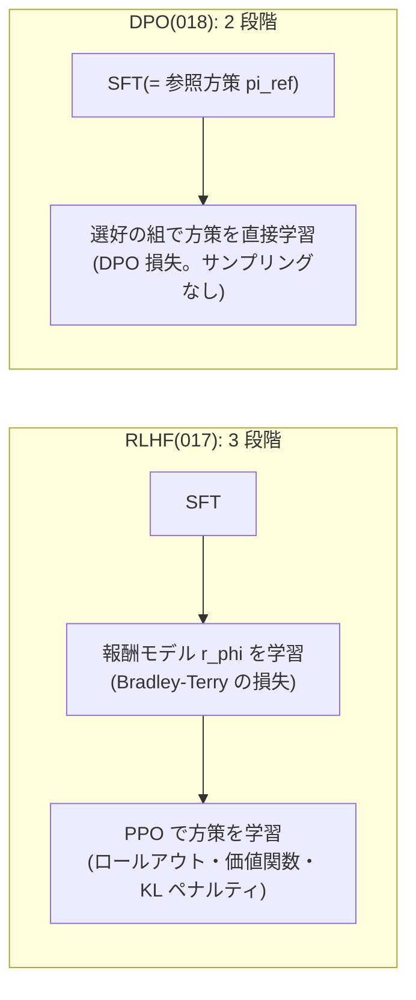
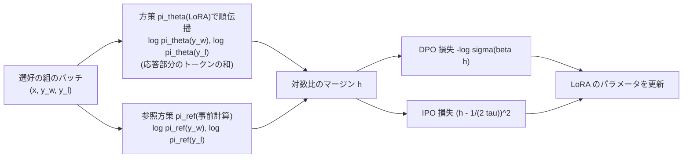

この記事は前編(理論編)です。続きは [こちら](https://zenn.dev/kojikojiprg/books/ai-theories-roadmap/viewer/018_direct_preference_optimization-practice-1)。

# 018. DPO(Direct Preference Optimization) / Direct Preference Optimization

## 1. 概要 / Overview

DPO(Direct Preference Optimization、直接選好最適化)は、RLHF(Reinforcement Learning from Human Feedback)の
KL 正則化つきの目的関数の最適解を報酬について解き直し、Bradley-Terry モデルに代入することで、報酬モデルの学習と強化学習の
2 段階を、選好データに対する 1 つの分類損失に置き換える手法である。本トピックでは DPO と、決定的な選好での過適合を避ける
IPO(Identity Preference Optimization)をスクラッチ実装し、[017](https://zenn.dev/kojikojiprg/books/ai-theories-roadmap/viewer/017_reward_model_and_rlhf-theory) で作った参照方策
(合成課題で SFT したモデル)と既知の真の報酬 $r^*$ の上で、(A)$\beta$ を小さくしていくと真の報酬が上がってから下がる
**過最適化(overoptimization)** が報酬モデルなしでも起きるか、(B)ラベルが決定的なときに DPO のマージンが伸び続け IPO では
そうならないか、(C)マージンが広がる一方で選好された応答の尤度が下がる **尤度の置き換わり(likelihood displacement)**
が起きるか、(D)それが似た応答の組ほど大きいかを検証する。

本番実行(Google Colab T4)の結果、事前に宣言した基準により、実験 A(過最適化)・B(決定的なラベルでの DPO と IPO の違い)・C(尤度の置き換わり)は **支持**、実験 D(類似度依存性)は **判定不能** となった。ただし実験 A・C の効果量は小さく(真の報酬の変化は 0.02 以下、選好された応答の対数確率の低下は 0.075 nats)、KL ダイバージェンスのみで較正した標準の $\beta$(0.566)より小さい $\beta$ では、終端記号を出さずに生成し続ける方策の崩壊が観察された(7 節)。

### 1.1 実行の手順

本番実行は Google Colab T4 の **1 つのセッションで完結** させる。5.1 節のセットアップセルで`SMOKE_TEST = False`にして、
「すべてのセルを実行」する。

実行時間の予算は 1 セッションあたり **T4 で 120 分** とする。本番の学習を始める前に(6.4 節)、スケーリングの計測
(6.3 節)から 1 セッション全体の実行時間を **削る段階**(6.1 節)ごとに見積もり、予算に収まる最小の段階を自動で選ぶ。
選択は見積もりのみに基づき、どの実験の結果も参照しない。最後の段階でも予算を超える場合は、学習の前に例外で停止する。

本トピックで学習したモデルは後続のトピックの入力にならず、読者がノートブックの外で試すためのものでもないので、
Hugging Face Hub にはアップロードしない。

## 2. 参考論文 / References

1. Rafailov, R., Sharma, A., Mitchell, E., Ermon, S., Manning, C. D., Finn, C.,
   "Direct Preference Optimization: Your Language Model is Secretly a Reward Model", NeurIPS 2023.
   https://arxiv.org/abs/2305.18290(DPO の原典。3.2・3.3 節)
2. Azar, M. G., Rowland, M., Piot, B., Guo, D., Calandriello, D., Valko, M., Munos, R.,
   "A General Theoretical Paradigm to Understand Learning from Human Preferences", AISTATS 2024.
   https://arxiv.org/abs/2310.12036(ΨPO の一般形と IPO、決定的な選好での過適合。3.4・3.5 節、実験 B)
3. Rafailov, R., Chittepu, Y., Park, R., Sikchi, H., Hejna, J., Knox, B., Finn, C., Niekum, S.,
   "Scaling Laws for Reward Model Overoptimization in Direct Alignment Algorithms", NeurIPS 2024.
   https://arxiv.org/abs/2406.02900(直接選好最適化の過最適化。3.7 節、実験 A)
4. Razin, N., Malladi, S., Bhaskar, A., Chen, D., Arora, S., Hanin, B.,
   "Unintentional Unalignment: Likelihood Displacement in Direct Preference Optimization", ICLR 2025.
   https://arxiv.org/abs/2410.08847(尤度の置き換わりと CHES スコア。3.6 節、実験 C・D)
5. Pal, A., Karkhanis, D., Dooley, S., Roberts, M., Naidu, S., White, C.,
   "Smaug: Fixing Failure Modes of Preference Optimisation with DPO-Positive", arXiv 2024.
   https://arxiv.org/abs/2402.13228(編集距離の小さい組で選好された応答の尤度が下がること。3.6 節、実験 D)
6. Ethayarajh, K., Xu, W., Muennighoff, N., Jurafsky, D., Kiela, D.,
   "KTO: Model Alignment as Prospect Theoretic Optimization", ICML 2024. https://arxiv.org/abs/2402.01306(3.8 節)
7. Hong, J., Lee, N., Thorne, J., "ORPO: Monolithic Preference Optimization without Reference Model", EMNLP 2024.
   https://arxiv.org/abs/2403.07691(3.8 節)
8. Meng, Y., Xia, M., Chen, D., "SimPO: Simple Preference Optimization with a Reference-Free Reward", NeurIPS 2024.
   https://arxiv.org/abs/2405.14734(3.8 節)
9. Xu, S., Fu, W., Gao, J., Ye, W., Liu, W., Mei, Z., Wang, G., Yu, C., Wu, Y.,
   "Is DPO Superior to PPO for LLM Alignment? A Comprehensive Study", ICML 2024. https://arxiv.org/abs/2404.10719(3.8 節)
10. Tajwar, F., Singh, A., Sharma, A., Rafailov, R., Schneider, J., Xie, T., Ermon, S., Finn, C., Kumar, A.,
    "Preference Fine-Tuning of LLMs Should Leverage Suboptimal, On-Policy Data", ICML 2024.
    https://arxiv.org/abs/2404.14367(3.8 節)
11. Gao, L., Schulman, J., Hilton, J., "Scaling Laws for Reward Model Overoptimization", ICML 2023.
    https://arxiv.org/abs/2210.10760(報酬モデルの過最適化。017 の実験 B・C。3.7 節)
12. Christiano, P. F., Leike, J., Brown, T. B., Martic, M., Legg, S., Amodei, D.,
    "Deep Reinforcement Learning from Human Preferences", NeurIPS 2017. https://arxiv.org/abs/1706.03741(3.1 節)
13. Ouyang, L., Wu, J., Jiang, X., Almeida, D., Wainwright, C. L., Mishkin, P., Zhang, C., Agarwal, S., Slama, K.,
    Ray, A., et al., "Training Language Models to Follow Instructions with Human Feedback", NeurIPS 2022.
    https://arxiv.org/abs/2203.02155(InstructGPT の RLHF の 3 段階。3.1 節)
14. Hu, E. J., Shen, Y., Wallis, P., Allen-Zhu, Z., Li, Y., Wang, S., Wang, L., Chen, W.,
    "LoRA: Low-Rank Adaptation of Large Language Models", ICLR 2022. https://arxiv.org/abs/2106.09685
    (方策の学習に使う。[012](https://zenn.dev/kojikojiprg/books/ai-theories-roadmap/viewer/012_low_rank_adaptation-theory))

## 3. 理論 / Theory

### 3.1 動機: RLHF の 2 段階の学習

[017](https://zenn.dev/kojikojiprg/books/ai-theories-roadmap/viewer/017_reward_model_and_rlhf-theory) の RLHF(Christiano et al. [12]、Ouyang et al. [13])は、SFT(Supervised
Fine-Tuning、教師あり微調整)の後に、選好データから報酬モデル $r_\phi$ を学習し、その報酬を KL 正則化つきで最大化する
方策を PPO(Proximal Policy Optimization)で学習した。この 2 段階には次の手間がある。

- 報酬モデルという 2 つ目のモデルを学習し、方策の学習中にはロールアウト(方策からの応答のサンプリング)ごとに
  スコアリングしなければならない。
- PPO は価値関数・GAE(Generalized Advantage Estimation)・クリップの幅・KL ペナルティの係数 $\beta$ など多くの
  超パラメータを持つ。017 の PPO では、KL 係数が小さい条件で、代理報酬(報酬モデルのスコア)が上がる一方で真の報酬が
  下がった。

DPO(Rafailov et al., NeurIPS 2023 [1])は、017 の 3.4 節で導出した最適解の形を使って、この 2 段階を **選好データに対する
1 つの損失** に置き換える。



### 3.2 DPO 損失の導出

017 の 3.4 節で、KL 正則化つきの目的関数

$$
\max_\pi \; \mathbb{E}_{x \sim \mathcal{X}} \left[ \mathbb{E}_{y \sim \pi(\cdot \mid x)} [ r(x, y) ]
- \beta \, \mathrm{KL}\left( \pi(\cdot \mid x) \,\|\, \pi_{\mathrm{ref}}(\cdot \mid x) \right) \right]
$$

の最適解が

$$
\pi^*(y \mid x) = \frac{1}{Z(x)} \pi_{\mathrm{ref}}(y \mid x) \exp\left( \frac{r(x, y)}{\beta} \right), \qquad
Z(x) = \sum_y \pi_{\mathrm{ref}}(y \mid x) \exp\left( \frac{r(x, y)}{\beta} \right)
$$

であることを導いた。記号は次のとおりである。

- $x$: プロンプト(指示部分)。$\mathcal{X}$: プロンプトの分布。$y$: 応答。
- $r(x, y)$: 報酬。$\pi_{\mathrm{ref}}$: 参照方策(SFT モデル)。$\pi^*$: 最適な方策。
- $\beta > 0$: KL 正則化の係数。$Z(x)$: 分配関数(プロンプトだけの関数)。

**報酬について解く**: 両辺の対数をとって整理すると

$$
r(x, y) = \beta \log \frac{\pi^*(y \mid x)}{\pi_{\mathrm{ref}}(y \mid x)} + \beta \log Z(x)
$$

となる。すなわち、任意の報酬は「その報酬の最適方策と参照方策の対数比の $\beta$ 倍」に、プロンプトだけの項を足したもので
表せる。

**Bradley-Terry モデルに代入する**: 017 の 3.2 節の Bradley-Terry モデルは、同じプロンプトへの 2 つの応答のうち $y_w$ が
$y_l$ より選好される確率を

$$
P(y_w \succ y_l \mid x) = \sigma\left( r(x, y_w) - r(x, y_l) \right)
$$

とする。ここで $y_w$ は選好された応答、$y_l$ は選好されなかった応答、$\sigma(z) = 1 / (1 + e^{-z})$ はシグモイド関数、
$\succ$ は「選好される」を表す。上の $r$ を代入すると、報酬の **差** だけが現れるので $\beta \log Z(x)$ は打ち消され

$$
P(y_w \succ y_l \mid x) = \sigma\left( \beta \log \frac{\pi^*(y_w \mid x)}{\pi_{\mathrm{ref}}(y_w \mid x)}
- \beta \log \frac{\pi^*(y_l \mid x)}{\pi_{\mathrm{ref}}(y_l \mid x)} \right)
$$

となる。計算できない $Z(x)$(全応答の和)が消えることが要点である。017 の 3.2 節で述べた「報酬は定数の差を除いて
しか識別できない」性質が、ここでは $Z(x)$ を消す働きをしている。

**最尤推定**: 最適方策 $\pi^*$ をパラメータ $\theta$ の方策 $\pi_\theta$ で置き換え、選好データ $\mathcal{D}$ の負の対数尤度を
最小化すると、DPO 損失

$$
\mathcal{L}_{\mathrm{DPO}}(\theta) = -\mathbb{E}_{(x, y_w, y_l) \sim \mathcal{D}} \left[ \log \sigma\left(
\beta \log \frac{\pi_\theta(y_w \mid x)}{\pi_{\mathrm{ref}}(y_w \mid x)}
- \beta \log \frac{\pi_\theta(y_l \mid x)}{\pi_{\mathrm{ref}}(y_l \mid x)} \right) \right]
$$

が得られる。報酬モデルを経由せず、方策そのものを 017 の報酬モデルと同じ Bradley-Terry の損失で学習する。サンプリング
(ロールアウト)は不要で、学習は選好データ上の教師あり学習になる。

### 3.3 暗黙の報酬(implicit reward)と勾配

**暗黙の報酬**: 3.2 節の式から、方策 $\pi_\theta$ は報酬

$$
\hat{r}_\theta(x, y) = \beta \log \frac{\pi_\theta(y \mid x)}{\pi_{\mathrm{ref}}(y \mid x)}
$$

の最適方策とみなせる(論文の副題「言語モデルは密かに報酬モデルである」)。DPO 損失は、この暗黙の報酬を報酬モデルとした
Bradley-Terry の損失 $-\log \sigma(\hat{r}_\theta(x, y_w) - \hat{r}_\theta(x, y_l))$ そのものである。暗黙の報酬による選好の
正解率($\hat{r}_\theta(x, y_w) > \hat{r}_\theta(x, y_l)$ である組の割合)を、学習が進んでいるかの指標に使う。

**勾配**: $u = \hat{r}_\theta(x, y_w) - \hat{r}_\theta(x, y_l)$ とおくと、$\frac{d}{du}\left[ -\log \sigma(u) \right] = -\sigma(-u)$ なので

$$
\nabla_\theta \mathcal{L}_{\mathrm{DPO}} = -\beta \, \mathbb{E}_{(x, y_w, y_l) \sim \mathcal{D}} \left[
\sigma\left( \hat{r}_\theta(x, y_l) - \hat{r}_\theta(x, y_w) \right)
\left( \nabla_\theta \log \pi_\theta(y_w \mid x) - \nabla_\theta \log \pi_\theta(y_l \mid x) \right) \right]
$$

となる($\pi_{\mathrm{ref}}$ は $\theta$ によらない)。勾配は $\log \pi_\theta(y_w \mid x)$ を上げ $\log \pi_\theta(y_l \mid x)$ を
下げる向きで、その重み $\sigma(\hat{r}_\theta(x, y_l) - \hat{r}_\theta(x, y_w))$ は、暗黙の報酬が組の順序を **誤って**
並べているほど大きく、正しく大きな差で並べるほど 0 に近づく。

**系列の対数確率の分解**: 自己回帰の言語モデルでは

$$
\log \pi_\theta(y \mid x) = \sum_{t=1}^{\lvert y \rvert} \log \pi_\theta(y_t \mid x, y_{<t})
$$

である($y_t$ は応答の $t$ 番目のトークン、$y_{<t}$ はそれより前のトークン、$\lvert y \rvert$ は応答のトークン数)。和は
**応答部分のトークンだけ** にわたり、プロンプトのトークンは含めない。プロンプトは $x$ として条件に入るだけで、その尤度は
$y_w$ と $y_l$ で共通なので差をとると消える。これは [016](https://zenn.dev/kojikojiprg/books/ai-theories-roadmap/viewer/016_supervised_fine_tuning-theory) の損失マスク(指示部分の
トークンを損失に含めない)と同じ区別である。



### 3.4 記法: 対数比のマージン

以降の実験では、Azar et al.(AISTATS 2024 [2])の記法に従い、**対数比のマージン**

$$
h_\theta(x, y_w, y_l) = \log \frac{\pi_\theta(y_w \mid x) \, \pi_{\mathrm{ref}}(y_l \mid x)}{\pi_\theta(y_l \mid x) \, \pi_{\mathrm{ref}}(y_w \mid x)}
= \log \frac{\pi_\theta(y_w \mid x)}{\pi_{\mathrm{ref}}(y_w \mid x)} - \log \frac{\pi_\theta(y_l \mid x)}{\pi_{\mathrm{ref}}(y_l \mid x)}
$$

を使う(単位は nats)。DPO 損失は $\mathcal{L}_{\mathrm{DPO}} = \mathbb{E}\left[ -\log \sigma(\beta h_\theta) \right]$ と書ける。
学習の前($\pi_\theta = \pi_{\mathrm{ref}}$)には $h_\theta = 0$ で、DPO 損失は $\log 2$ である。

### 3.5 決定的な選好での過適合と IPO

**経験的な選好確率**: 同じ組 $(x, y, y')$ が $K$ 回観測され、そのうち $y$ が選好された割合を $\hat{p} \in [0, 1]$ とする。
この組の DPO 損失の和を $K$ で割ると、$h = h_\theta(x, y, y')$(向きを $y$ が先に固定する。$h_\theta(x, y', y) = -h$)について

$$
\ell_{\mathrm{DPO}}(h) = -\hat{p} \log \sigma(\beta h) - (1 - \hat{p}) \log \sigma(-\beta h)
$$

となる。これは 2 値の交差エントロピーで、$\hat{p} \in (0, 1)$ なら $\sigma(\beta h) = \hat{p}$、すなわち **有限の**

$$
h^*_{\mathrm{DPO}} = \frac{1}{\beta} \mathrm{logit}(\hat{p}) = \frac{1}{\beta} \log \frac{\hat{p}}{1 - \hat{p}}
$$

で最小になる。

**決定的な選好**(Azar et al. [2] の議論): $\hat{p} = 1$ なら $\ell_{\mathrm{DPO}}(h) = -\log \sigma(\beta h)$ は $h$ について単調に減少し、
最小値は $h \to \infty$ でしか達成されない。$\pi_\theta(y \mid x) \le 1$ なので、$h \to \infty$ には
$\pi_\theta(y' \mid x) \to 0$ が必要であり、これは **$\beta$ の値によらない**。KL 正則化の係数 $\beta$ は、本来は方策が
$\pi_{\mathrm{ref}}$ から離れすぎるのを防ぐためのものだが、決定的な選好のもとでは損失の最小点を変えず(到達の速さを変える
だけで)、正則化として働かない。

**有限のデータでは $\hat{p}$ は 0 か 1 になる**: 実際の選好データでは、各組は通常 **1 回しか観測されない**($K = 1$)。
このとき、ラベルが Bradley-Terry モデルから確率的に抽選されたものであっても、経験的な選好確率 $\hat{p}$ は 0 か 1 であり、
上の「決定的な選好」の状況になる。DPO の最適解では、観測された組の選好されなかった応答の確率が 0 に押しやられる。

**ΨPO と IPO**: Azar et al. [2] は、非減少の関数 $\Psi: [0, 1] \to \mathbb{R}$ を使った一般形(ΨPO)

$$
\max_\pi \; \mathbb{E}_{x \sim \mathcal{X}} \, \mathbb{E}_{y \sim \pi(\cdot \mid x), \, y' \sim \mu(\cdot \mid x)}
\left[ \Psi\left( p^*(y \succ y' \mid x) \right) \right] - \tau \, \mathrm{KL}(\pi \,\|\, \pi_{\mathrm{ref}})
$$

を考えた。$p^*(y \succ y' \mid x)$ は真の選好確率、$\mu$ はデータの応答の分布、$\tau > 0$ は KL 正則化の係数(DPO の
$\beta$ に対応する)である。Bradley-Terry モデルのもとで $\Psi(q) = \log(q / (1 - q))$ とすると RLHF・DPO の目的関数に
一致する。この $\Psi$ は $q \to 1$ で発散するので、決定的な選好が過適合を生む。$\Psi$ を **恒等写像** $\Psi(q) = q$ とした
ものが IPO(Identity Preference Optimization)で、その経験損失は

$$
\mathcal{L}_{\mathrm{IPO}}(\theta) = \mathbb{E}_{(x, y_w, y_l) \sim \mathcal{D}} \left[
\left( h_\theta(x, y_w, y_l) - \frac{1}{2\tau} \right)^2 \right]
$$

である。マージンを有限の目標値 $1 / (2\tau)$ へ回帰させるので、$\hat{p} = 1$ でも最適なマージンは有限である。

**IPO の最適なマージン**: 同じ組が $y$ の選好として $\hat{p}$ の割合、$y'$ の選好として $1 - \hat{p}$ の割合で観測されるとき、
損失は

$$
\ell_{\mathrm{IPO}}(h) = \hat{p} \left( h - \frac{1}{2\tau} \right)^2 + (1 - \hat{p}) \left( -h - \frac{1}{2\tau} \right)^2
$$

で、$\frac{d \ell_{\mathrm{IPO}}}{dh} = 2\hat{p}\left(h - \frac{1}{2\tau}\right) + 2(1 - \hat{p})\left(h + \frac{1}{2\tau}\right) = 0$ から

$$
h^*_{\mathrm{IPO}} = \frac{2\hat{p} - 1}{2\tau}
$$

となる。$\hat{p} = 1$ でも $1 / (2\tau)$ にとどまり、$\tau$ が小さいほど目標値は大きい(正則化が弱い)。本トピックでは $\tau = \beta$
とする。実験 B は、同じ組を $K$ 回重複させたデータで、この 2 つの損失の振る舞いの違いを検証する。

### 3.6 尤度の置き換わり(likelihood displacement)

DPO 損失はマージン $h_\theta$(2 つの対数比の **差**)にしか依存しない。したがって、損失が下がってマージンが広がっても、
$\log \pi_\theta(y_w \mid x)$ 自体が上がるとは限らない。$\log \pi_\theta(y_w \mid x)$ と $\log \pi_\theta(y_l \mid x)$ がともに
下がり、$y_l$ の方が大きく下がれば、マージンは広がる。

**勾配の共有による説明**: 学習率 $\eta$ の勾配法の 1 ステップで、1 つの組 $(x, y_w, y_l)$ だけで更新したときの
$\log \pi_\theta(y_w \mid x)$ の変化は、1 次の近似で

$$
\Delta \log \pi_\theta(y_w \mid x) \approx \eta \beta \, \sigma\left( -\beta h_\theta \right)
\left( \lVert g_w \rVert^2 - \langle g_w, g_l \rangle \right), \qquad
g_w = \nabla_\theta \log \pi_\theta(y_w \mid x), \; g_l = \nabla_\theta \log \pi_\theta(y_l \mid x)
$$

となる(3.3 節の勾配と $g_w$ の内積)。$\langle g_w, g_l \rangle$ が $\lVert g_w \rVert^2$ を上回るとき、すなわち $y_w$ と $y_l$ の勾配が
よく似ているとき、選好された応答の尤度は **下がる**。$y_w$ と $y_l$ が共通の接頭辞や共通のトークンを多く持つほど、
同じパラメータ・似た内部表現を通って確率が決まるので、$y_l$ を下げる勾配が $y_w$ も下げる。

**CHES スコア**(Razin et al., ICLR 2025 [4]): Razin et al. は、隠れ状態(語彙への射影の直前の、最終層の隠れ状態)と
語彙の埋め込みに着目した解析から、この現象の起こりやすさを表す **CHES スコア**(centered hidden embedding similarity、
中心化した隠れ状態の類似度)

$$
\mathrm{CHES}_x(y_w, y_l) = \left\langle \sum_{k=1}^{\lvert y_w \rvert} h_{x, y_{w, <k}}, \; \sum_{k'=1}^{\lvert y_l \rvert} h_{x, y_{l, <k'}} \right\rangle
- \left\lVert \sum_{k=1}^{\lvert y_w \rvert} h_{x, y_{w, <k}} \right\rVert^2
$$

を導いた。$h_{x, y_{<k}} \in \mathbb{R}^{d_{\mathrm{model}}}$ は、プロンプト $x$ と応答の先頭 $k - 1$ トークンを入力したときの
隠れ状態(応答の $k$ 番目のトークンを予測する位置の隠れ状態)、$d_{\mathrm{model}}$ は隠れ状態の次元である。上の勾配の式の
$\langle g_w, g_l \rangle - \lVert g_w \rVert^2$ を隠れ状態で表した形で、CHES スコアが大きいほど $\log \pi_\theta(y_w \mid x)$ が
下がりやすい。長さで正規化した版(同論文の Definition 3)は、内積を $\lvert y_w \rvert \lvert y_l \rvert$ で、第 2 項を
$\lvert y_w \rvert^2$ で割る。

**編集距離の小さい組**(Pal et al., arXiv 2024 [5]): Pal et al. は、$y_w$ と $y_l$ が少数のトークンしか違わない(編集距離の
小さい)組で DPO を行うと、選好された応答の尤度が下がりうることを理論と実験で示した(違いのある位置より後のトークンで
確率が下がる)。実験 D は、応答の文字列の正規化編集距離を類似度の代理として、近い組だけ・遠い組だけで学習したときの
$\log \pi_\theta(y_w \mid x)$ の下がり方を比べる。編集距離は勾配の共有の度合いの **代理** にすぎないので、CHES スコアを
診断量として併記する。

### 3.7 直接選好最適化の過最適化

017 の 3.6 節の過最適化(Gao et al., ICML 2023 [11])は、学習した報酬モデル(代理報酬)と真の報酬のずれに最適化の圧力が
かかることで起きた。DPO には明示的な報酬モデルがないが、Rafailov et al.(NeurIPS 2024 [3])は、DPO などの直接選好最適化
(Direct Alignment Algorithms)でも、$\beta$ を小さくして KL ダイバージェンスの予算を大きくするほど、真の報酬(彼らの実験では
より強いモデルによる評価)がはじめ上がり、やがて下がることを報告した。

**理由**: 暗黙の報酬 $\hat{r}_\theta$ は有限の選好データから推定した報酬であり、017 の報酬モデルと同じく真の報酬とずれる。
3.5 節のとおり、有限のデータでは $\hat{p}$ が 0 か 1 になるので、DPO はデータに現れた選好されなかった応答の確率を 0 へ
押しやり、その分の確率をデータの外の応答(選好データに現れず、暗黙の報酬が正しく評価できない応答)へ移しうる。
$\beta$ が小さいほど方策は $\pi_{\mathrm{ref}}$ から遠くへ動けるので、このずれにつけ込む余地が大きくなる。

**017 の best-of-n との対応**(定性的な比較のみ): 017 の best-of-n では、最適化の圧力を $n$ で、方策の移動量を KL の
上界 $\log n - (n - 1)/n$ で表した。DPO では圧力を $1/\beta$ で表し、移動量はサンプリングによる KL ダイバージェンスの推定値で
測る。本トピックは報酬モデルを学習しないので、同じ KL での両者の真の報酬を定量的には比べない。

**KL ダイバージェンスの推定**: 方策 $\pi_\theta$ の KL ダイバージェンスを、$\pi_\theta$ からサンプリングした応答による
モンテカルロ推定

$$
\widehat{\mathrm{KL}} = \frac{1}{M} \sum_{i=1}^{M} \left[ \log \pi_\theta(y_i \mid x_i) - \log \pi_{\mathrm{ref}}(y_i \mid x_i) \right],
\qquad y_i \sim \pi_\theta(\cdot \mid x_i)
$$

で求める($M$ は応答の数、$x_i$ は評価用のプロンプト)。これは $\mathbb{E}_x[\mathrm{KL}(\pi_\theta(\cdot \mid x) \,\|\,
\pi_{\mathrm{ref}}(\cdot \mid x))]$ の不偏推定量である。

### 3.8 位置づけ: DPO の派生手法と、off-policy / on-policy のデータ

DPO の後、参照方策や組の構造を変えた手法が提案された。本トピックでは実装せず、位置づけのみを述べる。

| 手法 | 学習に使うデータ | 参照方策 | 要点 |
|---|---|---|---|
| DPO [1] | 組 $(x, y_w, y_l)$ | 使う | 暗黙の報酬 $\beta \log(\pi_\theta / \pi_{\mathrm{ref}})$ の Bradley-Terry の損失 |
| IPO [2] | 組 | 使う | マージンを $1 / (2\tau)$ へ回帰させる二乗損失。決定的な選好でも最適解が有限 |
| KTO [6] | 単独の応答と「良い / 悪い」の 2 値のラベル | 使う | 組を作らずに学習する。プロスペクト理論の価値関数の形の損失 |
| ORPO [7] | 組 | 使わない | SFT の損失にオッズ比の項を足し、SFT と選好の学習を 1 段階にまとめる |
| SimPO [8] | 組 | 使わない | 長さで正規化した平均対数確率 $\frac{\beta}{\lvert y \rvert} \log \pi_\theta(y \mid x)$ を暗黙の報酬とし、目標のマージンを加える |

KTO(Kahneman-Tversky Optimization)・ORPO(Odds Ratio Preference Optimization)・SimPO(Simple Preference Optimization)の
正式名称は、それぞれの論文の題名に対応する。

**off-policy と on-policy のデータ**: 本トピックの選好データは、学習の前に参照方策 $\pi_{\mathrm{ref}}$ から 1 度だけ
サンプリングした応答の組であり、学習中の方策 $\pi_\theta$ からは取り直さない(off-policy)。学習が進んで $\pi_\theta$ が
$\pi_{\mathrm{ref}}$ から離れると、データの応答は $\pi_\theta$ が実際に生成する応答を代表しなくなる。Xu et al.(ICML 2024 [9])は、
DPO が分布の外の応答に偏った解を見つけうること、学習中の方策からデータを取り直すと改善することを示し、PPO との比較を行った。
Tajwar et al.(ICML 2024 [10])は、学習中の方策からサンプリングしたデータ(on-policy)と、確率を下げる方向の目的関数
(負の勾配)が、望ましい応答が参照方策で低い確率にあるときに有効であることを示した。017 の PPO はロールアウトのたびに
方策から応答を取り直す on-policy の手法である。

### 3.9 アルゴリズム

```text
procedure DPO_018(pi_ref, loss in {DPO, IPO}, beta):
    pairs  <- (x, y1, y2) with y1, y2 ~ pi_ref(. | x), drop y1 == y2 and r*(y1) == r*(y2)
    kappa  <- log 3 / median(|r*(y1) - r*(y2)|)                           # 017, 3.3
    labels <- K draws from Bernoulli(sigma(kappa (r*(y1) - r*(y2))))       # stochastic
              or K copies of [r*(y1) > r*(y2)]                              # deterministic
    ref_w, ref_l <- log pi_ref(y_w | x), log pi_ref(y_l | x)   (precomputed once, cached)
    policy <- pi_ref + LoRA (W_q, W_v), B = 0  (so policy == pi_ref at step 0)
    for step in 1..T:
        (x, y_w, y_l) <- minibatch of instances
        h <- (log pi(y_w|x) - ref_w) - (log pi(y_l|x) - ref_l)            # sums over response tokens
        loss <- mean(-log sigma(beta h))            if DPO                  # 3.2
                mean((h - 1/(2 beta))^2)            if IPO (tau = beta)     # 3.5
        update LoRA parameters with AdamW
    evaluate: y ~ policy(. | x_eval) -> E[r*(y)], KL estimate mean(log pi(y) - log pi_ref(y))
```


## 元ノートブック(実装の全文はこちら)

https://github.com/kojikojiprg/ai-theories/blob/main/theories/04_alignment/018_direct_preference_optimization.ipynb
