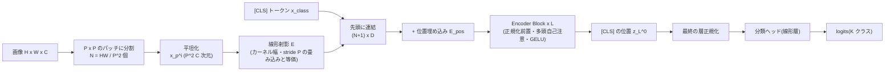

この記事は前編(理論編)です。続きは [こちら](https://zenn.dev/kojikojiprg/books/ai-theories-roadmap/viewer/019_vision_transformer-practice-1)。

# 019. ViT と画像パッチ埋め込み / Vision Transformer and Patch Embedding

## 1. 概要 / Overview

ViT(Vision Transformer)は、画像を $P \times P$ 画素の重ならないパッチに分割し、各パッチを線形射影したベクトルの系列を、
言語モデルと同じ Transformer の encoder に入力して画像を分類するモデルである(Dosovitskiy et al. [1])。畳み込みニューラル
ネットワーク(CNN: Convolutional Neural Network)が構造として持つ局所性・並進等変性(translation equivariance)を持たない代わりに、
パッチどうしの関係をすべて注意機構(Attention Mechanism)で学習する。本トピックでは、パッチ埋め込み(Patch Embedding)・
[CLS] トークン・位置埋め込み(Position Embedding)を備えた ViT をスクラッチ実装し、CIFAR-10 [8] 上で、(A)位置埋め込みを除くと
正解率が下がるか、(B)パッチを小さくして系列を長くするほど正解率が上がるか、(C)データ量を減らしたときの正解率の低下が
ViT の方が CNN(ResNet-56 [7])より大きいか、を検証する。

本番実行(Google Colab T4、1 回)では、実行計画 6($T = 1984$・段階 2。全データで約 5.6 エポック)が選ばれた。事前に宣言した
基準により、実験 A(位置埋め込みの寄与)は **支持**、実験 B(パッチサイズと系列長。段階 2 のため $P \in \{8, 4\}$ の 2 点)は
**支持** となった。実験 C(帰納バイアスとデータ量)は、CNN の学習率の較正で最良の値が格子の端(拡張後)に来たため
**前提不成立** であり、仮説について支持とも反証とも言えない(7 節)。

### 1.1 実行の手順

本番実行は Google Colab T4 の **1 つのセッションで完結** させる。5.1 節のセットアップセルで`SMOKE_TEST = False`にして、
「すべてのセルを実行」する。

実行時間の予算は 1 セッションあたり **T4 で 120 分** とする。学習を始める前に(6.4 節)、T4 上でのスケーリングの計測(6.3 節)から、
学習ステップ数 $T$ の候補 $\{3968, 1984, 992\}$ と **削る段階** 0〜3 を組み合わせた 12 通りの **実行計画**(6.1 節)のそれぞれについて
残りの実行時間を見積もり、予算に収まる計画のうち優先順位の最も高いもの($T$ が大きいものを優先)を自動で選ぶ。選択は見積もりのみに
基づき、どの実験の結果も参照しない。最も軽い計画でも予算を超える場合は、学習の前に例外で停止する。**選ばれた計画・$T$・段階は
6.4 節の出力に印字される。** 本番の Colab での実行はこの 1 回だけで、事前の計測のための実行やセッションの分割はしない。

本トピックで学習したモデルは Hugging Face Hub にアップロードしない。020(CLIP)は画像とテキストの encoder を共同で学習するので、
019 からはコード(`VisionTransformer`)のみを再利用する。

## 2. 参考論文 / References

1. Dosovitskiy, A., Beyer, L., Kolesnikov, A., Weissenborn, D., Zhai, X., Unterthiner, T., Dehghani, M., Minderer, M.,
   Heigold, G., Gelly, S., Uszkoreit, J., Houlsby, N.,
   "An Image is Worth 16x16 Words: Transformers for Image Recognition at Scale", ICLR 2021.
   https://arxiv.org/abs/2010.11929(本トピックの原典。3.2〜3.5 節、実験 A〜C)
2. Touvron, H., Cord, M., Douze, M., Massa, F., Sablayrolles, A., Jégou, H.,
   "Training data-efficient image transformers & distillation through attention", ICML 2021.
   https://arxiv.org/abs/2012.12877(DeiT。3.5 節、位置づけのみ)
3. Beyer, L., Zhai, X., Kolesnikov, A., "Better plain ViT baselines for ImageNet-1k", arXiv 2022.
   https://arxiv.org/abs/2205.01580(2 次元正弦波の位置埋め込み、大域平均プーリング。3.3・3.4 節、実験 A の条件 2)
4. Cordonnier, J.-B., Loukas, A., Jaggi, M., "On the Relationship between Self-Attention and Convolutional Layers",
   ICLR 2020. https://arxiv.org/abs/1911.03584(多頭自己注意による畳み込みの表現。3.5 節)
5. Raghu, M., Unterthiner, T., Kornblith, S., Zhang, C., Dosovitskiy, A.,
   "Do Vision Transformers See Like Convolutional Neural Networks?", NeurIPS 2021.
   https://arxiv.org/abs/2108.08810(下位層の注意の局所性。3.6 節、位置づけのみ)
6. Liu, Z., Lin, Y., Cao, Y., Hu, H., Wei, Y., Zhang, Z., Lin, S., Guo, B.,
   "Swin Transformer: Hierarchical Vision Transformer using Shifted Windows", ICCV 2021.
   https://arxiv.org/abs/2103.14030(階層型の ViT。3.6 節、位置づけのみ)
7. He, K., Zhang, X., Ren, S., Sun, J., "Deep Residual Learning for Image Recognition", CVPR 2016.
   https://arxiv.org/abs/1512.03385(比較対象の CNN。4.2 節の CIFAR-10 用の構成で 56 層の ResNet-56。実験 C)
8. Krizhevsky, A., "Learning Multiple Layers of Features from Tiny Images", Technical Report, University of Toronto, 2009.
   https://www.cs.toronto.edu/~kriz/learning-features-2009-TR.pdf(CIFAR-10)

本文で用いる既存トピックの部品: 多頭注意機構(Multi-Head Attention)と Encoder Block は
[001](https://zenn.dev/kojikojiprg/books/ai-theories-roadmap/viewer/001_attention_mechanism-theory)・[002](https://zenn.dev/kojikojiprg/books/ai-theories-roadmap/viewer/002_transformer_block-theory)、位置エンコーディング
(Positional Encoding)は [003](https://zenn.dev/kojikojiprg/books/ai-theories-roadmap/viewer/003_positional_encoding_rope-theory)、GELU は
[004](https://zenn.dev/kojikojiprg/books/ai-theories-roadmap/viewer/004_normalization_and_activation-theory)、AdamW・warmup + cosine・gradient clipping は
[007](https://zenn.dev/kojikojiprg/books/ai-theories-roadmap/viewer/007_training_stabilization-theory)、混合精度学習は
[011](https://zenn.dev/kojikojiprg/books/ai-theories-roadmap/viewer/011_mixed_precision_training-theory)、位置補間(Position Interpolation)は
[015](https://zenn.dev/kojikojiprg/books/ai-theories-roadmap/viewer/015_long_context_extension-theory) で扱った。

## 3. 理論 / Theory

### 3.1 動機: Transformer を画像にそのまま使うと系列が長すぎる

002 の Transformer の encoder は、長さ $n$ のトークンの系列を入力とし、自己注意で全トークンの組の関係を計算する。自己注意の
計算量は系列長の 2 乗 $O(n^2 D)$ に比例する($D$ は隠れ次元)。画像の画素を 1 つずつトークンにすると、$H \times W$ 画素の画像は
長さ $HW$ の系列になる。CIFAR-10 の $32 \times 32$ でも $n = 1024$、ImageNet で標準的な $224 \times 224$ では $n = 50176$ であり、
注意の重みの行列($n \times n$)だけで 1 層・1 ヘッドあたり約 25 億要素になる。

ViT [1] は、画像を $P \times P$ のパッチにまとめてから 1 つのトークンにすることで、系列長を $1/P^2$ に縮める。原論文の題名
「16x16 Words」は、$224 \times 224$ の画像を $P = 16$ のパッチ $14 \times 14 = 196$ 個(= 196 語の文)として扱うことを指す。
それ以外の構造は言語の Transformer の encoder とほぼ同じであり、画像に固有の構造(近い画素ほど関係が強いこと、物体が
画像のどこにあっても同じ物体であること)を、アーキテクチャに組み込まずにデータから学習させる点に特徴がある(3.5 節)。

### 3.2 パッチ分割とパッチ埋め込み

**記号**:

- $x \in \mathbb{R}^{H \times W \times C}$: 入力画像($H$・$W$ は高さ・幅の画素数、$C$ はチャネル数。CIFAR-10 では $H = W = 32$、$C = 3$)。
- $P$: パッチの一辺の画素数。$H$・$W$ は $P$ で割り切れるとする。
- $N = HW / P^2$: パッチの数(系列長。[CLS] トークンを除く)。
- $x_p^i \in \mathbb{R}^{P^2 C}$: $i$ 番目のパッチを平坦化したベクトル($i = 1, \dots, N$、ラスタ順)。
- $D$: 埋め込みの次元(Transformer の $d_{\mathrm{model}}$)。
- $E \in \mathbb{R}^{(P^2 C) \times D}$: パッチ埋め込みの射影行列。
- $x_{\mathrm{class}} \in \mathbb{R}^{D}$: 学習可能な [CLS] トークン。$E_{\mathrm{pos}} \in \mathbb{R}^{(N+1) \times D}$: 位置埋め込み(3.4 節)。

**入力の系列**(原論文の式 1): パッチを射影し、先頭に [CLS] トークンを付け、位置埋め込みを加える。

$$
z_0 = [x_{\mathrm{class}};\ x_p^1 E;\ x_p^2 E;\ \dots;\ x_p^N E] + E_{\mathrm{pos}}
$$

**Encoder**(式 2・3): 002 の正規化前置(Pre-Layer Normalization)の Encoder Block を $L$ 層積む。$\mathrm{MSA}$ は多頭自己注意、
$\mathrm{LN}$ は層正規化(Layer Normalization)、$\mathrm{MLP}$ は GELU を活性化とする 2 層の順伝播ネットワーク(Feed-Forward Network、
中間層の次元 $d_{\mathrm{ff}}$)である($\ell = 1, \dots, L$)。

$$
z'_\ell = \mathrm{MSA}(\mathrm{LN}(z_{\ell-1})) + z_{\ell-1}, \qquad
z_\ell = \mathrm{MLP}(\mathrm{LN}(z'_\ell)) + z'_\ell
$$

**出力**(式 4): 最終層の [CLS] トークンの位置の表現 $z_L^0$ を正規化し、分類ヘッド(線形層 $W_{\mathrm{head}} \in \mathbb{R}^{D \times K}$、
$K$ はクラス数)で logits にする。

$$
y = \mathrm{LN}(z_L^0), \qquad \mathrm{logits} = y W_{\mathrm{head}} + b_{\mathrm{head}}
$$



#### 3.2.1 パッチ埋め込みは stride $P$ の畳み込みと等価である

チャネル $c$、行 $u$、列 $v$ の画素を $x_{c,u,v}$ と書く。出力チャネル数 $D$、カーネル幅 $P$、stride $P$ の畳み込み
(重み $W \in \mathbb{R}^{D \times C \times P \times P}$、バイアス $b \in \mathbb{R}^D$)の出力は、出力の格子の位置 $(r, s)$
($r, s = 0, \dots, H/P - 1$)とチャネル $d$ について

$$
o_{d,r,s} = b_d + \sum_{c=1}^{C} \sum_{u=0}^{P-1} \sum_{v=0}^{P-1} W_{d,c,u,v}\, x_{c,\, rP+u,\, sP+v}
$$

である。stride がカーネル幅に等しいので、出力の各位置が参照する画素の範囲 $\{rP, \dots, rP+P-1\} \times \{sP, \dots, sP+P-1\}$ は
ちょうど 1 つのパッチであり、異なる出力位置の範囲は重ならない。そこで、パッチ $(r, s)$ を添字 $(c, u, v)$ の順に平坦化した
ベクトルを $x_p^{(r,s)} \in \mathbb{R}^{P^2 C}$ とし、$E_{(c,u,v),\, d} = W_{d,c,u,v}$ と置くと、

$$
o_{:,r,s} = x_p^{(r,s)} E + b
$$

となり、パッチ埋め込みと一致する。平坦化の順序を原論文の $(u, v, c)$ に変えることは $E$ の行の並べ替えにすぎず、表現できる
写像は変わらない。実装(`PatchEmbedding`)は畳み込み`nn.Conv2d(C, D, kernel_size=P, stride=P)`で行い、平坦化 + 行列積と数値的に
一致することを 5.4 節で確かめる。パッチが重ならないことが本質であり、パッチ埋め込み自体は画素の近さについて何も仮定しない
(パッチの中の $P^2 C$ 個の値を任意の線形写像で混ぜる)。

#### 3.2.2 系列長と計算量

[CLS] トークンを含む系列長を $n = N + 1$ とする。1 層の順伝播の浮動小数点演算数(積和を 2 回と数える)は、線形層
(Query・Key・Value・出力の射影 $4D^2$ と順伝播ネットワーク $2 D d_{\mathrm{ff}}$)が $2n(4D^2 + 2Dd_{\mathrm{ff}})$、注意の行列積
($QK^\top$ と重み × Value)が $4n^2 D$ である。

$$
F_{\mathrm{layer}}(n) = 2n(4D^2 + 2Dd_{\mathrm{ff}}) + 4n^2 D, \qquad
\frac{4n^2 D}{2n(4D^2 + 2Dd_{\mathrm{ff}})} = \frac{n}{2D + d_{\mathrm{ff}}}
$$

右の比は、注意の行列積が線形層に対してどれだけの計算を占めるかを表す。本トピックの標準の ViT($D = 192$、$d_{\mathrm{ff}} = 768$、
$2D + d_{\mathrm{ff}} = 1152$)では次のようになる。

| $P$ | $N$ | $n$ | 注意の行列積 / 線形層 | 1 層の計算量($P = 4$ を 1 とする) |
|---|---|---|---|---|
| 8 | 16 | 17 | 0.015 | 0.25 |
| 4 | 64 | 65 | 0.056 | 1 |
| 2 | 256 | 257 | 0.22 | 4.5 |
| 1(画素単位) | 1024 | 1025 | 0.89 | 22.9 |

$P$ を半分にすると $N$ は 4 倍になり、計算量は線形層の分だけで 4 倍、注意の分は 16 倍になる。したがって、学習ステップ数を
揃えても、$P$ の小さい条件は 1 ステップあたり多くの計算をする(実験 B の交絡、6.1 節)。

### 3.3 分類の読み出し: [CLS] トークンと大域平均プーリング

画像全体の表現を 1 つのベクトルにする方法として、次の 2 つがある。

- **[CLS] トークン**(原論文の既定、BERT に倣う): 学習可能なベクトル $z_0^0 = x_{\mathrm{class}}$ を系列の先頭に置き、最終層の同じ位置の
  表現 $y = \mathrm{LN}(z_L^0)$ を使う。[CLS] トークン自身は画像の情報を持たず、各層の自己注意でパッチから情報を集める。
- **大域平均プーリング**(Global Average Pooling): [CLS] トークンを置かず、最終層のパッチの表現の平均を使う。Beyer et al. [3] の
  実装では、最終の層正規化の後に平均する。

$$
y_{\mathrm{avg}} = \frac{1}{N} \sum_{i=1}^{N} \mathrm{LN}(z_L^i)
$$

原論文(付録 D.3)は、両者の性能は学習率を別々に調整すれば同程度であると報告している。CNN の分類器は、最終の特徴マップに
大域平均プーリングを掛けるのが標準である(ResNet [7])。どちらの読み出しも、パッチの並べ替えに対して不変な集約である
(和は順序によらず、[CLS] トークンは自己注意で全パッチを集合として見る。3.4.2 節)。本トピックの実験は [CLS] トークンを
標準とし、大域平均プーリングは理論として扱うのみとする。

### 3.4 位置埋め込み(Position Embedding)

#### 3.4.1 2 つの方式

- **学習可能な 1 次元の位置埋め込み**(原論文の既定): $E_{\mathrm{pos}} \in \mathbb{R}^{(N+1) \times D}$ を学習可能なパラメータとし、
  $z_0$ に加える(式 1)。パッチはラスタ順に 1 列に並べるので、埋め込みの添字は 1 次元の位置 $i = 0, \dots, N$ である。
  **格子の構造(どのパッチが上下左右に隣り合うか)は与えない**。原論文の図 7(中央)は、学習後の埋め込みの余弦類似度が、同じ行・
  同じ列のパッチどうしで高くなる 2 次元の構造を示し、この構造がデータから学習されることを報告している。
- **2 次元正弦波の位置埋め込み**(Beyer et al. [3]): 格子上の行 $r$・列 $c$($0 \le r, c < \sqrt{N}$)のパッチに、$k = 0, \dots, D/4 - 1$
  の周波数 $\omega_k = 10000^{-k / (D/4 - 1)}$ を使って

$$
p_{r,c} = [\sin(c\,\omega);\ \cos(c\,\omega);\ \sin(r\,\omega);\ \cos(r\,\omega)] \in \mathbb{R}^{D}
$$

  を割り当てる($\sin(c\,\omega)$ は $D/4$ 個の周波数それぞれの値を並べたベクトルで、各ブロックが $D/4$ 次元。学習しない)。$\sin a \sin b + \cos a \cos b = \cos(a - b)$ より、2 つのパッチの埋め込みの
  内積は

$$
p_{r,c}^\top p_{r',c'} = \sum_{k} \cos\big((c - c')\,\omega_k\big) + \sum_{k} \cos\big((r - r')\,\omega_k\big)
$$

  となり、行の差と列の差だけで決まる。格子の構造を与える方式である。[CLS] トークンには位置がないので、本実装では
  零ベクトルを加える。

003 との違い: 003 は 1 次元の系列(文)の位置を扱い、隣り合うトークンは位置の差 1 の 2 つだけだった。画像のパッチは 2 次元の
格子に並び、ラスタ順の 1 次元の添字では、同じ列で縦に隣り合うパッチの添字の差が $\sqrt{N}$ になる(例: $N = 64$ なら 8)。学習可能な
1 次元の埋め込みはこの対応を知らずに学習する必要があり、2 次元正弦波の埋め込みは最初から与える。原論文(付録 D.4)は、位置埋め込み
なしが明確に劣り、1 次元・2 次元・相対位置の方式どうしの差は小さかったと報告している。

#### 3.4.2 位置埋め込みがなければ、出力はパッチの並べ替えに対して不変である

**主張**: $E_{\mathrm{pos}} = 0$ のとき、[CLS] トークンによる読み出しの logits は、パッチの任意の並べ替えに対して変わらない。

**記号**: パッチの並べ替え $\pi$($\{1, \dots, N\}$ の置換)に対し、系列の行を並べ替える置換行列 $\Pi \in \{0, 1\}^{(N+1) \times (N+1)}$ を、
[CLS] の位置 0 を動かさず($\Pi_{00} = 1$)、パッチの行 $i$ を $\pi(i)$ に移すものとする。系列の行列を $Z \in \mathbb{R}^{(N+1) \times D}$ と書く。

**証明**: Encoder Block を $f$ と書き、$f(\Pi Z) = \Pi f(Z)$(置換同変性)を示す。

1. 層正規化・順伝播ネットワーク・残差接続は、各行(トークン)に同じ関数を独立に掛けるので、行の並べ替えと交換する。
2. 自己注意: 1 つのヘッドで $Q = ZW^Q$、$K = ZW^K$、$V = ZW^V$ とする。入力が $\Pi Z$ なら $Q, K, V$ はそれぞれ $\Pi Q, \Pi K, \Pi V$ になり、
   スコアは $\Pi Q K^\top \Pi^\top / \sqrt{d_k}$ になる。行ごとの softmax は、行と列を同じ置換で並べ替えた行列に対して
   $\mathrm{softmax}(\Pi S \Pi^\top) = \Pi\, \mathrm{softmax}(S)\, \Pi^\top$ を満たす(各行の要素の集合が同じで、並びだけが変わる)。
   よって出力は $\Pi A \Pi^\top \Pi V = \Pi A V$($\Pi^\top \Pi = I$)であり、ヘッドの連結と出力の射影も行ごとなので、多頭自己注意も同変である。
3. 同変な関数の合成は同変なので、$L$ 層の Encoder 全体も $f_L \circ \dots \circ f_1(\Pi Z) = \Pi\, (f_L \circ \dots \circ f_1)(Z)$ を満たす。

$E_{\mathrm{pos}} = 0$ なら、パッチを $\pi$ で並べ替えた画像の $z_0$ は、元の $z_0$ を $\Pi$ で並べ替えたものに等しい([CLS] は
動かない)。3 より最終層の出力も $\Pi$ で並べ替わるだけであり、$\Pi$ は行 0 を動かさないので、$z_L^0$ と logits は変わらない。$\square$

位置埋め込みがあると、並べ替えた画像の入力は $\Pi X + E_{\mathrm{pos}}$($X$ はパッチ埋め込みの行列)になり、一般に
$\Pi(X + E_{\mathrm{pos}})$ と異なるので、不変性は成り立たない。位置埋め込みなしの ViT は、パッチの **集合**(bag of patches)の
分類器であり、パッチの中の画素の配置は見えるが、パッチどうしの配置は見えない。この不変性は 5.4 節で FP32 の数値として確かめる
(実験ではなく不変条件)。

#### 3.4.3 解像度を変えるときの 2 次元補間

事前学習より高い解像度で微調整すると、同じ $P$ ではパッチの数が $N = g^2$ から $N' = g'^2$ に増え($g$・$g'$ は格子の一辺)、
学習済みの $E_{\mathrm{pos}}$ の行数が足りなくなる。原論文(3.2 節)は、パッチ部分の埋め込みを $g \times g \times D$ の格子に並べ直し、
新しい格子の各点を元の画像の中での位置に写して **2 次元で補間** する。新しい格子の行 $r'$ の中心を元の格子の座標
$u = (r' + \tfrac{1}{2})\, g / g' - \tfrac{1}{2}$ に写し(列も同様)、周囲の 4 点(双線形)や 16 点(双 3 次)から値を作る。[CLS] の位置の
埋め込みはそのまま使う。

これは 015 の位置補間(Position Interpolation、Chen et al., arXiv 2023、https://arxiv.org/abs/2306.15595)と同じ考え方である。015 は RoPE の位置 $m$ を $m \cdot L / L'$ に
縮めて、学習した範囲の外へ外挿する代わりに範囲の内側を細かく使った。ViT の補間も、学習した格子の範囲の外に新しい位置を
作らず、範囲の内側を細かく分ける。違いは、RoPE の回転が位置の連続関数なので入力を縮めるだけで済むのに対し、学習可能な
位置埋め込みは離散の表なので、表の値の間を補間する必要がある点である。2 次元正弦波の埋め込みは連続関数なので、新しい格子の
座標をそのまま代入できる。本トピックは解像度を変えないので、補間は理論として扱うのみとする。

### 3.5 帰納バイアス(Inductive Bias)とデータ量

**CNN の帰納バイアス**: 畳み込み層は、(1)**局所性**: 各出力が入力の小さな近傍(カーネル幅 $k$ の窓)だけに依存し、(2)**重みの共有**
により **並進等変性** を持つ。入力を $t$ 画素ずらす作用素を $T_t$ と書くと、畳み込み $g$ について

$$
g(T_t x) = T_t\, g(x)
$$

が成り立つ(境界を除く)。物体が画像のどこにあっても同じ特徴が同じように検出されるという仮定を、パラメータの形そのものに
組み込んでいる。

**ViT の帰納バイアス**: ViT で画像の 2 次元構造を使うのは、パッチへの分割(と、解像度を変えるときの補間)だけである
(原論文 3.1 節)。自己注意は最初の層から全パッチの組を見るので局所性はなく、学習可能な位置埋め込みは初期状態で格子の構造を
持たない。並進についても、$P$ の整数倍のずらしに対してトークンが並べ替わるだけで、位置埋め込みが加わるので出力は等変にならない。
これらの構造はデータから学習する必要がある。

**自己注意は畳み込みを表現しうる**: Cordonnier et al. [4] は、$N_h$ 個のヘッドを持つ多頭自己注意が、相対位置の符号化を
使えば、カーネル幅 $\sqrt{N_h} \times \sqrt{N_h}$ の任意の畳み込み層を表現できることを示した(定理 1)。構成は、各ヘッドが 1 つの
相対位置 $\Delta$(カーネルの 1 つの要素)の近傍だけに注意を集中させ(注意の重みがその位置で 1 になる極限)、ヘッドごとの
Value の射影がその要素の重みを担う、というものである。したがって ViT は CNN を包含しうるが、それは(1)十分な数のヘッドと
適切な位置の符号化があり、(2)学習がその構成にたどり着く場合に限る。本トピックの ViT はヘッド数 $h = 3$ で、$3 \times 3$ の畳み込み
(9 ヘッドが必要)をこの構成でそのまま表現することはできず、位置の符号化も絶対位置である。表現しうることと、有限のデータで
学習によって獲得することは別の問題である。

**データ量とともに ViT が CNN を追い越す**: 原論文は、事前学習のデータ量を変えて ViT と ResNet(BiT)を比べた。ImageNet-1k
(約 130 万枚)で事前学習すると、大きな ViT は ResNet に劣るが、ImageNet-21k(約 1400 万枚)で並び、JFT-300M(約 3 億枚)では
上回った(図 3)。JFT の 900 万・3000 万・9000 万・3 億枚の部分集合で学習した比較(図 4)でも、小さい部分集合では ResNet が、
大きい部分集合では ViT が優れていた。原論文は、畳み込みの帰納バイアスは小さなデータでは有利だが、大きなデータでは
関連するパターンをデータから直接学習すれば足り、むしろ有益である、と解釈している。

**本トピックでの検証の形**: CIFAR-10(訓練 5 万枚)は原論文の最小の比較よりさらに 1〜2 桁小さく、ViT が CNN を追い越すことは
期待できない。そこで実験 C は絶対値の逆転ではなく、**データを減らしたときの正解率の落ち方(データ量の対数に対する傾き)が
ViT の方が大きいか** を検証する。帰納バイアスの弱いモデルほど、データ量への依存が強いという主張の、小規模な側での現れである。

**DeiT(位置づけのみ)**: Touvron et al. [2] は、強いデータ拡張(RandAugment・Mixup・CutMix など)と正則化、および CNN を教師と
する蒸留(蒸留トークンを追加する)により、ImageNet-1k だけで ViT を CNN と同程度まで学習できることを示した。データ量の不足を、
データ拡張と教師の知識で補う方法である。本トピックのデータ拡張は random crop と左右反転のみとし、DeiT の方法は使わない。

### 3.6 位置づけのみ扱うもの

- **ハイブリッド構成**(原論文 3.1 節): 画像のパッチの代わりに、CNN(ResNet)の中間の特徴マップを入力とし、特徴マップの
  $1 \times 1$ の各位置を 1 トークンとする。局所的な特徴抽出を畳み込みに任せ、大域的な関係を自己注意に任せる構成である。原論文では、
  計算量の小さい範囲でハイブリッドが純粋な ViT をわずかに上回り、大きなモデルでは差が消えた。
- **階層型の ViT**(Swin Transformer [6]): 小さなパッチから始めて、局所的な窓の中だけで自己注意を計算し(計算量が画像の大きさに
  線形)、層を進むごとに隣接するパッチを結合して解像度を下げる(CNN と同じ多段の特徴マップ)。隣り合う層で窓の位置をずらす
  (shifted window)ことで窓の間の情報を伝える。局所性と階層性という CNN の帰納バイアスを、自己注意の枠組みに戻した設計である。
- **下位層の注意の局所性**(Raghu et al. [5]): 学習済みの ViT では、下位層のヘッドの一部は近くのパッチに、一部は遠くのパッチに
  注意し、局所的な情報と大域的な情報を早い層から併せ持つ。十分なデータで学習した ViT の下位層は局所的な注意を学習する一方、
  データが少ないとその局所性が十分に学習されないと報告している。本トピックでは、注意の重みから計算する平均の注意距離
  (原論文の図 7 右)を、判定なしの観察として示す(6.8 節)。

### 3.7 アルゴリズム(擬似コード)

```
入力: 画像のバッチ x (B, C, H, W)、パッチサイズ P、位置埋め込みの方式
1. tokens = Conv2d(C, D, kernel=P, stride=P)(x)        # (B, D, H/P, W/P)
2. tokens = flatten + transpose(tokens)                 # (B, N, D)、ラスタ順
3. z = concat([x_class を B 個に複製, tokens], 系列方向)   # (B, N+1, D)
4. 方式が "learned" なら z += E_pos(学習可能)、"sinusoidal_2d" なら z += [0; p_(r,c)](固定)、"none" なら何もしない
5. for l = 1..L:
       z = z + MultiHeadAttention(LayerNormalization(z))    # 正規化前置
       z = z + FeedForwardNetwork(LayerNormalization(z))    # Linear -> GELU -> Linear
6. y = LayerNormalization(z[:, 0])                      # [CLS] の位置
7. logits = Linear(D, K)(y)                             # 分類ヘッド(零で初期化)
学習: 交差エントロピー損失、AdamW、warmup + cosine、gradient clipping、FP16 の autocast と動的損失スケーリング(CUDA のみ)
```


## 元ノートブック(実装の全文はこちら)

https://github.com/kojikojiprg/ai-theories/blob/main/theories/05_vision_language/019_vision_transformer.ipynb
