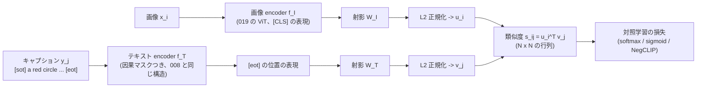

この記事は前編(理論編)です。続きは [こちら](https://zenn.dev/kojikojiprg/books/ai-theories-roadmap/viewer/020_clip_contrastive_learning-practice-1)。

# 020. CLIP と対照学習 / CLIP and Contrastive Learning

## 1. 概要 / Overview

CLIP(Contrastive Language-Image Pre-training)は、画像とその説明文の組から、**どの文がどの画像に対応するか** を当てる対照学習
(Contrastive Learning)で、画像 encoder とテキスト encoder を同時に学習する(Radford et al. [1])。学習後は、クラス名から作った文の
埋め込みを分類器の重みとして使うことで、事前に決めたクラスの集合に依存しない zero-shot 分類ができる。本トピックでは、019 の ViT を
画像 encoder、因果マスクつきの Transformer(008 の小型 GPT と同じ構造)をテキスト encoder とする二重 encoder(dual encoder)を
スクラッチ実装し、規則で生成した合成の画像とキャプション(2 つの図形の色・形・位置関係)で学習する。学習に一度も出てこない
(色, 形) の組み合わせを含む画像での zero-shot の検索を指標として、(A)sigmoid 損失(SigLIP [4])の softmax 損失(InfoNCE [2])に
対する優位が、バッチサイズが大きいほど縮むか、(B)標準の対照学習で、語順・属性の結びつきが問われる 2 択の正解率が、ランダムな
負例との 2 択より低いか(bag-of-words 化 [5])、(C)困難な負例(hard negative)のキャプションを分母に加える NegCLIP [5] で、その
正解率が上がるか、を検証する。画像とテキストの埋め込みが別々の領域に分かれる modality gap [6] は、判定なしで観察する。

### 1.1 実行の手順

本番実行は Google Colab T4 の **1 つのセッションで完結** させる。5.1 節のセットアップセルで`SMOKE_TEST = False`にして、
「すべてのセルを実行」する。

実行時間の予算は 1 セッションあたり **T4 で 120 分** とする。学習を始める前に(6.4 節)、T4 上でのスケーリングの計測(6.3 節)から、
1 ステップの実行の方式(FP16 / FP32 / FP32 と CUDA graph)を見積もりのみで選び、12 通りの **実行計画**(6.1 節。学習で見る事例数
$E \in \{2^{19}, 2^{18}\}$ と **削る段階** 0〜3 と学習率の較正の方式の組)のそれぞれについて残りの実行時間を見積もり、予算に収まる
計画のうち優先順位の最も高いものを自動で選ぶ。選択は見積もりのみに基づき、どの実験の結果も参照しない。**選ばれた実行の方式・
計画・$E$・段階・較正の方式は 6.4 節の出力に印字される。** 事前の計測のための実行やセッションの分割はしない。

**見積もりが予算を超える場合は、学習の前に停止する。その場合は結果の情報を何も得ていないので、実行条件(判定基準・水準・前提条件
以外)を直して再実行する。** 最初の本番の実行(コミット`81adad2`)は、この規則により学習の前に停止した。その経緯と対応は 6.2 節の
「停止した本番の実行」に記録した。

実験 C の NegCLIP・シード 0 のモデル(両方の encoder と射影)は、[021](https://github.com/kojikojiprg/ai-theories/blob/main/theories/05_vision_language/021_llava_visual_instruction_tuning.ipynb) の入力になりうるので Hugging Face Hub の
`kojikojiprg/ai-theories-clip-synthetic-scenes`にアップロードする(6.13 節)。アップロードは`UPLOAD_ARTIFACTS = True`にしたときだけ
行う(既定は`False`、`SMOKE_TEST`とは独立)。

### 1.2 本番実行の結果の要約

本番実行(Google Colab T4、コミット`65257e0`、1 回)では、実行の方式として`fp32_eager`が選ばれ(CUDA graph は等価性の確認の閾値をわずかに
超えて候補から外れた)、最下位の **計画 11**($E = 2^{18}$・段階 3・学習率の較正の方式`"representative"`、3 シード)が選ばれた。事前に宣言した
基準による最終判定は次のとおりである(7 節)。

- **実験 A**(負例数と損失関数の交互作用): **支持**。ただし、sigmoid 損失は $N = 16$ でも $N = 256$ でも softmax 損失を下回った
  ($\Delta_{16} = -0.091$、$\Delta_{256} = -0.185$)。支持されたのは「sigmoid の相対的な劣位が $N$ とともに拡大する」向きの交互作用であり、
  「小さいバッチでは sigmoid が優位」という原論文の主張そのものは、本トピックの条件では再現されなかった。
- **実験 B**(bag-of-words 化の存在): **判定不能**(天井効果)。困難な負例との 2 択もランダムな負例との 2 択も正解率が約 0.999 で、差がほぼ 0 だった。
- **実験 C**(NegCLIP による改善): **判定不能**(天井効果)。標準のモデルの 2 択の正解率がすでに約 0.999 で、改善の余地がなかった。
  診断量の未見の組み合わせの検索の正解率 $M$ は、NegCLIP のほうが +0.0295 高かった。
- **modality gap**(判定なし): sigmoid・$N = 256$ だけが学習後も大きい gap(0.67)を残した。

NegCLIP・シード 0 のモデルは、Hugging Face Hub の`kojikojiprg/ai-theories-clip-synthetic-scenes`にアップロードした(7.8 節)。

## 2. 参考論文 / References

1. Radford, A., Kim, J. W., Hallacy, C., Ramesh, A., Goh, G., Agarwal, S., Sastry, G., Askell, A., Mishkin, P., Clark, J., Krueger, G.,
   Sutskever, I., "Learning Transferable Visual Models From Natural Language Supervision", ICML 2021.
   https://arxiv.org/abs/2103.00020(本トピックの原典。3.1〜3.3・3.6・3.9 節)
2. van den Oord, A., Li, Y., Vinyals, O., "Representation Learning with Contrastive Predictive Coding", arXiv 2018.
   https://arxiv.org/abs/1807.03748(InfoNCE 損失と相互情報量の下界。3.3・3.4 節)
3. Poole, B., Ozair, S., van den Oord, A., Alemi, A. A., Tucker, G., "On Variational Bounds of Mutual Information", ICML 2019.
   https://arxiv.org/abs/1905.06922(InfoNCE の下界の厳密な導出と $\log K$ による頭打ち。3.4 節)
4. Zhai, X., Mustafa, B., Kolesnikov, A., Beyer, L., "Sigmoid Loss for Language Image Pre-Training", ICCV 2023.
   https://arxiv.org/abs/2303.15343(SigLIP。3.5 節、実験 A)
5. Yuksekgonul, M., Bianchi, F., Kalluri, P., Jurafsky, D., Zou, J.,
   "When and Why Vision-Language Models Behave like Bags-Of-Words, and What to Do About It?", ICLR 2023.
   https://arxiv.org/abs/2210.01936(bag-of-words 化と NegCLIP。3.7 節、実験 B・C)
6. Liang, W., Zhang, Y., Kwon, Y., Yeung, S., Zou, J.,
   "Mind the Gap: Understanding the Modality Gap in Multi-modal Contrastive Representation Learning", NeurIPS 2022.
   https://arxiv.org/abs/2203.02053(modality gap。3.8 節、6.10 節の観察)
7. Zhai, X., Wang, X., Mustafa, B., Steiner, A., Keysers, D., Kolesnikov, A., Beyer, L.,
   "LiT: Zero-Shot Transfer with Locked-image text Tuning", CVPR 2022. https://arxiv.org/abs/2111.07991(3.9 節、位置づけのみ)
8. Jia, C., Yang, Y., Xia, Y., Chen, Y.-T., Parekh, Z., Pham, H., Le, Q. V., Sung, Y., Li, Z., Duerig, T.,
   "Scaling Up Visual and Vision-Language Representation Learning With Noisy Text Supervision", ICML 2021.
   https://arxiv.org/abs/2102.05918(ALIGN。3.9 節、位置づけのみ)
9. Dosovitskiy, A., Beyer, L., Kolesnikov, A., Weissenborn, D., Zhai, X., Unterthiner, T., Dehghani, M., Minderer, M.,
   Heigold, G., Gelly, S., Uszkoreit, J., Houlsby, N.,
   "An Image is Worth 16x16 Words: Transformers for Image Recognition at Scale", ICLR 2021.
   https://arxiv.org/abs/2010.11929(ViT。画像 encoder、3.2 節)

本文で用いる既存トピックの部品: 多頭注意機構(Multi-Head Attention)と Decoder Block は
[001](https://zenn.dev/kojikojiprg/books/ai-theories-roadmap/viewer/001_attention_mechanism-theory)・[002](https://zenn.dev/kojikojiprg/books/ai-theories-roadmap/viewer/002_transformer_block-theory)、GELU は
[004](https://zenn.dev/kojikojiprg/books/ai-theories-roadmap/viewer/004_normalization_and_activation-theory)、因果マスクつきの decoder-only のモデルは
[006](https://zenn.dev/kojikojiprg/books/ai-theories-roadmap/viewer/006_pretraining_small_gpt-theory)・[008](https://zenn.dev/kojikojiprg/books/ai-theories-roadmap/viewer/008_decoding_strategies-theory)、AdamW・warmup + cosine・
gradient clipping は [007](https://zenn.dev/kojikojiprg/books/ai-theories-roadmap/viewer/007_training_stabilization-theory)、混合精度学習は
[011](https://zenn.dev/kojikojiprg/books/ai-theories-roadmap/viewer/011_mixed_precision_training-theory)、ViT は [019](https://zenn.dev/kojikojiprg/books/ai-theories-roadmap/viewer/019_vision_transformer-theory) で扱った。

## 3. 理論 / Theory

### 3.1 動機: 自然言語を教師信号にする

019 の ViT は、CIFAR-10 の 10 クラスのように **事前に決めたクラスの集合** のラベルで学習した。この方式には 2 つの制約がある。
(1)ラベル付けに人手がかかり、データの規模を増やしにくい。(2)学習したモデルが出力できるのは学習時のクラスだけであり、
新しいクラスを認識させるには、そのクラスのラベル付きデータで追加の学習が要る。

CLIP(Contrastive Language-Image Pre-training、Radford et al. [1])は、インターネットから集めた画像とその説明文(alt テキストなど)の
組 4 億個を使い、**どの文がどの画像に付いていたかを当てる** 課題で、画像 encoder とテキスト encoder を同時に学習する。自然言語は
人手のラベル付けなしに大量に集まり、しかも「クラスの集合」に縛られない。学習後は、クラス名から作った文(例: `a photo of a dog.`)の
テキストの埋め込みを分類器の重みとして使えば、**そのクラスの画像を 1 枚も学習していなくても** 分類できる(zero-shot 分類、3.6 節)。

原論文(2.3 節)は、画像から説明文を生成する予測的な目的関数よりも、正しい組を選ぶ **対照的な(contrastive)** 目的関数のほうが、
同じ zero-shot の正解率に達するまでの学習の効率が高かったと報告している。文の正確な単語列を当てるより、「どの文が対応するか」を
区別するほうが易しい課題であるためと説明されている。

本トピックでは、この対照学習を、規則で生成した合成の画像とキャプションでスクラッチ実装する。合成データなので、
(1)学習に一度も出てこない (色, 形) の組み合わせを含む画像で zero-shot の検索を評価でき、(2)語順や属性の結びつきだけが
異なる困難な負例(hard negative)を規則で正確に作れる。

### 3.2 二重 encoder(Dual Encoder)の構造

**記号**:

- $x$: 画像、$y$: テキスト(トークン列)。$N$: バッチサイズ。$(x_i, y_i)$($i = 1, \dots, N$)がバッチ内の正例の組。
- $f_I$: 画像 encoder。019 の ViT で、最終層の [CLS] トークンの位置の表現を層正規化したもの $f_I(x) \in \mathbb{R}^{d_i}$ を返す($d_i$ は画像 encoder の出力次元)。
- $f_T$: テキスト encoder。因果マスクつきの Transformer で、終端トークン(`<eot>`)の位置の表現を層正規化したもの $f_T(y) \in \mathbb{R}^{d_t}$ を返す($d_t$ はテキスト encoder の出力次元)。
- $W_I \in \mathbb{R}^{d_i \times d_e}$・$W_T \in \mathbb{R}^{d_t \times d_e}$: 共通の埋め込み空間(次元 $d_e$)への線形射影(バイアスなし)。
  記号 $d_i$・$d_t$・$d_e$ は CLIP の原論文の図 3 の擬似コードに従う(本トピックでは $E$ を学習で見る事例数に使う)。
- 埋め込み: $u_i = \dfrac{f_I(x_i) W_I}{\lVert f_I(x_i) W_I \rVert}$、$v_j = \dfrac{f_T(y_j) W_T}{\lVert f_T(y_j) W_T \rVert}$(L2 正規化して単位球面に載せる)。
- 類似度: $s_{ij} = u_i^\top v_j \in [-1, 1]$(コサイン類似度)。

**テキスト encoder**: 原論文(2.4 節)のテキスト encoder は、GPT-2 と同じ因果マスクつき(masked self-attention)の Transformer であり、
系列の先頭と末尾に開始・終端のトークンを置き、**最終層の終端トークンの位置の活性化** を層正規化して線形射影したものを文の表現とする。
因果マスクは、事前学習済みの言語モデルで初期化したり、言語モデルの損失を補助的に加えたりする余地を残すために使われている。
これは 008 の小型 GPT(`GPTLanguageModel`)と同じ構造(002 の Decoder Block を交差注意なしで積み、因果マスクを掛ける)であり、
違いは、語彙への射影で次のトークンを予測する代わりに、終端トークンの位置の特徴を文の埋め込みにする点である。因果マスクのもとでは、
終端トークンの位置は文の全トークンを参照できる唯一の位置であり、それより後ろのパディングは終端トークンの特徴に影響しない
(5.4 節で確かめる)。位置の情報は、CLIP と同じ学習可能な絶対位置埋め込みで与える(008 は RoPE)。



### 3.3 対称な InfoNCE 損失と学習可能な温度

**記号**(3.2 節に加えて): $\tau > 0$ は温度(temperature)、$t = \log(1/\tau)$ は温度を表す学習可能なスカラー、$\ell_{ij} = e^{t} s_{ij} = s_{ij}/\tau$ は logits である。

CLIP の損失は、類似度の行列 $\ell \in \mathbb{R}^{N \times N}$ の各行(画像 → テキスト)と各列(テキスト → 画像)を、それぞれ $N$ クラスの
分類とみなした交差エントロピーの平均である(原論文の図 3 の擬似コード)。

$$
\mathcal{L}_{I \to T} = -\frac{1}{N} \sum_{i=1}^{N} \log \frac{\exp(\ell_{ii})}{\sum_{j=1}^{N} \exp(\ell_{ij})}, \qquad
\mathcal{L}_{T \to I} = -\frac{1}{N} \sum_{i=1}^{N} \log \frac{\exp(\ell_{ii})}{\sum_{j=1}^{N} \exp(\ell_{ji})}, \qquad
\mathcal{L}_{\mathrm{CLIP}} = \frac{1}{2}\left(\mathcal{L}_{I \to T} + \mathcal{L}_{T \to I}\right)
$$

各項は、van den Oord et al. [2] の InfoNCE 損失(3.4 節)と同じ形である。

**温度の扱い**: 埋め込みは単位球面上にあるので $s_{ij} \in [-1, 1]$ であり、そのままでは logits の幅が 2 しかなく、softmax の出力が
一様分布から離れられない。$1/\tau$ 倍して幅を広げる。原論文(2.5 節)は $\tau$ を手で調整する代わりに、対数でパラメータ化した
$t = \log(1/\tau)$ を学習し、初期値を $\tau = 0.07$ とし、学習が不安定にならないよう logits の倍率 $e^t$ を 100 以下に切り詰める。
本実装も同じく、各ステップの更新の後に $t \le \log 100$ に切り詰める。

**勾配と負例の役割**: 画像 → テキストの項の、類似度 $s_{ij}$ に対する勾配は

$$
\frac{\partial \mathcal{L}_{I \to T}}{\partial s_{ij}} = \frac{1}{N \tau}\left(p_{ij} - \delta_{ij}\right), \qquad
p_{ij} = \frac{\exp(\ell_{ij})}{\sum_{k=1}^{N} \exp(\ell_{ik})}
$$

である($\delta_{ij}$ はクロネッカーのデルタ)。負例 $j \ne i$ を押し下げる力は、その負例の softmax の確率 $p_{ij}$ に比例する。すでに
正例と十分に見分けられている負例は $p_{ij} \approx 0$ で、学習に寄与しない。**損失が学習を促すのは、バッチの中にある見分けにくい
負例だけである。** 見分けるのに語順や属性の結びつきが必要な負例がバッチにほとんど現れなければ、それを学ぶ誘因は弱い(3.7 節)。

### 3.4 InfoNCE は相互情報量の下界であり、下界は $\log N$ で頭打ちになる

**記号**: $(X, Y)$ は同時分布 $p(x, y)$ に従う確率変数(画像とテキスト)、$p(x)$・$p(y)$ は周辺分布、
$I(X; Y) = \mathbb{E}_{p(x, y)}\left[\log \dfrac{p(x, y)}{p(x) p(y)}\right]$ は相互情報量(mutual information)。
$g(x, y)$ は任意の実数値の関数(critic。CLIP では $g(x, y) = \ell = s/\tau$)。$K$ は 1 つの問題の候補の数(CLIP では $K = N$)。

**設定**: $x_1$ とその正例 $y_1 \sim p(y \mid x_1)$ を 1 つ引き、負例 $y_2, \dots, y_K$ を周辺分布 $p(y)$ から独立に引く。InfoNCE 損失は

$$
\mathcal{L}_{\mathrm{NCE}} = -\mathbb{E}\left[\log \frac{e^{g(x_1, y_1)}}{\sum_{j=1}^{K} e^{g(x_1, y_j)}}\right]
$$

である。van den Oord et al. [2](2.3 節と付録)は、これが $I(X; Y) \ge \log K - \mathcal{L}_{\mathrm{NCE}}$ を満たすことを示した。
Poole et al. [3] は、これを NWJ の下界(Nguyen, Wainwright, Jordan の変分下界)から厳密に導いた。その道筋を示す。

**NWJ の下界**: 任意の関数 $h$ に対して $I(A; B) \ge \mathbb{E}_{p(a, b)}[h(a, b)] - e^{-1}\, \mathbb{E}_{p(a) p(b)}[e^{h(a, b)}]$。
これは KL ダイバージェンスの変分表現(Fenchel 双対)から得られる。

**導出**:

1. $A = X_1$、$B = Y_{1:K} = (y_1, \dots, y_K)$ とする。$y_2, \dots, y_K$ は $X_1$ とも $y_1$ とも独立なので、
   $I(X_1; Y_{1:K}) = I(X_1; y_1) = I(X; Y)$ である。
2. NWJ の下界に $h = 1 + \log \dfrac{e^{g(x_1, y_1)}}{a(x_1, y_{1:K})}$、$a(x_1, y_{1:K}) = \dfrac{1}{K} \sum_{j=1}^{K} e^{g(x_1, y_j)}$ を代入する。
3. 第 2 項の期待値は周辺分布の積 $p(x_1) p(y_{1:K})$ のもとでとる。このとき $y_1, \dots, y_K$ はすべて $x_1$ と独立に同じ分布に従うので、
   添字について対称であり、$\mathbb{E}\left[e^{g(x_1, y_1)}/a\right] = \frac{1}{K} \sum_{i=1}^{K} \mathbb{E}\left[e^{g(x_1, y_i)}/a\right] = \mathbb{E}[K a / (K a)] = 1$。
   よって $e^{-1}\, \mathbb{E}[e^{h}] = e^{-1} \cdot e \cdot 1 = 1$。
4. 代入すると $I(X; Y) \ge 1 + \mathbb{E}_{p}\left[\log \dfrac{e^{g(x_1, y_1)}}{a}\right] - 1
   = \mathbb{E}_{p}\left[\log \dfrac{e^{g(x_1, y_1)}}{\sum_j e^{g(x_1, y_j)}}\right] + \log K = \log K - \mathcal{L}_{\mathrm{NCE}}$。$\square$

**頭打ち**: $\sum_{j} e^{g(x_1, y_j)} \ge e^{g(x_1, y_1)}$ なので、期待値の中の対数は常に 0 以下であり、$\mathcal{L}_{\mathrm{NCE}} \ge 0$。したがって
下界 $\log K - \mathcal{L}_{\mathrm{NCE}}$ は **どんな critic を使っても $\log K$ を超えない**。真の相互情報量が $\log K$ より大きいとき、損失を
下げきっても下界はそこで止まる。CLIP では $K = N$(バッチサイズ)なので、負例の数 $N - 1$ を増やすほど、推定できる相互情報量の
上限が上がる。対照学習で大きなバッチが有利とされる理由の 1 つである(CLIP の原論文のバッチサイズは 32,768)。

**注意**: これは損失の値が表せる範囲についての主張であり、「バッチが大きいほど下流の正解率が上がる」ことを直接には意味しない。
また、本トピックのバッチは同じキャプションを重複させないように作る(5.3 節)ので、負例は $p(y)$ からの独立な抽出ではなく、
正例と異なるキャプションからの非復元抽出になる。上の導出の独立性の仮定からのずれである。

### 3.5 sigmoid 損失(SigLIP)

**記号**: $t'$ は学習可能なスカラー(倍率 $e^{t'}$ の対数)、$b$ は学習可能なバイアス、$z_{ij} = 1$($i = j$)または $-1$($i \ne j$)は
組 $(i, j)$ が正例かどうかのラベル、$\sigma(a) = 1/(1 + e^{-a})$ はシグモイド関数。

Zhai et al. [4] の SigLIP(Sigmoid Loss for Language Image Pre-training)は、$N^2$ 個の組のそれぞれを、正例か負例かの **独立な二値分類**
として扱う(原論文の Algorithm 1)。

$$
\mathcal{L}_{\mathrm{sig}} = -\frac{1}{N} \sum_{i=1}^{N} \sum_{j=1}^{N} \log \sigma\big(z_{ij} (e^{t'} s_{ij} + b)\big)
$$

- **初期値**: 原論文は $t' = \log 10$、$b = -10$ とする。バッチの組のうち正例は $N$ 個、負例は $N^2 - N$ 個で、負例が圧倒的に多い。
  $b = -10$ から始めると、初期状態の予測が「すべて負例」に近くなり、この不均衡による大きな初期の損失と勾配を避けられる。
- **softmax との違い**: softmax の損失は、各行・各列の分母 $\sum_j \exp(\ell_{ij})$ に **バッチ全体** が入る。1 つの組の損失が、同じ
  バッチの他のすべての組に依存する(分散学習では全デバイスの埋め込みを集め、正規化のために行方向と列方向の 2 回の集計が要る)。
  sigmoid の損失は組ごとに独立で、バッチ全体の正規化を要しない。
- **原論文の主張**(本トピックの実験 A の対象): 小さいバッチでは sigmoid の損失が softmax の損失より明らかに優れ、バッチを大きく
  するにつれて差が縮む(原論文のバッチサイズの比較)。原論文の比較は本トピックよりはるかに大きいバッチ(数百以上)であり、本トピックの
  $N \in \{16, 64, 256\}$ はそれよりずっと小さい。本トピックは、同じ傾向が小さい規模でも現れるかを確かめる。
- softmax の損失は行ごとに定数を加えても変わらないので、バイアス $b$ は意味を持たない。本実装では、softmax の損失のときバイアスの
  パラメータを持つが損失に使わない(勾配が計算されず、更新されない)。

sigmoid の損失は 3.4 節の InfoNCE の形ではないので、「下界が $\log N$ で頭打ちになる」という議論はそのままは当てはまらない。
各負例の組が、正規化の分母を通さずに直接損失に入る点が、バッチサイズへの依存の違いの源になっている。

### 3.6 zero-shot 分類・prompt・線形 probe(位置づけ)

- **zero-shot 分類**: クラス $k$ の名前から文 $y_k$(例: `a photo of a {label}.`)を作り、その埋め込み $v_k$ を分類器の重みとして、
  $\hat{k} = \arg\max_k u^\top v_k$ で予測する。学習時に特定のクラスの集合を使わないので、評価のたびにクラスの集合を変えられる。
  本トピックの評価(6.1 節)は、候補のキャプションの集合を「クラス」とみなした、同じ形の検索である。
- **prompt テンプレートと prompt ensembling**(原論文 3.1.4 節): クラス名 1 語だけでは、学習データの文(説明文)と分布が違ううえ、
  多義語の区別もつかない。`a photo of a {label}.`のようなテンプレートに埋めるだけで正解率が上がり、さらに複数のテンプレート
  (ImageNet では 80 個)から作った埋め込みを平均すると上がる。原論文は、この 2 つで ImageNet の正解率がおよそ 5 ポイント上がったと
  報告している。本トピックのキャプションは規則で生成するので、学習と評価で文の形が一致しており、テンプレートは使わない。
- **線形 probe との比較**(原論文 3.1.5 節・3.2 節): 画像 encoder を固定して、その特徴にロジスティック回帰を学習する評価(線形 probe)と
  比べた。原論文は、zero-shot の CLIP が、27 のデータセットのうち 16 で、ResNet-50 の特徴に対する全データの線形 probe を上回ったと
  報告している。一方、同じ CLIP の特徴に対する線形 probe は zero-shot より高く、zero-shot は特徴の持つ情報をすべて引き出しては
  いない。本トピックでは線形 probe は扱わない。

### 3.7 bag-of-words 化と NegCLIP

**現象**: Yuksekgonul et al. [5] は、属性の結びつき(`the paved road and the white house`と`the white road and the paved house`)、
関係(`the horse is eating the grass`と`the grass is eating the horse`)、語順の入れ替えを見分ける課題(ARO ベンチマーク)で、CLIP を
含む Vision-Language モデルの正解率がチャンス水準の付近かそれ以下になることを示した。単語の集合(bag of words)としては同じ 2 つの
文を区別できないので、モデルは文を **単語の袋として** 扱っている(bag-of-words 化)、と解釈される。

**原因の説明**: 対照学習で文を正しく選ぶには、バッチ内の負例と区別できれば十分である。ランダムに集めた負例の文は、
正例の文と単語そのものが違うことがほとんどで、**単語の集合を見るだけで見分けられる**。3.3 節の勾配の式のとおり、損失は見分けにくい
負例にしか学習を促さないので、語順や属性の結びつきを表現する誘因が弱い。

**NegCLIP**: 語順や属性を入れ替えた **困難な負例のキャプション** を規則で作り、画像 → テキスト方向の分母に加える。
記号: $\tilde{v}_k$($k = 1, \dots, M$)は、バッチ内の各正例のキャプションから作った困難な負例の埋め込み($M$ はバッチ全体の困難な負例の数)。

$$
\mathcal{L}^{\mathrm{neg}}_{I \to T} = -\frac{1}{N} \sum_{i=1}^{N} \log
\frac{\exp(\ell_{ii})}{\sum_{j=1}^{N} \exp(\ell_{ij}) + \sum_{k=1}^{M} \exp(u_i^\top \tilde{v}_k / \tau)}, \qquad
\mathcal{L}_{\mathrm{NegCLIP}} = \frac{1}{2}\left(\mathcal{L}^{\mathrm{neg}}_{I \to T} + \mathcal{L}_{T \to I}\right)
$$

困難な負例は画像を持たないので、テキスト → 画像の項は変わらない。原論文は、これに加えて **困難な負例の画像**(埋め込みが近い別の画像)
もバッチに加え、COCO で CLIP を微調整した。本トピックは画像の困難な負例を加えず、テキストの困難な負例のみの効果を見る(実験 C)。

**本トピックの困難な負例**(5.3 節): 2 つの図形の **色の入れ替え**(属性の入れ替え)と、関係語を保ったままの **図形の入れ替え**(順序の
入れ替え)。どちらも元のキャプションと単語の多重集合が同じで、単語の袋としては区別できない。

**学習中の困難な負例から、除外した組を含むキャプションを除く**: 学習用のキャプションの色を入れ替えると、除外した (色, 形) の組
(5.3 節)を含むキャプションになることがある(学習用の 1,444 個のうち 700 個、約 48%)。これを困難な負例として分母に入れると、
テキスト encoder が学習中に除外した組を含むキャプションを見ることになり、「学習に一度も出てこない組み合わせ」で評価するという前提が
崩れる。そこで、NegCLIP の学習では、除外した組を含むキャプションを困難な負例に使わない(テキスト encoder に入れず、分母にも加えない)。
順序の入れ替えは同じ 2 つの図形を使うので、常に学習用のキャプションのままであり、影響を受けない。その結果、色の入れ替えの困難な負例を
持つ正例は約 52% になる。

**本トピックの設定での注意**: 実画像のキャプションの空間に比べて、合成のキャプションの空間は小さい(学習用 1,444 個)。そのため、
標準の対照学習でも、あるキャプションの順序を入れ替えたキャプションが、偶然同じバッチの別の正例として現れることがある。その確率は
バッチの他の $N - 1$ 個のキャプションが残りの 1,443 個から一様に選ばれることから $(N - 1)/1443$ であり、$N = 16$ で約 1.0%、
$N = 64$ で約 4.4%、$N = 256$ で約 17.7% になる。色の入れ替えのキャプションが学習用として存在するのは正例の約 52% だけなので、
色の入れ替えが偶然同じバッチに入る確率は、存在する場合の $(N - 1)/1443$ に存在の割合を掛けた平均で、$N = 16$ で約 0.5%、$N = 64$ で
約 2.3%、$N = 256$ で約 9.1% と低い(5.3 節の出力)。**標準の学習にも困難な負例がある程度含まれ、その量がバッチ
サイズとともに増える** ことは、実画像での状況との違いであり、実験 A・B の解釈で考慮する。色を 8 色・形を 5 種類にしてキャプションの
空間を広げたのは、この確率を下げるためである(6 色・4 種類で同じ割合の組を除くと、学習用のキャプションは 456 個になり、$N = 256$ で約 56% になる。5.3 節の出力)。

### 3.8 modality gap

Liang et al. [6] は、CLIP の画像の埋め込みとテキストの埋め込みが、単位球面上の **別々の狭い領域(円錐)** に分かれて分布することを示し、
modality gap と名付けた。2 つの重心の差の大きさで測る。

$$
\Delta_{\mathrm{gap}} = \left\lVert \frac{1}{n} \sum_{i=1}^{n} u_i - \frac{1}{n} \sum_{i=1}^{n} v_i \right\rVert
$$

($u_i$・$v_i$ は対応する画像とテキストの埋め込み、$n$ は組の数)。原論文の説明は 2 段である。(1)深いネットワークは、乱数で初期化
した時点で、入力をすべて狭い円錐に写す(cone effect)。画像とテキストの encoder は別々に初期化されるので、最初から別の円錐にある。
(2)温度の低い対照学習の損失には、この隔たりを保つ局所的な平衡があり、学習で隔たりが消えない。本トピックでは、学習前(初期化の時点)
と学習後の $\Delta_{\mathrm{gap}}$ を記録し、2 次元への射影図を示す。**判定基準を設けない観察とする**(6.10 節)。

### 3.9 位置づけのみ扱うもの

- **LiT**(Locked-image text Tuning、Zhai et al. [7]): 事前学習済みの画像 encoder を **固定し**、テキスト encoder だけを対照学習で学習する。
  画像 encoder を固定すると、画像側の表現の質(大規模な画像分類で事前学習したもの)を保ったまま、比較的少ない画像とテキストの組で
  zero-shot の能力を得られると報告している。本トピックは両方の encoder をスクラッチから同時に学習する。
- **ALIGN**(Jia et al. [8]): 18 億の、ほとんど整理していない(noisy な)alt テキストと画像の組で、EfficientNet と BERT の二重 encoder を、
  CLIP と同じ形の正規化した softmax の対照損失で学習した。データの雑音を規模で補えることを示した。
- **実画像での CLIP の結果**(Radford et al. [1]): 最大のモデル(ViT-L/14 を 336 画素で学習したもの)は、ImageNet の訓練データを一切使わない
  zero-shot で top-1 の正解率 76.2% に達し、ImageNet で教師あり学習した ResNet-50 と同程度になった。また、ImageNet の分布をずらした
  評価集合(スケッチや敵対的に集めた画像など)での正解率の低下が、ImageNet で学習したモデルより小さかった。本トピックの合成データの
  結果は、これらの実画像での結果の再現ではない。

### 3.10 アルゴリズム(擬似コード)

```
入力: 学習用のシーン(画像とキャプションの番号)、バッチサイズ N、損失の種類(softmax / sigmoid / negclip)
各ステップ:
  1. 学習用のキャプションから N 個を重複なく選び、それぞれのシーンを 1 つずつ取り出す    # バッチ内のキャプションは互いに異なる
  2. u = normalize(f_I(images) @ W_I)、v = normalize(f_T(tokens) @ W_T)                 # (N, d_e)
  3. softmax:  logits = exp(t) * u @ v^T;  loss = (CE(logits, arange) + CE(logits^T, arange)) / 2
     sigmoid:  logits = exp(t') * u @ v^T + b;  z = 2 * eye(N) - 1;  loss = -sum(log_sigmoid(z * logits)) / N
     negclip:  困難な負例 = 正例ごとの色の入れ替え・順序の入れ替えのうち、除外した組を含まないもの   # 除外した組は学習で見せない
               v_neg = normalize(f_T(困難な負例の tokens) @ W_T)
               logits_i2t = exp(t) * u @ [v; v_neg]^T  (正例と同じキャプションになった負例の列は -inf)
               loss = (CE(logits_i2t, arange) + CE(exp(t) * v @ u^T, arange)) / 2
  4. 逆伝播、gradient clipping、AdamW の更新。softmax・negclip では t <= log 100 に切り詰める
評価(zero-shot の検索): 画像 u と候補のキャプション全体 v_1..v_C の類似度の argmax が正解なら正答
```


## 元ノートブック(実装の全文はこちら)

https://github.com/kojikojiprg/ai-theories/blob/main/theories/05_vision_language/020_clip_contrastive_learning.ipynb
