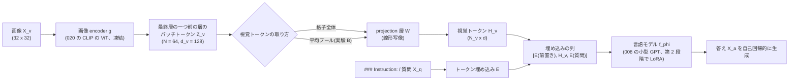

この記事は前編(理論編)です。続きは [こちら](https://zenn.dev/kojikojiprg/books/ai-theories-roadmap/viewer/021_llava_visual_instruction_tuning-practice-1)。

# 021. LLaVA 型 Vision-Language 連結と視覚指示チューニング / LLaVA-style Vision-Language Connection and Visual Instruction Tuning

## 1. 概要 / Overview

LLaVA(Large Language and Vision Assistant、Liu et al. [1])は、事前学習済みの画像 encoder と大規模言語モデル(Large Language Model)を、**projection 層**
という小さな写像でつなぐだけで、画像についての指示に答えるモデルを作る。画像 encoder のパッチ特徴を projection 層で言語モデルの
埋め込み空間に写し、テキストのトークン埋め込みと並べて言語モデルに入力する。学習は 2 段階で、第 1 段階(特徴の整列)では
projection 層だけを学習して視覚特徴を言語モデルの語彙の埋め込みと整列させ、第 2 段階(視覚指示チューニング)では projection 層と
言語モデルを学習して指示への応答を学ぶ。本トピックでは、020 の CLIP の画像 encoder(凍結)と 008 の小型 GPT を、この構成で
スクラッチ実装の部品からつなぎ、020 の合成のシーン(2 つの図形の色・形・位置関係)について規則で生成した質問(色・位置関係)に
答えさせる。貪欲復号による生成の完全一致を指標として、(A)第 1 段階が、第 2 段階の学習量を揃えたときの正解率を上げるか、
(B)視覚トークンをパッチトークンの格子全体から平均プールの 1 トークンに置き換えたときの正解率の低下が、色の質問より位置関係の
質問で大きいか、を検証する。

### 1.1 実行の手順

本番実行は Google Colab T4 の **1 つのセッションで完結** させる。5.1 節のセットアップセルで`SMOKE_TEST = False`にして、
「すべてのセルを実行」する。

実行時間の予算は 1 セッションあたり **T4 で 120 分** とする。学習を始める前に(6.4 節)、T4 上でのスケーリングの計測(6.3 節)から、
8 通りの **実行計画**(6.1 節。**削る段階** 0〜3 と学習率の較正の方式の組)のそれぞれについて残りの実行時間を見積もり、予算に
収まる計画のうち優先順位の最も高いものを自動で選ぶ。選択は見積もりのみに基づき、どの実験の結果も参照しない。**選ばれた計画・
段階・較正の方式は 6.4 節の出力に印字される。** 事前の計測のための実行やセッションの分割はしない。

**見積もりが最も下位の計画でも予算を超える場合は、学習の前に停止する。** その場合は結果の情報を何も得ていないので、実行条件
(判定基準・水準・前提条件以外)を直して再実行する。

学習したモデルは、すべて条件間の比較のためのものであり、Hugging Face Hub にはアップロードしない。

### 1.2 本番実行の結果の要約

本番実行(Google Colab T4、コミット`7cc0ceb`、1 回、全体 45.1 分)では、8 通りの計画がすべて予算に収まり、最上位の **計画 0**(段階 0・
較正の方式`"all"`、P・R・L・M とも 5 シード)が選ばれた。事前に宣言した基準による最終判定は次のとおりである(7 節)。前提条件
(P0〜P3)は両実験ですべて成立しており、「前提不成立」ではない。

- **実験 A**(第 1 段階の効果): **判定不能**。対比量 $\Delta_A = -0.0116$ に対して閾値は $2\sigma_A = 0.0354$ で、支持の条件も反証の条件も
  満たさなかった。
- **実験 B**(視覚トークンの取り方 × 質問の種類): **判定不能**。対比量 $\Delta_B = +0.0683$ に対して閾値は $2\sigma_B = 0.1020$ で、支持の条件も
  反証の条件も満たさなかった。

以下は **事後的な解釈であり、検証済みの結論ではない**(7.6 節)。

- 第 1 段階の効果は、第 2 段階の開始時の検証集合の負の対数尤度(P 3.249・R 6.912)には大きく現れたが、第 2 段階の 25% の時点では差が
  なくなっていた(0.1443・0.1441)。総ステップ数を P に揃えた第 2 段階のみの条件 L(判定なしの診断量)の正解率が最も高かった
  (平均 0.8033。P 0.7266、R 0.7382)。
- 線形プローブ(判定なしの診断量)では、平均プールの特徴からも図形の配置が 0.80 の正解率で読み出せた。一方、平均プールの条件 M の
  位置関係の質問の正解率は 0.5205 にとどまった。ボトルネックは視覚トークンの情報ではなく、言語モデル側の学習にある可能性がある。
- 標準偏差のほとんどはシード間のばらつきであり(実験 B で 0.0506 のうちブートストラップは 0.0064)、位置関係の質問の正解率が
  シードによって大きく違った。

## 2. 参考論文 / References

1. Liu, H., Li, C., Wu, Q., Lee, Y. J., "Visual Instruction Tuning", NeurIPS 2023. https://arxiv.org/abs/2304.08485
   (LLaVA。本トピックの原典。3.1〜3.6 節、実験 A・B)
2. Liu, H., Li, C., Li, Y., Lee, Y. J., "Improved Baselines with Visual Instruction Tuning", CVPR 2024.
   https://arxiv.org/abs/2310.03744(LLaVA-1.5。2 層の多層パーセプトロンの projection 層。3.3 節)
3. Radford, A., Kim, J. W., Hallacy, C., Ramesh, A., Goh, G., Agarwal, S., Sastry, G., Askell, A., Mishkin, P., Clark, J., Krueger, G.,
   Sutskever, I., "Learning Transferable Visual Models From Natural Language Supervision", ICML 2021.
   https://arxiv.org/abs/2103.00020(CLIP。画像 encoder の由来。3.4 節)
4. Hu, E. J., Shen, Y., Wallis, P., Allen-Zhu, Z., Li, Y., Wang, S., Wang, L., Chen, W.,
   "LoRA: Low-Rank Adaptation of Large Language Models", ICLR 2022. https://arxiv.org/abs/2106.09685(第 2 段階の LoRA。3.5 節)
5. Alayrac, J.-B., Donahue, J., Luc, P., Miech, A., Barr, I., Hasson, Y., Lenc, K., Mensch, A., Millican, K., Reynolds, M., Ring, R.,
   Rutherford, E., Cabi, S., Han, T., Gong, Z., Samangooei, S., Monteiro, M., Menick, J., Borgeaud, S., Brock, A., Nematzadeh, A.,
   Sharifzadeh, S., Binkowski, M., Barreira, R., Vinyals, O., Zisserman, A., Simonyan, K.,
   "Flamingo: a Visual Language Model for Few-Shot Learning", NeurIPS 2022. https://arxiv.org/abs/2204.14198(3.7 節、位置づけのみ)
6. Li, J., Li, D., Savarese, S., Hoi, S.,
   "BLIP-2: Bootstrapping Language-Image Pre-training with Frozen Image Encoders and Large Language Models", ICML 2023.
   https://arxiv.org/abs/2301.12597(Q-Former。3.7 節、位置づけのみ)
7. Tsimpoukelli, M., Menick, J., Cabi, S., Eslami, S. M. A., Vinyals, O., Hill, F.,
   "Multimodal Few-Shot Learning with Frozen Language Models", NeurIPS 2021. https://arxiv.org/abs/2106.13884
   (凍結した言語モデルに視覚特徴を接頭の埋め込みとして与える先行例。3.7 節、位置づけのみ)
8. Alain, G., Bengio, Y., "Understanding intermediate layers using linear classifier probes", ICLR 2017 Workshop.
   https://arxiv.org/abs/1610.01644(線形プローブ。実験 B の診断量)
9. Dosovitskiy, A., Beyer, L., Kolesnikov, A., Weissenborn, D., Zhai, X., Unterthiner, T., Dehghani, M., Minderer, M.,
   Heigold, G., Gelly, S., Uszkoreit, J., Houlsby, N.,
   "An Image is Worth 16x16 Words: Transformers for Image Recognition at Scale", ICLR 2021.
   https://arxiv.org/abs/2010.11929(ViT。3.4・3.6 節)

本文で用いる既存トピックの部品: 自己注意の計算量は [001](https://zenn.dev/kojikojiprg/books/ai-theories-roadmap/viewer/001_attention_mechanism-theory)、小型 GPT と英語の
トークナイザは [006](https://zenn.dev/kojikojiprg/books/ai-theories-roadmap/viewer/006_pretraining_small_gpt-theory)・[008](https://zenn.dev/kojikojiprg/books/ai-theories-roadmap/viewer/008_decoding_strategies-theory)、
AdamW・warmup + cosine・gradient clipping は [007](https://zenn.dev/kojikojiprg/books/ai-theories-roadmap/viewer/007_training_stabilization-theory)、KV キャッシュは
[010](https://zenn.dev/kojikojiprg/books/ai-theories-roadmap/viewer/010_kv_cache_and_inference_compute-theory)、LoRA は [012](https://zenn.dev/kojikojiprg/books/ai-theories-roadmap/viewer/012_low_rank_adaptation-theory)、
チャットテンプレートと損失マスクは [016](https://zenn.dev/kojikojiprg/books/ai-theories-roadmap/viewer/016_supervised_fine_tuning-theory)、パッチ埋め込みと系列長 $N = HW/P^2$ は
[019](https://zenn.dev/kojikojiprg/books/ai-theories-roadmap/viewer/019_vision_transformer-theory)、CLIP の画像 encoder と合成のシーンは [020](https://zenn.dev/kojikojiprg/books/ai-theories-roadmap/viewer/020_clip_contrastive_learning-theory) で扱った。

## 3. 理論 / Theory

### 3.1 動機: 事前学習済みの部品を小さな写像でつなぐ

020 の CLIP は、画像とテキストを同じ埋め込み空間に写すが、できるのは「どの文がどの画像に対応するか」の判定(検索・zero-shot 分類)
までであり、画像について自由な形式の文を生成することはできない。一方、008 の小型 GPT のような言語モデルは文を生成できるが、
画像を入力に取れない。両者を **最初から一緒に学習し直す** のは、画像とテキストの組の大量のデータと計算を要する。

LLaVA(Liu et al. [1])は、事前学習済みの画像 encoder(CLIP の ViT-L/14)と事前学習済みの言語モデル(Vicuna)を、**どちらも
作り直さずに**、画像の特徴を言語モデルの入力の埋め込みの列に「単語のように」差し込むことでつなぐ。新しく学習するのは、画像の
特徴を言語モデルの埋め込みの次元に写す projection 層だけ(第 1 段階)と、指示に従うための言語モデルの調整(第 2 段階)である。
原論文は、指示データ(会話・詳細な説明・複雑な推論)を、画像のキャプションと物体の位置(bounding box)の記述を text-only の
GPT-4 に与えて生成した(画像そのものは GPT-4 に見せていない)。

本トピックでは、この構成を小さな規模でスクラッチ実装の部品から組み立てる。画像は 020 の合成のシーン(2 つの図形の色・形・位置関係)、
画像 encoder は 020 で学習した CLIP の画像 encoder(NegCLIP・シード 0、凍結)、言語モデルは 008 の小型 GPT である。指示データは、
原論文が GPT-4 に渡した「記号による画像の記述」に相当するシーンの意味(どの色のどの形が、どちらの側にあるか)から、規則で
質問と正解を作る(016 の合成の指示データと同じ考え方)。

### 3.2 全体の構成

**記号**(原論文の式 1〜3 の記号に従う):

- $X_v$: 画像。$X_q$: 指示(質問)、$X_a$: 答え(応答)。いずれもトークン列。
- $g$: 画像 encoder。$Z_v = g(X_v) \in \mathbb{R}^{N \times d_v}$ は画像のパッチ特徴の格子($N$ はパッチの数、$d_v$ は画像 encoder の
  隠れ次元)。どの層の特徴を使うかは 3.4 節。
- $W$: projection 層。$H_v = W \cdot Z_v \in \mathbb{R}^{N_v \times d}$ が **視覚トークン**($d$ は言語モデルの隠れ次元 $d_{\mathrm{model}}$、
  $N_v$ は視覚トークンの数。パッチトークン全体を使うなら $N_v = N$)。
- $H_q$: 指示のトークン埋め込みの列($H_q = E[X_q]$、$E$ は言語モデルのトークン埋め込み行列)。
- $f_\phi$: 言語モデル($\phi$ はそのパラメータ)。

LLaVA は、視覚トークン $H_v$ を指示の埋め込みの列 $H_q$ と **同じ系列に並べて** 言語モデルに入力し、答え $X_a$ を自己回帰的に生成する。
言語モデルから見ると、$H_v$ は「語彙にない単語」の埋め込みの列であり、言語モデル自体の構造は変わらない。

本トピックの系列は、016 のテンプレートに視覚トークンの枠を加えたものである(`<image>`の位置に $H_v$ を差し込む)。

```
### Instruction:
<image>
{質問}
### Response: {答え}
### End
```

`### Instruction:\n`(7 トークン)の直後に $N_v$ 個の視覚トークンを置くので、視覚トークンの枠の開始位置は全事例で共通である。



### 3.3 projection 層: 視覚特徴を言語モデルの埋め込み空間に写す

**線形写像(LLaVA [1])**: $H_v = Z_v W^\top + b$($W \in \mathbb{R}^{d \times d_v}$、$b \in \mathbb{R}^{d}$。$Z_v$ の各行(各パッチ)に同じ
写像を掛ける)。原論文は、これを「軽量な」接続として選び、より高度な接続(3.7 節の Flamingo の gated cross-attention や BLIP-2 の
Q-Former)は今後の課題とした。

**2 層の多層パーセプトロン(LLaVA-1.5 [2])**: $H_v = \mathrm{GELU}(Z_v W_1^\top + b_1) W_2^\top + b_2$。LLaVA-1.5 は、線形写像を
2 層の多層パーセプトロン(Multi-Layer Perceptron)に替えると、ベンチマークの性能が上がったと報告している。自己教師あり学習で
線形の射影頭を多層パーセプトロンに替えると表現が良くなるのと同様に、表現力の高い接続が有効であったと説明されている。

**写像の意味**: 言語モデルの入力の埋め込み空間では、トークン埋め込み行列 $E$ の各行が 1 つの語彙を表す。projection 層は、
視覚特徴をこの空間の中の「言語モデルが解釈できる位置」に置く役割を持つ。projection 層の出力は、$E$ のどの行とも一致する必要は
なく(連続的な「ソフトな単語」)、言語モデルの後段の層が、そこから必要な情報を読み出せればよい。第 1 段階(3.5 節)は、
キャプションの生成を通じて、この配置を学習する段階である。

**本トピックの扱い**: 実験では線形写像($d_v = 128 \to d = 256$、パラメータ数 $128 \times 256 + 256 = 33{,}024$)のみを使う。
2 層の多層パーセプトロンとの比較は **理論のみ** とし、判定を置かない(`src/models/llava.py`の`VisualProjection`は`kind="mlp"`で
2 層の版も構築できるが、実験では使わない)。

### 3.4 どの層の特徴を視覚トークンにするか

**原論文の選び方**: LLaVA は、CLIP の画像 encoder の **最終層の一つ前の層** の出力の格子特徴(パッチトークン)を使い、最終層の
特徴は使わない。原論文のアブレーション(ScienceQA)では、最終層の特徴を使うと正解率が一つ前の層より約 1 ポイント低かった。
著者らは、CLIP の最終層の特徴は画像全体の大域的・抽象的な性質に寄り、一つ前の層の特徴は細部の理解に役立つ局所的な性質を
保っているためだろうと説明している。CLIP の対照学習の損失が評価するのは画像全体の 1 つの埋め込みだけなので、最終層ほど
その目的に特化しやすい、という見方である。

**020 の画像 encoder での事情**: 020 の画像 encoder は、[CLS] トークンの最終層の表現 $y = \mathrm{LN}(z_L^0)$ だけを射影して埋め込みに
する(019 の式 4)。最終層($L = 4$ 層目)の **パッチの位置の出力** $z_L^1, \dots, z_L^N$ は、その後どこにも使われない。損失の勾配は
最終層のパッチの位置の計算を通らず、これらの出力は学習の目的から直接には制約されない。一方、最終層の一つ前の層のパッチトークン
$z_{L-1}^1, \dots, z_{L-1}^N$ は、最終層で [CLS] トークンが自己注意で参照する Key・Value になるので、「[CLS] トークンに画像の情報を
渡す」ように学習されている。[CLS] トークンで読み出すモデルでは、原論文の経験的な選び方に、この構造上の理由が加わる。本トピックは
原論文に従い、最終層の一つ前の層($L - 1 = 3$ ブロックを通した後)の残差の流れ(最終正規化の前)から、[CLS] トークンを除いた
$N = 64$ 個のパッチトークンを使う。

**位置の情報は直接の学習目標ではない**: 020 の対照学習は、画像全体の埋め込み(1 本のベクトル)とキャプションの埋め込みの一致を
学習する。キャプションには位置関係(`left of`・`above`)が含まれるので、[CLS] トークンの埋め込みは位置関係を表す必要があるが、
**各パッチトークンが自分の位置の内容を保っていること** は損失の対象ではない。パッチトークンには入力の時点で位置埋め込みが加わって
いるが、3 層の自己注意を経た後に、どのパッチトークンがどの位置の何を表しているかが線形に読み出せる形で残っているかは、学習の
目標から直接には保証されない。実験 B の診断量(パッチトークンから図形の位置を当てる線形プローブ、Alain & Bengio [8])は、この点を
確かめるためのものである。

### 3.5 2 段階の学習

**損失**(原論文の式 3): 答え $X_a = (x_1, \dots, x_L)$($L$ は答えのトークン数)について、

$$
p(X_a \mid X_v, X_q) = \prod_{i=1}^{L} p_\theta\left(x_i \mid X_v, X_q, X_{a,<i}\right), \qquad
\mathcal{L}(\theta) = -\sum_{i=1}^{L} \log p_\theta\left(x_i \mid X_v, X_q, X_{a,<i}\right)
$$

を最小化する。$\theta$ は学習するパラメータ、$X_{a,<i}$ は答えの $i$ 番目より前のトークンである。損失は **答えのトークンだけ** に掛け、
指示(と視覚トークン)の位置には掛けない(016 の損失マスク)。バッチの損失は、バッチ内の答えのトークンの数で割った平均とする
(016 の $\mathcal{L}_{\mathrm{mask}}$ と同じ正規化)。答えの終端記号(`### End`)も予測の対象に含める。

**第 1 段階: 特徴の整列のための事前学習(Pre-training for Feature Alignment)**

- 学習するもの: projection 層 $W$ のみ($\theta = W$)。画像 encoder と言語モデルは凍結する。
- データ: 画像とキャプションの組を、「画像を短く説明せよ」という指示とキャプションの答えの形に直したもの。原論文は CC3M から
  選んだ約 59.5 万組を 1 エポック学習した。
- 目的: 言語モデルを変えずに、視覚トークン $H_v$ を、言語モデルがその画像のキャプションを生成できるような埋め込みの位置に置く。
  原論文はこれを「凍結した言語モデルのための、互換性のある visual tokenizer を学習する」段階と説明している。言語モデルが凍結
  されているので、第 1 段階の後の視覚トークンは、言語モデルが元々持っている語彙の埋め込みの使い方に合わせた配置になる。

**第 2 段階: 視覚指示チューニング(Fine-tuning End-to-End)**

- 学習するもの: 原論文は projection 層と **言語モデルの全パラメータ**($\theta = \{W, \phi\}$)。画像 encoder は凍結のまま。
- データ: GPT-4 で生成した指示データ約 15.8 万件(会話・詳細な説明・複雑な推論)。原論文は 3 エポック学習した。
- 目的: 指示に従って、画像の内容に基づいて答えることを学ぶ。

**本トピックの対応と相違**:

| 項目 | 原論文(LLaVA) | 本トピック |
|---|---|---|
| 画像 encoder | CLIP ViT-L/14(凍結) | 020 の CLIP の画像 encoder(ViT、$P = 4$、凍結) |
| 言語モデル | Vicuna(13B) | 008 の小型 GPT(4 層、$d_{\mathrm{model}} = 256$、約 525 万パラメータ) |
| projection 層 | 線形写像 | 線形写像(同じ) |
| 第 1 段階のデータ | CC3M の画像とキャプション | 合成のシーンと 020 の正準形のキャプション |
| 第 2 段階のデータ | GPT-4 で生成した指示データ | シーンの意味から規則で生成した質問と答え(色・位置関係) |
| 第 2 段階で学習するもの | projection 層 + 言語モデルの全パラメータ | projection 層 + 言語モデルの Query・Value 射影への LoRA |

**第 2 段階の LoRA(相違)**: 本トピックは、言語モデルの全パラメータを更新する代わりに、012・016 と同じ LoRA(Low-Rank
Adaptation、Hu et al. [4])を、各層の自己注意の Query 射影 $W_q$ と Value 射影 $W_v$ に掛ける(rank $r = 8$、$\alpha = 8$、学習可能な
パラメータは $2 \cdot 4 \cdot 8 \cdot (256 + 256) = 32{,}768$)。理由は次のとおり。

- 同じ言語モデルでの既存の結果がある。016 では、この小型 GPT の Query・Value への $r = 8$ の LoRA による指示チューニングで、
  モデルが指示を読んで出力を切り替えるようになった(016 の実験 A、支持)。012 では、同じ設定の LoRA の改善幅は全パラメータの
  微調整の約 0.68 倍にとどまり(012 の実験 A、反証)、rank の効果は $r = 8$ 付近から逓減した(012 の実験 C、支持)。つまり、この
  設定は指示への応答を学ぶには足りたが、全パラメータの更新と同等ではない。
- 視覚トークンを使うには、言語モデルが答えの位置から視覚トークンの位置を参照する必要がある。Query・Value 射影は、自己注意が
  **どこを見るか**(Query と Key の内積)と **何を受け取るか**(Value)を直接変えるので、この適応に直接作用する。
- 全パラメータの更新は、本トピックの小さな合成データでは事前学習の言語の能力を壊しやすく、また学習可能なパラメータ数が
  約 525 万に増えて、凍結した部品を小さな写像でつなぐという LLaVA の構図からも離れる。

この相違により、第 2 段階で言語モデルが変われる範囲は原論文より狭い。実験 A の第 1 段階の効果は、この制約のもとでの効果である。

**指示データの生成(相違)**: 原論文は、画像を記号で記述したもの(キャプションと bounding box)を text-only の GPT-4 に渡して
指示データを作った。本トピックは、シーンの意味(2 つの図形の色・形と、左右・上下のどちらに並ぶか)から規則で作る。

- **色(属性)の質問**: 形で指定した図形の色を答える(例: `What color is the circle?` → `red`)。答えは 8 色のいずれか。
- **位置関係の質問**: 形で指定した図形 A が、もう一方の図形 B に対してどこにあるかを答える
  (例: `Where is the circle relative to the square?` → `left`)。答えは`left`・`right`・`above`・`below`のいずれか。

2 つの図形は色も形も異なる(020)ので、形で図形が一意に決まる。1 枚の画像から色の質問 2 個(各図形)・位置関係の質問 2 個(各図形を
A にしたもの)を作り、質問の種類ごとに 2 個のテンプレートを用意する(5.4 節)。数の質問は加えない(どの画像も図形は 2 個で、
答えが常に同じになるため)。

### 3.6 視覚トークンの数・文脈長・計算量

**視覚トークンの数**: 019 のとおり、画像 $H \times W$ をパッチサイズ $P$ で分割したパッチの数は $N = HW/P^2$ である。パッチトークンの
格子全体を視覚トークンにすると $N_v = N$ となり、言語モデルの系列長がその分だけ増える。原論文の CLIP ViT-L/14(224 画素)では
$N = 224^2 / 14^2 = 256$、LLaVA-1.5 の 336 画素では $N = 336^2 / 14^2 = 576$ である。本トピックの画像 encoder は $32 \times 32$・$P = 4$ なので
$N = 1024 / 16 = 64$ である。

**文脈長**: 系列長 $S$ は、テキストの部分(前置き・質問・答え)のトークン数 $S_t$ と $N_v$ の和 $S = S_t + N_v$ で、言語モデルの文脈長
$S_{\max}$(008 のモデルでは 256)以下でなければならない。5.4 節で、全事例の $S$ と、生成の上限トークン数を加えた長さが
$S_{\max}$ 以下であることをアサーションで確かめる。

**計算量**: 001 のとおり、自己注意のスコアの計算量は 1 層あたり $O(S^2 d)$、Query・Key・Value・出力の射影と順伝播ネットワーク
(Feed-Forward Network)は $O(S d^2)$ である。視覚トークンを $N_v$ 個加えると、前者は $(S_t + N_v)^2 / S_t^2$ 倍、後者は
$(S_t + N_v) / S_t$ 倍になる。本トピックでは $S_t$ が 30〜45 程度なので、パッチトークン全体($N_v = 64$)の系列は平均プール
($N_v = 1$)の系列の 2 倍以上の長さになる(5.4 節で実測する)。高解像度の画像ほど $N$ が増えるので、視覚トークンの数を減らす
手法(平均プール、3.7 節の Perceiver Resampler や Q-Former)は計算量の面で動機づけられる。実験 B は、その代償として何が失われるかを
調べる。

**平均プール**: $\bar{z} = \frac{1}{N} \sum_{n=1}^{N} z_n$($z_n$ は $Z_v$ の $n$ 行目)を 1 個の視覚トークンにする($N_v = 1$)。
平均は各パッチトークンの和なので、パッチトークンが **位置と内容を組にした特徴**(例: 「左側に円がある」)を持っていれば、その
情報は平均にも残りうる。一方、位置の情報が「どのトークンに載っているか」(系列の中の位置)だけで表されているなら、平均を取ると
失われる。色のように、図形の内容そのもの(形と色の結びつき)で決まる情報は、位置が失われても残りうる。実験 B の仮説
(位置関係の質問で、平均プールによる低下が大きい)は、この非対称に基づく。

### 3.7 位置づけのみ扱うもの

- **Flamingo**(Alayrac et al. [5]): 凍結した言語モデルの層の間に、新しく **gated cross-attention** の層を挿入し、言語モデルのトークンが
  視覚特徴を交差注意(cross-attention)で参照する。視覚トークンを系列に並べる LLaVA と違い、言語モデルの系列長は変わらない。挿入した
  層の出力には $\tanh$ のゲート(初期値 0)を掛け、学習の開始時に凍結した言語モデルの出力を変えないようにする。視覚特徴は
  Perceiver Resampler で、画像の大きさによらない固定の数(64 個)の視覚トークンに圧縮してから参照する。
- **BLIP-2**(Li et al. [6]): 凍結した画像 encoder と凍結した言語モデルの間に、**Q-Former**(学習可能な 32 個の Query を持つ小さな
  Transformer)を置く。Query は交差注意で画像の特徴を参照し、32 個の出力を線形写像で言語モデルの入力の埋め込みに写す。視覚トークンの
  数が画像のパッチの数によらず 32 個に圧縮される点で、パッチトークン全体を渡す LLaVA と対照的である。Q-Former は、画像とテキストの
  表現学習(対照学習などを含む)の段階と、凍結した言語モデルを使った生成の段階の 2 段階で学習する。
- **Frozen**(Tsimpoukelli et al. [7]): 凍結した言語モデルに、学習した画像 encoder の出力を **接頭の埋め込み**(visual prefix)として
  与える。視覚特徴を埋め込みの列として言語モデルに入れる点で LLaVA の先行例である(ただし Frozen は画像 encoder 側を学習する)。

本トピックの実験 B の「平均プール」は、Perceiver Resampler や Q-Former のような学習する圧縮ではなく、最も単純な固定の圧縮である。

### 3.8 アルゴリズム(擬似コード)

```
入力: 凍結した画像 encoder g(L 層)、凍結した言語モデル f(008 の小型 GPT)、学習用の画像
前処理: 各画像のパッチ特徴 Z_v = g の (L - 1) 層目の出力から [CLS] を除いたもの   # 凍結なので 1 回だけ計算する
視覚トークン: pooling == "patch" なら H_v = Z_v W^T + b(N_v = N)、"mean" なら H_v = mean(Z_v) W^T + b(N_v = 1)
入力の埋め込み: [E("### Instruction:\n"), H_v, E("\n{質問}\n### Response:"), E(" {答え}\n### End")]

第 1 段階(W のみ学習。f は凍結):
  各ステップ: キャプションの事例のミニバッチで、答えのトークンだけの負の対数尤度の平均を損失として W を更新
第 2 段階(W と f の Query・Value への LoRA を学習):
  LoRA を掛ける(B = 0 で初期化するので、掛けた直後の出力は第 1 段階の終わりと同じ)
  各ステップ: 質問の事例のミニバッチで、答えのトークンだけの負の対数尤度の平均を損失として W と LoRA を更新
評価: 指示部分(視覚トークンを含む)から貪欲法で "### End" まで生成し、答えが正解と完全一致すれば正答
```

第 2 段階のみの条件(実験 A の条件 2)では、第 1 段階を行わず、乱数で初期化した $W$ から第 2 段階を始める。


## 元ノートブック(実装の全文はこちら)

https://github.com/kojikojiprg/ai-theories/blob/main/theories/05_vision_language/021_llava_visual_instruction_tuning.ipynb
