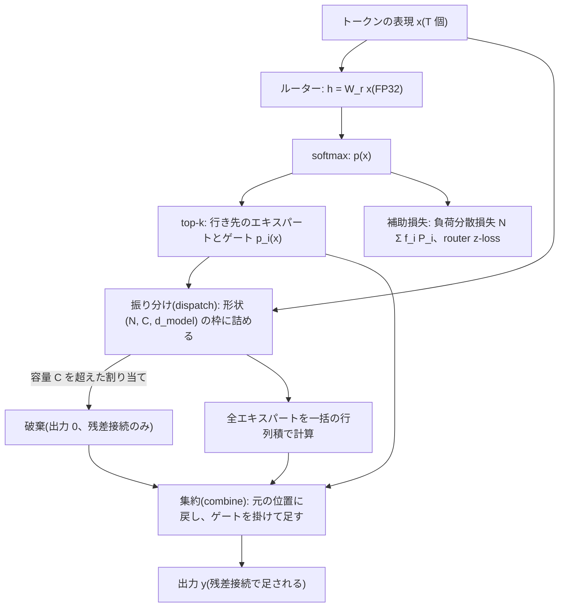

この記事は前編(理論編)です。続きは [こちら](https://zenn.dev/kojikojiprg/books/ai-theories-roadmap/viewer/022_mixture_of_experts-practice-1)。

# 022. Mixture of Experts(MoE) / Mixture of Experts

## 1. 概要 / Overview

MoE(Mixture of Experts)は、Transformer Block の Feed-Forward Network(順伝播ネットワーク)を、複数の **エキスパート(expert)** と、
トークンごとにどのエキスパートを通すかを決める **ルーター(router)** に置き換える構造である。各トークンは一部のエキスパートだけを
通るので、総パラメータ数を増やしても、トークンあたりの計算量はほとんど増えない(条件付き計算、conditional computation)。
本トピックでは、ルーティング(routing)、top-k の選択、エキスパートの容量と capacity factor(容量係数)によるトークンの破棄、
負荷分散損失(load balancing loss)、router z-loss をスクラッチ実装し、008 と同じレシピの小型 GPT を密なモデルと MoE のそれぞれで
最初から事前学習して、(A)計算量を揃えた密なモデルより評価集合の bits-per-byte が下がるか、(B)負荷分散損失をなくすと
エキスパートへの負荷が偏るか、(C)エキスパート数を等比で増やしたときの改善幅が逓減するか、を検証する。あわせて、
(D)エキスパートがトークンの種類に応じて専門化しているかを、判定基準を設けずに観察する。

### 1.1 実行の手順

本番実行は Google Colab T4 の **1 つのセッションで完結** させる。5.1 節のセットアップセルで`SMOKE_TEST = False`にして、
「すべてのセルを実行」する。

実行時間の予算は 1 セッションあたり **T4 で 120 分** とする。学習を始める前に(6.4 節)、T4 上でのスケーリングの計測(6.3 節)から、
30 通りの **実行計画**(6.1 節。学習ステップ数 $T$・学習率の較正の方式・**削る段階** 0〜4 の組)のそれぞれについて残りの実行時間を
見積もり、予算に収まる計画のうち優先順位の最も高いものを自動で選ぶ。選択は見積もりのみに基づき、どの実験の結果も参照しない。
**選ばれた計画は 6.4 節の出力に印字される。** 事前の計測のための実行やセッションの分割はしない。

**見積もりが最も下位の計画でも予算を超える場合は、学習の前に停止する。** その場合は結果の情報を何も得ていないので、実行条件
(判定基準・水準・前提条件以外)を直して再実行する。

学習したモデルは、すべて条件間の比較のためのものであり、Hugging Face Hub にはアップロードしない。

### 1.2 本番実行の結果の要約

本番実行(Google Colab T4、コミット`8f89fd3`、全体 103.1 分)では、30 通りの計画のうち予算に収まる最初の **計画 16**($T = 1090$、
学習用のトークンの約 1.55 エポック分。較正の方式`"representative"`、段階 1)が選ばれた。前提条件はすべての実験で成立した(7.2 節)。
事前に宣言した基準による最終判定は次のとおりである。その前の本番の 1 回目は、単体テストで学習の前に停止しており、結果の情報は
得ていない(6.2 節)。

| 実験 | 最終判定 | 対比量 | 閾値($2\sigma$) |
|---|---|---|---|
| A: 計算量を揃えた密なモデルとの比較 | 判定不能 | $\Delta_A = -0.0069$ | 0.0076 |
| B: 負荷分散損失と負荷の偏り | 支持 | $\Delta_B = +0.0905$ | 0.0138 |
| C: エキスパート数の等比スケーリング | 支持 | $\Delta_C = +0.0112$ | 0.0069 |

- **実験 A**: 対比量の向きは仮説と逆で、5 シード中 4 シードで MoE($E = 8$)の bits-per-byte が密なモデルより悪かったが、閾値には
  届かなかった。学習用の部分の窓では両者はほぼ同じで、差は評価集合との汎化の差として現れた(7.3 節)。
- **実験 B**: 負荷分散損失をなくすと、割り当ての分布の正規化エントロピーが 5 シードすべてで下がった。負荷分散損失がなくても負荷は
  学習の初期に大きく偏った後に部分的に回復し、ありの条件も初期にいったん偏った(7.4 節)。
- **実験 C**: 支持だが、**支持は $E = 4 \to 16$ での悪化から生じたもので、$E$ を増やしても bits-per-byte は下がらなかった。**
  $g_{\mathrm{low}}$ はほぼ 0($-0.0006$)、$g_{\mathrm{high}}$ は負($-0.0117$)で、最もよかったのは $E = 2$、$E = 8$・16 は密なモデルより
  悪かった。改善幅の逓減を示す結果ではない(7.5 節)。

以下は **事後的な解釈であり、検証済みの結論ではない**(7.7 節)。MoE が上回らなかった理由の候補として、エキスパートあたりの
学習量の不足、学習データの反復による汎化の不足、学習の初期のトークンの破棄、規則で流用した学習率、モデルの規模を検討した。
実験 A の遅れのほとんどは汎化の差で説明できる大きさで、$E = 16$ は学習用の部分の窓でも密なモデルより悪かった。

## 2. 参考論文 / References

1. Shazeer, N., Mirhoseini, A., Maziarz, K., Davis, A., Le, Q., Hinton, G., Dean, J.,
   "Outrageously Large Neural Networks: The Sparsely-Gated Mixture-of-Experts Layer", ICLR 2017. https://arxiv.org/abs/1701.06538
   (疎なゲートの MoE 層、noisy top-k gating、importance と load の 2 つの損失。3.2・3.5・3.8 節)
2. Lepikhin, D., Lee, H., Xu, Y., Chen, D., Firat, O., Huang, Y., Krikun, M., Shazeer, N., Chen, Z.,
   "GShard: Scaling Giant Models with Conditional Computation and Automatic Sharding", ICLR 2021. https://arxiv.org/abs/2006.16668
   (Transformer の順伝播ネットワークを MoE にする構成、top-2、エキスパートの容量とトークンの破棄。3.3・3.4 節)
3. Fedus, W., Zoph, B., Shazeer, N.,
   "Switch Transformers: Scaling to Trillion Parameter Models with Simple and Efficient Sparsity", JMLR 2022.
   https://arxiv.org/abs/2101.03961(top-1 ルーティング、負荷分散損失、capacity factor、ルーターの FP32 計算、初期化の縮小。
   本トピックの主構成の原典。3.2〜3.6 節、実験 A・B)
4. Zoph, B., Bello, I., Kumar, S., Du, N., Huang, Y., Dean, J., Shazeer, N., Fedus, W.,
   "ST-MoE: Designing Stable and Transferable Sparse Expert Models", arXiv:2202.08906, 2022. https://arxiv.org/abs/2202.08906
   (router z-loss、学習時と評価時の capacity factor。3.4・3.6 節)
5. Clark, A., de las Casas, D., Guy, A., Mensch, A., Paganini, M., Hoffmann, J., Damoc, B., Hechtman, B., Cai, T., Borgeaud, S.,
   van den Driessche, G., Rutherford, E., Hennigan, T., Johnson, M., Millican, K., Cassirer, A., Jones, C., Buchatskaya, E., Budden, D.,
   Sifre, L., Osindero, S., Vinyals, O., Rae, J., Elsen, E., Kavukcuoglu, K., Simonyan, K.,
   "Unified Scaling Laws for Routed Language Models", ICML 2022. https://arxiv.org/abs/2202.01169
   (エキスパート数を増やしたときの改善の収穫逓減。3.8 節、実験 C)
6. Zhou, Y., Lei, T., Liu, H., Du, N., Huang, Y., Zhao, V., Dai, A., Chen, Z., Le, Q., Laudon, J.,
   "Mixture-of-Experts with Expert Choice Routing", NeurIPS 2022. https://arxiv.org/abs/2202.09368(3.8 節、位置づけのみ)
7. Jiang, A. Q., Sablayrolles, A., Roux, A., Mensch, A., Savary, B., Bamford, C., Chaplot, D. S., de las Casas, D., Bou Hanna, E.,
   Bressand, F., Lengyel, G., Bour, G., Lample, G., Lavaud, L. R., Saulnier, L., Lachaux, M.-A., Stock, P., Subramanian, S., Yang, S.,
   Antoniak, S., Le Scao, T., Gervet, T., Lavril, T., Wang, T., Lacroix, T., El Sayed, W.,
   "Mixtral of Experts", arXiv:2401.04088, 2024. https://arxiv.org/abs/2401.04088(8 個のエキスパートから 2 個を選ぶ decoder-only の
   言語モデル。3.3 節)
8. Dai, D., Deng, C., Zhao, C., Xu, R. X., Gao, H., Chen, D., Li, J., Zeng, W., Yu, X., Wu, Y., Xie, Z., Li, Y. K., Huang, P., Luo, F.,
   Ruan, C., Sui, Z., Liang, W.,
   "DeepSeekMoE: Towards Ultimate Expert Specialization in Mixture-of-Experts Language Models", ACL 2024.
   https://arxiv.org/abs/2401.06066(細粒度のエキスパートと共有エキスパート。3.8 節、位置づけのみ)
9. Wang, L., Gao, H., Zhao, C., Sun, X., Dai, D.,
   "Auxiliary-Loss-Free Load Balancing Strategy for Mixture-of-Experts", arXiv:2408.15664, 2024. https://arxiv.org/abs/2408.15664
   (補助損失を使わない負荷分散。3.8 節、位置づけのみ)
10. Komatsuzaki, A., Puigcerver, J., Lee-Thorp, J., Riquelme Ruiz, C., Mustafa, B., Ainslie, J., Tay, Y., Dehghani, M., Houlsby, N.,
    "Sparse Upcycling: Training Mixture-of-Experts from Dense Checkpoints", ICLR 2023. https://arxiv.org/abs/2212.05055
    (3.8 節、位置づけのみ)

本文で用いる既存トピックの部品: SwiGLU の順伝播ネットワークは [004](https://zenn.dev/kojikojiprg/books/ai-theories-roadmap/viewer/004_normalization_and_activation-theory)、
小型 GPT と bits-per-byte は [006](https://zenn.dev/kojikojiprg/books/ai-theories-roadmap/viewer/006_pretraining_small_gpt-theory)、AdamW・warmup + cosine・gradient clipping は
[007](https://zenn.dev/kojikojiprg/books/ai-theories-roadmap/viewer/007_training_stabilization-theory)、本トピックが踏襲する事前学習のレシピは
[008](https://zenn.dev/kojikojiprg/books/ai-theories-roadmap/viewer/008_decoding_strategies-theory)、FP16 の autocast と動的損失スケーリングは
[011](https://zenn.dev/kojikojiprg/books/ai-theories-roadmap/viewer/011_mixed_precision_training-theory)、記事を単位とするクラスタブートストラップは
[015](https://zenn.dev/kojikojiprg/books/ai-theories-roadmap/viewer/015_long_context_extension-theory) で扱った。

## 3. 理論 / Theory

### 3.1 動機: 総パラメータ数とトークンあたりの計算量を切り離す

密な Transformer では、パラメータ数を増やすと、すべてのトークンがすべてのパラメータを通るので、トークンあたりの計算量も同じ割合で
増える。たとえば SwiGLU の順伝播ネットワーク(004)は、入出力の次元を $d_{\mathrm{model}}$、中間次元を $d_{\mathrm{ff}}$ として 3 つの
行列を持ち、パラメータ数も 1 トークンあたりの積和の回数も $3 d_{\mathrm{model}} d_{\mathrm{ff}}$ である。中間次元を 8 倍にすれば、
パラメータ数も計算量も 8 倍になる。

**条件付き計算(conditional computation)** は、入力ごとにネットワークの一部だけを使うことで、この 2 つを切り離す。MoE(Mixture of
Experts)層(Shazeer et al. [1])は、同じ形の小さなネットワーク **エキスパート** を $N$ 個並べ、入力ごとに $k$ 個($k \ll N$)だけを
選んで計算する。Lepikhin et al. [2](GShard)と Fedus et al. [3](Switch Transformer)は、これを Transformer の順伝播ネットワークに
適用した。順伝播ネットワークは位置ごとに独立に働くので(002)、**トークンごと** に通すエキスパートを変えられる。

**記号**(Fedus et al. [3] の表記に従う):

- $N$: エキスパート数。$T$: 1 つのバッチのトークン数(バッチサイズ × 系列長)。$k$: 1 トークンが通るエキスパートの数。
  なお、6 節以降の $T$ は学習ステップ数を表し、この節(3 節)の $T$ とは別の量である。
- $x \in \mathbb{R}^{d_{\mathrm{model}}}$: MoE 層に入るトークンの表現(正規化前置なので、正規化層の出力)。
- $E_i(x)$: $i$ 番目のエキスパートの出力。本トピックでは $E_i(x) = (\mathrm{Swish}(x W_i) \odot x V_i) W_{2,i}$ で、形も大きさも密なモデルの
  順伝播ネットワークと同じにする($\odot$ は要素ごとの積)。

このとき、MoE 層のパラメータ数は $N \cdot 3 d_{\mathrm{model}} d_{\mathrm{ff}}$(とルーターの $N d_{\mathrm{model}}$)、1 トークンあたりの
積和の回数は $k \cdot 3 d_{\mathrm{model}} d_{\mathrm{ff}}$(とルーターの $N d_{\mathrm{model}}$)である。$k = 1$ なら、ルーターの分を除いて
**計算量は密なモデルと同じまま、順伝播ネットワークのパラメータ数だけが $N$ 倍になる**。本トピックの構成($d_{\mathrm{model}} = 256$、
$d_{\mathrm{ff}} = 683$)では、ルーターの計算量はエキスパート 1 個の $N / (3 d_{\mathrm{ff}}) = N / 2049$ 倍で、$N = 16$ でも 0.8% である。

一方、各エキスパートが学習で受け取るトークンは全体の約 $1/N$ になる。パラメータは増えるが、パラメータ 1 個あたりの学習信号は減る。
MoE が同じ計算量の密なモデルより良くなるかどうかは、この 2 つの釣り合いで決まり、学習量が少ないと利得が出にくいことが予想される
(実験 A・C)。

### 3.2 ルーター: どのエキスパートを通すかを決める

ルーターは、トークンの表現 $x$ から $N$ 個のロジットを作る線形写像である(バイアスなし)。

$$
h(x) = W_r x, \qquad p_i(x) = \frac{e^{h_i(x)}}{\sum_{j=1}^{N} e^{h_j(x)}}
$$

- $W_r \in \mathbb{R}^{N \times d_{\mathrm{model}}}$: ルーターの重み。$h(x) \in \mathbb{R}^{N}$: ルーターのロジット。
- $p_i(x)$: トークン $x$ をエキスパート $i$ に送る確率(ルーターの確率)。

確率の大きい順に $k$ 個のエキスパートの集合 $\mathcal{T}(x)$ を選び、その出力を **ルーターの確率を重みとして** 足し合わせる
(Fedus et al. [3] の式 2):

$$
y = \sum_{i \in \mathcal{T}(x)} p_i(x) \, E_i(x)
$$

$y$ が MoE 層の出力で、呼び出し側の残差接続によって $x$ の正規化前の表現に足される。

**ゲートの確率を出力に掛ける理由**: エキスパートの選択(top-k、$k = 1$ なら $\arg\max$)は離散的な操作で、微分できない。出力に
$p_i(x)$ を掛けなければ、損失はルーターの重み $W_r$ に依存しなくなり、ルーターは学習されない。$k = 1$ で選ばれたエキスパートを
$i^\ast$ とすると $y = p_{i^\ast}(x) E_{i^\ast}(x)$ で、ロジットについての微分は softmax の微分から

$$
\frac{\partial y}{\partial h_j} = p_{i^\ast}(x) \left( \delta_{i^\ast j} - p_j(x) \right) E_{i^\ast}(x)
$$

となる($\delta$ は Kronecker のデルタ)。損失 $\mathcal{L}$ の勾配は $\partial \mathcal{L} / \partial h_j = p_{i^\ast} (\delta_{i^\ast j} - p_j) \, g^\top E_{i^\ast}(x)$
($g = \partial \mathcal{L} / \partial y$)で、エキスパートの出力 $E_{i^\ast}(x)$ が損失を下げる向き($g^\top E_{i^\ast}(x) < 0$)なら、
$h_{i^\ast}$ を上げ、他のロジットを下げる向きに更新される。つまりルーターが受け取る信号は「**選んだエキスパートの出力を、もっと
強く使うべきか弱く使うべきか**」だけであり、「選ばなかったエキスパートを選んでいたらどうなったか」の信号はない(3.7 節の負荷の
崩壊の原因になる)。

$k \ge 2$ では、選んだ $k$ 個の確率をその和で割って正規化する流儀もある(Shazeer et al. [1] は top-k 以外のロジットを $-\infty$ に
してから softmax をとる。Jiang et al. [7] も選んだ $k$ 個のロジットの softmax を使う)。$k = 1$ でこの正規化を行うとゲートが恒等的に
1 になり、上の勾配が消えるので、top-1 では正規化しない確率 $p_{i^\ast}(x)$ をそのまま掛ける。

**初期化**: Fedus et al. [3] は、重みを平均 0・標準偏差 $\sqrt{s/n}$($n$ は入力の次元、$s$ は尺度)の切断正規分布で初期化し、
尺度を Transformer の既定の $s = 1.0$ から $0.1$ に縮めると学習が安定すると報告している。本トピックではルーターの重みをこの方法
($s = 0.1$、$n = d_{\mathrm{model}}$)で初期化する。$d_{\mathrm{model}} = 256$ では標準偏差が約 0.0198 で、初期のルーターの確率はほぼ一様
($p_i \approx 1/N$)になる。エキスパートの重みは、密なモデルの順伝播ネットワークと同じ既定の初期化(`nn.Linear`と同じ)を使う
(密なモデルとの比較で、初期化の違いを交絡させないため)。Fedus et al. の実装は、学習時にルーターのロジットへ乗法的な一様乱数の
雑音を加えるが、本トピックでは加えない(雑音は探索のための別の介入であり、実験 B の負荷分散損失の効果と交絡するため)。

### 3.3 top-1 と top-2、計算量の揃え方

| 方式 | $k$ | ゲート | 1 トークンあたりの順伝播ネットワークの計算量 |
|---|---|---|---|
| Shazeer et al. [1] | 4 など | top-k のロジットの softmax(雑音つき、3.8 節) | エキスパートの $k$ 倍 |
| GShard(Lepikhin et al. [2]) | 2 | 1 個目は最大、2 個目は確率に比例して無作為に選ぶ | エキスパートの 2 倍 |
| Switch Transformer(Fedus et al. [3]) | 1 | ルーターの確率 $p_{i^\ast}(x)$ | エキスパート 1 個分 |
| Mixtral(Jiang et al. [7]) | 2($N = 8$) | 選んだ 2 個のロジットの softmax | エキスパートの 2 倍 |

それまで「エキスパートどうしを比べる信号を得るには $k \ge 2$ が必要」と考えられていた(Shazeer et al. [1])のに対し、
Fedus et al. [3] は $k = 1$ でも学習でき、計算量・通信量・実装のすべてが簡単になることを示した。

**計算量の揃え方が方式によって違う。** top-1 では、各エキスパートを密なモデルの順伝播ネットワークと同じ大きさにすれば、ルーターの
分を除いてトークンあたりの計算量が密なモデルと一致する(本トピックの主構成)。top-2 で同じことをするには、各エキスパートの
中間次元を半分にする必要がある(エキスパートを同じ大きさにすると、順伝播ネットワークの計算量が 2 倍になる)。本トピックの
`src/layers/moe.py`は $k = 2$ も実装して単体テストで確かめるが、実験には使わない。

### 3.4 エキスパートの容量・capacity factor・トークンの破棄

ルーターはトークンごとに独立に行き先を決めるので、あるエキスパートにトークンが集中しうる。一方、計算を一括の行列積で行うには
(GPU や TPU では、テンソルの形が実行前に決まっている必要がある)、各エキスパートが受け取るトークン数を固定しなければならない。
そこで各エキスパートに **容量**(expert capacity)を設ける(Fedus et al. [3] の式 3 を、$k$ 個選ぶ場合に書き直したもの):

$$
C = \left\lceil c \cdot \frac{k T}{N} \right\rceil
$$

- $C$: エキスパート 1 個が 1 つのバッチで受け取れるトークン数。$c$: **capacity factor(容量係数)**。

$c = 1$ は、割り当てが完全に一様なときにちょうど全部が収まる大きさである。$c > 1$ は偏りに対する余裕になるが、その分だけ計算と
メモリが増える。**容量を超えて割り当てられたトークンは破棄する**(dropped tokens)。破棄されたトークンはその層のエキスパートを
通らず、出力は 0 になる。すなわち残差接続だけを通って次の層に渡る(情報が消えるわけではなく、その層の順伝播ネットワークの変換が
抜ける)。

**学習時と評価時の値**: Fedus et al. [3] は $c \in \{1.0, 1.25, 2.0\}$ を比べ、負荷分散損失があれば破棄されるトークンは少ない
(典型的に 1% 未満)と報告している。Zoph et al. [4] は **学習時 $c = 1.25$、評価時 $c = 2.0$** を使っている。評価時は逆伝播がなく余裕を大きく
取れるので、破棄を減らす側に倒す設定である。

**本トピックでは、学習時は原論文と同じ $c = 1.25$ を使い、評価時は破棄をしない**(容量を $C = T$ にする)。理由は 2 つある
(6.1 節の「評価の手順の改訂」)。(1)破棄があると、ある評価窓の負の対数尤度が、同じバッチに入った他の窓の割り当てに依存する。
記事を単位とするクラスタブートストラップは、窓ごとの値が再標本化によって変わらないことを前提にしており、この前提が崩れる。
(2)評価の値が、モデルの予測の質ではなく、評価のバッチの組み方に依存する。なお、破棄はその層の出力だけでなく、
残差を通じて **それより後の層のルーターの入力** も変える。したがって評価時の破棄の有無は、層 1 以降の割り当て(破棄の前)にも
影響する。原論文の評価時の値 $c = 2.0$ は、「その設定なら
破棄されたはずの割り当ての割合」を診断量として計算するのに使う。

**本トピックの実装での扱い**(`src/layers/moe.py`):

- トークンを形状 $(N, C, d_{\mathrm{model}})$ のテンソルに振り分け(dispatch)、全エキスパートを一括の行列積(`torch.bmm`)で計算し、
  元の位置に戻す(combine)。空いた枠は 0 で埋める(エキスパートにバイアスがないので、0 の入力の出力は 0 になる)。
- 枠は平坦化したトークンの順(バッチの先頭の系列から、系列の中では先頭の位置から)に埋める。**あるトークンが破棄されるかどうかは、
  同じ系列の中では、それより前の位置のトークンの割り当てにしか依存しない。** したがって、因果的な言語モデルでも、未来のトークンの
  情報が同じ系列の予測に混入しない。ただしバッチ内の他の系列には依存する(学習時)。評価時は破棄をしないので、あるトークンの
  出力は同じバッチの他のトークンに依存しない。評価時の枠は $(N, T, d_{\mathrm{model}})$ で、形はデータによらず一定だが、
  エキスパートの行列積の量は $N$ 倍になる。
- 「トークンあたりの計算量を密なモデルと揃える」は、破棄されなかったトークン 1 個が通る演算の量についての主張である。一括の
  行列積は空いた枠も計算するので、実際の演算量は密なモデルの順伝播ネットワークの約 $c$ 倍になる(学習時 1.25 倍。破棄をしない
  評価時は $N$ 倍)。これは固定形状の
  実装の都合であり、3.8 節のとおり実測の時間は判定に使わない。

### 3.5 負荷分散損失

ルーターに何の制約もなければ、少数のエキスパートにトークンが集中しうる(3.7 節)。Fedus et al. [3] は、割り当てを一様に近づける
**負荷分散損失(load balancing loss)** を、補助損失(auxiliary loss)として全体の損失に加える(式 4〜6):

$$
\mathcal{L}_{B} = \alpha \cdot N \cdot \sum_{i=1}^{N} f_i \, P_i, \qquad
f_i = \frac{1}{T} \sum_{x \in \mathcal{B}} \mathbb{1}\{\arg\max_j p_j(x) = i\}, \qquad
P_i = \frac{1}{T} \sum_{x \in \mathcal{B}} p_i(x)
$$

- $\mathcal{B}$: バッチ(トークン $T$ 個)。$f_i$: エキスパート $i$ に割り当てられたトークンの割合。$P_i$: ルーターの確率 $p_i(x)$ の
  バッチ平均。$\alpha$: 係数。
- 原論文は $\alpha$ を $10^{-1}$ から $10^{-5}$ まで 10 倍刻みで調べ、$\alpha = 10^{-2}$ を使っている。本トピックもこの値を使う。
- 補助損失は Switch 層ごとに全体の損失に加える(層について合計する)。本トピックでは 4 層すべてを MoE 層にする。

**$f_i$ は微分できず、勾配は $P_i$ を通じて流れる。** $f_i$ は $\arg\max$ の指示関数の平均なので、ロジットについての勾配は
(ほとんど至るところ)0 である。実装では $f_i$ を定数として扱う。したがって

$$
\frac{\partial \mathcal{L}_{B}}{\partial P_i} = \alpha N f_i
$$

であり、**いま多くのトークンを受け取っているエキスパートほど、その確率 $P_i$ を強く下げる** 向きの勾配になる。$\sum_i P_i = 1$ なので、
確率は負荷の大きいエキスパートから負荷の小さいエキスパートへ移る。

**係数 $N$ の意味と、一様なときの値**: 割り当てと確率がともに一様($f_i = P_i = 1/N$)なら $\sum_i f_i P_i = N \cdot (1/N)^2 = 1/N$ なので、
$N$ を掛けた $\mathcal{L}_B$ はエキスパート数によらず $\alpha$ になる。

**一様なときに最小になること**(以下は本ノートブックでの導出): ルーターが確信を持っている(各トークンの $p(x)$ がほぼ one-hot)とき、
$f_i \approx P_i$ である。このとき $\sum_i f_i P_i \approx \sum_i P_i^2$ で、Cauchy–Schwarz の不等式

$$
1 = \left( \sum_{i=1}^{N} P_i \cdot 1 \right)^2 \le N \sum_{i=1}^{N} P_i^2
$$

から $\sum_i P_i^2 \ge 1/N$、等号は $P_i = 1/N$ のときに限る。よって $\mathcal{L}_B \ge \alpha$ で、一様な割り当てが最小を与える。

**ただし、一般の $f$ と $P$ については一様が最小とは限らない。** 例として $N = 2$ で、トークンの 6 割が $p = (0.51, 0.49)$、4 割が
$p = (0, 1)$ なら、$f = (0.6, 0.4)$、$P = (0.306, 0.694)$ で $\sum_i f_i P_i = 0.461 < 1/2$ になる(5.4 節で数値を確かめる)。ルーターが
「僅差で選ぶ」ことで、割り当て $f$ を保ったまま損失を下げられる。負荷分散損失は「割り当ての多いエキスパートの確率を下げる」圧力で
あって、割り当て $f$ そのものを直接一様にする損失ではない。このため、実験 B の対比量は損失の値ではなく、割り当ての分布 $f$ から
作る(6.1 節)。

**系譜**: Shazeer et al. [1] は、ゲートの値の合計の変動係数を罰する importance の損失と、雑音つきのゲートのもとで各エキスパートが
選ばれる確率の滑らかな推定量を使う load の損失の 2 つを使った。Fedus et al. [3] の式はこれを 1 つにまとめた簡略版である。

### 3.6 router z-loss とルーターの数値安定性

**ルーターを FP32 で計算する理由**: ルーターは指数関数(softmax)を含む。FP16 で表せる最大値は 65504 で、$e^{h}$ は $h > 11.09$ で
あふれる(011)。また、指数関数は入力の丸め誤差を増幅するので、ロジットが大きいほど確率の誤差が大きくなり、$\arg\max$ による選択や
ゲートの値が不安定になる。Fedus et al. [3] は、モデル全体を低精度(bfloat16)で計算しつつ、**ルーターの内部だけを FP32 に
キャストする**(selective precision)ことで、全体を FP32 にした場合と同じ安定性が得られると報告している。FP32 のテンソルは
ルーターの関数の中だけに現れるので、コストはほとんど増えない。本トピックの実装も、`torch.autocast`の中でルーターのロジット・
softmax・補助損失を FP32 で計算する。

**router z-loss**(Zoph et al. [4] の式 5):

$$
\mathcal{L}_{z} = \frac{1}{T} \sum_{x \in \mathcal{B}} \left( \log \sum_{j=1}^{N} e^{h_j(x)} \right)^2
$$

ロジットの log-sum-exp の 2 乗を罰する。log-sum-exp は最大のロジットの滑らかな近似なので、この損失は **ロジットの絶対値が
大きくなること** を抑える。softmax はロジット全体に定数を足しても変わらないので、この損失はルーターの確率の表現力を奪わずに、
ロジットを 0 の近くに保つ。ロジットが小さければ、指数関数に入る値の丸め誤差が小さくなる。全体の損失は

$$
\mathcal{L}_{\mathrm{tot}} = \mathcal{L}_{\mathrm{CE}} + \sum_{\ell} \left( \alpha N \sum_i f_i^{(\ell)} P_i^{(\ell)} + c_z \mathcal{L}_z^{(\ell)} \right)
$$

($\mathcal{L}_{\mathrm{CE}}$ は次のトークンの交差エントロピー損失、$\ell$ は MoE 層の番号)で、原論文は $c_z = 10^{-3}$ を使う。本トピックも
この値を使う。確率が一様でロジットがすべて 0 のとき $\mathcal{L}_z = (\log N)^2$ である。

### 3.7 負荷の崩壊

負荷分散損失がないとき、次の自己強化が起こりうる。

1. 初期化の偶然で、あるエキスパート $a$ が他より少し多くのトークンを受け取る。
2. エキスパート $a$ は、多くのトークンから勾配を受け取り、他より速く学習が進む。
3. ルーターが受け取る信号は「選んだエキスパートの出力が損失を下げたか」だけ(3.2 節)なので、学習の進んだ $a$ の確率が上がり、
   さらに多くのトークンが $a$ に送られる。
4. 選ばれないエキスパートは勾配を受け取らないので学習されず、選ばれる理由がますますなくなる。

行き着く先では、少数のエキスパートだけが使われる(**負荷の崩壊**)。使われないエキスパートのパラメータは無駄になり、集中した
エキスパートでは容量を超えたトークンが破棄される(3.4 節)。破棄されたトークンはその層の変換を受けないので、モデルの質も下がる。
実験 B は、負荷分散損失がこの偏りを実際に防いでいるかを、割り当ての分布で直接調べる。

### 3.8 位置づけのみ扱うもの

- **noisy top-k gating**(Shazeer et al. [1]): ロジットに、学習可能な大きさの正規乱数の雑音を加えてから top-k をとる
  ($H(x)_i = (x W_g)_i + \epsilon \cdot \mathrm{softplus}((x W_{\mathrm{noise}})_i)$、$\epsilon$ は標準正規乱数)。雑音は、選ばれる
  エキスパートを揺らして探索を促すとともに、「各エキスパートが選ばれる確率」を滑らかな関数にして、load の損失を微分できるようにする。
- **Expert Choice routing**(Zhou et al. [6]): トークンがエキスパートを選ぶ代わりに、**各エキスパートが、自分への確率の高い
  トークンを容量の分だけ選ぶ**。負荷は定義から完全に均等になり、補助損失が要らない。重要なトークンは複数のエキスパートに、
  そうでないトークンは 0 個のエキスパートに送られる。ただし、エキスパートがバッチの中のトークンを比べて選ぶので、あるトークンが
  選ばれるかどうかが **同じ系列の後ろの位置のトークン** に依存する。因果的な言語モデルでは、未来のトークンの情報が選択を通じて
  過去の位置の出力に混入し、学習時(系列全体が見える)と生成時(未来が存在しない)で振る舞いが変わる。
- **細粒度のエキスパートと共有エキスパート**(Dai et al. [8]、DeepSeekMoE): 各エキスパートを $1/m$ の大きさに分割して数を $m$ 倍にし、
  選ぶ数も $m$ 倍にする(計算量は同じまま、選べる組み合わせの数が増える)。また、ルーターを通さず常に全トークンが通る
  **共有エキスパート** を置き、どのトークンにも必要な共通の知識をそこに集めて、他のエキスパートの重複を減らす。
- **補助損失を使わない負荷分散**(Wang et al. [9]、DeepSeek-V3 で採用): 負荷分散損失の勾配は、言語モデルの損失の勾配と干渉する。
  代わりに、エキスパートごとのバイアス $b_i$ を **選択に使うスコアにだけ** 加え、直前のバッチで負荷が平均より多かったエキスパートの
  $b_i$ を下げ、少なかったエキスパートの $b_i$ を上げる。$b_i$ は勾配で学習するパラメータではなく、ゲートの値にも入らない。
- **Sparse Upcycling**(Komatsuzaki et al. [10]): 学習済みの密なモデルの順伝播ネットワークを複製してエキスパートにし、ルーターだけを
  新しく初期化して学習を続ける。MoE を最初から学習するコストを避ける。本トピックは密なモデルも MoE も最初から学習するので、
  この方法は使わない。
- **エキスパート数の収穫逓減**(Clark et al. [5]): ルーティングつきの言語モデルの損失を、密なモデルの大きさとエキスパート数の
  両方の関数としてあてはめ、エキスパート数を増やすことの利得は、数が増えるほど、またモデルが大きいほど小さくなることを示した。
  実験 C は、この逓減を小さな規模で調べる。
- **速度(エキスパートの並列化と通信)**: 大規模な学習では、エキスパートを複数のデバイスに分散して置き、トークンを行き先の
  デバイスに送って結果を戻す(all-to-all の通信)。capacity factor を大きくすると通信量とメモリが比例して増えるので、
  Zoph et al. [4] は学習時の値を小さく(1.25)保っている。1 台の GPU 上の本トピックの実装では、この通信は発生せず、代わりに
  振り分けと集約の索引の演算と、空いた枠の計算が上乗せになる。**T4 上の実測の時間は、実行計画の見積もりにのみ使い、どの実験の
  判定にも使わない。**

### 3.9 データの流れとアルゴリズム(擬似コード)



```
入力: トークンの表現 x_1, ..., x_T(1 つのバッチを平坦化したもの)、エキスパート数 N、選ぶ数 k、capacity factor c
1. h_t = W_r x_t、p_t = softmax(h_t)                         # FP32 で計算する
2. 各 t について、確率の大きい順に k 個のエキスパート i_{t,1..k} とゲート g_{t,r} = p_t[i_{t,r}] を選ぶ
3. 容量 C = ceil(c k T / N)
4. 割り当て (t, r) を「r = 1 の全トークン、r = 2 の全トークン、...」の順に並べ、エキスパートごとに先着 C 個までを枠に入れる
   枠に入らなかった割り当ては破棄する
5. 枠のテンソル (N, C, d_model) を作り、全エキスパートの SwiGLU を一括の行列積で計算する
6. y_t = sum_r g_{t,r} * (割り当て (t, r) の枠の出力。破棄されていれば 0)
7. 補助損失: f_i = (エキスパート i への割り当ての数) / (k T)   # 破棄の前の割り当てで数える。定数として扱う
            P_i = mean_t p_t[i]
            負荷分散損失 = N * sum_i f_i P_i、router z-loss = mean_t (logsumexp(h_t))^2
学習: 損失 = 交差エントロピー + sum_層 (alpha * 負荷分散損失 + c_z * router z-loss)
```


## 元ノートブック(実装の全文はこちら)

https://github.com/kojikojiprg/ai-theories/blob/main/theories/06_architectures/022_mixture_of_experts.ipynb
