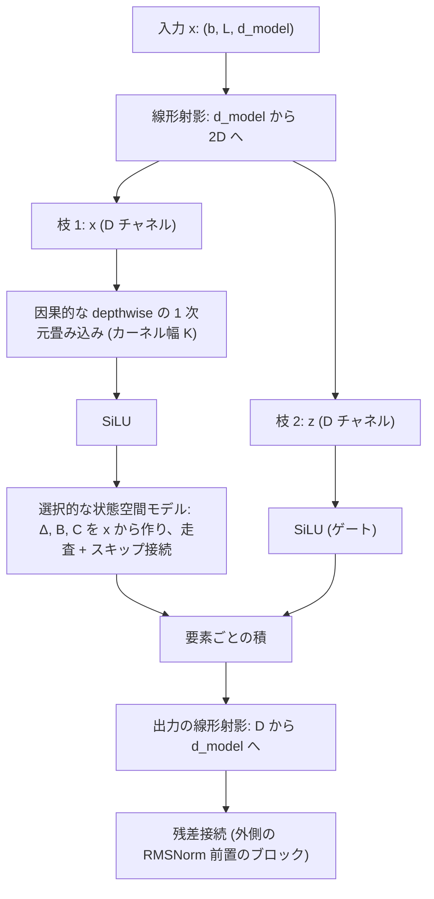

この記事は前編(理論編)です。続きは [こちら](https://zenn.dev/kojikojiprg/books/ai-theories-roadmap/viewer/023_state_space_model_mamba-practice-1)。

# 023. State Space Model / Mamba / State Space Model and Mamba

## 1. 概要 / Overview

状態空間モデル(State Space Model)は、連続時間の線形な力学系 $h'(t) = A h(t) + B x(t)$、$y(t) = C h(t)$ を離散化し、固定サイズの状態 $h$ を持つ再帰として系列を処理するモデルである。Mamba(Gu & Dao [1])は、離散化の刻み幅 $\Delta$ と行列 $B$・$C$ を **入力の関数にする**(選択的な状態空間モデル、Selective State Space Model)ことで、入力の内容に応じて状態に記憶するか無視するかを切り替えられるようにした。学習時の計算量は系列長 $L$ に線形で、推論時は 1 トークンあたり一定の時間と一定サイズの状態で済み、注意機構(Attention Mechanism)の $O(L^2)$ の計算量や、系列長に比例して増える KV キャッシュ(010)を持たない。

本トピックでは、ゼロ次ホールド(zero-order hold)による離散化、選択的な状態空間モデルの走査(scan)、Mamba ブロック、状態を持ち回る推論をスクラッチ実装し(公式の CUDA カーネルを含むパッケージは使わず、走査は逐次ループで書く)、次の 3 つを判定つきで検証する。(A)selective copying の課題で、選択的な構成が非選択の構成より正解率が高いか。(B)順伝播の時間の系列長に対するべき指数が、注意機構の層の方が Mamba の層より大きいか。(C)induction heads の課題で、学習時より長い系列に伸ばしたときの正解率の低下が、RoPE を使う Transformer の方が Mamba より大きいか。あわせて、(D)Mamba の言語モデルを 008 のレシピで学習し、008 の Transformer と同じ評価窓で検証 bits-per-byte を測る動作確認を、判定基準を設けずに行う。

### 1.1 実行の手順

本番の実行は Google Colab T4 の **1 つのセッションで完結** させる。5.1 節のセットアップセルで`SMOKE_TEST = False`にして、5.1〜6.12 節のセルを上から順に実行する。

実行時間の予算は 1 セッションあたり **T4 で 120 分** とする。学習を始める前に(6.4 節)、T4 上でのスケーリングの計測(6.3 節)から、7 通りの **実行計画**(6.1 節。実験 D の学習ステップ数・実験 D の省略・実験 C のシード数・実験 A のシード数・実験 A と C の学習ステップ数を、この順に 1 つずつ削る)のそれぞれについて残りの実行時間を見積もり、予算に収まる計画のうち番号の最も小さいものを自動で選ぶ。選択は見積もりのみに基づき、どの実験の結果も参照しない。**選ばれた計画は 6.4 節の出力に印字される。** 事前の計測のための実行やセッションの分割はしない。

**見積もりが最も下位の計画でも予算を超える場合は、学習の前に停止する。** その場合は結果の情報を何も得ていないので、実行条件(判定基準・水準・前提条件以外)を直して再実行する。

学習したモデルは、すべて条件間の比較または動作確認のためのものであり、Hugging Face Hub にはアップロードしない。

6.3〜6.12 節が本番の実行、6.13 節が条件を直した再実行(実験 B・C)である。6.13 節は本番とは別のセッションで実行した。5.1 節の実行環境の印字は、6.13 節のセッションのものである。

### 1.2 本番実行の結果の要約

判定は 6.1 節で事前に宣言した基準のとおりである。数値と診断量は 7 節に示す。

- **実験 A(selective copying)**: **支持**($\Delta_A = +0.3055$、閾値 0.1562)。選択的な構成(A1)は全シードで正解率 0.9992 以上、非選択の構成(A2)は 5 シードが 2 つの水準に分かれた(0.8089〜0.8282 の 3 シードと、0.4675・0.543 の 2 シード。平均 0.6942)。作用点に近い診断量である $\Delta_t$ の平均は、データの位置の方がノイズの位置より小さく(データ / ノイズが層 0 で 0.73、層 1 で 0.92)、6.1 節で宣言した予測とは逆の向きだった。
- **実験 B(計算量のべき指数)**: 本番の実行も、条件を直した再実行も **支持**(本番の実行 $\Delta_B = +0.5788$・閾値 0.0195、再実行 $\Delta_B = +0.6009$・閾値 0.0033)。べき指数は Mamba の層が 0.993(再実行は 0.990)で理論値 1 に近く、注意機構の層は 1.571(再実行は 1.591)で理論値 2 に届かなかった(5 水準の範囲での局所的な指数)。**絶対時間は、この実装ではすべての水準で注意機構の層の方が短い。**
- **実験 C(長さの外挿)**: 本番の実行は **前提不成立**(C1 の 1 シードで学習が崩壊)。学習率の採用の規則だけを直した再実行は **支持**($\Delta_C = +0.6698$、閾値 0.0347)。結論は RoPE を使う Transformer に限る。診断量として、再実行の C1 は学習時の系列長の 16 倍まで、シード平均 1.000(シード間の標準偏差 0.000)を保った。
- **実験 D(判定基準なし)**: Mamba の言語モデルを 008 と同じ 2181 ステップで学習した。検証 bits-per-byte は Mamba が 1.6525、008 のモデルが 1.6681 だった(1 シードの観察で、優劣は判断しない)。
- **一般化の制約**: 合成課題と小さなモデル、逐次ループの実装(絶対時間は公式実装を代表しない)、1 台の GPU 上の計測である(7.8 節)。

## 2. 参考論文 / References

1. Gu, A., Dao, T.,
   "Mamba: Linear-Time Sequence Modeling with Selective State Spaces", COLM 2024(arXiv:2312.00752). https://arxiv.org/abs/2312.00752
   (選択的な状態空間モデル、Mamba ブロック、Theorem 1、selective copying と induction heads の課題。本トピックの原典。3.4〜3.9 節、実験 A・B・C・D)
2. Gu, A., Goel, K., Ré, C.,
   "Efficiently Modeling Long Sequences with Structured State Spaces", ICLR 2022. https://arxiv.org/abs/2111.00396
   (S4。時不変な状態空間モデルの畳み込みとしての計算。3.3 節、位置づけ)
3. Gu, A., Dao, T., Ermon, S., Rudra, A., Ré, C.,
   "HiPPO: Recurrent Memory with Optimal Polynomial Projections", NeurIPS 2020. https://arxiv.org/abs/2008.07669
   (状態行列 $A$ の初期化の理論的な背景。3.3 節、位置づけのみ)
4. Jing, L., Gulcehre, C., Peurifoy, J., Shen, Y., Tegmark, M., Soljačić, M., Bengio, Y.,
   "Gated Orthogonal Recurrent Units: On Learning to Forget", Neural Computation 31(4), 2019(arXiv:1706.02761). https://arxiv.org/abs/1706.02761
   (selective copying の課題の出典。原論文 [1] は denoising task と同じものとしている。実験 A)
5. Olsson, C., Elhage, N., Nanda, N., Joseph, N., DasSarma, N., Henighan, T., Mann, B., Askell, A., Bai, Y., Chen, A., Conerly, T., Drain, D., Ganguli, D.,
   Hatfield-Dodds, Z., Hernandez, D., Johnston, S., Jones, A., Kernion, J., Lovitt, L., Ndousse, K., Amodei, D., Brown, T., Clark, J., Kaplan, J., McCandlish, S., Olah, C.,
   "In-context Learning and Induction Heads", Transformer Circuits Thread, 2022(arXiv:2209.11895). https://transformer-circuits.pub/2022/in-context-learning-and-induction-heads/
   (induction heads の出典。実験 C)
6. Dao, T., Gu, A.,
   "Transformers are SSMs: Generalized Models and Efficient Algorithms Through Structured State Space Duality", ICML 2024(arXiv:2405.21060). https://arxiv.org/abs/2405.21060
   (Mamba-2。3.10 節、位置づけのみ。論文の題名に含まれる略語は原題のまま)
7. Gu, A., Gupta, A., Goel, K., Ré, C.,
   "On the Parameterization and Initialization of Diagonal State Space Models", NeurIPS 2022. https://arxiv.org/abs/2206.11893
   (対角の状態行列の初期化 S4D-Real と、$B = 1$・$C$ を標準正規分布とする初期化。3.6 節、非選択の構成の初期化)

公式の参照実装(`state-spaces/mamba`のリポジトリ、`selective_scan_ref`・`Mamba`クラス)は、離散化の簡略形 $\bar{B} x = \Delta B x$、$\Delta$ の初期化(対数一様分布から引いて softplus の逆関数をバイアスに書く)、低ランクの射影の次元(`dt_rank`、既定は $\lceil d_{\mathrm{model}} / 16 \rceil$)の確認に用いた。

本文で用いる既存トピックの部品: 注意機構と因果マスクは [001](https://zenn.dev/kojikojiprg/books/ai-theories-roadmap/viewer/001_attention_mechanism-theory)、RoPE は [003](https://zenn.dev/kojikojiprg/books/ai-theories-roadmap/viewer/003_positional_encoding_rope-theory)、RMSNorm と SwiGLU は [004](https://zenn.dev/kojikojiprg/books/ai-theories-roadmap/viewer/004_normalization_and_activation-theory)、小型 GPT と bits-per-byte は [006](https://zenn.dev/kojikojiprg/books/ai-theories-roadmap/viewer/006_pretraining_small_gpt-theory)、AdamW・warmup + cosine・gradient clipping は [007](https://zenn.dev/kojikojiprg/books/ai-theories-roadmap/viewer/007_training_stabilization-theory)、本トピックの実験 D が踏襲する事前学習のレシピと比較の相手は [008](https://zenn.dev/kojikojiprg/books/ai-theories-roadmap/viewer/008_decoding_strategies-theory)、KV キャッシュは [010](https://zenn.dev/kojikojiprg/books/ai-theories-roadmap/viewer/010_kv_cache_and_inference_compute-theory)、FP16 の autocast と動的損失スケーリングは [011](https://zenn.dev/kojikojiprg/books/ai-theories-roadmap/viewer/011_mixed_precision_training-theory)、時間計測の手順(ウォームアップ・交互実行・ドリフトの不在と平均の標準誤差の前提条件)は [010](https://zenn.dev/kojikojiprg/books/ai-theories-roadmap/viewer/010_kv_cache_and_inference_compute-theory) と [014](https://zenn.dev/kojikojiprg/books/ai-theories-roadmap/viewer/014_flash_attention-theory)、単体テストの許容誤差の導出は [022](https://zenn.dev/kojikojiprg/books/ai-theories-roadmap/viewer/022_mixture_of_experts-theory) で扱った。

## 3. 理論 / Theory

### 3.1 動機: 系列長に対する計算量と、推論時に増え続ける状態

注意機構(001)は、長さ $L$ の系列の全対の位置の間でスコア $q_i^\top k_j$ を計算する。計算量は $O(L^2 d_{\mathrm{model}})$、スコア行列を実体化する実装ではメモリも $O(L^2)$ である(014 の Flash Attention はこのメモリを避ける)。自己回帰の生成では、過去の Key と Value を保持する KV キャッシュが必要で、そのサイズは系列長に比例して増える(010)。

再帰型のモデルは、系列を先頭から 1 つずつ読み、固定サイズの状態 $h_t$ に過去を圧縮して持ち回る。1 トークンあたりの計算量も状態のサイズも系列の長さによらず一定である。一方で、古典的な再帰型ニューラルネットワーク(Recurrent Neural Network)は学習時に時間方向の計算を並列化しにくく、状態が小さいぶん過去の情報の取りこぼしが起こる。Gu & Dao [1] は、系列モデルの効率と効果のトレードオフを「文脈をどれだけうまく状態に圧縮できるか」で特徴づけ、**何を状態に入れて何を捨てるかを入力の内容で決められる** 状態空間モデルとして Mamba を提案した。

### 3.2 連続時間の状態空間モデル

1 つのチャネルについて、入力 $x(t) \in \mathbb{R}$ から出力 $y(t) \in \mathbb{R}$ への写像を、$N$ 次元の状態 $h(t) \in \mathbb{R}^N$ を介して次の連立の微分方程式で定める。

$$
h'(t) = A h(t) + B x(t), \qquad y(t) = C h(t)
$$

$A \in \mathbb{R}^{N \times N}$ は状態の時間発展、$B \in \mathbb{R}^{N \times 1}$ は入力が状態に入る経路、$C \in \mathbb{R}^{1 \times N}$ は状態から出力を読み出す経路である(原論文 [1] の式 (1))。Mamba は $D$ 個のチャネルのそれぞれに、独立な $(A, B, C)$ を持つこの系を適用する(チャネルの間の混合は、ブロックの前後の線形射影が担う)。以下、$A$ は対角行列とし、チャネル $d$ の状態 $n$ の対角成分を $a_{d,n}$ と書く。

### 3.3 ゼロ次ホールドによる離散化

系列を扱うために、刻み幅 $\Delta > 0$ ごとに離散化する。ゼロ次ホールドは、区間 $[t_k, t_k + \Delta]$ の間、入力を一定値 $x_k$ とみなす。定数変化法により、この区間の解は

$$
h(t_k + \Delta) = e^{\Delta A} h(t_k) + \int_0^{\Delta} e^{(\Delta - s) A} B x_k \, ds
= e^{\Delta A} h(t_k) + A^{-1} \left( e^{\Delta A} - I \right) B x_k
$$

である($A$ が可逆のとき、$I$ は単位行列。2 つ目の等号は $\int_0^\Delta e^{(\Delta - s) A} ds = A^{-1} (e^{\Delta A} - I)$ による)。したがって離散化した系は $h_k = \bar{A} h_{k-1} + \bar{B} x_k$、$y_k = C h_k$ となり、

$$
\bar{A} = \exp(\Delta A), \qquad \bar{B} = (\Delta A)^{-1} \left( \exp(\Delta A) - I \right) \cdot \Delta B
$$

である(原論文 [1] の式 (4)。$(\Delta A)^{-1} \Delta = A^{-1}$ なので上の式と一致する)。**$A$ が対角のとき**、すべてが要素ごとの式になる。

$$
\bar{A}_{d,n} = e^{\Delta a_{d,n}}, \qquad \bar{B}_{d,n} = \frac{e^{\Delta a_{d,n}} - 1}{a_{d,n}} B_{d,n}
$$

実装(`src/layers/mamba.py`の`discretize_state_space()`)はこの式を全時刻・全チャネル・全状態について一括で計算する。5.5 節の単体テストでは、拡大した行列 $\begin{pmatrix} a & b \\ 0 & 0 \end{pmatrix}$ の行列指数関数が $\begin{pmatrix} e^{\Delta a} & b (e^{\Delta a} - 1) / a \\ 0 & 1 \end{pmatrix}$ になることを使い、`torch.linalg.matrix_exp`から $\bar{A}$ と $\bar{B}$ を読んで、上の式と独立に照合する。

**公式実装の簡略形**: 公式の参照実装(`selective_scan_ref`)は、$\bar{A} = \exp(\Delta A)$ はそのまま使い、$\bar{B}$ だけを $\bar{B} = \Delta B$ とする(入力の項は`delta * B * u`)。$u = \Delta a_{d,n}$ とおくと $(e^u - 1) / u = 1 + u/2 + u^2/6 + \cdots$ なので、ゼロ次ホールドの $\bar{B}$ は

$$
\bar{B}_{d,n} = \Delta B_{d,n} \left( 1 + \frac{u}{2} + \frac{u^2}{6} + \cdots \right)
$$

であり、簡略形はこの級数の 1 項目だけを残した $\Delta$ についての 1 次の近似である。相対差は $u/2 + O(u^2)$ で、$\Delta \to 0$ で 0 に近づく。一方、$\Delta \lvert a_{d,n} \rvert$ が大きいときの $\bar{B}$ は、ゼロ次ホールドでは $-B_{d,n} / a_{d,n}$ に飽和し、簡略形では $\Delta B_{d,n}$ のまま増え続ける。本トピックの主構成はゼロ次ホールドで、簡略形は引数で切り替えられる(`discretization="euler"`)。

### 3.4 時不変な系は畳み込みで表せる。しかし入力の内容を見られない

$\Delta$・$A$・$B$・$C$ が時刻によらない(時不変、linear time-invariant)とき、離散化した再帰を展開すると

$$
y_t = \sum_{s=0}^{t} K_{t-s} \, x_s, \qquad K_k = C \bar{A}^k \bar{B}
$$

となり、系全体は入力に依存しないカーネル $K$ との畳み込みである(S4 [2] の畳み込み表現)。畳み込みは高速フーリエ変換などで並列に計算できるので、学習は効率的になる。5.5 節の単体テストでは、再帰の出力が $K_k = C \bar{A}^k \bar{B}$ との畳み込みに一致することと、入力を遅らせると出力も遅れるだけ(時不変性)であることを確かめる。

しかしカーネル $K$ は入力 $x$ に依存しないので、**どの入力を状態に取り込み、どれを無視するかを内容によって決められない**。原論文 [1] は、この限界を 2 つの課題で示す(3.9 節の実験 A・C)。selective copying は、ノイズの間にランダムな位置で置かれたデータのトークンを順序を保って出力する課題で、入力から出力までの間隔が事例ごとに変わるので、固定のカーネルでは表せない。induction heads は、文脈の中で以前に見た組(あるトークンとその直後のトークン)を、同じトークンが再び現れたときに思い出す課題である。

状態行列 $A$ の初期化には、HiPPO [3] の理論(過去の入力を直交多項式で最適に近似する状態の更新)に基づく S4D-Real [7] を使う。状態 $n$($0$ 始まり)の対角成分を $a_{d,n} = -(n + 1)$ とする。HiPPO の導出は本トピックでは扱わず、位置づけのみとする。

### 3.5 選択的な状態空間モデル

選択的な構成では、$\Delta$・$B$・$C$ を入力 $x_t$ の関数にする(原論文 [1] の Algorithm 2)。

$$
B_t = s_B(x_t) = \mathrm{Linear}_N(x_t), \qquad C_t = s_C(x_t) = \mathrm{Linear}_N(x_t), \qquad
\Delta_t = \tau_\Delta \left( \mathrm{Parameter} + s_\Delta(x_t) \right), \quad \tau_\Delta = \mathrm{softplus}
$$

$\mathrm{Linear}_N$ は $N$ 次元への線形射影、$\mathrm{Parameter}$ は学習可能なチャネルごとのバイアスである。原論文は $s_\Delta(x) = \mathrm{Broadcast}_D(\mathrm{Linear}_1(x))$(1 次元に射影して全チャネルに複製する)とし、その一般化として $\mathrm{Linear}_D(\mathrm{Linear}_R(x))$(低ランクの射影、$R$ は $D$ の小さな一部)を述べている。公式の実装と本トピックは後者を使い、$R = \lceil d_{\mathrm{model}} / 16 \rceil$ とする。$\bar{A}_t = \exp(\Delta_t A)$ と $\bar{B}_t$ は時刻ごとに変わり、再帰は

$$
h_t = \bar{A}_t h_{t-1} + \bar{B}_t x_t, \qquad y_t = C_t h_t
$$

である。時刻ごとに系が変わるので畳み込みでは表せず、計算は走査(scan)になる。形状は、$x$ が $(b, L, D)$($b$ はバッチサイズ)、選択的な構成の $B_t$・$C_t$ が $(b, L, N)$(全チャネルで共通)、$\Delta_t$ が $(b, L, D)$ である。

**$\Delta$ の役割**: $a_{d,n} < 0$ のとき、$\Delta \to 0$ では $\bar{A} \to 1$ かつ $\bar{B} x \to 0$ で、状態をそのまま保って現在の入力を無視する。$\Delta \to \infty$ では $\bar{A} \to 0$ かつ $\bar{B} \to -B / a$ で、状態を捨てて現在の入力に集中する。したがって $\Delta_t$ は「このトークンを状態に取り込むか」を決めるゲートとして働き、ノイズのトークンで $\Delta_t$ を小さく、データのトークンで大きくすれば、selective copying の間隔の変動に対処できる(実験 A の診断量)。

**パラメータ化と初期化**: $\tau_\Delta = \mathrm{softplus}$ は $\Delta > 0$ を保証する。$\mathrm{Parameter}$ は、$\Delta$ の初期値が $[10^{-3}, 10^{-1}]$ に入るよう、$\mathrm{softplus}$ の逆関数で書き込む。原論文は $\tau_\Delta^{-1}(\mathrm{Uniform}([0.001, 0.1]))$ と記し、公式の実装は対数一様分布から引く。本実装は公式の実装に従う。$B$・$C$ の射影の重みは各層の既定の初期化である。

**非選択の構成**(実験 A の条件 2): $\Delta$・$B$・$C$ を入力によらない学習可能なパラメータにする(原論文 [1] の Algorithm 1)。$\Delta$ はチャネルごとのスカラー($\mathrm{softplus}$ の逆関数で初期化)、$B$・$C$ は形状 $(D, N)$ のパラメータで、初期値は S4D [7] に従い $B = 1$、$C$ は標準正規分布とする。ブロックの他の構成要素(射影・畳み込み・ゲート・$A$・スキップ接続)は選択的な構成と同一なので、2 つの構成の差は $\Delta$・$B$・$C$ が入力に依存するかどうかに限られる(ただし、入力から $\Delta$・$B$・$C$ を作る射影のパラメータは選択的な構成だけが持ち、非選択の構成は $B$・$C$ のパラメータを持つ。パラメータ数の差は 5.5 節の出力にある)。

### 3.6 ゲートつき再帰型ネットワークとの対応(原論文 Theorem 1)

**命題**(原論文 [1] の Theorem 1): $N = 1$、$A = -1$、$B = 1$、$s_\Delta(x) = \mathrm{Linear}(x)$、$\tau_\Delta = \mathrm{softplus}$ のとき、選択的な状態空間モデルの再帰は、$g_t = \sigma(\mathrm{Linear}(x_t))$($\sigma$ はシグモイド関数)として

$$
h_t = (1 - g_t) h_{t-1} + g_t x_t
$$

になる。

**導出**: $z_t = \mathrm{Linear}(x_t)$ とおくと $\Delta_t = \mathrm{softplus}(z_t) = \log(1 + e^{z_t})$ である。$A = -1$ なので $\bar{A}_t = e^{-\Delta_t} = 1 / (1 + e^{z_t}) = \sigma(-z_t) = 1 - \sigma(z_t) = 1 - g_t$。$B = 1$ なので、3.3 節の式から $\bar{B}_t = (e^{-\Delta_t} - 1) / (-1) = 1 - e^{-\Delta_t} = g_t$。よって $h_t = (1 - g_t) h_{t-1} + g_t x_t$ である。

これは古典的な再帰型ネットワークの更新ゲートそのものである。$\Delta_t$ は「ゲートを一般化したもの」で、$g_t \to 0$ で入力を無視して状態を保ち、$g_t \to 1$ で状態を捨てて現在の入力に置き換える。5.5 節の単体テストで、$\bar{A} = 1 - g$、$\bar{B} = g$ と、走査の出力が上の再帰に一致することを、走査とは独立なスカラーのループで確かめる。

### 3.7 Mamba ブロックの構成

Mamba ブロック(原論文 [1] の Figure 3)は、H3 のブロックと Transformer の順伝播ネットワークのブロックを 1 つにまとめた構造で、Transformer の注意機構と順伝播ネットワークの 2 つのブロックを交互に積む代わりに、Mamba ブロックだけを繰り返し積む。モデルの次元 $d_{\mathrm{model}}$ を拡大率 $E$ で $D = E \, d_{\mathrm{model}}$ に広げ、状態空間モデルは $D$ 個のチャネルのそれぞれに適用する。$E$ は 022 のエキスパート数とは別の量である。

- **因果的な畳み込み**: カーネル幅 $K = 4$ の depthwise(チャネルごと)の 1 次元畳み込みで、時刻 $t$ の出力は入力 $t - K + 1, \dots, t$ だけに依存する。状態空間モデルに入る前に、近傍のトークンの情報を混ぜる。
- **ゲート**: 枝 2 の $\mathrm{SiLU}(z)$(SiLU は Swish と同じ関数、004)を、状態空間モデルの出力に要素ごとに掛ける。このゲートは各時刻の入力だけを見るので、時間方向には作用しない。**ゲートは選択性ではない**(原論文 [1] の Appendix A)。実際、非選択の構成にもゲートはあり、実験 A はこの違いを測る。
- **パラメータ数**: 2 つの線形射影が $2 E d_{\mathrm{model}}^2 + E d_{\mathrm{model}}^2 = 3 E d_{\mathrm{model}}^2$ 個を占め、Transformer の 1 層(注意機構の $4 d_{\mathrm{model}}^2$ と順伝播ネットワークの $3 d_{\mathrm{model}} d_{\mathrm{ff}}$)より少ない。同じパラメータ数で比べると、Mamba は層の数が約 2 倍になる(実験 D)。
- **Mamba の言語モデル**: トークン埋め込み → [RMSNorm → Mamba ブロック → 残差接続] を層の数だけ積み、最終の RMSNorm と出力層(埋め込みと重みを共有)を置く。位置エンコーディングは持たない(再帰の構造が順序の情報を担う)。

### 3.8 計算量: 学習時は線形、推論時は 1 トークンあたり定数

| | 注意機構(KV キャッシュなし・あり) | Mamba |
|---|---|---|
| 学習・事前入力の処理の時間 | $O(L^2 d_{\mathrm{model}})$ | $O(L \, D N)$ |
| 学習時の主なメモリ(スコア・離散化した行列の実体化) | $O(L^2)$(スコア行列を実体化する実装) | $O(L \, D N)$(本実装は $\bar{A}_t$・$\bar{B}_t x_t$ を実体化する) |
| 推論で 1 トークンを出す時間 | $O(L \, d_{\mathrm{model}})$(KV キャッシュあり。長さ $L$ の Key・Value を読む) | $O(D N)$(文脈の長さによらず一定) |
| 推論で持ち回る状態 | KV キャッシュ: $2 L \, d_{\mathrm{model}}$ 要素(1 層、系列長に比例して増える) | $D N + D (K - 1)$ 要素(1 層。$h$ と畳み込みのバッファ。一定) |

Mamba の状態は文脈の長さによらず固定サイズなので、文脈が長くなっても推論のメモリが増えない。代償として、固定サイズの状態に文脈を圧縮するため、過去の任意のトークンを正確に引き出す能力は状態の大きさで制限される。

**並列走査(parallel scan)とハードウェアを意識した実装**: 再帰 $h_t = \bar{A}_t h_{t-1} + \bar{B}_t x_t$ は、組 $(a, b)$ の合成 $(a_2, b_2) \circ (a_1, b_1) = (a_2 a_1, \, a_2 b_1 + b_2)$ が結合的なので、並列走査で $O(\log L)$ の深さに並列化できる。原論文 [1] は、状態の展開 $(b, L, D, N)$ を GPU の低速なメモリに書き出さず、高速なメモリの中で離散化・走査・出力までを融合する実装で、実体化のメモリ量と読み書きの量を避けている。**本ノートブックの実装は逐次ループであり、$(b, L, D, N)$ のテンソルを実体化する。** そのため計算量の大きさ(べき指数)は理論どおり系列長に線形になりうるが、実測の絶対速度は公式の実装を代表しない。1 ステップあたりの Python の呼び出しの固定費が大きいので、短い系列では特にそうである(実験 B の解釈の注意)。

### 3.9 本トピックの 4 つの実験の位置づけ

| 実験 | 問い | 3 節の根拠 |
|---|---|---|
| A | 選択性は selective copying の正解率を上げるか | 3.4・3.5 節: 時不変な系は間隔の変動に対処できない |
| B | 順伝播の時間の系列長に対するべき指数は、注意機構の方が大きいか | 3.8 節: 学習時の計算量は Mamba が線形、注意機構が二次 |
| C | 長さの外挿で、正解率の低下は Transformer の方が大きいか | 3.8 節: 固定サイズの状態の再帰は、系列長に依存する位置の情報を持たない |
| D | Mamba の言語モデルは 008 のレシピで学習できるか(判定なし) | 3.7 節: ブロックの積層 |

### 3.10 位置づけのみ扱うもの

- **Mamba-2**(Dao & Gu [6]): 状態空間モデルと注意機構が、構造化された半可分行列(structured semiseparable matrix)を介して双対の関係にあることを示し(structured state space duality)、行列積に寄せたアルゴリズムで速度を上げた後継の手法。本トピックでは扱わない。
- **HiPPO の導出**(Gu et al. [3]): 状態行列 $A$ の初期化の理論的な背景。本トピックは S4D-Real の初期化を使うだけで、導出は扱わない。
- **構造化された状態空間モデルの計算法**(S4 [2] の Cauchy カーネルなど): 時不変な系の畳み込みを効率的に計算する工夫。本トピックは再帰と畳み込みの対応を小さな系で確かめるにとどめる。
- **ハイブリッド**(状態空間モデルの層と注意機構の層を混ぜる構成): 本トピックでは扱わない。

## 元ノートブック(実装の全文はこちら)

https://github.com/kojikojiprg/ai-theories/blob/main/theories/06_architectures/023_state_space_model_mamba.ipynb
