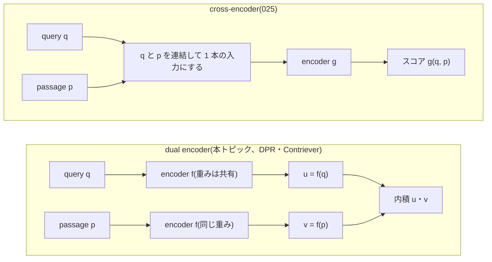
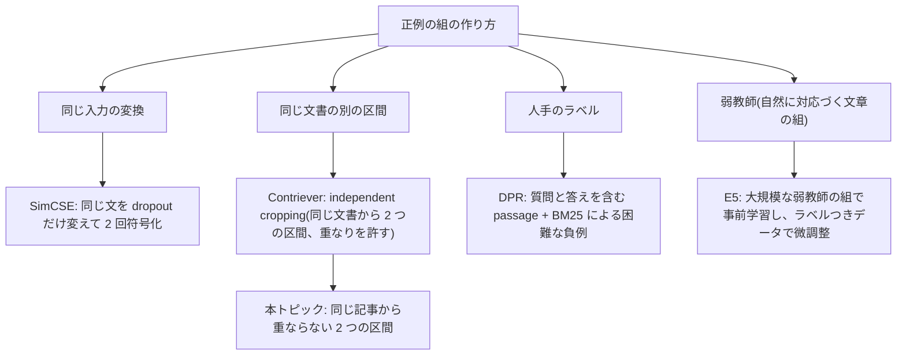

この記事は前編(理論編)です。続きは [こちら](https://zenn.dev/kojikojiprg/books/ai-theories-roadmap/viewer/024_text_embedding_and_retriever-practice-1)。

# 024. テキスト埋め込みと retriever / Text Embedding and Retriever

## 1. 概要 / Overview

**テキスト埋め込み(text embedding)** は、文章を固定次元のベクトルに写し、ベクトルの近さで文章の意味的な近さを測る仕組みである。
query(検索の質問)と passage(検索される文章)を同じ空間に埋め込み、内積の大きい passage を順位づけして返す検索器を
**dense retriever** と呼ぶ。本トピックでは、008 の小型 GPT を encoder として、同じ記事から切り出した 2 つの区間を正例の組にする
教師なしの対照学習(Contriever の independent cropping に相当)で dense retriever を学習し、dual encoder 構造・プーリング・
InfoNCE・Matryoshka Representation Learning・BM25 をスクラッチ実装する。

検証するのは次の 4 つである(いずれも判定つき)。(A)因果マスクのもとで、終端位置のプーリングが平均プールより Recall@10 が高いか、
(B)平均プールで、注意マスクを双方向にすると因果マスクより Recall@10 が高いか、(C)008 の重みから始めると、ランダム初期化から
始めるより Recall@10 が高いか、(D)Matryoshka Representation Learning で学習すると、先頭 16 次元に切り詰めた埋め込みの
Recall@10 が、通常の InfoNCE で学習した埋め込みより高いか。あわせて、判定を設けない観察として、(E)BM25 との比較、(F)対照学習の前後での
異方性(anisotropy)・alignment・uniformity の変化を示す。

### 1.1 実行の手順

本番実行は Google Colab T4 の **1 つのセッションで完結** させる。5.1 節のセットアップセルで`SMOKE_TEST = False`にして、
「すべてのセルを実行」する。

実行時間の予算は 1 セッションあたり **T4 で 120 分** とする。学習を始める前に(6.4 節)、T4 上でのスケーリングの計測(6.3 節)から、
**実行計画**(6.1 節。学習ステップ数 $T$・学習率の較正の方式・**削る段階** の組)のそれぞれについて残りの実行時間を見積もり、予算に収まる
計画のうち優先順位の最も高いものを自動で選ぶ。選択は見積もりのみに基づき、どの実験の結果も参照しない。**選ばれた計画は 6.4 節の
出力に印字される。** 事前の計測のための実行やセッションの分割はしない。

**見積もりが最も下位の計画でも予算を超える場合は、学習の前に停止する。**

学習したモデルのうち、後続のトピック([025](https://github.com/kojikojiprg/ai-theories/blob/main/theories/07_retrieval/025_ann_search_and_reranking.ipynb))の入力にする **Matryoshka Representation Learning で学習した条件(C5)のシード 0** だけを
Hugging Face Hub(`kojikojiprg/ai-theories-text-embedding-en`)にアップロードする(6.14 節。`UPLOAD_ARTIFACTS`が`True`のときだけ。
既定は`False`)。他のモデルは条件間の比較のためのものであり、保存もアップロードもしない。

### 1.2 本番実行の結果の要約

Google Colab の T4 で 1 セッションで完結した(5.1 節の出力: コミット b68fceb、実行日時 2026-10-06 08:26 UTC、torch 2.13.0+cu130、FP16 の autocast と動的損失スケーリング)。
選ばれた計画は **計画 0**(学習ステップ数 $T = 1024$、全条件の学習率を較正する方式`"all"`、全条件 5 シード。削る段階は適用されなかった)で、全体の実行時間は 64.3 分(予算 120 分、7.8 節)だった。
前提条件 P0〜P2 はすべての実験で成立した(7.2 節)。

| 実験 | 比べたもの(評価用の Recall@10 のシード平均) | 対比量 | $\sigma$ | 閾値($2\sigma$) | 最終判定 |
|---|---|---|---|---|---|
| A | C1(終端位置)0.5702、C2(平均)0.6700 | $\Delta_A = -0.0999$ | 0.0075 | 0.0150 | **反証** |
| B | C3(双方向)0.6779、C2(因果)0.6700 | $\Delta_B = +0.0078$ | 0.0049 | 0.0098 | **判定不能** |
| C | C2(008 の重み)0.6700、C4(ランダム初期化)0.4628 | $\Delta_C = +0.2073$ | 0.0092 | 0.0183 | **支持** |
| D | 先頭 16 次元: C5(Matryoshka Representation Learning)0.5692、C2(通常の InfoNCE)0.3784 | $\Delta_D = +0.1908$ | 0.0074 | 0.0147 | **支持** |

- **実験 A(反証)**: 終端位置のプーリング(C1)は平均プール(C2)より低く、差は 5 シードすべてで負だった。位置ごとの診断量(C2 のモデルで測った量)は、後ろの位置ほど単独の Recall@10 が高い(0.0809 から 0.1729)。
  判定が確かめたのは対比量の向きであり、機構の有無ではない。
- **実験 B(判定不能)**: 双方向の注意(C3)の対比量は正だが閾値に届かなかった。検証用の集合の推移では、序盤は C3 が高く、最後は C2 が高かった。
- **実験 C(支持)**: ランダム初期化(C4)は学習の最後まで検証用の Recall@10 が伸びており、飽和していない状態での比較なので、事前学習の効果の大きさの上限として読む。
- **実験 D(支持)**: 先頭 16 次元で C5 が高く、次元 $m$ が大きいほど差は縮み、全次元($m = 256$)では C5 が C2 より 0.0193 低い(判定に含めない診断量で、検証済みの結論ではない)。
- **観察 E・F**: BM25 の Recall@10(0.7398)は全条件より高かった(最良の dense retriever は C3 の 0.6779)。対照学習の前後で Recall@10 は 0.4834 から 0.6692 に上がったが、ランダムな組のコサイン類似度の平均は 0.4659 から 0.4590 でほぼ変わらなかった(1 本の学習の観察)。
- **アップロード**: C5 のシード 0 を`kojikojiprg/ai-theories-text-embedding-en`にアップロードし、`list_repo_files()`で意図したファイルの存在を確認した。読み込み直した重みの全次元の Recall@10 は 0.6477(7.9 節)。
- 実験 A・B について、なぜそうなったかの考察は **事後的な解釈** として 7.10 節に分けて記した。検証済みの結論ではない。結論の一般化には制約がある(7.10 節: 9,470 記事、約 30% がリスト系、008 の 1 つのチェックポイント、約 0.074 エポックの学習)。

## 2. 参考論文 / References

1. Karpukhin, V., Oğuz, B., Min, S., Lewis, P., Wu, L., Edunov, S., Chen, D., Yih, W.,
   "Dense Passage Retrieval for Open-Domain Question Answering", EMNLP 2020. https://arxiv.org/abs/2004.04906
   (DPR(Dense Passage Retrieval)。dual encoder、in-batch negatives、BM25 による困難な負例。3.2・3.4・3.6 節)
2. Izacard, G., Caron, M., Hosseini, L., Riedel, S., Bojanowski, P., Joulin, A., Grave, E.,
   "Unsupervised Dense Information Retrieval with Contrastive Learning", TMLR 2022. https://arxiv.org/abs/2112.09118
   (Contriever。independent cropping による教師なしの対照学習。本トピックの学習データの作り方の原型。3.6 節)
3. Gao, T., Yao, X., Chen, D.,
   "SimCSE: Simple Contrastive Learning of Sentence Embeddings", EMNLP 2021. https://arxiv.org/abs/2104.08821
   (同じ文を dropout だけ変えて 2 回符号化したものを正例にする。温度 0.05。3.4・3.6 節)
4. Wang, L., Yang, N., Huang, X., Jiao, B., Yang, L., Jiang, D., Majumder, R., Wei, F.,
   "Text Embeddings by Weakly-Supervised Contrastive Pre-training", arXiv:2212.03533, 2022. https://arxiv.org/abs/2212.03533
   (E5。大規模な弱教師の文章の組での対照学習。3.6 節)
5. Wang, L., Yang, N., Huang, X., Yang, L., Majumder, R., Wei, F.,
   "Improving Text Embeddings with Large Language Models", ACL 2024. https://arxiv.org/abs/2401.00368
   (E5-mistral。decoder 型の大規模言語モデルを、終端のトークンの位置の出力で埋め込みモデルに転用する。3.3 節)
6. BehnamGhader, P., Adlakha, V., Mosbach, M., Bahdanau, D., Chapados, N., Reddy, S.,
   "LLM2Vec: Large Language Models Are Secretly Powerful Text Encoders", COLM 2024. https://arxiv.org/abs/2404.05961
   (decoder 型の言語モデルの注意を双方向にして埋め込みモデルに転用する。3.3 節、実験 B)
7. Muennighoff, N.,
   "SGPT: GPT Sentence Embeddings for Semantic Search", arXiv:2202.08904, 2022. https://arxiv.org/abs/2202.08904
   (GPT 型のモデルでの、位置に比例した重みの平均プール。3.3 節、位置づけのみ)
8. Neelakantan, A., Xu, T., Puri, R., Radford, A., et al.,
   "Text and Code Embeddings by Contrastive Pre-Training", arXiv:2201.10005, 2022. https://arxiv.org/abs/2201.10005
   (GPT 型のモデルの終端のトークンの位置の出力を埋め込みにする対照学習。3.3 節)
9. Kusupati, A., Bhatt, G., Rege, A., Wallingford, M., Sinha, A., Ramanujan, V., Howard-Snyder, W., Chen, K.,
   Kakade, S., Jain, P., Farhadi, A.,
   "Matryoshka Representation Learning", NeurIPS 2022. https://arxiv.org/abs/2205.13147
   (入れ子の次元の損失の和。3.7 節、実験 D)
10. Wang, T., Isola, P.,
    "Understanding Contrastive Representation Learning through Alignment and Uniformity on the Hypersphere", ICML 2020.
    https://arxiv.org/abs/2005.10242(alignment と uniformity。3.5 節、観察 F)
11. Ethayarajh, K.,
    "How Contextual are Contextualized Word Representations? Comparing the Geometry of BERT, ELMo, and GPT-2 Embeddings",
    EMNLP 2019. https://arxiv.org/abs/1909.00512(GPT-2 の表現の異方性。3.1 節、観察 F)
12. van den Oord, A., Li, Y., Vinyals, O.,
    "Representation Learning with Contrastive Predictive Coding", arXiv:1807.03748, 2018. https://arxiv.org/abs/1807.03748
    (InfoNCE 損失。020 の 3.4 節で導出済み)
13. Reimers, N., Gurevych, I.,
    "Sentence-BERT: Sentence Embeddings using Siamese BERT-Networks", EMNLP-IJCNLP 2019. https://arxiv.org/abs/1908.10084
    (言語モデルの出力の平均や [CLS] をそのまま文埋め込みにすると性能が低いという観察。3.1 節)
14. Robertson, S., Zaragoza, H.,
    "The Probabilistic Relevance Framework: BM25 and Beyond", Foundations and Trends in Information Retrieval 3(4), 2009.
    https://doi.org/10.1561/1500000019(BM25。3.8 節、観察 E)
15. Thakur, N., Reimers, N., Rücklé, A., Srivastava, A., Gurevych, I.,
    "BEIR: A Heterogeneous Benchmark for Zero-shot Evaluation of Information Retrieval Models", NeurIPS 2021
    (Datasets and Benchmarks Track). https://arxiv.org/abs/2104.08663(語彙の一致に頼る検索と dense retriever の比較。3.8 節、位置づけのみ)
16. Khattab, O., Zaharia, M.,
    "ColBERT: Efficient and Effective Passage Search via Contextualized Late Interaction over BERT", SIGIR 2020.
    https://arxiv.org/abs/2004.12832(late interaction。3.2 節、位置づけのみ)
17. Nogueira, R., Cho, K.,
    "Passage Re-ranking with BERT", arXiv:1901.04085, 2019. https://arxiv.org/abs/1901.04085
    (cross-encoder による再順位づけ。3.2 節。実装は [025](https://github.com/kojikojiprg/ai-theories/blob/main/theories/07_retrieval/025_ann_search_and_reranking.ipynb))

本文で用いる既存トピックの部品: 小型 GPT と bits-per-byte は [006](https://zenn.dev/kojikojiprg/books/ai-theories-roadmap/viewer/006_pretraining_small_gpt-theory)、AdamW・warmup + cosine・
gradient clipping は [007](https://zenn.dev/kojikojiprg/books/ai-theories-roadmap/viewer/007_training_stabilization-theory)、本トピックが起点にする学習済みの小型 GPT は
[008](https://zenn.dev/kojikojiprg/books/ai-theories-roadmap/viewer/008_decoding_strategies-theory)、FP16 の autocast と動的損失スケーリングは
[011](https://zenn.dev/kojikojiprg/books/ai-theories-roadmap/viewer/011_mixed_precision_training-theory)、記事を単位とするクラスタブートストラップは
[015](https://zenn.dev/kojikojiprg/books/ai-theories-roadmap/viewer/015_long_context_extension-theory)、二重 encoder と InfoNCE 損失・InfoNCE が相互情報量の下界であること・温度は
[020](https://zenn.dev/kojikojiprg/books/ai-theories-roadmap/viewer/020_clip_contrastive_learning-theory) で扱った。

## 3. 理論 / Theory

### 3.1 動機: 検索を「同じ空間に埋め込んで内積で順位をつける」問題として定式化する

**検索(retrieval)の設定**: passage の集合 $\mathcal{C} = \{p_1, \dots, p_P\}$ と query $q$ が与えられ、$q$ に関連する passage を上位に並べて返す。
各 query について関連する passage の集合(正解)$G_q \subseteq \mathcal{C}$ が決まっているとし、上位 $k$ 件に正解が入っているかなどで評価する(3.9 節)。

**語彙の一致による検索**: BM25(3.8 節)は、query と passage が共有する語の重みつきの和でスコアをつける。passage ごとの転置索引から高速に
計算でき、強力な基準である一方、同じ意味を別の語で表した query と passage は一致しない(語彙の不一致、vocabulary mismatch)。

**dense retriever**: encoder $f_\theta$ が文章を $d$ 次元のベクトルに写し、query $q$ と passage $p$ の類似度を内積(またはコサイン類似度)で定義する。

$$
s(q, p) = f_\theta(q)^\top f_\theta(p), \qquad \lVert f_\theta(\cdot) \rVert_2 = 1
$$

($\lVert f_\theta(\cdot) \rVert_2 = 1$ は L2 正規化で、そのとき内積はコサイン類似度に一致する。)passage の埋め込みは事前に計算して索引にしておけるので、
query が来たときには query を 1 回符号化して全 passage との内積をとるだけでよい。本トピックは全 passage との内積を厳密に計算する(近似最近傍探索は [025](https://github.com/kojikojiprg/ai-theories/blob/main/theories/07_retrieval/025_ann_search_and_reranking.ipynb))。

**言語モデルの隠れ状態をそのまま文埋め込みにしない理由**: 008 の小型 GPT の隠れ状態は、次のトークンの予測のために学習されたもので、
文章どうしの類似度を測る目的では学習されていない。次の 2 つの問題が文献で指摘されている。

1. **異方性(anisotropy)**: Ethayarajh [11] は、GPT-2 の文脈つきの表現が、層が深くなるほど狭い錐に偏り、最終層ではランダムな 2 つの
   単語の表現のコサイン類似度の平均が 1 に近いことを報告した。コサイン類似度の平均が大きいと、近さの差が小さな範囲に押し込められる。
   ただし、定数の偏りだけでは順位は変わらないので、異方性そのものが検索の失敗を意味するわけではない。
2. **目的の不一致**: Reimers & Gurevych [13] は、BERT の出力の平均や [CLS] をそのまま文埋め込みにすると、意味的な類似度の課題で GloVe の
   単語ベクトルの平均より低い性能になる場合があることを報告した。

本トピックでは、008 の重みのまま埋め込みとして使った場合の値(Recall@10・異方性・alignment・uniformity)を、対照学習の後と並べて測る(観察 F)。
008 の重みのままの値が低いかどうかは事前には断定せず、測った値を出力する。

### 3.2 dual encoder と cross-encoder

検索の類似度を計算する構造は、query と passage をどの段階で結合するかで 2 つに分かれる。



| | dual encoder | cross-encoder |
|---|---|---|
| 結合の段階 | 出力のベクトルの内積(結合は最後) | 入力の連結(注意機構が query と passage の語どうしを直接参照) |
| passage の事前計算 | **できる**(索引にする) | できない(query ごとに組を符号化する) |
| 1 つの query の計算量 | encoder 1 回 + 内積 $P$ 回 | encoder $P$ 回(全 passage との組) |
| 精度 | 相互作用がないので低くなりうる | 相互作用があり高い |

dual encoder は上位の候補を絞り込むのに、cross-encoder(Nogueira & Cho [17])は絞り込んだ候補の再順位づけ(reranking)に向く。cross-encoder の
実装と、絞り込みと再順位づけの組み合わせは [025](https://github.com/kojikojiprg/ai-theories/blob/main/theories/07_retrieval/025_ann_search_and_reranking.ipynb) で扱う。**late interaction**(ColBERT、Khattab & Zaharia [16])は、passage をトークンごとの
ベクトルの集合として事前に索引にし、query のトークンごとに最も近い passage のトークンとの内積(MaxSim)を足し合わせる中間の方式で、
位置づけのみとする(本トピックでは実装しない)。

dual encoder では、query と passage で **同じ重みの encoder** を使う(重みの共有。Contriever [2])場合と、別々の encoder を使う場合(DPR [1])がある。
本トピックは重みを共有する。

### 3.3 プーリング: 系列の隠れ状態から 1 本のベクトルを作る

encoder の最終正規化層の後の隠れ状態を $H = (h_0, \dots, h_{S-1}) \in \mathbb{R}^{S \times d}$ とする($S$ は系列長、$d = 256$ は隠れ次元)。
文埋め込みは、$H$ から 1 本のベクトル $z \in \mathbb{R}^d$ を作り(プーリング、pooling)、L2 正規化したもの $u = z / \lVert z \rVert_2$ である。
本トピックは射影層を置かず、次元は $d = 256$ のままとする。

| 方式 | $z$ | 備考 |
|---|---|---|
| 平均プール(mean pooling) | $\frac{1}{S} \sum_{t=0}^{S-1} h_t$ | E5 [4]・Contriever [2]・Sentence-BERT [13] |
| 終端位置(last-token pooling) | $h_{S-1}$ | E5-mistral [5]・cpt-text [8] |
| [CLS] | 先頭に置いた特別なトークンの出力 $h_0$ | encoder 型(双方向の注意)の BERT など |

**因果マスクのもとでの位置 $t$ の出力が見ているもの**: 008 の小型 GPT は因果マスク(causal mask)を使うので、位置 $t$ の隠れ状態 $h_t$ は
位置 $t$ までのトークン $x_0, \dots, x_t$ にだけ依存し、$t$ より後のトークンを見ていない(001)。したがって、

- 入力の **全体** を見ているのは、最後の位置の出力 $h_{S-1}$ だけである。
- 先頭の位置の出力 $h_0$ は、第 1 トークンだけに依存する。そのため、[CLS] のように先頭の位置を使う方式は、因果マスクのもとでは入力全体の要約にならない。
  encoder 型の [CLS] は、双方向の注意で全体を見られることを前提にした方式である。
- 平均プールは、前半の位置の出力(文脈が短い)と後半の位置の出力(文脈が長い)を等しい重みで平均する。SGPT [7] は、後ろの位置ほど多くの文脈を見ているので、
  位置 $t$ に比例した重み $w_t \propto t + 1$ の平均が良いことを報告した(位置づけのみ。本トピックでは実装しない)。

**decoder 型の言語モデルを埋め込みモデルに転用する流れ**: cpt-text [8] と E5-mistral [5] は、入力の末尾に終端のトークンを加え、その位置の出力を埋め込みにする。
これらの文献が末尾の位置を使う根拠は、因果マスクのもとで入力全体を見ている位置が末尾だけだという整理である。LLM2Vec [6] は、因果マスクを外して注意を **双方向** にし、さらに追加の学習(マスクされたトークンの
次トークン予測と、教師なしの対照学習)を行うことで、decoder 型の言語モデルを強い埋め込みモデルに転用した。双方向の注意は、事前学習で見ていない入力になる
(位置 $t$ の出力が、$t$ より後のトークンにも依存する)ので、追加の学習なしに注意を双方向にしたときの性能はモデルによって異なると報告されている [6]。

**008 のトークナイザには終端の特殊トークンがない**(語彙は 256 個のバイトと 7,936 個のマージで 8,192 個、特殊トークンなし。5.4 節で確かめる)。そのため終端位置のプーリングは、
**入力の最後の位置の出力** を使う。query と passage は固定長でパディングを使わないので、最後の位置は常に最後のトークンの位置である。

以上は文献の整理であり、主に大規模なモデルでの結果に基づく。008 の小型 GPT と本トピックの学習量で成り立つかは、本トピックの実験 A・B で確かめる: (A)因果マスクのもとで、入力全体を見ている終端位置のプーリングが、平均プールより良いか。(B)平均プールで、注意を双方向にして全位置が入力全体を見られるようにすると、因果マスクより良いか。

結果は 7.3・7.4 節、考察は 7.10 節に記した(文献の整理が本トピックの設定でそのまま成り立つとは限らない)。

### 3.4 対照学習の損失: InfoNCE、in-batch negatives、温度

正例の組 $(q_i, p_i^+)$ が $N$ 組あるバッチを考える。$u_i = f_\theta(q_i)$、$v_j = f_\theta(p_j^+)$ を L2 正規化した埋め込み、
$s_{ij} = u_i^\top v_j$ をコサイン類似度、$\tau > 0$ を温度とする。**in-batch negatives**(バッチ内負例)は、i 番目の query にとって、同じバッチの
他の $N - 1$ 個の passage $p_j^+$($j \neq i$)を負例とする方法で、負例のための追加の符号化が要らない(DPR [1])。損失は

$$
\mathcal{L}_{\mathrm{NCE}} = -\frac{1}{N} \sum_{i=1}^{N} \log \frac{\exp(s_{ii} / \tau)}{\sum_{j=1}^{N} \exp(s_{ij} / \tau)}
$$

である($\mathcal{L}_{\mathrm{NCE}}$ の添字は InfoNCE の NCE。query から passage への方向。passage から query への方向も足して対称にする流儀(CLIP、020)もある)。この形は 020 の 3.3 節の対称な InfoNCE 損失の片方の
向きと同じで、InfoNCE が相互情報量の下界になること($I(X; Y) \ge \log N - \mathcal{L}_{\mathrm{NCE}}$)と、下界が $\log N$ で頭打ちになるので
負例の数 $N$ が効くことは、020 の 3.4 節で導出済みである(ここでは再導出しない)。

**温度 $\tau$**: $\tau$ が小さいほど softmax が鋭くなり、類似度の高い負例(困難な負例)の勾配への寄与が大きくなる。SimCSE [3] は $\tau = 0.05$、E5 [4] は $\tau = 0.01$ を使う。
020 では $\log(1/\tau)$ を学習したが、本トピックは $\tau = 0.05$ に **固定** する(条件間で揃える量)。

**バッチの作り方の注意(偽の負例)**: in-batch negatives は、同じバッチの他の組の passage を「負例」とみなす。同じ記事から切り出した別の組が同じバッチに入ると、
その passage は query にとって実際には関連があり(同じ記事の区間)、負例として押しのけると意味的に近いものを遠ざけてしまう(偽の負例、false negative)。
本トピックは **1 つのバッチに同じ記事の組を 2 つ以上入れない**(5.4 節で確かめる)。

### 3.5 alignment と uniformity、異方性

Wang & Isola [10] は、単位球面上の埋め込みを学ぶ対照学習の損失が、次の 2 つの性質を同時に最適化することを示した。

$$
\mathcal{L}_{\mathrm{align}} = \mathbb{E}_{(x, y) \sim p_{\mathrm{pos}}} \left[ \lVert f(x) - f(y) \rVert_2^{\alpha} \right], \qquad
\mathcal{L}_{\mathrm{uniform}} = \log \mathbb{E}_{x, y \sim p_{\mathrm{data}}} \left[ e^{-t \lVert f(x) - f(y) \rVert_2^{2}} \right]
$$

- $p_{\mathrm{pos}}$: 正例の組の分布、$p_{\mathrm{data}}$: データの分布(独立に 2 つ引く)。$\alpha = 2$、$t = 2$ が原論文の既定値である。
- **alignment**: 正例の組の埋め込みの距離。小さいほど正例が近い。
- **uniformity**: 埋め込みが単位球面にどれだけ一様に広がっているか。小さい(より負の)ほど一様で、全部が 1 点に潰れると 0 になる。

異方性の指標は、ランダムな 2 つの埋め込みのコサイン類似度の平均 $\mathbb{E}_{x \neq y}[f(x)^\top f(y)]$ である [11]。1 に近いほど、埋め込みが狭い錐に偏っている。
uniformity と同様に、偏りの度合いを測るが、uniformity は距離の分布全体に、異方性は平均に注目する。
5.2 節以降で、対照学習の前後でこれらを測る(観察 F)。

### 3.6 正例の作り方の系譜

対照学習の正例の組をどう作るかが、手法の違いの中心である。



- **SimCSE** [3]: 同じ文を、dropout の乱数だけ変えて 2 回 encoder に通し、2 つの出力を正例にする。データの拡張が要らず、教師なし。
- **Contriever** [2]: 同じ文書から 2 つの区間を独立に切り出して正例にする(independent cropping)。2 つの区間は **重なってもよい**。重なると語の一致だけで正例を当てられるので、
  語彙の一致に頼らない表現を学ぶ目的には不利になりうる。本トピックは **重ならないように** 切り出す(`src/data/retrieval.py`の`sample_pair_schedule()`)。
- **DPR** [1]: 質問と、答えを含む passage のラベルつきの組を使う。**困難な負例(hard negative)** として、BM25 で上位に来たが答えを含まない passage を各質問に 1 個加える。
  in-batch negatives が「簡単な負例」(無関係な passage)であるのに対し、BM25 の上位は語彙が似ているので、区別が難しい。
- **E5** [4]: ウェブから集めた、自然に対応する文章の組(質問と回答、見出しと本文など)で事前学習し、ラベルつきのデータで微調整する。

**偽の負例(false negative)**: 困難な負例は、語彙や意味が正例に近い passage を負例として使うので、実際には正解である passage を負例にしてしまう危険が大きくなる。
**困難な負例は本トピックでは理論のみとし、実験には使わない。** 本トピックの負例は in-batch negatives だけで、バッチ内に同じ記事の組を入れないことで偽の負例を避ける。

### 3.7 Matryoshka Representation Learning

通常の埋め込みは $d$ 次元すべてを使って初めて意味を持つ。次元を減らして索引のメモリや内積の計算量を減らしたいときは、あとから主成分分析で圧縮するなどが必要になる。
Matryoshka Representation Learning(Kusupati et al. [9])は、**先頭の $m$ 次元だけを取り出しても使える** ように、入れ子の次元の集合
$\mathcal{M} = \{m_1 < m_2 < \dots < m_K = d\}$ のそれぞれについて損失を計算して足し合わせる。

$$
\mathcal{L}_{\mathrm{Matryoshka}} = \sum_{m \in \mathcal{M}} c_m \, \mathcal{L}_{\mathrm{NCE}}^{(m)}
$$

$\mathcal{L}_{\mathrm{NCE}}^{(m)}$ は、プーリングで得た正規化前のベクトル $z$ の **先頭 $m$ 次元を取り出して、L2 正規化し直した** 埋め込み
$u^{(m)} = z_{1:m} / \lVert z_{1:m} \rVert_2$ で計算した 3.4 節の InfoNCE 損失、$c_m \ge 0$ は次元ごとの重みである。

**切り詰めた後の再正規化**: 切り詰めたベクトルのノルムは 1 より小さくなるので、そのままでは内積がコサイン類似度にならない。切り詰めた後に L2 正規化し直す。
$m = d$ のときは通常の埋め込みと一致する。

**重み $c_m$**: 原論文は $c_m = 1$ を使う。本トピックは $c_m = 1 / \lvert \mathcal{M} \rvert$(平均)にする。全体が $\lvert \mathcal{M} \rvert$ 倍になるだけで最適解は変わらず、
AdamW の更新は損失の尺度に依らない。違いが出るのは gradient clipping が発動しないステップの勾配のノルムだけで、平均にすると通常の InfoNCE と尺度が揃う。

**原論文との違い**: 原論文は ImageNet の分類で、各次元の先頭 $m$ 個を入力とする線形分類器を持つ。検索への適用では、各次元の埋め込みの InfoNCE 損失を足し合わせる形が使われる。
本トピックはこの形(各 $m$ について再正規化した埋め込みの InfoNCE)を使う。入れ子の次元は等比の $\mathcal{M} = \{16, 32, 64, 128, 256\}$ とする。

**索引のメモリとの関係**: $P$ 個の passage を FP32 の $m$ 次元の埋め込みで持つ索引のメモリは $4 P m$ バイトで、$m$ に比例する。$m = 256 \to 16$ で 16 分の 1 になる。
この利得を実際の索引で扱うのは [025](https://github.com/kojikojiprg/ai-theories/blob/main/theories/07_retrieval/025_ann_search_and_reranking.ipynb) である。

### 3.8 BM25 と、語彙の一致に頼る検索

BM25(Robertson & Zaragoza [14])は、query $q$ の語 $t$ の集合について、passage $D$ のスコアを次の和で与える。

$$
\mathrm{BM25}(D, q) = \sum_{t \in q} \mathrm{IDF}(t) \cdot \frac{f(t, D) \, (k_1 + 1)}{f(t, D) + k_1 \left( 1 - b + b \, \dfrac{\lvert D \rvert}{\mathrm{avgdl}} \right)}, \qquad
\mathrm{IDF}(t) = \ln \left( 1 + \frac{P - n(t) + 0.5}{n(t) + 0.5} \right)
$$

- $f(t, D)$: 語 $t$ の passage $D$ での出現回数。$\lvert D \rvert$: passage の長さ(トークン数)。$\mathrm{avgdl}$: 全 passage の平均の長さ。
- $P$: passage の数。$n(t)$: 語 $t$ を含む passage の数。$\mathrm{IDF}(t)$: 逆文書頻度(inverse document frequency)で、多くの passage に現れる語ほど小さい。
  上の式は Lucene と同じ、常に正になる形である。
- $k_1$: 語の出現回数の飽和の強さ(既定値 1.2)。$b$: passage の長さの正規化の強さ(既定値 0.75)。query の語は重複を除いた集合として足す。

本トピックの BM25 は **BPE(Byte Pair Encoding)のトークン ID の列** を入力にする(`src/retrieval/bm25.py`)。passage が固定長なので $\lvert D \rvert = \mathrm{avgdl}$ で、長さの正規化の項は定数 1 になり、$b$ は結果に影響しない。

**語彙の一致に頼る検索と dense retriever の得意・不得意**(BEIR、Thakur et al. [15] の知見の紹介のみ。本トピックでは検証しない): 18 のデータセットでの
ゼロショットの評価で、BM25 は頑健な基準で、特定のデータセットで学習した dense retriever は、学習した領域と異なる領域の多くで BM25 を下回った。語の一致が強い手がかりになる
課題(固有名詞、専門用語)では BM25 が強く、語が違っても意味が近い query と passage の対応(言い換え)では dense retriever が強い。両者は補い合うので、組み合わせて使われる。
本トピックの観察 E は、同じ索引と query で BM25 と各条件の値を並べるだけで、優劣は判定しない。

### 3.9 評価指標: Recall@k、MRR、nDCG

query $i$ について、正解の集合を $G_i$(同じ記事の他の passage)、候補を類似度の降順に並べたときの最も上位の正解の順位を $r_i$ とする。
**query を含む passage は候補から除く。**

- **Recall@k**: 上位 $k$ 件に正解が 1 つ以上あれば 1、なければ 0 を、query について平均した値。

$$
\mathrm{Recall@}k = \frac{1}{Q} \sum_{i=1}^{Q} \mathbb{1}[r_i \le k]
$$

- **MRR**(Mean Reciprocal Rank): 最も上位の正解の順位の逆数の平均。

$$
\mathrm{MRR} = \frac{1}{Q} \sum_{i=1}^{Q} \frac{1}{r_i}
$$

- **nDCG@k**(normalized Discounted Cumulative Gain): 順位 $j$ の候補が正解かどうかを $\mathrm{rel}_j \in \{0, 1\}$ として

$$
\mathrm{DCG@}k = \sum_{j=1}^{k} \frac{\mathrm{rel}_j}{\log_2 (j + 1)}, \qquad
\mathrm{nDCG@}k = \frac{\mathrm{DCG@}k}{\mathrm{IDCG@}k}, \qquad
\mathrm{IDCG@}k = \sum_{j=1}^{\min(\lvert G_i \rvert, k)} \frac{1}{\log_2 (j + 1)}
$$

($Q$ は query の数。$\mathrm{IDCG@}k$ は正解が上位から並んだ理想の順序での $\mathrm{DCG@}k$。)

本トピックの主指標は Recall@10 で、MRR と nDCG@10 を診断量として印字する。Recall@k は上位 $k$ 件の中の順序を見ず、MRR は最上位の正解だけを見る。
同点は、最も上位の正解と同じ以上のスコアを持つ正解でない候補の数に 1 を加えた値を順位とする(正解に不利な向き)。

**ランダムな順位の期待値**: 候補が $M$ 個で正解が $g$ 個のとき、ランダムに並べて上位 $k$ 件に正解が 1 つもない確率は $\binom{M - g}{k} / \binom{M}{k}$ なので、
Recall@k の期待値は $1 - \binom{M - g}{k} / \binom{M}{k}$ である(query について平均する)。前提条件(6.1 節)で使う。

### 3.10 データの流れとアルゴリズム(擬似コード)

```
学習:
  入力: 学習用の記事、query の長さ L_q、passage の長さ L_p、バッチサイズ N、温度 tau、学習ステップ数 T
  前処理(学習の前に全ステップぶんを作る):
    各ステップで N 個の記事を、重みに比例する確率で非復元抽出する         # 1 つのバッチに同じ記事の組は 2 つ入らない
    各記事から、重ならない長さ L_q と長さ L_p の区間を切り出す(query 側と passage 側)
  各ステップ:
    z_q = pool(encoder(query))、z_p = pool(encoder(passage))              # 同じ重みの encoder。pool は平均または終端位置
    通常の InfoNCE:   u = normalize(z_q)、v = normalize(z_p)、 L = InfoNCE(u, v, tau)
    Matryoshka Representation Learning:  L = sum_m c_m InfoNCE(normalize(z_q[:m]), normalize(z_p[:m]), tau)
    勾配 -> gradient clipping -> AdamW の更新(学習率は warmup + cosine)

評価:
  索引: 評価用の記事を重ならない長さ L_p の passage に分け、埋め込みにする(記事ごとに passage 数の上限あり)
  query: 索引の passage の一部(長さ L_q)。その query を含む passage は、その query の候補から除く
  全件の内積で順位をつけ、Recall@10 (主指標)・MRR・nDCG@10 を求める
```


## 元ノートブック(実装の全文はこちら)

https://github.com/kojikojiprg/ai-theories/blob/main/theories/07_retrieval/024_text_embedding_and_retriever.ipynb
