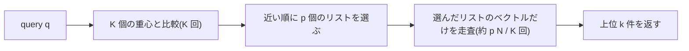
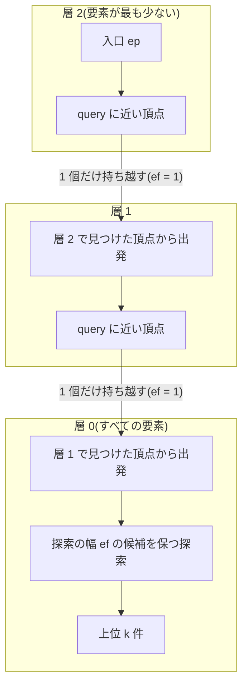
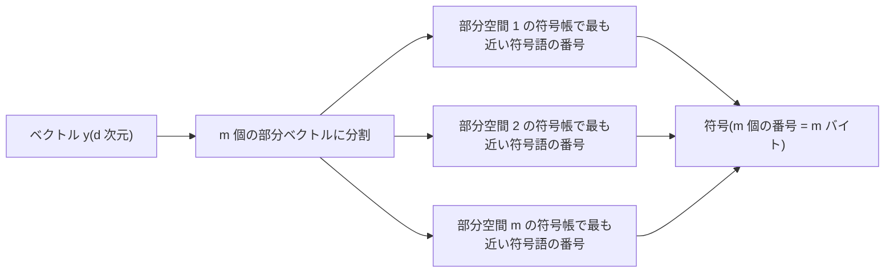
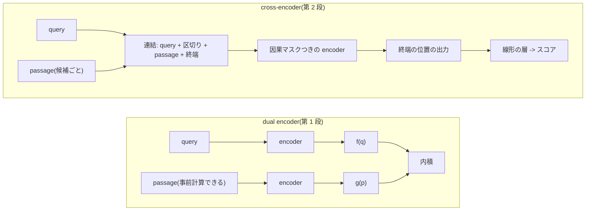
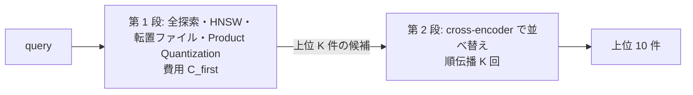

この記事は前編(理論編)です。続きは [こちら](https://zenn.dev/kojikojiprg/books/ai-theories-roadmap/viewer/025_ann_search_and_reranking-practice-1)。

# 025. ANN 検索とリランキング / ANN Search and Reranking

## 1. 概要 / Overview

**近似最近傍探索(ANN: Approximate Nearest Neighbor)** は、全探索のように全ベクトルとの距離を計算せず、query に近いベクトルを少ない距離計算で見つける手法である。
recall(全探索の上位との一致率)を少し手放す代わりに、**1 query あたりの距離計算の回数(費用)** を大きく減らす、という交換を扱う。
本トピックは、024 の dual encoder が埋め込んだ約 9.4 万個の passage を対象に、HNSW(Hierarchical Navigable Small World)・転置ファイル(Inverted File Index)・
Product Quantization(直積量子化)をスクラッチ実装し、費用と recall の関係を測る。さらに、第 1 段(上記の索引)が絞り込んだ上位の候補を、query と passage を連結して符号化する
**cross-encoder** で並べ替える 2 段階の検索(retrieve-then-rerank)を、008 の小型 GPT を起点に実装する。

検証するのは次の 5 つである(いずれも判定つき)。(A)HNSW が目標の recall に達するための費用の、件数 $N$ に対するべき指数が 1 より小さいか、(B)最大の $N$ で、HNSW の費用が転置ファイルより小さいか、
(C)同じ符号帳で、Product Quantization の非対称距離計算(Asymmetric Distance Computation)が対称距離計算(Symmetric Distance Computation)より recall が高いか、
(D)起点・学習データ・負例・損失の形・学習ステップ数を揃えたとき、cross-encoder による並べ替えが dual encoder による並べ替えより検索指標が高いか、(E)第 1 段の上位から採掘した困難な負例で学習した
cross-encoder が、ランダムな負例で学習した cross-encoder より、並べ替えの検索指標が高いか。あわせて、判定を設けない観察として、(F)第 1 段を全探索・HNSW・転置ファイル・Product Quantization
(再採点あり・なし)に替えたときの 2 段階の検索の検索指標と費用を示す。

### 1.1 実行の手順

本番実行は Google Colab T4 の **1 つのセッションで完結** させた。5.1 節のセットアップセルで`SMOKE_TEST = False`・`UPLOAD_ARTIFACTS = True`にして、「すべてのセルを実行」した(実行環境とコミットは 5.1 節の出力)。

実行時間の予算は 1 セッションあたり **T4 で 120 分** とした。索引の構築と学習を始める前に(6.3 節)、実行するデバイスの上でスケーリングの計測を行い、**実行計画**(6.1 節。学習ステップ数 $T$・
HNSW・転置ファイル・Product Quantization の索引の最大の件数 $N_{\max}$・各実験のシード数の組)のそれぞれについて残りの実行時間を見積もり(6.4 節)、
予算に収まる計画のうち優先順位の最も高いものを自動で選ぶ。選択は見積もりのみに基づき、どの実験の結果も参照しない。**選ばれた計画は 6.4 節の出力に印字され、本番では計画 1 だった(1.2 節)。**
事前の計測のための実行やセッションの分割はしない。見積もりが最も下位の計画でも予算を超える場合は、索引の構築と学習の前に停止する(本番では停止しなかった)。

学習したモデルのうち、後続のアプリ(`apps/`)の入力にする候補とした **困難な負例で学習した cross-encoder(D1)のシード 0** は、公開の条件(読み込み直した重みの Recall@10 が並べ替えなしを上回ること。判定ではない)を満たし、
かつ`UPLOAD_ARTIFACTS`が`True`のときだけ、Hugging Face Hub にアップロードする設計だった(6.16 節。既定は`False`)。**本番では公開の条件を満たさず、アップロードは行われなかった(7.10 節)。**
索引・埋め込み・他の条件のモデルは、保存もアップロードもしない。

### 1.2 本番実行の結果の要約

**実行環境**(5.1 節の出力): Google Colab、Tesla T4(compute capability 7.5、GPU の総メモリ 14.56 GiB)、Python 3.13.15、torch 2.13.0+cu130(ビルド時の CUDA 13.0、cuDNN 92000)。コミット`2d508485e52b78d7786dc9475fb27cc59bbdd906`(未コミットの変更なし)、
実行日時(UTC)2026-10-07T07:28:55。並べ替えモデルの精度は FP16 の autocast と動的損失スケーリング(スコア・損失・指標は FP32、近似最近傍探索の索引は CPU の FP32)。

**選ばれた計画と実行時間**(6.4 節・6.15 節の出力): 計画 1(学習ステップ数 $T = 1024$、段階 1: 実験 A・B・C のシード数を 5 から 3 に削る)。索引の最大の件数は $N_{\max} = 65{,}536$、並べ替えモデルは D1・D2・E2 とも 5 シード。
見積もりは終了までに 107.9 分(準備と計測の 10.8 分 + 計画 1 の 97.1 分)で、実際の全体の経過時間は **98.9 分**(予算 120 分)だった。

**前提条件の成否**(7.2 節): 実験 A・B・C は、すべての前提条件が成立した。実験 D・E は、P0(較正)・P2(改善の余地)・P3(第 1 段の候補)が成立し、**P1(学習の成立)が成立しなかった**。
成分 (a)(訓練損失)は、D1 のシード 1 とシード 2 で不成立(最後の区間の損失の差の平均が、標準誤差の 2 倍以上低くない。最小は標準誤差の 1.2 倍で、閾値は 2.0 倍)。
成分 (b)(較正の query での Recall@10 の増分)は、実験 D の基準の条件(D2)で成立し(増分 / 標準偏差 2.5)、実験 E の基準の条件(E2)で不成立だった(0.8)。

**判定**(6.15 節の出力。対比量 $\Delta$・標準偏差 $\sigma$・閾値 $2\sigma$):

| 実験 | 対比量(D・E は参考値) | 標準偏差 | 閾値 | 前提条件 | 最終判定 |
|---|---|---|---|---|---|
| A | +0.6657 | 0.0102 | 0.0204 | 成立 | **支持** |
| B | +1.4339 | 0.0307 | 0.0613 | 成立 | **支持** |
| C | +0.1296 | 0.0033 | 0.0067 | 成立 | **支持** |
| D | -0.0625 | 0.0084 | 0.0168 | P1 が不成立 | **前提不成立** |
| E | -0.0050 | 0.0076 | 0.0151 | P1 が不成立 | **前提不成立** |

実験 D・E の対比量は、前提条件が成立しないため参考値であり、結論として読まない。

- **実験 A(支持)**: HNSW が目標の recall 0.9 に達する 1 query あたりの距離計算の回数は、$N = 4096$〜$65{,}536$(16 倍)の範囲で $N^{0.334}$ に比例して増え(べき指数は 3 シードとも 0.334〜0.335)、$N = 65{,}536$ で 399.4 回と、全探索(65,536 回)の約 164 分の 1 だった。
- **実験 B(支持)**: $N = 65{,}536$ で、目標の recall での費用は、転置ファイル(リスト数 512 が 3 シードとも最小)が 1,675.4 回、HNSW が 399.4 回で、転置ファイルが約 4.2 倍(距離計算の回数の比較で、構築の費用を含まない)。
- **実験 C(支持)**: 同じ符号帳(符号 32 バイト、32 倍の圧縮)で、全探索の上位 10 件との一致率は、非対称距離計算 0.5143、対称距離計算 0.3847(3 シードの平均。差は 0.1296)。
- **実験 D(前提不成立)**: D1 の学習の成立の前提条件が不成立で(最後の区間の訓練損失が 2.059〜2.078 と、一様な予測の損失 $\ln 8 = 2.079$ とほぼ同じ)、cross-encoder と dual encoder のどちらの Recall@10 が高いかについて、情報を得ていない。
- **実験 E(前提不成立)**: D1(= E1)の学習の成立の前提条件 (a) に加えて、基準の条件(E2)の (b) も成立しなかった(Recall@10 の増分のシードごとの値が +0.0525 から -0.0251 までばらついた)。困難な負例の効果について、情報を得ていない。
- **観察 F(判定なし)**: 第 1 段を HNSW(533 回の距離計算)にしても、並べ替えなしの Recall@10 は 0.1465 で、全探索(65,536 回)の 0.1481 とほぼ同じだった。D1 で並べ替えると、どの第 1 段でも、並べ替える候補の数 $K = 20, 50, 100$ の Recall@10 は $K = 10$(並べ替えなしと同じ)より低かった。
  D1 は実験 D・E で学習の成立の前提条件が不成立の条件なので、この表は並べ替えの効果を示すものではない。
- **アップロード**: 公開の条件を満たさず(読み込み直した D1 のシード 0 の Recall@10 0.1708 が、並べ替えなしの 0.2199 を上回らない)、**Hub へのアップロードは行っていない**(`HF_TOKEN`の取得も行っていない)。
- **事後的な解釈**(検証済みの結論ではない。7.11 節): D1 の学習が進まなかった原因の候補は、学習量(使える query の 0.208 エポック)・課題の難しさ・学習率の較正の選び方・cross-encoder の構成で、確かめる方法を併記した。

## 2. 参考論文 / References

1. Malkov, Yu. A., Yashunin, D. A.,
   "Efficient and robust approximate nearest neighbor search using Hierarchical Navigable Small World graphs", IEEE TPAMI 42(4), 2020(arXiv:1603.09320, DOI 10.1109/TPAMI.2018.2889473).
   https://arxiv.org/abs/1603.09320(HNSW。層の番号の分布、挿入と探索のアルゴリズム(Algorithm 1〜5)、近傍の選択のヒューリスティック、計算量の議論。3.3 節、実験 A・B)
2. Malkov, Y., Ponomarenko, A., Logvinov, A., Krylov, V.,
   "Approximate nearest neighbor algorithm based on navigable small world graphs", Information Systems 45, 61–68, 2014. https://doi.org/10.1016/j.is.2013.10.006
   (Navigable Small World。階層を持たない 1 層のグラフ。HNSW の前身。3.3 節)
3. Jégou, H., Douze, M., Schmid, C.,
   "Product Quantization for Nearest Neighbor Search", IEEE TPAMI 33(1), 117–128, 2011. https://doi.org/10.1109/TPAMI.2010.57
   (Product Quantization、非対称距離計算と対称距離計算、転置ファイルとの組み合わせ(IVFADC: Inverted File with Asymmetric Distance Computation)。3.2・3.4 節、実験 C)
4. Kleinberg, J.,
   "The small-world phenomenon: an algorithmic perspective", STOC 2000, pp. 163–170. https://www.cs.cornell.edu/home/kleinber/swn.d/swn.html
   (small world のグラフ上の貪欲な経路探索が、どのようなグラフで有効になるか。3.3 節)
5. Sivic, J., Zisserman, A.,
   "Video Google: A Text Retrieval Approach to Object Matching in Videos", ICCV 2003. https://doi.org/10.1109/ICCV.2003.1238663
   (ベクトル量子化と転置ファイルによる検索。転置ファイルの考え方の出典の 1 つ。3.2 節)
6. Lloyd, S. P.,
   "Least squares quantization in PCM", IEEE Transactions on Information Theory 28(2), 129–137, 1982. https://doi.org/10.1109/TIT.1982.1056489
   (Lloyd のアルゴリズム(k-means)。3.2 節)
7. Aumüller, M., Bernhardsson, E., Faithfull, A.,
   "ANN-Benchmarks: A Benchmarking Tool for Approximate Nearest Neighbor Algorithms", Information Systems 87, 101374, 2020(オンライン公開は 2019 年。arXiv:1807.05614).
   https://arxiv.org/abs/1807.05614(recall と費用の曲線で索引を比べる評価の方法。3.9 節)
8. Lin, P.-C., Zhao, W.-L.,
   "Graph based Nearest Neighbor Search: Promises and Failures", arXiv:1904.02077, 2019. https://arxiv.org/abs/1904.02077
   (高次元のデータで、階層が対数の計算量をもたらさず、階層を持たない近傍グラフと同程度の性能になることの報告。3.3 節、実験 A の診断量)
9. Munyampirwa, B., Lakshman, V., Coleman, B.,
   "Down with the Hierarchy: The 'H' in HNSW Stands for 'Hubs'", arXiv:2412.01940, 2024. https://arxiv.org/abs/2412.01940
   (高次元のデータでは、階層を持たない近傍グラフが HNSW の利点を保つこと、ハブとなる頂点が階層の代わりをしているという報告。3.3 節、実験 A の診断量)
10. Nogueira, R., Cho, K.,
    "Passage Re-ranking with BERT", arXiv:1901.04085, 2019. https://arxiv.org/abs/1901.04085
    (cross-encoder による passage の並べ替え。3.5 節、実験 D)
11. Ma, X., Wang, L., Yang, N., Wei, F., Lin, J.,
    "Fine-Tuning LLaMA for Multi-Stage Text Retrieval", SIGIR 2024(arXiv:2310.08319). https://arxiv.org/abs/2310.08319
    (decoder-only の大規模言語モデルを、終端のトークンの位置の出力から並べ替えのスコアを出す reranker(RankLLaMA)に転用する。3.5 節)
12. Karpukhin, V., Oğuz, B., Min, S., Lewis, P., Wu, L., Edunov, S., Chen, D., Yih, W.,
    "Dense Passage Retrieval for Open-Domain Question Answering", EMNLP 2020. https://arxiv.org/abs/2004.04906
    (BM25 で採掘した困難な負例。024 の 3.6 節。3.7 節)
13. Xiong, L., Xiong, C., Li, Y., Tang, K.-F., Liu, J., Bennett, P., Ahmed, J., Overwijk, A.,
    "Approximate Nearest Neighbor Negative Contrastive Learning for Dense Text Retrieval", ICLR 2021. https://arxiv.org/abs/2007.00808
    (学習時の負例が、検索時に出会う無関係な文書の分布を代表していないことが問題であり、近似最近傍探索の索引で採掘した負例で学習する。3.7 節、実験 E)
14. Qu, Y., Ding, Y., Liu, J., Liu, K., Ren, R., Zhao, W. X., Dong, D., Wu, H., Wang, H.,
    "RocketQA: An Optimized Training Approach to Dense Passage Retrieval for Open-Domain Question Answering", NAACL 2021. https://arxiv.org/abs/2010.08191
    (採掘した困難な負例に、実際には正解である偽の負例が混ざる問題と、その除去。3.7 節、位置づけのみ)
15. Indyk, P., Motwani, R.,
    "Approximate nearest neighbors: towards removing the curse of dimensionality", STOC 1998, pp. 604–613(統合した版: Har-Peled, S., Indyk, P., Motwani, R., Theory of Computing 8(14), 2012).
    https://theoryofcomputing.org/articles/v008a014/(近似を許すと検索時間を件数に対して劣線形にできること。locality sensitive hashing。3.1 節。位置づけのみ)
16. Johnson, J., Douze, M., Jégou, H.,
    "Billion-scale similarity search with GPUs", IEEE Transactions on Big Data 7(3), 535–547(arXiv:1702.08734). https://arxiv.org/abs/1702.08734
    (Faiss。転置ファイルと Product Quantization の実装の代表例。3.2・3.4 節。位置づけのみ)
17. Guo, R., Sun, P., Lindgren, E., Geng, Q., Simcha, D., Chern, F., Kumar, S.,
    "Accelerating Large-Scale Inference with Anisotropic Vector Quantization", ICML 2020(arXiv:1908.10396). https://arxiv.org/abs/1908.10396
    (ScaNN。量子化の損失を内積の順位に合わせて設計する。3.8 節。位置づけのみ)
18. Subramanya, S. J., Devvrit, Kadekodi, R., Krishnaswamy, R., Simhadri, H. V.,
    "DiskANN: Fast Accurate Billion-point Nearest Neighbor Search on a Single Node", NeurIPS 2019. https://papers.nips.cc/paper/2019/hash/09853c7fb1d3f8ee67a61b6bf4a7f8e6-Abstract.html
    (ディスク上に置いた近傍グラフによる探索。3.8 節。位置づけのみ)
19. Ge, T., He, K., Ke, Q., Sun, J.,
    "Optimized Product Quantization", IEEE TPAMI 36(4), 744–755, 2014(CVPR 2013 の拡張)。https://www.microsoft.com/en-us/research/publication/optimized-product-quantization/
    (部分空間の分け方を最適化する Product Quantization。3.8 節。位置づけのみ)
20. Khattab, O., Zaharia, M.,
    "ColBERT: Efficient and Effective Passage Search via Contextualized Late Interaction over BERT", SIGIR 2020. https://arxiv.org/abs/2004.12832
    (late interaction。024 の参考論文 16。3.5 節。位置づけのみ)
21. Hofstätter, S., Althammer, S., Schröder, M., Sertkan, M., Hanbury, A.,
    "Improving Efficient Neural Ranking Models with Cross-Architecture Knowledge Distillation", arXiv:2010.02666, 2020. https://arxiv.org/abs/2010.02666
    (cross-encoder から dual encoder への知識蒸留。3.8 節。位置づけのみ)

本文で用いる既存トピックの部品: 小型 GPT と bits-per-byte は [006](https://zenn.dev/kojikojiprg/books/ai-theories-roadmap/viewer/006_pretraining_small_gpt-theory)、AdamW・warmup + cosine・gradient clipping は
[007](https://zenn.dev/kojikojiprg/books/ai-theories-roadmap/viewer/007_training_stabilization-theory)、本トピックが起点にする学習済みの小型 GPT は [008](https://zenn.dev/kojikojiprg/books/ai-theories-roadmap/viewer/008_decoding_strategies-theory)、FP16 の autocast と動的損失スケーリングは
[011](https://zenn.dev/kojikojiprg/books/ai-theories-roadmap/viewer/011_mixed_precision_training-theory)、スカラー量子化(一様量子化)は [013](https://zenn.dev/kojikojiprg/books/ai-theories-roadmap/viewer/013_quantization_basics-theory)、
記事を単位とするクラスタブートストラップは [015](https://zenn.dev/kojikojiprg/books/ai-theories-roadmap/viewer/015_long_context_extension-theory)、報酬モデルのスカラーのヘッドは [017](https://zenn.dev/kojikojiprg/books/ai-theories-roadmap/viewer/017_reward_model_and_rlhf-theory)、
dual encoder・InfoNCE 損失・Matryoshka Representation Learning・評価用の索引と query・Recall@10 は [024](https://zenn.dev/kojikojiprg/books/ai-theories-roadmap/viewer/024_text_embedding_and_retriever-theory) で扱った。

## 3. 理論 / Theory

### 3.1 動機: 全探索の計算量と、近似の考え方

**全探索(exhaustive search)** は、query $x$ と全ベクトル $y_1, \dots, y_N \in \mathbb{R}^d$ との距離(または類似度)をすべて計算して、上位 $k$ 件を返す。
1 本のベクトルとの距離計算が $O(d)$ なので、1 query あたりの計算量は

$$
O(N d)
$$

である($N$ は索引のベクトルの数、$d$ は次元)。本トピックでは **1 本のベクトルとの距離(内積)の計算を 1 回と数え**、全探索の費用を $N$ 回とする。

**単位ベクトルでは、3 つの尺度の順位が一致する。** $x$ と $y$ が単位ベクトル($\lVert x \rVert = \lVert y \rVert = 1$)のとき、

$$
\lVert x - y \rVert^2 = \lVert x \rVert^2 - 2 x^\top y + \lVert y \rVert^2 = 2 - 2 x^\top y
$$

となる。したがって、二乗ユークリッド距離は内積(= コサイン類似度)の減少関数で、**cosine 類似度・内積・二乗ユークリッド距離は、どれも同じ順位を与える**。024 の埋め込みは L2 正規化した単位ベクトルなので、
以下の索引はどの尺度を使っても同じ最近傍を探す。

**近似最近傍探索の考え方**: 次元が高いと、木構造などの厳密な探索法も全探索とほぼ同じ費用になる(次元の呪い)。Indyk & Motwani [15] は、真の最近傍でなくてよい(近似を許す)
とすると、検索時間を $N$ に対して劣線形にできることを示した。実用の索引は、**真の上位 $k$ 件のうち返せた割合(recall)を手放す代わりに、距離計算の回数を減らす**。
探索の幅や探索するリストの数を増やすと、recall も費用も増える。索引どうしの比較は、**同じ recall を達成するときの費用** で行う(3.9 節、ANN-Benchmarks [7] の考え方)。

本トピックで扱う 3 つの方式は、費用を減らす方法が異なる。

| 方式 | 減らし方 | 近似の源 |
|---|---|---|
| 転置ファイル(3.2 節) | query に近いクラスタのベクトルだけを走査する | 近いベクトルが別のクラスタに入る |
| HNSW(3.3 節) | 近傍グラフをたどって、query に近い部分だけを訪れる | 局所最適にはまり、真の近傍を訪れない |
| Product Quantization(3.4 節) | ベクトルを短い符号に圧縮し、距離を表引きで近似する | 量子化の誤差で順位が乱れる |

転置ファイルと HNSW は **走査するベクトルを減らす**(距離は正確に計算する)方式、Product Quantization は **1 本あたりの距離の計算を安くする**(全ベクトルを走査するが、距離は近似する)方式である。

### 3.2 転置ファイル(Inverted File Index)

**考え方**: 全ベクトルを k-means で $K$ 個のクラスタ(Voronoi 領域)に分け、クラスタごとに、属するベクトルの一覧(転置リスト)を作る。query が来たら、$K$ 個の重心との距離を求め、近い順に $p$ 個のリスト
($p$ を探索するリストの数と呼ぶ)だけを走査して、その中の上位を返す。ベクトルを重心の番号で引く索引は、画像検索の Video Google(Sivic & Zisserman [5])が、テキスト検索の転置索引になぞらえて
導入し、Jégou ら [3] が Product Quantization と組み合わせた(IVFADC。3.4 節)。

**k-means(Lloyd のアルゴリズム [6])**: 点の集合 $\{x_i\}_{i=1}^{n}$ と重心の集合 $\{c_j\}_{j=1}^{K}$ について、各点を最も近い重心に割り当てたときの二乗誤差の和

$$
J = \sum_{i=1}^{n} \min_{j} \lVert x_i - c_j \rVert^2
$$

を小さくする。割り当て(各点を最も近い重心へ)と更新(各重心を割り当てられた点の平均へ)を交互に行うと、どちらの手順も $J$ を増やさないので、$J$ は反復ごとに単調に減少する。
ただし、収束先は局所最適で、初期値に依存する。本トピックでは、初期化を「点の集合から $K$ 個を重複なく選ぶ」、反復回数を 20 回に固定する(割り当てが 0 個になった重心は、割り当てた重心までの距離が最大の点に置き直す)。

**費用の式**: 各リストの大きさが平均 $N / K$ のとき、1 query あたりの距離計算の回数は

$$
C(K, p) = K + p \cdot \frac{N}{K}
$$

である。第 1 項が重心との比較、第 2 項が走査するベクトルの数である($p = K$ ですべてのリストを走査すると、全探索と同じ結果になり、費用は全探索より $K$ だけ増える)。

**リスト数を $\sqrt{N}$ に比例させると費用が $O(\sqrt{N})$ になること**: $p$ を固定して $K$ で最小化する。

$$
\frac{\partial C}{\partial K} = 1 - \frac{p N}{K^2} = 0 \;\Rightarrow\; K = \sqrt{p N}, \qquad C = 2 \sqrt{p N} = O(\sqrt{N})
$$

$K = c \sqrt{N}$($c$ は定数)とおけば $C = (c + p / c) \sqrt{N}$ で、費用は $\sqrt{N}$ で増える。重心との比較(第 1 項)と走査(第 2 項)が同じ大きさになる点が最小である。
**この導出は、目標の recall に必要な $p$ が $N$ によらず一定という仮定を置いている。** 実際には、$K$ が増えると各リストが小さくなり、近いベクトルが別のリストに入る割合が増えるので、
同じ recall に必要な $p$ は $N$ とデータに依存する(必要な $p$ が $N$ とともに増えれば、費用は $\sqrt{N}$ より速く増える)。実験 B は、$K$ を $\sqrt{N}$ の $1/2$ 倍から 8 倍までの 5 点(公比 2)で試し、
目標の recall での費用が最小のものを採用する。



### 3.3 HNSW(Hierarchical Navigable Small World)

#### 3.3.1 small world のグラフと貪欲な探索

**近傍グラフ(proximity graph)** は、ベクトルを頂点とし、近いベクトルどうしを辺で結んだグラフである。query に対して、適当な頂点から出発し、
**隣接する頂点のうち query に最も近いものへ移る**(貪欲な探索、greedy search)を、近づけなくなるまで繰り返せば、query に近い頂点にたどり着ける。
各頂点の辺が近いベクトルだけだと、遠い頂点までのたどる回数が多くなる(辺数が少ないとき、頂点の数 $N$ に対して多項式のステップが要る)。
**small world** のグラフは、近い頂点への辺に加えて、少数の遠い頂点への辺(長距離の辺)を持ち、任意の 2 頂点の間の最短経路が短い(頂点数の対数程度)。
Kleinberg [4] は、短い経路が存在するだけでなく、**局所の情報だけで貪欲にその経路を見つけられる** のは、辺の長さの分布が特定の形のモデルに限られることを示した(navigability)。

**Navigable Small World(Malkov ら [2])** は、ベクトルを 1 つずつ挿入し、挿入のたびに、その時点のグラフから探索で見つけた近い頂点と辺を張る。
**早く挿入された頂点どうしは、その時点では少数の中で最も近い相手と結ばれる** ので、後から密になった領域では長距離の辺になる。この自然な長距離の辺により、貪欲な探索が遠くから近くへ進める。
ただし、Navigable Small World は 1 層のグラフで、探索の費用の件数への増え方が対数よりも速い(原論文の主張)。

#### 3.3.2 階層化: 層の番号を指数分布から引く

HNSW(Malkov & Yashunin [1])は、**辺の長さの尺度ごとに層を分ける**。最下層(層 0)がすべての要素を含み、上の層ほど要素が少ない(上の層の頂点の集合は下の層の部分集合)。
要素 $q$ を挿入するとき、その要素が属する最大の層の番号 $l$ を、指数分布から引く(原論文の式)。

$$
l = \lfloor -\ln(u) \cdot m_L \rfloor, \qquad u \sim \mathrm{Uniform}(0, 1), \qquad m_L = \frac{1}{\ln M}
$$

$M$ は 1 つの要素が挿入のときに張る接続の数、$m_L$ は層の番号の分布を決める正規化の係数である。**層の番号の分布**: $l \ge j$ となる確率は

$$
P(l \ge j) = P\left(-\ln u \ge \frac{j}{m_L}\right) = P\left(u \le e^{-j \ln M}\right) = M^{-j}
$$

なので、層 $j$ 以上に属する要素は $N M^{-j}$ 個程度、最上層の番号は $\log_M N$ 程度である(スキップリストの確率 $1/M$ に対応する)。原論文は $m_L = 1/\ln M$ を、層の間の頂点の重なり
(ある頂点の近傍が他の層にも属する割合)が小さく、層の数と 1 層あたりのたどる回数が釣り合う単純な選択として示す。



**探索(Algorithm 5)**: 最上層の入口の要素から出発し、**上の層では貪欲な探索(探索の幅 $ef = 1$)** で query に最も近い 1 つの要素を見つけ、それを次の層の入口にして降りる。
**層 0 では、探索の幅 $ef$ の候補の集合 $W$ を保ちながら探索する**(Algorithm 2)。$W$ に入っている最も遠い要素より遠い候補を捨てるので、探索は $W$ の中を改善できなくなったときに終わる。
$W$ の中の上位 $k$ 件を返す。**$ef$ を大きくすると recall が上がり、費用も増える。**

**挿入(Algorithm 1)**: 要素の層の番号 $l$ を引く。最上層から $l + 1$ 層までは $ef = 1$ の貪欲な探索で入口を更新する。層 $l$ 以下の各層では、探索の幅 $efConstruction$ の探索で見つけた候補から、
$M$ 個の近傍を選んで双方向の辺を張る。辺を張った相手の頂点の接続の数が上限 $M_{\max}$ を超えたら、その頂点の近傍を同じ選び方で選び直す(最下層の上限は $M_{\max 0} = 2M$、それ以外の層は $M_{\max} = M$。
原論文は、$M_{\max 0} = 2M$ を良い選択として示す)。

**近傍の選択のヒューリスティック(Algorithm 4)**: 単純には、候補のうち query(基準の点)に近い順の $M$ 個を選ぶ(Algorithm 3)。ヒューリスティックは、候補を基準の点に近い順に調べ、
**すでに選んだどの要素よりも基準の点に近い候補だけ** を選ぶ(候補 $e$ について、選んだ集合 $R$ のすべての要素 $r$ で $d(e, q) < d(e, r)$ が成り立つとき)。近いが同じ方向にある候補は捨てられるので、
**方向の異なる近傍が選ばれ**、クラスタの間をつなぐ辺が残りやすい。原論文は、クラスタ構造を持つデータや低次元のデータで、単純な選択より大きく改善すると報告している。

#### 3.3.3 計算量の主張と、高次元での注意

原論文は、**探索の計算量が $O(\log N)$、構築の計算量が $O(N \log N)$ でスケールする** と主張する。根拠は次の議論である: 各層で、厳密な Delaunay グラフ(近傍関係を表す最小の部分グラフ)があれば、
次の層の入口に着くまでの平均のステップ数は定数で抑えられ(層の間で要素の選ばれる確率が空間の位置と無関係なので、次の層に属する要素にたどり着く確率が $e^{-m_L}$ で一定になる)、
層の数の期待値が $\log N$ に比例するので、全体で $O(\log N)$ になる。この議論は **Delaunay グラフの平均次数が定数で抑えられるという仮定** に依存する。原論文自身が、
Delaunay グラフの平均次数は次元に対して指数的に増えるので、高次元のデータ(例: $d = 128$)でこの仮定の成立を実験で確かめるには極端に大きなデータが要り、高次元への一般化にはさらなる解析が必要だと述べている。

**高次元での階層の利得**: 階層(上の層)が高次元のデータで効くかは、後続の研究で疑問が示されている。Lin & Zhao [8] は、高次元のデータで階層が対数の計算量をもたらさず、階層を持たない近傍グラフ
(多様化した辺を持つもの)と同程度の性能になることを報告した。Munyampirwa ら [9] は、高次元のデータでは、階層を持たない近傍グラフが HNSW の利点を保つこと、
ハブ(多くの頂点から近傍として選ばれる頂点)が階層の代わりに「高速道路」の役割を果たしていることを報告した。本トピックの埋め込みは $d = 256$ の高次元なので、
**階層の効果を、最下層だけをランダムな入口から探索したときの費用との比較として診断量に併記する**(実験 A)。

**パラメータの選び方**: 原論文は、$M$ の妥当な範囲を 5〜48 とし、**小さい $M$ は低い recall や低次元のデータに、大きい $M$ は高い recall や高次元のデータに向く** と述べている。メモリは $(M_{\max 0} + m_L M_{\max})$ にリンク 1 本のバイト数を掛けた値に比例する。

### 3.4 Product Quantization(直積量子化)

**符号化**: $d$ 次元のベクトル $y$ を $m$ 個の部分ベクトル $y^1, \dots, y^m$(各 $d / m$ 次元)に分け、部分空間 $j$ ごとに、独立な k-means で $k^*$ 個の符号語(centroid)の符号帳 $C^j$ を学習する。
各部分ベクトルを、最も近い符号語の番号で表す(Jégou ら [3])。

$$
q(y) = \left( q^1(y^1), \dots, q^m(y^m) \right), \qquad q^j(y^j) = \arg\min_{c \in C^j} \lVert y^j - c \rVert^2
$$

$q^j$ は部分空間 $j$ の量子化器である。符号の長さは $m \log_2 k^*$ ビットで、$k^* = 256$ なら 1 部分ベクトルを 1 バイトで表し、**1 ベクトルあたり $m$ バイト** になる($d = 256$ を FP32 で持てば 1,024 バイトなので、$m = 32$ なら 32 分の 1)。

**実効的な符号帳の大きさ**: 部分空間の符号語の直積 $C = C^1 \times \dots \times C^m$ の要素数は $(k^*)^m$ である。持つ符号語は $m k^*$ 個(例: $m = 32$、$k^* = 256$ で 8,192 個)なのに、
表せる再構成のベクトルの種類は $256^{32}$ 個になる。通常の k-means で同じ数の符号語を持つことは、メモリの面でも学習の面でも不可能である。これが直積を使う理由である。

**非対称距離計算(Asymmetric Distance Computation)**: query $x$ は量子化せず、データベースのベクトル $y$ だけを量子化して、二乗距離を部分空間ごとの和で近似する。

$$
\hat{d}_{\mathrm{asymmetric}}(x, y)^2 = \lVert x - q(y) \rVert^2 = \sum_{j=1}^{m} \left\lVert x^j - q^j(y^j) \right\rVert^2
$$

query ごとに、すべての部分空間 $j$ と符号語 $c \in C^j$ の組について $\lVert x^j - c \rVert^2$ を求めて **参照表**($m \times k^*$ 個の値)を作る。各ベクトルの距離は、その符号の $m$ 個の番号で参照表を引いて足すだけで求まる。
1 query の費用は、参照表の作成($m k^*$ 回の部分ベクトルの距離)と、全ベクトルについての表引き($N m$ 回)である。

**対称距離計算(Symmetric Distance Computation)**: query も量子化して、符号語どうしの距離で近似する。

$$
\hat{d}_{\mathrm{symmetric}}(x, y)^2 = \lVert q(x) - q(y) \rVert^2 = \sum_{j=1}^{m} \left\lVert q^j(x^j) - q^j(y^j) \right\rVert^2
$$

符号語どうしの距離の表($m \times k^* \times k^*$)は索引の構築時に 1 回だけ作る。query の量子化(最も近い符号語を探す)に $m k^*$ 回の部分ベクトルの距離が要る。距離の求め方は、
query の符号で表の行を選べば、非対称距離計算と同じ表引きになる。

**距離の誤差と量子化の平均二乗誤差の関係**: 符号語は k-means の重心(その領域に属するベクトルの平均)なので、$e_y = y - q(y)$(領域の中での位置のずれ。量子化の誤差)は、領域を決めると平均 0 である。
$D = \mathbb{E}\lVert e_y \rVert^2$ を量子化の平均二乗誤差とし、query $x$ は $y$ の領域の中での位置と独立とする。$x - y = (x - q(y)) - e_y$ を展開すると、

$$
\lVert x - y \rVert^2 = \lVert x - q(y) \rVert^2 - 2 \langle x - q(y), e_y \rangle + \lVert e_y \rVert^2
$$

右辺の第 2 項は、$e_y$ の平均が 0 で $x - q(y)$ と独立なので期待値が 0、第 3 項の期待値は $D$ である。したがって、非対称距離計算の推定の二乗距離 $\lVert x - q(y) \rVert^2$ は、真の値に対して **平均として $D$ だけ小さい**
(偏りは $-D$。$y$ を重心に置き換えると、$y$ の領域の中のばらつきのぶんだけ、$x$ に近づいて見える)。対称距離計算では $x$ も量子化するので、$e_x = x - q(x)$ を使って

$$
\lVert x - y \rVert^2 = \lVert q(x) - q(y) \rVert^2 + 2 \langle q(x) - q(y), e_x - e_y \rangle + \lVert e_x - e_y \rVert^2
$$

と展開できる。第 2 項の期待値は 0、第 3 項の期待値は $\mathbb{E}\lVert e_x \rVert^2 + \mathbb{E}\lVert e_y \rVert^2$($e_x$ と $e_y$ が独立で平均 0 のとき)なので、偏りは $-(\mathbb{E}\lVert e_x \rVert^2 + \mathbb{E}\lVert e_y \rVert^2)$ で、
$x$ と $y$ が同じ分布なら $-2D$ になる。誤差の分散も、$x$ の誤差が加わるぶん大きい(Jégou ら [3] は、解析と実験で、非対称距離計算の方が検索の精度が高いことを示した)。
一様な偏りは順位を変えないが、$\lVert e_y \rVert^2$ はベクトルごとに異なるので、偏りの大きさのばらつきと第 2 項のばらつきが順位を乱す。
**query は passage と長さが違い(32 トークンと 128 トークン)、埋め込みの分布が異なりうる。** 符号帳を passage で学習すると、query の量子化の誤差 $\mathbb{E}\lVert e_x \rVert^2$ が passage の $D$ より大きくなりうるので、
対称距離計算の誤差はさらに大きくなりうる(実験 C の診断量で、推定の偏りと $\mathbb{E}\lVert e_x \rVert^2$・$D$ を並べる)。

**スカラー量子化からベクトル量子化へ(013 との対応)**: 013 の一様量子化は、1 つの値を $2^b$ 個の等間隔の水準に丸める(1 次元の量子化。誤差は $\Delta^2 / 12$)。
Product Quantization は、これを **部分ベクトル($d / m$ 次元)を単位とするベクトル量子化** に拡張したものである。水準が等間隔である必要がなく、データの分布に合わせて学習した符号語を使う。
$m = d$(部分ベクトルが 1 次元)の場合が、水準を学習するスカラー量子化にあたる。同じ符号長なら、部分ベクトルを大きくするほど、次元の間の相関を符号語が捉えられる。

**再採点(re-scoring)**: 圧縮した符号による近似の距離で上位 $R$ 件の候補に絞り、その $R$ 件だけ元のベクトルで距離を計算し直して順位をつける。近似の距離は順位を少し乱すだけで、
真の上位 $k$ 件は近似の距離の上位 $R$ 件($R > k$)に入っていることが多い。費用は $R$ 回(全次元)の距離計算が加わる。

**転置ファイルとの組み合わせ(IVFADC。位置づけのみ)**: 転置ファイルの重心 $c(y)$ との **残差** $y - c(y)$ を Product Quantization で量子化し、query の近い $p$ 個のリストだけを、残差に対する非対称距離計算で走査する。

$$
\hat{d}(x, y)^2 = \lVert (x - c(y)) - q(y - c(y)) \rVert^2
$$

全ベクトルを走査せず(走査は $p N / K$ 個)、かつ 1 本あたりの距離が安い。本トピックでは、転置ファイルと Product Quantization を別々に実装・比較し、組み合わせは実装しない。



### 3.5 dual encoder と cross-encoder

検索の類似度を計算する構造は、query と passage をどの段階で結合するかで 2 つに分かれる(024 の 3.2 節)。

- **dual encoder**: $s(q, p) = f(q)^\top g(p)$。スコアが $q$ の関数と $p$ の関数の内積に **分解できる** ので、passage の埋め込みを事前に計算して索引にでき、全件の検索に使える
  (本トピックの第 1 段)。一方、passage のすべての情報を 1 本のベクトルに詰めるので、query と passage の語どうしの細かい対応は表せない。
- **cross-encoder**: query と passage を **連結して 1 本の入力** にし、すべてのトークンの間の注意(attention)で相互作用を計算して、スカラーのスコア $g(q, p)$ を出す(Nogueira & Cho [10])。
  スコアが $q$ と $p$ に分解できないので、事前計算ができず、**組ごとに順伝播が要る**。全件には使えず、第 1 段が絞り込んだ候補の並べ替えに使う。

**late interaction**(ColBERT [20])は、passage をトークンごとのベクトルの集合として事前に索引にし、query のトークンごとに最も近い passage のトークンとの内積(MaxSim)を足し合わせる中間の方式で、
位置づけのみとする。

**因果マスクつきの decoder-only のモデルを cross-encoder にする**: 008 の小型 GPT は因果マスクを使うので、位置 $t$ の隠れ状態は位置 $t$ までのトークンにだけ依存する。入力を

$$
\left[ x_1, \dots, x_{L_q}, \langle \mathrm{sep} \rangle, y_1, \dots, y_{L_p}, \langle \mathrm{end} \rangle \right]
$$

($x_i$ は query のトークン、$y_i$ は passage のトークン、$\langle \mathrm{sep} \rangle$ は区切り、$\langle \mathrm{end} \rangle$ は終端、$L_q$・$L_p$ は query・passage の長さ)とすると、
**query 全体と passage 全体の両方を見ている位置は、最後の位置(終端のトークン)だけ** である。query のトークンの位置は passage を見ておらず、passage の途中の位置は query 全体と passage の前半だけを見ている。
そこで、最終正規化層の後の、終端の位置の隠れ状態 $h_{\mathrm{end}}$ に線形の層を付けてスコアにする。

$$
g(q, p) = w^\top h_{\mathrm{end}}(q, p) + b
$$

$w \in \mathbb{R}^{d_{\mathrm{model}}}$ は重み、$b$ はバイアスである(017 の報酬モデルと同じ形。decoder-only の大規模言語モデルの reranker である RankLLaMA(Ma ら [11])も、終端のトークンの位置の表現からスコアを出す)。
**008 のトークナイザの語彙には特殊トークンがない**(256 個のバイトと 7,936 個のマージ)。語彙を増やさずに、コーパスに一度も現れない単一バイトのトークン(区切りは 0x1F、終端は 0x1E の制御文字)を使う。
これらのトークンは 008 の事前学習で入力に現れたことがなく、入力としての埋め込みは学習されていない(出力層との重み共有により、出力側の勾配だけは受けている)。



### 3.6 2 段階の検索(retrieve-then-rerank)の費用

第 1 段が全ベクトルから上位 $K$ 件の候補を絞り込み、第 2 段がその $K$ 件をスコアの高い順に並べ替える。1 query あたりの費用は

$$
C_{\mathrm{total}} = C_{\mathrm{first}} + K \cdot F_{\mathrm{pair}}
$$

である。$C_{\mathrm{first}}$ は第 1 段の距離計算の回数(全探索なら $N$)、$K$ は並べ替える候補の数、$F_{\mathrm{pair}}$ は第 2 段の 1 組あたりの費用である。cross-encoder は組ごとに順伝播が要るので、
**第 2 段の順伝播の回数は $K$ 回** である。dual encoder で並べ替える場合は、passage の埋め込みを事前に計算してあれば、query の順伝播 1 回と $K$ 回の内積で済む。
cross-encoder の順伝播は、列の長さ $L_q + L_p + 2$ のトークンぶんの計算で、1 回の距離計算(内積)よりはるかに重い。



候補を増やす($K$ を大きくする)と、第 1 段の上位 $K$ 件に正例が入る割合(並べ替えで到達できる Recall の上限)は上がるが、第 2 段の費用が $K$ に比例して増える。
第 1 段を近似検索にすると、$C_{\mathrm{first}}$ は減るが、上位 $K$ 件に正例が入る割合が下がりうる。実験 F はこの交換を表にする。

### 3.7 困難な負例(hard negative)

**学習時の負例と推論時の入力の不一致**: 並べ替えモデルは、推論時には第 1 段の上位 $K$ 件、すなわち **第 1 段が query に近いと判断した候補** の中から正例を選ぶ。学習の負例が、
コーパスからランダムに選んだ passage(多くは query と無関係で、見分けるのが易しい)だと、モデルは易しい区別だけを学び、推論時に出会う「紛らわしい」候補を区別する力が育たない。
そこで、**第 1 段の上位から採掘した、紛らわしい負例(困難な負例)** で学習する。DPR(Karpukhin ら [12])は BM25 の上位の passage を、ANCE(Xiong ら [13])は近似最近傍探索の索引で
採掘した負例を使い、「学習時の負例が、検索時の無関係な文書の分布を代表していないこと」が問題だと指摘した。

**偽の負例(false negative)**: 困難な負例は、query に近い passage なので、**実際には正解である passage が混ざる** 危険が大きい。正解を負例として押しのけると、関連のあるものを遠ざける学習になる。
RocketQA(Qu ら [14])は、この偽の負例を、より強いモデルで除く手法を提案した(位置づけのみ)。本トピックの関連性は「query と同じ記事の passage」なので、**採掘した候補から同じ記事の passage を除く**
(ラベルによる除去)。ただし、**別の記事の passage でも、内容が関連しうる**(話題の近い記事、リスト系の記事など)ので、除ききれない偽の負例が残る。

**学習時と推論時の分布を揃える(負例と正例の両方)**: 推論時に並べ替える候補は第 1 段の上位 $K$ 件なので、困難な負例も **第 1 段の上位 $K$ 件(同じ記事を除く)から一様に選ぶ**。学習用の記事の passage だけを対象に採掘するので、
学習に評価用の記事の passage は現れない。

**正例も同じ範囲から選ぶ**: 推論時に並べ替えモデルが見る正例は、定義により、必ず第 1 段の上位 $K$ 件の中にある(上位 $K$ 件に入らない正例は、並べ替えの対象にならない)。学習の正例を、query と同じ記事の passage(元の passage 以外)から
一様に選ぶと、正例の大半は上位 $K$ 件の外にある。そのとき、困難な負例(上位 $K$ 件から選んだもの)との組では、「第 1 段のスコアが低い候補が正例」という、推論時には成り立たない手がかりで訓練損失を下げられる。
そこで、**学習に使う query を、採掘した上位 $K$ 件に同じ記事の passage(元の passage を除く)が 1 つ以上ある query に限り、正例をその上位 $K$ 件の中の同じ記事の passage から一様に選ぶ**。この選び方では、困難な負例の条件の
1 組(正例と負例 $n$ 個)は、すべて第 1 段の上位 $K$ 件の中にある。使える query の数と割合は 5.3 節の出力にある。

**ランダムな負例の条件(実験 E の条件 2)では、分布が揃わない**: 正例は上位 $K$ 件の中、負例は学習用の記事の passage から一様に選ぶので、ほとんどの負例は上位 $K$ 件の外にある。したがって、**第 1 段のスコアの高さが正例の手がかりになりうる**
(推論時の候補はすべて上位 $K$ 件の中なので、この手がかりは役に立たない。実験 E の「解釈の注意」)。

### 3.8 位置づけのみ(実装しない)

- **Locality Sensitive Hashing**(Indyk & Motwani [15]): 近いベクトルが同じ値にハッシュされる確率が高い関数族で、同じ値のベクトルだけを調べる。理論的な保証があるが、実用では他の方式に recall と費用で劣ることが多い。
- **ScaNN**(Guo ら [17]): 量子化の損失を、内積の順位への影響(query に平行な方向の誤差を重く扱う)に合わせて設計する。
- **DiskANN**(Subramanya ら [18]): 近傍グラフをディスクに置き、メモリに載らない規模を扱う。
- **Optimized Product Quantization**(Ge ら [19]): ベクトルを回転して、部分空間の分け方を最適にしてから Product Quantization を行う。
- **IVFADC**(Jégou ら [3]): 3.4 節で式のみ示した、転置ファイルの残差を Product Quantization で量子化する方式。Faiss(Johnson ら [16])の中心的な索引である。
- **ColBERT の late interaction**(Khattab & Zaharia [20])、**cross-encoder から dual encoder への知識蒸留**(Hofstätter ら [21])、**偽の負例を除く手法**(RocketQA [14])。

### 3.9 評価の定義

#### 近似最近傍探索の recall と、目標の recall での費用

**正解**: 実験 A〜C の正解は、**全探索の上位 10 件** である(関連性のラベルは使わない)。query の元になった passage は、全探索でも近似探索でも候補から除く(024 と同じ)。
索引が返した上位 10 件のうち、全探索の上位 10 件と一致した割合を、query ごとの recall とする。

$$
\mathrm{recall}_i = \frac{\lvert \mathrm{returned}_i \cap \mathrm{truth}_i \rvert}{10}
$$

$\mathrm{returned}_i$ は query $i$ に索引が返した上位 10 件、$\mathrm{truth}_i$ は全探索の上位 10 件である。

**目標の recall での費用**: 宣言した格子(探索の幅 $ef$、または探索するリストの数 $p$ を小さい順に並べたもの)を掃引し、各格子点 $j$ で、query について平均した recall $r_j$ と費用 $c_j$
(1 query あたりの距離計算の回数)を求める。$r_j$ が初めて目標 $r^* = 0.9$ 以上になる格子点を $j$(最小の格子点では $r_0 < r^*$)として、**費用の対数を、recall について隣り合う 2 点の間で線形に補間する**。

$$
\log c^* = \log c_{j-1} + \frac{r^* - r_{j-1}}{r_j - r_{j-1}} \left( \log c_j - \log c_{j-1} \right)
$$

最小の格子点で既に $r_0 \ge r^*$ だと外挿になり、最大の格子点でも $r^*$ に届かないと費用が定まらないので、どちらも「補間できない」として前提条件で検出する。壁時計時間は判定に使わず、観察として印字する。

#### 並べ替えの検索指標

関連性の定義と指標は 024 と同じである(query と同じ記事の、元の passage 以外の passage が正例)。**Recall@10**(上位 10 件に正例が 1 つ以上あれば 1)を主指標とし、
平均逆順位(Mean Reciprocal Rank)と正規化割引累積利得(normalized Discounted Cumulative Gain)の上位 10 件の値を診断量として印字する。
並べ替えの対象は第 1 段の上位 $K$ 件だけなので、候補に正例が 1 つもない query の順位は候補の外($K + 1$)とし、平均逆順位ではその逆数を 0 とみなす。
**同点のスコアは、正例に不利に数える**: 正例の順位は、1 + (スコアが最も高い正例以上の、正例でない候補の数)である(同点では、正例でない候補を上位とする)。第 1 段の順位は同点の解決に使わない。
定数に近い出力に崩れたモデルが第 1 段の順位を受け継ぐと、指標が並べ替えモデルの識別の力ではなく第 1 段の力を測ってしまうためである(診断量の「ランダムな候補の中での指標」も同じ規則)。**候補に正例が入っている query の割合(coverage)** は、並べ替えで到達できる Recall@10 の上限である。

### 3.10 データの流れとアルゴリズム(擬似コード)

```
準備(1 回だけ):
  コーパス = 使う 9,470 記事すべてから、024 と同じ手順で切り出した passage(記事ごとに最大 12 個、長さ 128 トークン)
  埋め込み = 024 のモデル(凍結)で、コーパスの passage と query を埋め込んだ単位ベクトル

実験 A・B・C(近似最近傍探索):
  シードごとに、コーパスの passage の並べ替え(HNSW の挿入の順序)を引き、先頭 N 個を N の部分集合とする(入れ子)
  正解 = 部分集合での全探索の上位 10 件
  HNSW: 先頭から挿入していき、N の水準ごとに、探索の幅 ef の格子を掃引して recall と費用を求める -> 目標の recall での費用
  転置ファイル: 最大の N の部分集合で、リスト数 5 通り x 探索するリストの数の格子を掃引する
  Product Quantization: 最大の N の部分集合で、符号帳を学習し、非対称・対称の距離計算の recall を測る

実験 D・E(並べ替え):
  学習の組 = (query, 正例, 負例 n 個)  # 学習用の記事のみ。負例は困難な負例(第 1 段の上位 K 件から、同じ記事を除いて一様に)またはランダム
  学習: 1 個の正例と n 個の負例の softmax 交差エントロピー(cross-encoder は線形のヘッドのスコア、dual encoder は内積 / 温度)
  評価: 第 1 段(全探索)の上位 K 件を並べ替え、Recall@10 などを測る
```


## 元ノートブック(実装の全文はこちら)

https://github.com/kojikojiprg/ai-theories/blob/main/theories/07_retrieval/025_ann_search_and_reranking.ipynb
